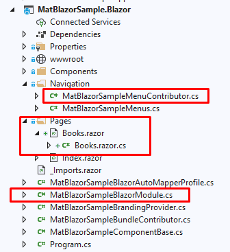

## Using MatBlazor UI Components With the ABP Framework

Hi, in this step by step article, I will show you how to integrate [MatBlazor](https://www.matblazor.com/), a blazor UI components into ABP Framework-based applications.


*(A screenshot from the example application developed in this article)*

## Create the Project

> First thing is to create the project. ABP Framework offers startup templates to get into business faster.

In this article, I will create a new startup template with EF Core as a database provider and Blazor for UI framework. But if you already have a project with Blazor UI, you don't need to create a new startup template, you can directly implement the following steps to your existing project.

> If you already have a project with the Blazor UI, you can skip this section.

* Before starting the development, we will create a new solution named `MatBlazorSample` (or whatever you want). We will create a new startup template with EF Core as a database provider and Blazor for UI framework by using [ABP CLI](https://docs.abp.io/en/abp/latest/CLI):

````bash
abp new MatBlazorSample -u blazor
````

This will create new project inside of `aspnet-core`, so:

````bash
cd aspnet-core
````

and

````bash
dotnet restore
````

* Our project boilerplate will be ready after the download is finished. Then, we can open the solution in the Visual Studio (or any other IDE) and run the `MatBlazorSample.DbMigrator` to create the database and seed initial data (which creates the admin user, admin role, permissions etc.)


* After database and initial data created,
* Run the `MatBlazorSample.HttpApi.Host` to see our server side working and 
* Run the `MatBlazorSample.Blazor` to see our UI working properly.

> _Default login credentials for admin: username is **admin** and password is **1q2w3E\***_

## Install MatBlazor

You can follow [this documentation](https://www.matblazor.com/) to install MatBlazor packages into your computer.

### Adding MatBlazor NuGet Packages

```bash
Install-Package MatBlazor
```

### Register MatBlazor Resources

1. Add the following line to the HEAD section of the `wwwroot/index.html` file within the `MatBlazorSample.Blazor` project:

   ```Razor
   <head>
       <!--...-->
       <script src="_content/MatBlazor/dist/matBlazor.js"></script>
       <link href="_content/MatBlazor/dist/matBlazor.css" rel="stylesheet" />
   </head>
   ```

2. In the `MatBlazorSampleBlazorModule` class, call the `AddMatBlazor()` method from your project's `ConfigureServices()` method:

   ```csharp
   public override void ConfigureServices(ServiceConfigurationContext context)
   {
       var environment = context.Services.GetSingletonInstance<IWebAssemblyHostEnvironment>();
       var builder = context.Services.GetSingletonInstance<WebAssemblyHostBuilder>();
   	  // ...
       builder.Services.AddMatBlazor();
   }
   ```

3. Register the **MatBlazorSample.Blazor** namespace in the `_Imports.razor` file:

   ```Razor
   @using MatBlazor
   ```

## The Sample Application

We have created a sample application with [Table](https://www.matblazor.com/Table) example.

### The Source Code

You can download the source code from [here](https://github.com/abpframework/abp-samples/tree/master/MatBlazorSample).

The related files for this example are marked in the following screenshots.




## Conclusion

In this article, I've explained how to use [MatBlazor](https://www.matblazor.com/) components in your application. ABP Framework is designed so that it can work with any UI library/framework.