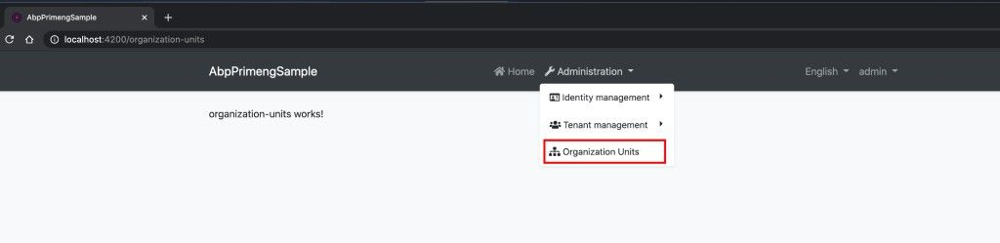

# How to Use PrimeNG Components with the ABP Angular UI

## Introduction

In this article, we will use components of the [PrimeNG](https://www.primefaces.org/primeng/) that is a popular UI component library for Angular with the ABP Framework Angular UI that will be generated via [ABP CLI](https://docs.abp.io/en/abp/latest/CLI).

We will create an organization units page and use PrimeNG's [OrganizationChart](https://primefaces.org/primeng/showcase/#/organizationchart) and [Table](https://primefaces.org/primeng/showcase/#/table) components on the page.


<small>The UI shown above contains many PrimeNG components. You can reach the source code of this rich UI. Take a look at the source code section below.</small>

> This article does not cover any backend code. I used mock data to provide data source to the components.

## Pre-Requirements

The following tools should be installed on your development machine:

* [.NET Core 5.0+](https://www.microsoft.com/net/download/dotnet-core/)
* [Node v12 or v14](https://nodejs.org/)
* [VS Code](https://code.visualstudio.com/) or another IDE

## Source Code

I have prepared a sample project that contains more PrimeNG components than described in this article. You can download the source code [on GitHub](https://github.com/abpframework/abp-samples/tree/master/PrimengSample).

## Creating a New Solution

In this step, we will create a new solution that contains Angular UI and backend startup templates. If you have a startup template with Angular UI, you can skip this step.

Run the following command to install the ABP CLI:

```bash
dotnet tool install -g Volo.Abp.Cli
```

...or update:

```bash
dotnet tool update -g Volo.Abp.Cli
```

Create a new solution named `AbpPrimengSample` by running the following command:

```bash
abp new AbpPrimengSample -u angular -csf
```

See the [ABP CLI documentation](https://docs.abp.io/en/abp/latest/CLI) for all available options.

You can also use the Direct Download tab on the [Get Started](https://abp.io/get-started) page.

## Running the Solution

You can run the solution as described in [here](https://docs.abp.io/en/abp/latest/Getting-Started-Running-Solution?UI=NG&DB=EF&Tiered=No).

## PrimeNG Setup

Open the `angular` folder and run the following command to install packages: 

```bash
npm install
```

Next, we need to install `primeng` and required packages (`primeicons` and `@angular/cdk`) for the library. Run the command below to install these packages:

```bash
npm install primeng primeicons @angular/cdk --save
```

The packages we have installed;
 
 - `primeng` is the main package that is a component library.
 - `primeicons` is an icon font library. Many PrimeNG components use this font internally. 
 - `@angular/cdk` is a component dev kit created by the Angular team. Some PrimeNG modules depend on it.

As the last step of the setup, we should add the required style files for the library to `angular.json`:

```js
//angular.json

"projects": {
    "AbpPrimengSample": {
        //...
        "styles": {
            "node_modules/primeicons/primeicons.css",
            "node_modules/primeng/resources/themes/saga-blue/theme.css",
            "node_modules/primeng/resources/primeng.min.css",
            //...other styles
        }
    }
}
```

We have added the `primeng.min.css`, Saga Blue theme's `theme.css`, and `primeicons.css` files to the project. You can choose another theme instead of the Sage Blue. See available themes on the [Get Started](https://www.primefaces.org/primeng/showcase/#/setup) document of the PrimeNG.


> You have to restart the running `ng serve` process to see the effect of the changes you made in the `angular.json`.


## Creating the Organization Units Page

Run the following command to create a new module named `OrganizationUnits`:

```bash
npm run ng -- generate module organization-units --route organization-units --module app.module
```

Then open the `src/route.provider.ts` and add a new route as an array element to add a navigation link labeled "Organization Units" to the menu:

```js
//route.provider.ts

import { eThemeSharedRouteNames } from '@abp/ng.theme.shared';
//...

routesService.add([
    //...
    {
    path: '/organization-units',
    name: 'Organization Units',
    parentName: eThemeSharedRouteNames.Administration,
    iconClass: 'fas fa-sitemap',
    layout: eLayoutType.application,
    },
]);
```

We have created a lazy-loadable module and defined a menu navigation link. We can navigate to the page as shown below:



##  Using the PrimeNG Components

### Implementing the Organization Chart Component

When you would like to use any component from PrimeNG, you have to import the component's module to your module. Since we will use the `OrganizationChart` on the organization units page, we need to import `OrganizationChartModule` into `OrganizationUnitsModule`.

Open the `src/organization-units/organization-units.module.ts` and add the `OrganizationChartModule` to the imports array as shown below:

```js
import { OrganizationChartModule } from 'primeng/organizationchart';
//...

@NgModule({
  //...
  imports: [
    //...
    OrganizationChartModule
  ],
})
export class OrganizationUnitsModule {}
```

> Since NGCC need to work in some cases, restarting the `ng serve` process would be good when you import any modules from `primeng` package to your module.

Let's define a mock data source for the `OrganizationChartComponent` and add the component to the page.

Open the `src/organization-units/organization-units.component.ts` and add two variables as shown below:

```js
//...
import { TreeNode } from 'primeng/api';

@Component(/* component metadata*/)
export class OrganizationUnitsComponent implements OnInit {
  //...

  organizationUnits: TreeNode[] = [
    {
      label: 'Management',
      expanded: true,
      children: [
        {
          label: 'Selling',
          expanded: true,
          children: [
            {
              label: 'Customer Relations',
            },
            {
              label: 'Marketing',
            },
          ],
        },
        {
          label: 'Supporting',
          expanded: true,
          children: [
            {
              label: 'Buying',
            },
            {
              label: 'Human Resources',
            },
          ],
        },
      ],
    },
  ];

  selectedUnit: TreeNode;
```

- First variable is `organizationUnits`. It provides mock data source to `OrganizationChartComponent`.
- Second variable is `selectedUnit`. It keeps chosen unit on the chart.

Then, open the `src/organization-units/organization-units.component.html` and replace the file content with the following:

```html
<div class="card">
  <div class="card-header">
    <h5>Organization Units</h5>
  </div>
  <div class="card-body">
    <p-organizationChart
      [value]="organizationUnits"
      selectionMode="single"
      [(selection)]="selectedUnit"
    ></p-organizationChart>
  </div>
</div>
```

We have implemented the `OrganizationChart`. The final UI looks like below:


## Implementing the Table Component

In order to use the `TableComponent`, we have to import the `TableModule` to the `OrganizationUnitsModule`.

Open the `organization-units.module.ts` and add `TableModule` to the imports array as shown below:

```js
import { TableModule } from 'primeng/table';
//...

@NgModule({
  //...
  imports: [
    //...
    TableModule
  ],
})
export class OrganizationUnitsModule {}
```

Open the `organization-units.component.ts` and add a variable named `members` with initial value and add a getter named `tableData` as shown below:

```js
//...
export class OrganizationUnitsComponent implements OnInit {
  //...

  members = [
  {
    fullName: 'John Doe',
    username: 'John.Doe',
    phone: '+1-202-555-0125',
    email: 'john.doe@example.com',
    parent: 'Customer Relations',
  },
  {
    fullName: 'Darrion Walter',
    username: 'Darrion.Walter',
    phone: '+1-262-155-0355',
    email: 'Darrion_Walter@example.com',
    parent: 'Marketing',
  },
  {
    fullName: 'Rosa Labadie',
    username: 'Rosa.Labadie',
    phone: '+1-262-723-2255',
    email: 'Rosa.Labadie@example.com',
    parent: 'Marketing',
  },
  {
    fullName: 'Adelle Hills',
    username: 'Adelle.Hills',
    phone: '+1-491-112-9011',
    email: 'Adelle.Hills@example.com',
    parent: 'Buying',
  },
  {
    fullName: 'Brian Hane',
    username: 'Brian.Hane',
    phone: '+1-772-509-1823',
    email: 'Brian.Hane@example.com',
    parent: 'Human Resources',
  },
  ];

  get tableData() {
  return this.members.filter(user => user.parent === this.selectedUnit.label);
  }
```

What we have done above?

- We defined a variable named `members` to provide mock data to the table.
- We have defined a getter named `tableData` to provide filtered data source to the table using `members` variable.

We are now ready to add the table to the HTML template.

Open the `organization-units.component.html`, find the `p-organizationChart` tag and place the following code to the bottom of this tag:

```html
<div class="p-3" *ngIf="selectedUnit">
  <h6>Members of {{ selectedUnit.label }}</h6>

  <p-table [value]="tableData">
    <ng-template pTemplate="header">
      <tr>
        <th>Name</th>
        <th>Username</th>
        <th>Email</th>
        <th>Phone</th>
      </tr>
    </ng-template>
    <ng-template pTemplate="body" let-member>
      <tr>
        <td>{{ member.fullName }}</td>
        <td>{{ member.username }}</td>
        <td>{{ member.email }}</td>
        <td>{{ member.phone }}</td>
      </tr>
    </ng-template>
  </p-table>
</div>
```

We have added a new `div` that contains the `TableComponent`. The table appears when an organization unit is selected.
The table contains 4 columns which are name, username, email, and phone for displaying the members' information.

After adding the table, the final UI looks like this:


## Conclusion

We have implemented the PrimeNG component library on the ABP Angular UI project and used two components on a page in a short time. You can use any PrimeNG components by following the documentation. The ABP Angular UI will not block you in any case.
