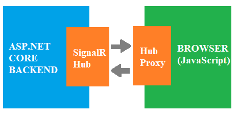
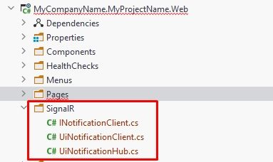
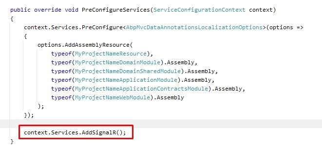
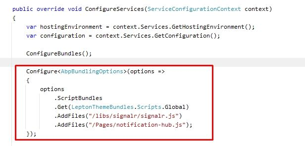
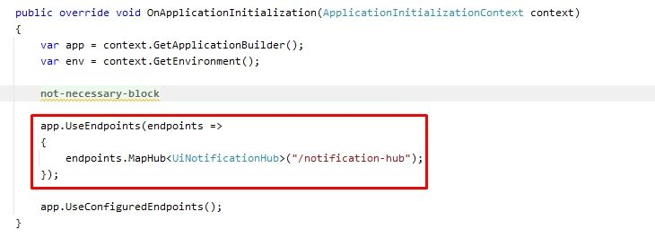
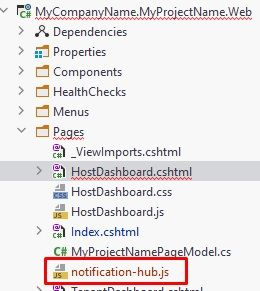
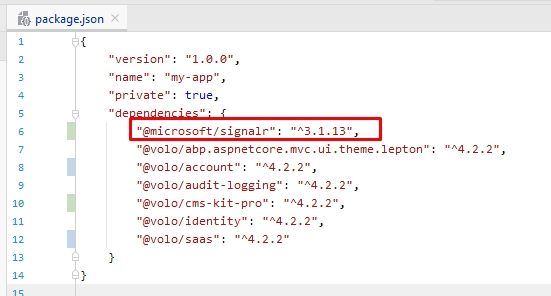
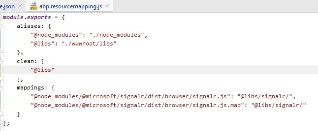
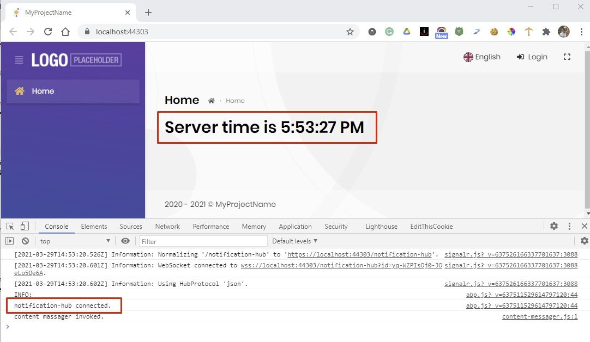

# Send Real-time Notifications via SignalR in ABP Project

SignalR is an open source library that adds real-time operation functionality to applications. Real-time web functionality enables server-side code to instantly send content to clients without refreshing the page. I'll show you how to add SignalR and use it to send notifications from backend. I'll implement this functionality in MVC template of ABP Framework.



## Implement Backend

### Create Notification Hub

Create a new folder named `SignalR` in your root directory of your Web project.



Then add the following classes to the folder:

1. [INotificationClient.cs](https://gist.github.com/ebicoglu/f7dc22cca2d353f8bf7f68a03e3395b8#file-inotificationclient-cs)
2. [UiNotificationClient.cs](https://gist.github.com/ebicoglu/f7dc22cca2d353f8bf7f68a03e3395b8#file-uinotificationclient-cs)
3. [UiNotificationHub.cs](https://gist.github.com/ebicoglu/f7dc22cca2d353f8bf7f68a03e3395b8#file-uinotificationhub-cs)

### Configure Module

These 3 steps will be done in your web module class.

#### 1- Add SignalR

Open `YourProjectWebModule.cs` class and add the following line to the `PreConfigureServices` method:

```csharp
 context.Services.AddSignalR();
```





#### 2- Add Client Scripts

2- In the `ConfigureServices` method of your web module add the following code to add the `signalr.js` and `notification-hub.js`. We'll add these packages in the next steps.



#### 3- Add Hub Endpoint

Add the following code to add the notification hub endpoint in `OnApplicationInitialization`  method:

```csharp
app.UseEndpoints(endpoints =>
{
   endpoints.MapHub<UiNotificationHub>("/notification-hub");
});
```



### Implement Frontend

We'll write the client-side code to be able to handle the SignalR response. 

#### 1- Add Notification Hub 

Add the following JavaScript class into your `Pages` folder in your Web project. We already added this script to our global scripts.

[notification-hub.js](https://gist.github.com/ebicoglu/f7dc22cca2d353f8bf7f68a03e3395b8#file-notification-hub-js)



#### 2- Add SignalR NPM package

Add [Microsoft.SignalR](https://www.npmjs.com/package/@microsoft/signalr) JavaScript package to the `package.json` which is located in your root folder of the Web project. After you add it, run `yarn` command in your Web directory to be able to install this package.



#### 3- Add resource Mapping

We added SignalR to the `package.json` but it comes into your `node_modules` folder. We need to copy the related files to `wwwroot/libs` folder. To do this copy the content of the following file to your `abp.resourcemappings.js` file. It's in your root directory of Web folder. After you do this, go to your web directory and run `gulp` command. By doing this, it'll copy the related files into your `wwwroot/libs` folder.

[abp.resourcemappings.js](https://gist.github.com/ebicoglu/f7dc22cca2d353f8bf7f68a03e3395b8#file-abp-resourcemapping-js)



#### 4- Usage

We have completed the implementation part. Let's check if it's running...

To do this easily, open your `Index.cshtml` which is in the Pages folder of your Web project. And replace the content with the following.  Also replace the `Index.cshtml.cs` as well.

[Index.cshtml](https://gist.github.com/ebicoglu/f7dc22cca2d353f8bf7f68a03e3395b8#file-index-cshtml)

[Index.cshtml.cs](https://gist.github.com/ebicoglu/f7dc22cca2d353f8bf7f68a03e3395b8#file-index-cshtml-cs)

#### 5- See it in action

Run your web project and in the Index page you'll see a button named as "Get Notification". Click the button and see the notification that comes from SignalR. This is a basic usage of SignalR notification system. You can implement it according to your own requirements.


