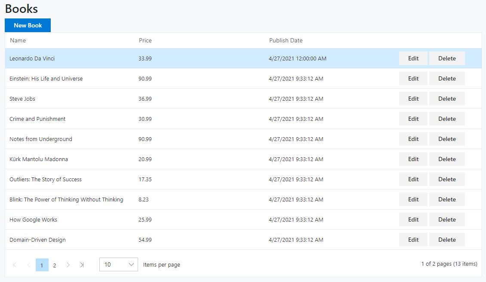

## Using SyncFusion UI Components With the ABP Framework

Hi, in this step by step article, I will show you how to integrate [Syncfusion](https://www.syncfusion.com/blazor-components), a blazor UI components into ABP Framework-based applications.



*(A screenshot from the example application developed in this article)*

## Create the Project

> First thing is to create the project. ABP Framework offers startup templates to get into business faster.

In this article, I will create a new startup template with EF Core as a database provider and Blazor for UI framework. But if you already have a project with Blazor UI, you don't need to create a new startup template, you can directly implement the following steps to your existing project.

> If you already have a project with the Blazor UI, you can skip this section.

* Before starting the development, we will create a new solution named `SyncfusionSample` (or whatever you want). We will create a new startup template with EF Core as a database provider and Blazor for UI framework by using [ABP CLI](https://docs.abp.io/en/abp/latest/CLI):

````bash
md SyncfusionSample
cd SyncfusionSample
````

After we have navigated inside of `SyncfusionSample` directory, we can create a new project. Note that I am creating Blazor Server (`blazor-server`) project. If you want to create a regular Blazor WebAssembly project just use `blazor` keyword instead.

````bash
abp new SyncfusionSample -u blazor-server
````

and

````bash
dotnet restore
````

* Our project boilerplate will be ready after the download is finished. Then, we can open the solution in the Visual Studio (or any other IDE) and run the `SyncfusionSample.DbMigrator` to create the database and seed initial data (which creates the admin user, admin role, permissions etc.)


* After database and initial data created,
* Run the `SyncfusionSample.Blazor` to see our UI working properly.

> _Default login credentials for admin: username is **admin** and password is **1q2w3E\***_

## Install Syncfusion

You can follow [this documentation](https://blazor.syncfusion.com/documentation/getting-started/blazor-server-side-visual-studio-2019/) to install Syncfusion packages into your computer.

### Adding Syncfusion NuGet Packages

Select `SyncfusionSample.Blazor` as the **default project** and then install NuGet packages.

```bash
Install-Package Syncfusion.Blazor.Grid
```

### Register Syncfusion Resources

1. Add the following line to the HEAD section of the `_Host.cshtml` file within the `SyncfusionSample.Blazor` project:

   ```Razor
   <head>
       <!--...-->
       <link href="_content/Syncfusion.Blazor.Themes/fabric.css" rel="stylesheet" />
   </head>
   ```

2. In the `SyncfusionSampleBlazorModule` class, call the `AddSyncfusionBlazor()` method from your project's `ConfigureServices()` method:

   ```csharp
   public override void ConfigureServices(ServiceConfigurationContext context)
   {
       var hostingEnvironment = context.Services.GetHostingEnvironment();
       var configuration = context.Services.GetConfiguration();

   	// ...

       context.Services.AddSyncfusionBlazor();
       Syncfusion.Licensing.SyncfusionLicenseProvider.RegisterLicense("YOUR LICENSE KEY");
   }
   ```

   > To get the `LICENSE KEY` you can login into your Syncfusion account and request the key. Trial keys are also available.

3. Register the **SyncfusionSample.Blazor** namespace(s) in the `_Imports.razor` file:

   ```Razor
   @using Syncfusion.Blazor
   @using Syncfusion.Blazor.Buttons
   @using Syncfusion.Blazor.Inputs
   @using Syncfusion.Blazor.Calendars
   @using Syncfusion.Blazor.Popups
   @using Syncfusion.Blazor.Grids
   ```

## The Sample Application

We have created a sample application with [SfGrid](https://blazor.syncfusion.com/documentation/datagrid/getting-started/) example.

### The Source Code

You can download the source code from [here](https://github.com/abpframework/abp-samples/tree/master/SyncfusionSample).

The related files for this example are marked in the following screenshots.


## Conclusion

In this article, I've explained how to use [Syncfusion](https://www.syncfusion.com/blazor-components) components in your application. ABP Framework is designed so that it can work with any UI library/framework.