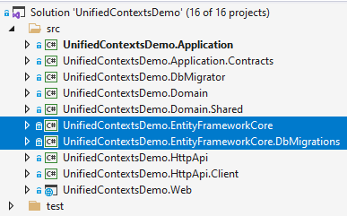
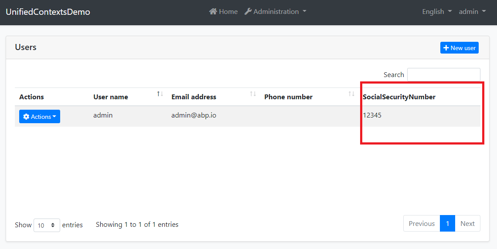

# Unifying DbContexts for EF Core / Removing the EF Core Migrations Project

This article shows how to remove the `EntityFrameworkCore.DbMigrations` project from your solution to have a single `DbContext` for your database mappings and code first migrations.

## Source Code

You can find source of the example solution used in this article [here](https://github.com/abpframework/abp-samples/tree/master/UnifiedEfCoreMigrations).

## Motivation

If you create a new solution with **Entity Framework Core** as the database provider, you see two projects related to EF Core:



* `EntityFrameworkCore` project contains the actual `DbContext` of your application. It includes all the database mappings and your repository implementations.
* `EntityFrameworkCore.DbMigrations` project, on the other hand, contains another `DbContext` class that is only used to create and apply the database migrations. It contains the database mappings for all the modules you are using, so have a single, unified database schema.

There were two main reasons we'd created such a separation;

1. Your actual `DbContext` remains simple and focused. It only contains your own entities and doesn't contain anything related to the modules that are used by the application.
2. You can create your own classes that map to the tables of depending modules. For example, the `AppUser` entity (that is included in the downloaded solution) is mapped to `AbpUsers` table in the database, which is actually mapped to the `IdentityUser` entity of the [Identity Module](https://docs.abp.io/en/abp/latest/Modules/Identity). That means they share the same database table. `AppUser` includes less properties compared to `IdentityServer`. You only add the properties you need, not more. This also allows you to add new standard (type-safe) properties to the `AppUser` for your custom requirements as long as you carefully manage the database mappings.

We've [documented the structure](https://docs.abp.io/en/abp/latest/Entity-Framework-Core-Migrations) in details. However, it has always been a problem for the developers since that structure makes your database mappings complicated when you re-use tables of the depended modules. Many developers are misunderstanding or making mistakes while mapping such classes, especially when they try to use these entities in relations to other entities.

**So, [we've decided](https://github.com/abpframework/abp/issues/8776) to cancel that separation and remove the `EntityFrameworkCore.DbMigrations` project in the version 4.4. New startup solutions will come with a single `EntityFrameworkCore` project and single `DbContext` class.**

If you want to make it in your solution with today, follow the steps in this article.

## Warnings

> There is one **drawback** with the new design (everything in software development is a trade-off). We need to remove the `AppUser` entity, because EF Core can't map two classes to single table without an inheritance relation. I will cover this later in this article and provide suggestions to deal with it.

> If you are using **ABP Commercial**, ABP Suite code generation won't work correctly before the version 4.4. Please upgrade to v4.4 if you are using a previous version.

## The Steps

Our goal to enable database migrations in the `EntityFrameworkCore` project, remove the `EntityFrameworkCore.DbMigrations` project and revisit the code depending on that package.

> I've created a new solution with v4.3, then made all the changes in a pull request, so you can see all the changes line by line.  While this article will cover all, you may want to [check the changes done in this PR](https://github.com/abpframework/abp-samples/pull/88) if you have problems with the implementation.

### 1) Add Microsoft.EntityFrameworkCore.Tools package to the EntityFrameworkCore project

Add the following code into the `EntityFrameworkCore.csproj` file:

````xml
<ItemGroup>
  <PackageReference Include="Microsoft.EntityFrameworkCore.Tools" Version="5.0.*">
    <IncludeAssets>runtime; build; native; contentfiles; analyzers</IncludeAssets>
    <PrivateAssets>compile; contentFiles; build; buildMultitargeting; buildTransitive; analyzers; native</PrivateAssets>
  </PackageReference>
</ItemGroup>
````

### 2) Create design time DbContext factory

Create a class implementing `IDesignTimeDbContextFactory<T>` inside the `EntityFrameworkCore` project:

````csharp
using System.IO;
using Microsoft.EntityFrameworkCore;
using Microsoft.EntityFrameworkCore.Design;
using Microsoft.Extensions.Configuration;

namespace UnifiedContextsDemo.EntityFrameworkCore
{
    public class UnifiedContextsDemoDbContextFactory : IDesignTimeDbContextFactory<UnifiedContextsDemoDbContext>
    {
        public UnifiedContextsDemoDbContext CreateDbContext(string[] args)
        {
            UnifiedContextsDemoEfCoreEntityExtensionMappings.Configure();

            var configuration = BuildConfiguration();

            var builder = new DbContextOptionsBuilder<UnifiedContextsDemoDbContext>()
                .UseSqlServer(configuration.GetConnectionString("Default"));

            return new UnifiedContextsDemoDbContext(builder.Options);
        }

        private static IConfigurationRoot BuildConfiguration()
        {
            var builder = new ConfigurationBuilder()
                .SetBasePath(Path.Combine(Directory.GetCurrentDirectory(), "../UnifiedContextsDemo.DbMigrator/"))
                .AddJsonFile("appsettings.json", optional: false);

            return builder.Build();
        }
    }
}
````

I basically copied from the `EntityFrameworkCore.DbMigrations` project, renamed and uses the actual `DbContext` of the application.

### 3) Create DB schema migrator

Copy `EntityFrameworkCore...DbSchemaMigrator` (`...` standard for your project name) class to the `EntityFrameworkCore` project and change the code in the `MigrateAsync` method to use the actual `DbContext` of the application. In my case, the final class is shown below:

````csharp
using System;
using System.Threading.Tasks;
using Microsoft.EntityFrameworkCore;
using Microsoft.Extensions.DependencyInjection;
using UnifiedContextsDemo.Data;
using Volo.Abp.DependencyInjection;

namespace UnifiedContextsDemo.EntityFrameworkCore
{
    public class EntityFrameworkCoreUnifiedContextsDemoDbSchemaMigrator
        : IUnifiedContextsDemoDbSchemaMigrator, ITransientDependency
    {
        private readonly IServiceProvider _serviceProvider;

        public EntityFrameworkCoreUnifiedContextsDemoDbSchemaMigrator(
            IServiceProvider serviceProvider)
        {
            _serviceProvider = serviceProvider;
        }

        public async Task MigrateAsync()
        {
            /* We intentionally resolving the UnifiedContextsDemoMigrationsDbContext
             * from IServiceProvider (instead of directly injecting it)
             * to properly get the connection string of the current tenant in the
             * current scope.
             */

            await _serviceProvider
                .GetRequiredService<UnifiedContextsDemoDbContext>()
                .Database
                .MigrateAsync();
        }
    }
}
````

### 4) Move module configurations

The migrations `DbContext` typically contains code lines like `builder.ConfigureXXX()` for each module you are using. We can move these lines to our actual `DbContext` in the `EntityFrameworkCore` project. Also, remove the database mappings for the `AppUser` (we will remove this entity). Optionally, you may move the database mappings code for your own entities from `...DbContextModelCreatingExtensions` class in the `OnModelCreating` method of the actual `DbContext`, and remove the static extension class.

For the example solution, the final `DbContext` class is shown below:

````csharp
using Microsoft.EntityFrameworkCore;
using UnifiedContextsDemo.Users;
using Volo.Abp.AuditLogging.EntityFrameworkCore;
using Volo.Abp.BackgroundJobs.EntityFrameworkCore;
using Volo.Abp.Data;
using Volo.Abp.EntityFrameworkCore;
using Volo.Abp.FeatureManagement.EntityFrameworkCore;
using Volo.Abp.Identity.EntityFrameworkCore;
using Volo.Abp.IdentityServer.EntityFrameworkCore;
using Volo.Abp.PermissionManagement.EntityFrameworkCore;
using Volo.Abp.SettingManagement.EntityFrameworkCore;
using Volo.Abp.TenantManagement.EntityFrameworkCore;

namespace UnifiedContextsDemo.EntityFrameworkCore
{
    [ConnectionStringName("Default")]
    public class UnifiedContextsDemoDbContext
        : AbpDbContext<UnifiedContextsDemoDbContext>
    {
        public DbSet<AppUser> Users { get; set; }

        /* Add DbSet properties for your Aggregate Roots / Entities here.
         * Also map them inside UnifiedContextsDemoDbContextModelCreatingExtensions.ConfigureUnifiedContextsDemo
         */

        public UnifiedContextsDemoDbContext(
            DbContextOptions<UnifiedContextsDemoDbContext> options)
            : base(options)
        {

        }

        protected override void OnModelCreating(ModelBuilder builder)
        {
            base.OnModelCreating(builder);

            builder.ConfigurePermissionManagement();
            builder.ConfigureSettingManagement();
            builder.ConfigureBackgroundJobs();
            builder.ConfigureAuditLogging();
            builder.ConfigureIdentity();
            builder.ConfigureIdentityServer();
            builder.ConfigureFeatureManagement();
            builder.ConfigureTenantManagement();

            /* Configure your own tables/entities inside here */

            //builder.Entity<YourEntity>(b =>
            //{
            //    b.ToTable(UnifiedContextsDemoConsts.DbTablePrefix + "YourEntities", UnifiedContextsDemoConsts.DbSchema);
            //    b.ConfigureByConvention(); //auto configure for the base class props
            //    //...
            //});
        }
    }
}
````

### 5) Remove `EntityFrameworkCore.DbMigrations` project from the solution

Remove the `EntityFrameworkCore.DbMigrations` project from the solution and replace references given to that project by the `EntityFrameworkCore` project reference.

Also, change usages of `...EntityFrameworkCoreDbMigrationsModule` to `...EntityFrameworkCoreModule` (`...` stands for your project name).

In this example, I had to change references and usages in the `DbMigrator`, `Web` and `EntityFrameworkCore.Tests` projects.

### 6) Remove AppUser Entity

We need to remove the `AppUser` entity, because EF Core can't map two classes to single table without an inheritance relation. So, remove this class and all the usages. You can replace the usages with `IdentityUser` if you need to query users in your application code. See The AppUser Entity & Custom Properties section for more info.

### 7) Create or move the migrations

We've removed the `EntityFrameworkCore.DbMigrations` project. What about the migrations created and applied into the database until now? If you want to keep your migrations history, copy all the migrations from the `EntityFrameworkCore.DbMigrations` project to the `EntityFrameworkCore` project and manually change the `DbContext` type in the designer classes.

If you want to clear the migrations history, but continue with the migrations already applied to the database, create a new database migration in the `EntityFrameworkCore` project, executing the following command in a command-line terminal in the directory of that project:

````bash
dotnet ef migrations add InitialUnified
````

You can specify a different migration name, surely. This will create a migration class that contains all the database tables you already have in the database. Keep calm and delete all the content in the `Up` and `Down` methods. Then you can apply the migration to the database:

````bash
dotnet ef database update
````

Your database won't have any change, because the migration is just empty and does nothing. From now, you can create new migrations as you change your entities, just like you normally do.

All the changes are done. The next section explains how to add custom properties to entities of depending modules with this design.

## The AppUser Entity & Custom Properties

The database mapping logic, solution structure and migrations become much simpler and easier to manage with that new setup.

As a drawback, we had to remove the `AppUser` entity, which was sharing the `AbpUsers` table with the `IdentityUser` entity of the Identity Module. Fortunately, ABP provides a flexible system to [extend existing entities](https://docs.abp.io/en/abp/latest/Module-Entity-Extensions) in case of you need to define some custom properties. In this section, I will show how to add a custom property to the `IdentityUser` entity and use it in your application code and database queries.

I've done all the changes in this part as a single PR, so you may want to [check the changes done in this PR](https://github.com/abpframework/abp-samples/pull/89) if you have problems with the implementation.

### Defining a Custom Property

The application startup template provides a point to configure the custom properties for existing entities, which is located under `Domain.Shared` project, in the `...ModuleExtensionConfigurator.cs` (`...` standard for your project name) class. Open that class and add the following code into the `ConfigureExtraProperties` method:

````csharp
ObjectExtensionManager.Instance.Modules()
    .ConfigureIdentity(identity =>
    {
        identity.ConfigureUser(user =>
        {
            user.AddOrUpdateProperty<string>( //property type: string
                "SocialSecurityNumber", //property name
                property =>
                {
                    //validation rules
                    property.Attributes.Add(new RequiredAttribute());
                    property.Attributes.Add(new StringLengthAttribute(64));
                }
            );
        });
    });
````

After that setup, just run the application to see the new property on the Users table:



The new `SocialSecurityNumber` property will also be available on the create and edit modals with the validation rules.

> See the [Module Entity Extensions](https://docs.abp.io/en/abp/latest/Module-Entity-Extensions) document to understand and control the new custom property with all the details.

### Mapping to the Database Table

By default, ABP saves all custom properties inside the `ExtraProperties` field as a single JSON object. If you prefer to create a table field for a custom property, you can configure it in the `...EfCoreEntityExtensionMappings.cs` (`...` standard for your project name) class in the `EntityFrameworkCore` project. You can write the following code inside this class (in the `OneTimeRunner.Run`):

````csharp
ObjectExtensionManager.Instance
    .MapEfCoreProperty<IdentityUser, string>(
        "SocialSecurityNumber",
        (entityBuilder, propertyBuilder) =>
        {
            propertyBuilder.HasMaxLength(64).IsRequired().HasDefaultValue("");
        }
    );
````

After that, you can just run the following command in a command-line terminal to add a new database migration (in the directory of the `EntityFrameworkCore` project):

````bash
dotnet ef migrations add Added_SocialSecurityNumber_To_IdentityUser
````

This will add a new migration class to your project. You can then run the following command (or run the `.DbMigrator` application) to apply changes to the database:

````bash
dotnet ef database update
````

This will add a `SocialSecurityNumber` field to the `AbpUsers` table in the database.

### Using Custom Properties in the Application Code

Now, we can use `GetProperty` and `SetProperty` methods on the `IdentityUser` entity to work with the new property. The following code demonstrates to get/set the custom property:

````csharp
public class MyUserService : ITransientDependency
{
    private readonly IRepository<IdentityUser, Guid> _userRepository;

    public MyUserService(IRepository<IdentityUser, Guid> userRepository)
    {
        _userRepository = userRepository;
    }

    public async Task SetSocialSecurityNumberDemoAsync(string userName, string number)
    {
        var user = await _userRepository.GetAsync(u => u.UserName == userName);
        user.SetProperty("SocialSecurityNumber", number);
        await _userRepository.UpdateAsync(user);
    }

    public async Task<string> GetSocialSecurityNumberDemoAsync(string userName)
    {
        var user = await _userRepository.GetAsync(u => u.UserName == userName);
        return user.GetProperty<string>("SocialSecurityNumber");
    }
}
````

Tip: Using `SetProperty` and `GetProperty` with a string property name everywhere could be tedious and error-prone. I suggest you to create the following extension methods:

````csharp
public static class MyUserExtensions
{
    public const string SocialSecurityNumber = "SocialSecurityNumber";

    public static void SetSocialSecurityNumber(this IdentityUser user, string number)
    {
        user.SetProperty(SocialSecurityNumber, number);
    }
    
    public static string GetSocialSecurityNumber(this IdentityUser user)
    {
        return user.GetProperty<string>(SocialSecurityNumber);
    }
}
````

Then we can change the previous demo method as shown below:

````csharp
public async Task SetSocialSecurityNumberDemoAsync(string userName, string number)
{
    var user = await _userRepository.GetAsync(u => u.UserName == userName);
    user.SetSocialSecurityNumber(number); //Using the new extension property
    await _userRepository.UpdateAsync(user);
}

public async Task<string> GetSocialSecurityNumberDemoAsync(string userName)
{
    var user = await _userRepository.GetAsync(u => u.UserName == userName);
    return user.GetSocialSecurityNumber(); //Using the new extension property
}
````

### Querying Based on a Custom Property

You may want to query users based on `SocialSecurityNumber`. We will use Entity Framework's API to accomplish that. You have two options to use EF Core API in your application code:

1. Reference to the [Microsoft.EntityFrameworkCore](https://www.nuget.org/packages/Microsoft.EntityFrameworkCore) NuGet package from your project (domain or application layer, depending on where you want to use the EF Core API).
2. Create a [repository](https://docs.abp.io/en/abp/latest/Repositories) interface in the domain layer and implement it in your `EntityFrameworkCore` project.

I will prefer the second approach, so I am defining a new repository interface in the `Domain` project:

````csharp
using System;
using System.Threading.Tasks;
using Volo.Abp.Domain.Repositories;
using Volo.Abp.Identity;

namespace UnifiedContextsDemo.Users
{
    public interface IMyUserRepository : IRepository<IdentityUser, Guid>
    {
        Task<IdentityUser> FindBySocialSecurityNumber(string number);
    }
}
````

Then implementing it in the `EntityFrameworkCore` project:

````csharp
using System;
using System.Linq;
using System.Threading.Tasks;
using Microsoft.EntityFrameworkCore;
using UnifiedContextsDemo.EntityFrameworkCore;
using Volo.Abp.Domain.Repositories.EntityFrameworkCore;
using Volo.Abp.EntityFrameworkCore;
using Volo.Abp.Identity;

namespace UnifiedContextsDemo.Users
{
    public class MyUserRepository 
        : EfCoreRepository<UnifiedContextsDemoDbContext, IdentityUser, Guid>, 
          IMyUserRepository
    {
        public MyUserRepository(
            IDbContextProvider<UnifiedContextsDemoDbContext> dbContextProvider) 
            : base(dbContextProvider)
        {
        }

        public async Task<IdentityUser> FindBySocialSecurityNumber(string number)
        {
            var dbContext = await GetDbContextAsync();
            return await dbContext.Set<IdentityUser>()
                .Where(u => EF.Property<string>(u, "SocialSecurityNumber") == number)
                .FirstOrDefaultAsync();
        }
    }
}
````

Tip: Use the constant instead of `SocialSecurityNumber` as a magic string.

Now, I can use that repository method in my service by injecting the `IMyUserRepository`:

````csharp
public class MyUserService : ITransientDependency
{
    private readonly IMyUserRepository _userRepository;

    public MyUserService(IMyUserRepository userRepository)
    {
        _userRepository = userRepository;
    }

    //...other methods

    public async Task<IdentityUser> FindBySocialSecurityNumberDemoAsync(string number)
    {
        return await _userRepository.FindBySocialSecurityNumber(number);
    }
}
````

I changed `IRepository<IdentityUser, Guid>` dependency to `IMyUserRepository`.

## Conclusion

With this article, I wanted to show you how to remove the `EntityFrameworkCore.DbMigrations` project from your solution to simplify your database mappings, database migrations and your application code. In the next version (4.4), this [will be](https://github.com/abpframework/abp/issues/8776) the default approach.

### Source Code

You can find source of the example solution used in this article [here](https://github.com/abpframework/abp-samples/tree/master/UnifiedEfCoreMigrations).
