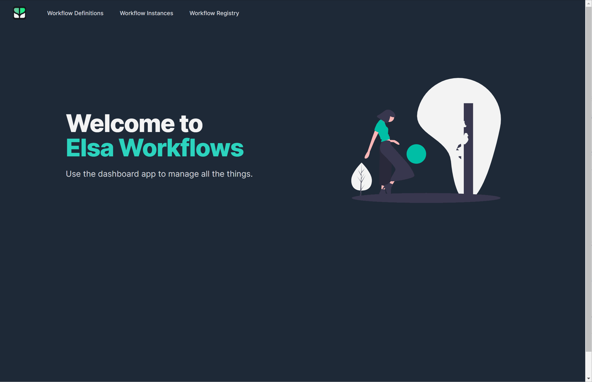
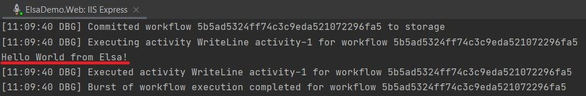
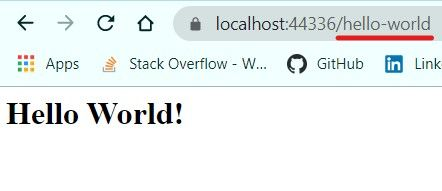
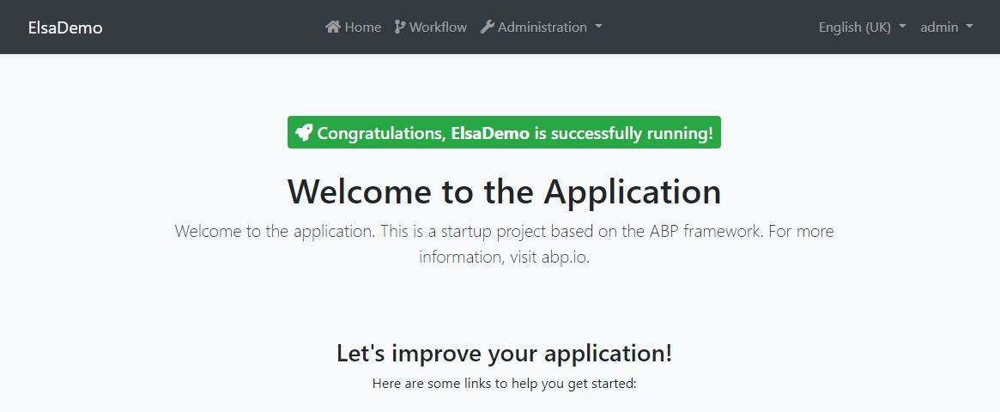
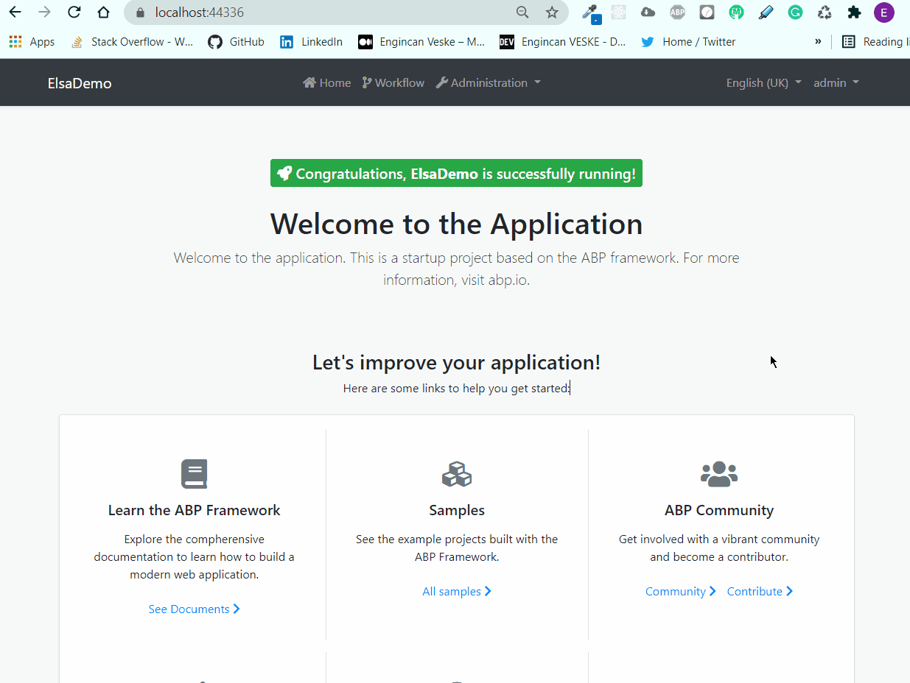

# Using Elsa Workflow with ABP Framework

**Elsa Core** is an open-source workflows library that can be used in any kind of .NET Core application. Using such a workflow library can be useful to implement a business rules visually or programmatically.



This article shows how we can use this workflow library within our ABP-based application. We will start with a couple of examples and then we will integrate the **Elsa Dashboard** (you can see it in the above gif) into our application to be able to design our workflows visually.

## Source Code

You can find source code of the sample used in this article [here](https://github.com/abpframework/abp-samples/tree/elsa-demo).

## Create the Project

In this article, I will create a new startup template with EF Core as a database provider and MVC/Razor-Pages for UI framework.

> If you already have a project with MVC/Razor-Pages or Blazor UI, you don't need to create a new startup template, you can directly implement the following steps to your existing project. In other words you can skip this section.

* Before starting to the development, we will create a new solution named `ElsaDemo` (or whatever you want). We will create a new startup template with EF Core as a database provider and MVC/Razor-Pages for UI framework by using the [ABP CLI](https://docs.abp.io/en/abp/latest/CLI):

```bash
abp new ElsaDemo
```

* Our project boilerplate will be ready after the download is finished. Then, we can open the solution in the Visual Studio (or any other IDE).

* First of all we need to create database migrations and apply these migrations to our database. So, open your terminal in the `ElsaDemo.EntityFrameworkCore.DbMigrations` project directory and run the following command to create the initial migration.

```bash
dotnet ef migrations add Initial
```

* After the initial migration created, we can run the `ElsaDemo.DbMigrator` project to apply migration into our database and seed initial data.

* After database and initial data created, we can run the `ElsaDemo.Web` to see our UI working properly.

> Default admin username is **admin** and password is **1q2w3E***

## Creating A Workflow (Hello World to Workflows) - Console Activity

We can start with creating our first workflow. Let's start with creating basic hello-world workflow.

### Install Packages

We need to install two packages: `Elsa` and `Elsa.Activities.Console` into our `ElsaDemo.Web` project. You can add these two packages with the following command:

```bash
dotnet add package Elsa
dotnet add package Elsa.Activities.Console
```

* After the packages installed, we can define our first workflow. To do this, create a folder named **Workflows** and in this folder create a class named `HelloWorldConsole`.

```csharp
using Elsa.Activities.Console;
using Elsa.Builders;

namespace ElsaDemo.Web.Workflows
{
    public class HelloWorldConsole : IWorkflow
    {
        public void Build(IWorkflowBuilder builder) => builder.WriteLine("Hello World from Elsa!");
    }
}
```

* In here we've basically implemented the `IWorkflow` interface which only has one method named **Build**. In this method, we can define our workflow's executing steps (activities). 

* As you can see in the example above, we've used a activity named **WriteLine**, which writes a line of text to the console. We could also chain the activities one to another.

> "An activity is an atomic building block that represents a single executable step on the workflow." - [Elsa Core Definition](https://elsa-workflows.github.io/elsa-core/docs/next/concepts/concepts-workflows#activity)

* After defining our workflow, we need to register it. To do that, open your `ElsaDemoWebModule` class and update your `ElsaDemoWebModule` with the following lines. Most of the codes are abbreviated for simplicity.

```csharp
using ElsaDemo.Web.Workflows;
using Elsa.Services;

public override void ConfigureServices(ServiceConfigurationContext context)
{
    var hostingEnvironment = context.Services.GetHostingEnvironment();
    var configuration = context.Services.GetConfiguration();

    //...

    ConfigureElsa(context); //add this line for Elsa's service registrations
}

private void ConfigureElsa(ServiceConfigurationContext context)
{
    context.Services.AddElsa(options =>
    {
        options
            .AddConsoleActivities()
            .AddWorkflow<HelloWorldConsole>();
    });
}

public override void OnApplicationInitialization(ApplicationInitializationContext context)
{
    //...

    var workflowRunner = context.ServiceProvider.GetRequiredService<IBuildsAndStartsWorkflow>();
    workflowRunner.BuildAndStartWorkflowAsync<HelloWorldConsole>();
}
```

* Here we basically, configured Elsa's services in our `ConfigureServices` method and after that in our `OnApplicationInitialization` method we get workflow runner (**IBuildsAndStartsWorkflow**) and started the our `HelloWorldConsole` workflow.

* If we run the application and examine the console outputs, we should see the message that we defined in our workflow.



## Creating A Workflow - Http Activity

In this example we will create a **Http Activity**. It will basically listen the specified route for incoming HTTP Request and write back a simple response.

### Install Elsa.Activities.Http Package

* Be able to use HTTP Activities we need to add `Elsa` (we've already installed it in previous section) and `Elsa.Activities.Http` packages into our web application.

```bash
dotnet add package Elsa.Activities.Http
```

* After the package installed we can create our workflow. So, create a class named `HelloWorldHttp` under **Workflows** folder.

```csharp
using System.Net;
using Elsa.Activities.Http;
using Elsa.Builders;

namespace ElsaDemo.Web.Workflows
{
    public class HelloWorldHttp : IWorkflow
    {
        public void Build(IWorkflowBuilder builder)
        {
            builder
                .HttpEndpoint("/hello-world")
                .WriteHttpResponse(HttpStatusCode.OK, "<h1>Hello World!</h1>", "text/html");
        }
    }
}
```

* The above workflow has two activities. The first activity `HttpEndpoint` represents an HTTP endpoint, which can be invoked using an HTTP client, including a web browser. The first activity is connected to the second activity `WriteHttpResponse`, which writes a response to the HTTP client.

* After defined the **HelloWorldHttp** workflow we need to register it. So, open your `ElsaDemoWebModule` and update the `ConfigureElsa` method as below.

```csharp
private void ConfigureElsa(ServiceConfigurationContext context)
{
    context.Services.AddElsa(options =>
    {
        options
            .AddConsoleActivities()
            .AddHttpActivities() //add this line to be able to use http activities
            .AddWorkflow<HelloWorldConsole>()
            .AddWorkflow<HelloWorldHttp>(); //add new workflow that we defined
    });
}
```
* And add **HttpActivity** middleware to `OnApplicationInitilization` method of your `ElsaDemoWebModule` class.

```csharp
public override void OnApplicationInitialization(ApplicationInitializationContext context)
{
    // ...
    app.UseHttpActivities(); //add this line
}
```

* If we run the application and navigate to the "/hello-world" route we should see the response message that we've defined in our `HelloWorldHttp` workflow.



## Integrate Elsa Dashboard To Our Application

* Until now we've created two workflows programmatically. But also we can create workflow visually by using Elsa's **HTML5 Workflow Designer**.

* Being able to design our workflows basically and taking advantage of **HTML5 Workflow Designer** we will integrate the Elsa Dashboard to our application. So let's get started.

### Install Packages

* Following three package installation required for Elsa Server.

```bash
dotnet add package Elsa.Activities.Temporal.Quartz
dotnet add package Elsa.Persistence.EntityFramework.SqlServer
dotnet add package Elsa.Server.Api
```

> Also we need to install the **Elsa** and **Elsa.Activities.Http** packages but we've already installed these packages in the previous chapters.

* We need to install one more package named `Elsa.Designer.Components.Web`. This package provides us components for our dashboard. 

```bash
dotnet add package Elsa.Designer.Components.Web
```

* After the package installations completed, we need to make the neccessarily configurations to be able to use the **Elsa Server** and **Elsa Dashboard**. Therefore, open your `ElsaDemoWebModule` class and make the neccessarily changes as below.

```csharp
public override void ConfigureServices(ServiceConfigurationContext context)
{
    var configuration = context.Services.GetConfiguration();

    //...

    ConfigureElsa(context, configuration);
}

private void ConfigureElsa(ServiceConfigurationContext context, IConfiguration configuration)
{
    var elsaSection = configuration.GetSection("Elsa");

    context.Services.AddElsa(elsa =>
    {
        elsa
            .UseEntityFrameworkPersistence(ef =>
                DbContextOptionsBuilderExtensions.UseSqlServer(ef,
                    configuration.GetConnectionString("Default")))
            .AddConsoleActivities()
            .AddHttpActivities(elsaSection.GetSection("Server").Bind)
            // .AddEmailActivities(elsaSection.GetSection("Smtp").Bind)
            .AddQuartzTemporalActivities()
            .AddJavaScriptActivities()
            .AddWorkflowsFrom<Startup>();
    });

    context.Services.AddElsaApiEndpoints();
    context.Services.Configure<ApiVersioningOptions>(options =>
    {
        options.UseApiBehavior = false;
    });

    context.Services.AddCors(cors => cors.AddDefaultPolicy(policy => policy
        .AllowAnyHeader()
        .AllowAnyMethod()
        .AllowAnyOrigin()
        .WithExposedHeaders("Content-Disposition"))
    );

    //Disable antiforgery validation for elsa
    Configure<AbpAntiForgeryOptions>(options =>
    {
        options.AutoValidateFilter = type =>
                    type.Assembly != typeof(Elsa.Server.Api.Endpoints.WorkflowRegistry.Get).Assembly;
    });
}

public override void OnApplicationInitialization(ApplicationInitializationContext context)
{
     app.UseCors();
    
    //...

    app.UseHttpActivities();
    app.UseConfiguredEndpoints(endpoints =>
    {
        endpoints.MapFallbackToPage("/_Host");
    });

    var workflowRunner = context.ServiceProvider.GetRequiredService<IBuildsAndStartsWorkflow>();
    workflowRunner.BuildAndStartWorkflowAsync<HelloWorldConsole>();
}
```

* We don't need to register our workflows one by one anymore. Because now we use `.AddWorkflowsFrom<Startup>()`, and this register workflows behalf of us. 

* As you can notice here, we use a section named `Elsa` and its sub-sections from configuration sytem but we didn't define them yet. Let's define them. So open your `appsettings.json` and update its content as below.

```json
{
  "App": {
    "SelfUrl": "https://localhost:44336"
  },
  "ConnectionStrings": {
    "Default": "Server=localhost;Database=ElsaDemo;Trusted_Connection=True"
  },
  "AuthServer": {
    "Authority": "https://localhost:44336",
    "RequireHttpsMetadata": "false"
  },
  "StringEncryption": {
    "DefaultPassPhrase": "***********"
  },
  "Elsa": {
    "Http": {
      "BaseUrl": "https://localhost:44336"
    }
  }
}
```

#### Define Permission For Elsa Dashboard

* After those configurations, we can define a [permission](https://docs.abp.io/en/abp/latest/Authorization#permission-system) to be assure of only allowed users can see the Elsa Dashboard.

* Open your `ElsaDemoPermissions` class under the **Permissions** folder (in `ElsaDemo.Application.Contracts` layer) and add the following permission name.

```csharp
namespace ElsaDemo.Permissions
{
    public static class ElsaDemoPermissions
    {
        public const string GroupName = "ElsaDemo";

        public const string ElsaDashboard = GroupName + ".ElsaDashboard"; //add this line
    }
}
```

* After that, open your `ElsaDemoPermissionDefinitionProvider` class and define the permission for Elsa Dashboard.

```csharp
using ElsaDemo.Localization;
using Volo.Abp.Authorization.Permissions;
using Volo.Abp.Localization;

namespace ElsaDemo.Permissions
{
    public class ElsaDemoPermissionDefinitionProvider : PermissionDefinitionProvider
    {
        public override void Define(IPermissionDefinitionContext context)
        {
            var myGroup = context.AddGroup(ElsaDemoPermissions.GroupName);

            myGroup.AddPermission(ElsaDemoPermissions.ElsaDashboard, L("Permission:ElsaDashboard"));
        }

        private static LocalizableString L(string name)
        {
            return LocalizableString.Create<ElsaDemoResource>(name);
        }
    }
}
```

* As you notice we've used a localized value (**Permission:ElsaDashboard**) but haven't add this localization key and value to the localization file, so let's add this localization key and value. To do this, open your `en.json` file under **Localization/ElsaDemo** folder (under **DomainShared** layer) and add this localization key.

```json
{
  "culture": "en",
  "texts": {
    "Menu:Home": "Home",
    "Welcome": "Welcome",
    "LongWelcomeMessage": "Welcome to the application. This is a startup project based on the ABP framework. For more information, visit abp.io.",
    "Permission:ElsaDashboard": "Elsa Dashboard"
  }
}
```

> You can also add this localization key to the other localization files such as **tr.json**.

#### Add Elsa Dashboard To Application

* After those configurations, now we can add Elsa Dashboard to our application with authorization check. To do this, create a razor page named **_Host.cshtml** under **Pages** folder and update its content as below.

```html
@page "/elsa"
@using ElsaDemo.Permissions
@using Microsoft.AspNetCore.Authorization
@attribute [Authorize(ElsaDemoPermissions.ElsaDashboard)]
@{
    var serverUrl = $"{Request.Scheme}://{Request.Host}";
    Layout = null;
}
<!DOCTYPE html>
<html lang="en">
<head>
    <meta charset="utf-8"/>
    <meta name="viewport" content="width=device-width, initial-scale=1.0"/>
    <title>Elsa Workflows</title>
    <link rel="icon" type="image/png" sizes="32x32" href="/_content/Elsa.Designer.Components.Web/elsa-workflows-studio/assets/images/favicon-32x32.png">
    <link rel="icon" type="image/png" sizes="16x16" href="/_content/Elsa.Designer.Components.Web/elsa-workflows-studio/assets/images/favicon-16x16.png">
    <link rel="stylesheet" href="/_content/Elsa.Designer.Components.Web/elsa-workflows-studio/assets/fonts/inter/inter.css">
    <link rel="stylesheet" href="/_content/Elsa.Designer.Components.Web/elsa-workflows-studio/assets/styles/tailwind.css">
    <script src="/_content/Elsa.Designer.Components.Web/monaco-editor/min/vs/loader.js"></script>
    <script type="module" src="/_content/Elsa.Designer.Components.Web/elsa-workflows-studio/elsa-workflows-studio.esm.js"></script>
</head>
<body class="h-screen" style="background-size: 30px 30px; background-image: url(/_content/Elsa.Designer.Components.Web/elsa-workflows-studio/assets/images/tile.png); background-color: #FBFBFB;">
<elsa-studio-root server-url="@serverUrl" monaco-lib-path="_content/Elsa.Designer.Components.Web/monaco-editor/min"></elsa-studio-root>
</body>
</html>
```

* As you may notice, we've defined an attribute for authorization check. This provides us only the user who has the **ElsaDemoPermissions.ElsaDashboard** permission allowed to see this page.

#### Add Elsa Dashboard Page To Main Menu

* We can open the `ElsaDemoMenuContributor` class under **Menus** folder and define the menu item for reaching the Elsa Dashboard easily.

```csharp
using System.Threading.Tasks;
using ElsaDemo.Localization;
using ElsaDemo.MultiTenancy;
using ElsaDemo.Permissions;
using Volo.Abp.Identity.Web.Navigation;
using Volo.Abp.SettingManagement.Web.Navigation;
using Volo.Abp.TenantManagement.Web.Navigation;
using Volo.Abp.UI.Navigation;

namespace ElsaDemo.Web.Menus
{
    public class ElsaDemoMenuContributor : IMenuContributor
    {
        public async Task ConfigureMenuAsync(MenuConfigurationContext context)
        {
            if (context.Menu.Name == StandardMenus.Main)
            {
                await ConfigureMainMenuAsync(context);
            }
        }

        private async Task ConfigureMainMenuAsync(MenuConfigurationContext context)
        {
            var administration = context.Menu.GetAdministration();
            var l = context.GetLocalizer<ElsaDemoResource>();

            context.Menu.Items.Insert(
                0,
                new ApplicationMenuItem(
                    ElsaDemoMenus.Home,
                    l["Menu:Home"],
                    "~/",
                    icon: "fas fa-home",
                    order: 0
                )
            );
            
            context.Menu.Items.Insert(
                1,
                new ApplicationMenuItem(
                    ElsaDemoMenus.Home,
                    "Workflow",
                    "~/elsa",
                    icon: "fas fa-code-branch",
                    order: 1,
                    requiredPermissionName: ElsaDemoPermissions.ElsaDashboard
                )
            );

            //...
        }
    }
}
```

* With that menu item configuration, only the user who has **ElsaDemoPermissions.ElsaDashboard** permission allowed to see the defined menu item.

## Result

* Let's run the application and login.

> Default admin username is **admin** and password is **1q2w3E***



> If the account you are logged in has the **ElsaDemoPermissions.ElsaDashboard** permission, you should see the **Workflow** menu item. If you do not see this menu item, please be assured that your logged-in account has that permission.

* Now we can click the workflow menu item, display the Elsa Dashboard and designing workflows.

