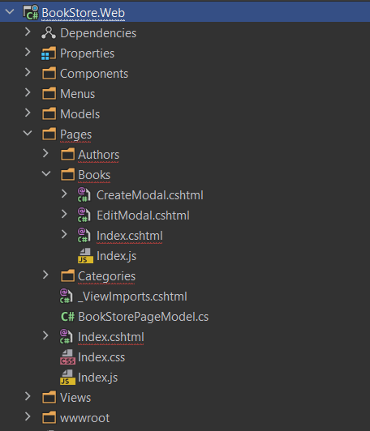

# Many to Many Relationship with ABP and EF Core

## Introduction 

In this article, we'll create a **BookStore** application like in [the ABP tutorial](https://docs.abp.io/en/abp/latest/Tutorials/Part-1?UI=MVC&DB=EF) and add an extra `Category` feature to demonstrate how we can manage the many-to-many relationship with ABP-based applications (by following DDD rules).

You can see the ER Diagram of our application below. This diagram will be helpful for us to demonstrate the relations between our entities.


When we've examined the ER Diagram, we can see the one-to-many relationship between **Author** and **Book** tables and also the many-to-many relationship (**BookCategory** table) between **Book** and **Category** tables. (There can be more than one category on each book and vice-versa in our scenario).

### Source Code

You can find the source code of the application at https://github.com/EngincanV/ABP-Many-to-Many-Relationship-Demo .

### Demo of The Final Application

At the end of this article, we will have created an application as in the below gif.


## Creating the Solution

In this article, I will create a new startup template with EF Core as a database provider and MVC for UI framework.

* We can create a new startup template by using the [ABP CLI](https://docs.abp.io/en/abp/latest/CLI):

```bash
abp new BookStore -t app --version 5.0.0-beta.2
```

* Our project boilerplate will be ready after the download is finished. Then, we can open the solution and starts the development.

## Starting the Development

Let's start with creating our Domain Entities. 

### Step 1 - (Creating the Domain Entities)

We can create a folder-structure under the `BookStore.Domain` project like in the below image.


Open the entity classes and add the following codes to each of these classes.

* **Author.cs**

```csharp
using System;
using JetBrains.Annotations;
using Volo.Abp;
using Volo.Abp.Domain.Entities.Auditing;

namespace BookStore.Authors
{
    public class Author : FullAuditedAggregateRoot<Guid>
    {
        public string Name { get; private set; }
        
        public DateTime BirthDate { get; set; }
        
        public string ShortBio { get; set; }
        
        /* This constructor is for deserialization / ORM purpose */
        private Author()
        {
        }

        public Author(Guid id, [NotNull] string name, DateTime birthDate, [CanBeNull] string shortBio = null)
            : base(id)
        {
            SetName(name);
            BirthDate = birthDate;
            ShortBio = shortBio;
        }

        public void SetName([NotNull] string name)
        {
            Name = Check.NotNullOrWhiteSpace(
                name,
                nameof(name),
                maxLength: AuthorConsts.MaxNameLength
            );
        }
    }
}
```

> We'll create the `AuthorConsts` class later in this step.

* **Book.cs**

```csharp
using System;
using System.Collections.Generic;
using System.Collections.ObjectModel;
using System.Linq;
using Volo.Abp;
using Volo.Abp.Domain.Entities.Auditing;

namespace BookStore.Books
{
    public class Book : FullAuditedAggregateRoot<Guid>
    {
        public Guid AuthorId { get; set; }

        public string Name { get; private set; }

        public DateTime PublishDate { get; set; }

        public float Price { get; set; }

        public ICollection<BookCategory> Categories { get; private set; }

        private Book()
        {
        }

        public Book(Guid id, Guid authorId, string name, DateTime publishDate, float price) 
            : base(id)
        {
            AuthorId = authorId;
            SetName(name);
            PublishDate = publishDate;
            Price = price;

            Categories = new Collection<BookCategory>();
        }

        public void SetName(string name)
        {
            Name = Check.NotNullOrWhiteSpace(name, nameof(name), BookConsts.MaxNameLength);
        }

        public void AddCategory(Guid categoryId)
        {
            Check.NotNull(categoryId, nameof(categoryId));

            if (IsInCategory(categoryId))
            {
                return;
            }
            
            Categories.Add(new BookCategory(bookId: Id, categoryId));
        }

        public void RemoveCategory(Guid categoryId)
        {
            Check.NotNull(categoryId, nameof(categoryId));

            if (!IsInCategory(categoryId))
            {
                return;
            }

            Categories.RemoveAll(x => x.CategoryId == categoryId);
        }

        public void RemoveAllCategoriesExceptGivenIds(List<Guid> categoryIds)
        {
            Check.NotNullOrEmpty(categoryIds, nameof(categoryIds));
            
            Categories.RemoveAll(x => !categoryIds.Contains(x.CategoryId));
        }

        public void RemoveAllCategories()
        {
            Categories.RemoveAll(x => x.BookId == Id);
        }

        private bool IsInCategory(Guid categoryId)
        {
            return Categories.Any(x => x.CategoryId == categoryId);
        }
    }
}
```

* In our scenario, a book can have more than one category and a category can have more than one book so we need to create a many-to-many relationship between them.

* For achieving this, we will create a **join entity** named `BookCategory`, and this class will simply have variables named `BookId` and `CategoryId`.

* To manage this **join entity**, we can add it as a sub-collection to the **Book** entity, as we do above. We add this sub-collection
to **Book** class instead of **Category** class, because a book can have tens (or mostly hundreds) of categories but on the other perspective a category can have more than a hundred (or even way much) books inside of it.

* It is a significant performance problem to load thousands of items whenever you query a category. Therefore it makes much more sense to add that sub-collection to the `Book` entity. 

> Don't forget: **Aggregate is a pattern in Domain-Driven Design. A DDD aggregate is a cluster of domain objects that can be treated as a single unit.** (See the full [description](https://martinfowler.com/bliki/DDD_Aggregate.html))

* Notice that, `BookCategory` is not an **Aggregate Root** so we are not violating one of the base rules about Aggregate Root (Rule: **"Reference Other Aggregates Only by ID"**).

* If we examine the methods in the `Book` class (such as **RemoveAllCategories**, **RemoveAllCategoriesExceptGivenIds** and **AddCategory**) we will manage our sub-collection `Categories` (**BookCategory** - join table/entity) through them. (Adds or removes categories for books)

> We'll create the `BookCategory` and `BookConsts` classes later in this step.

* **BookCategory.cs**

```csharp
using System;
using Volo.Abp.Domain.Entities;

namespace BookStore.Books
{
    public class BookCategory : Entity
    {
        public Guid BookId { get; protected set; }

        public Guid CategoryId { get; protected set; }

        /* This constructor is for deserialization / ORM purpose */
        private BookCategory()
        {
        }

        public BookCategory(Guid bookId, Guid categoryId)
        {
            BookId = bookId;
            CategoryId = categoryId;
        }
        
        public override object[] GetKeys()
        {
            return new object[] {BookId, CategoryId};
        }
    }
}
```

* Here, as you can notice we've defined the `BookCategory` as the **Join Table/Entity** for our many-to-many relationship and ensure the required properties (BookId and CategoryId) must be set in the constructor method of this class to create this object.

* And also we've derived this class from the `Entity` class and therefore we've had to override the **GetKeys** method of this class to define **Composite Key**.

> The composite key is composed of `BookId` and `CategoryId` in our case. And they are unique together.

>  For more information about **Entities with Composite Keys**, you can read the relevant section from [Entities documentation](https://docs.abp.io/en/abp/latest/Entities#entities-with-composite-keys).

* **BookManager.cs**

```csharp
using System;
using System.Linq;
using System.Threading.Tasks;
using BookStore.Categories;
using JetBrains.Annotations;
using Volo.Abp.Domain.Repositories;
using Volo.Abp.Domain.Services;

namespace BookStore.Books
{
    public class BookManager : DomainService
    {
        private readonly IBookRepository _bookRepository;
        private readonly IRepository<Category, Guid> _categoryRepository;

        public BookManager(IBookRepository bookRepository, IRepository<Category, Guid> categoryRepository)
        {
            _bookRepository = bookRepository;
            _categoryRepository = categoryRepository;
        }

        public async Task CreateAsync(Guid authorId, string name, DateTime publishDate, float price, [CanBeNull]string[] categoryNames)
        {
            var book = new Book(GuidGenerator.Create(), authorId, name, publishDate, price);

            await SetCategoriesAsync(book, categoryNames);
            
            await _bookRepository.InsertAsync(book);
        }

        public async Task UpdateAsync(
            Book book, 
            Guid authorId,
            string name, 
            DateTime publishDate, 
            float price,
            [CanBeNull] string[] categoryNames
        )
        {
            book.AuthorId = authorId;
            book.SetName(name);
            book.PublishDate = publishDate;
            book.Price = price;
            
            await SetCategoriesAsync(book, categoryNames);

            await _bookRepository.UpdateAsync(book);
        }
        
        private async Task SetCategoriesAsync(Book book, [CanBeNull] string[] categoryNames)
        {
            if (categoryNames == null || !categoryNames.Any())
            {
                book.RemoveAllCategories();
                return;
            }

            var query = (await _categoryRepository.GetQueryableAsync())
                .Where(x => categoryNames.Contains(x.Name))
                .Select(x => x.Id)
                .Distinct();

            var categoryIds = await AsyncExecuter.ToListAsync(query);
            if (!categoryIds.Any())
            {
                return;
            }

            book.RemoveAllCategoriesExceptGivenIds(categoryIds);

            foreach (var categoryId in categoryIds)
            {
                book.AddCategory(categoryId);
            }
        }
    }
}
```

* If we examine the codes in the `BookManager` class, we can see that we've managed the `BookCategory` class (our join table/entity)
by using some methods that we've defined in the `Book` class such as **RemoveAllCategories**, **RemoveAllCategoriesExceptGivenIds** and **AddCategory**.

* These methods basically add or remove categories related to the book by conditions.

* In the `CreateAsync` method, if the category names are specified we are retrieving their ids from the database and by using the **AddCategory** method that we've defined in the `Book` class, we're adding them.

* In the `UpdateAsync` method, the same logic is also valid. But in this case, the user could want to remove some categories from books, so if the user sends us an empty **categoryNames** array, we remove all categories from the book he wants to update. If the user sends us some category names, we remove the excluded ones and add the new ones according to **categoryNames** array.

* **BookWithDetails.cs**

```csharp
using System;
using Volo.Abp.Auditing;

namespace BookStore.Books
{
    public class BookWithDetails : IHasCreationTime
    {
        public Guid Id { get; set; }
        
        public string Name { get; set; }

        public DateTime PublishDate { get; set; }

        public float Price { get; set; }

        public string AuthorName { get; set; }

        public string[] CategoryNames { get; set; }
        
        public DateTime CreationTime { get; set; }
    }
}
```

We will use this class as output DTO to retrieve books with their sub-categories and author names.

* **IBookRepository.cs**

```csharp
using System;
using System.Collections.Generic;
using System.Threading;
using System.Threading.Tasks;
using Volo.Abp.Domain.Repositories;

namespace BookStore.Books
{
    public interface IBookRepository : IRepository<Book, Guid>
    {
        Task<List<BookWithDetails>> GetListAsync(
            string sorting,
            int skipCount,
            int maxResultCount,
            CancellationToken cancellationToken = default
        );

        Task<BookWithDetails> GetAsync(Guid id, CancellationToken cancellationToken = default);
    }
}
```

We need to create two methods named **GetListAsync** and **GetAsync** and specify their return type as `BookWithDetails`. So by implementing these methods, we will return the book/books by their details (author name and categories).

* **Category.cs**

```csharp
using System;
using Volo.Abp;
using Volo.Abp.Domain.Entities.Auditing;

namespace BookStore.Categories
{
    public class Category : AuditedAggregateRoot<Guid>
    {
        public string Name { get; private set; }

        /* This constructor is for deserialization / ORM purpose */
        private Category()
        {
        }

        public Category(Guid id, string name) : base(id)
        {
            SetName(name);
        }

        public Category SetName(string name)
        { 
            Name = Check.NotNullOrWhiteSpace(name, nameof(name), CategoryConsts.MaxNameLength);
            return this;
        }
    }
}
```

### Step 2 - (Define Consts)

We can create a folder-structure under the `BookStore.Domain.Shared` project like in the below image.


* **AuthorConsts.cs**

```csharp
namespace BookStore.Authors
{
    public class AuthorConsts
    {
        public const int MaxNameLength = 128;

        public const int MaxShortBioLength = 256;
    }
}
```

* **BookConsts.cs**

```csharp
namespace BookStore.Books
{
    public class BookConsts
    {
        public const int MaxNameLength = 128;
    }
}
```

* **CategoryConsts.cs**

```csharp
namespace BookStore.Categories
{
    public class CategoryConsts
    {
        public const int MaxNameLength = 64;
    }
}
```

In these classes, we've defined max text length for our entity properties that we will use in the **Database Integration** section to specify limits for our properties. (E.g. varchar(128) for BookName)

### Step 3 - (Database Integration)

After defining our entities, we can configure them for the database integration. 
Open the `BookStoreDbContext` class in the `BookStore.EntityFrameworkCore` project and update with the following code blocks.

```csharp
namespace BookStore.EntityFrameworkCore
{
    [ReplaceDbContext(typeof(IIdentityDbContext))]
    [ReplaceDbContext(typeof(ITenantManagementDbContext))]
    [ConnectionStringName("Default")]
    public class BookStoreDbContext : 
        AbpDbContext<BookStoreDbContext>,
        IIdentityDbContext,
        ITenantManagementDbContext
    {
        //...

        //DbSet properties for our Aggregate Roots
        public DbSet<Author> Authors { get; set; }
        public DbSet<Book> Books { get; set; }
        public DbSet<Category> Categories { get; set; }
        
        //NOTE: We don't need to add DbSet<BookCategory>, because we will be query it via using the Book entity
        // public DbSet<BookCategory> BookCategories { get; set; }

        //...

        protected override void OnModelCreating(ModelBuilder builder)
        {
            //...

            /* Configure your own tables/entities inside here */
            builder.Entity<Author>(b =>
            {
                b.ToTable(BookStoreConsts.DbTablePrefix + "Authors" + BookStoreConsts.DbSchema);
                b.ConfigureByConvention();

                b.Property(x => x.Name)
                    .HasMaxLength(AuthorConsts.MaxNameLength)
                    .IsRequired();

                b.Property(x => x.ShortBio)
                    .HasMaxLength(AuthorConsts.MaxShortBioLength)
                    .IsRequired();
            });

            builder.Entity<Book>(b =>
            {
                b.ToTable(BookStoreConsts.DbTablePrefix + "Books" + BookStoreConsts.DbSchema);
                b.ConfigureByConvention();

                b.Property(x => x.Name)
                    .HasMaxLength(BookConsts.MaxNameLength)
                    .IsRequired();

                //one-to-many relationship with Author table
                b.HasOne<Author>().WithMany().HasForeignKey(x => x.AuthorId).IsRequired();

                //many-to-many relationship with Category table => BookCategories
                b.HasMany(x => x.Categories).WithOne().HasForeignKey(x => x.BookId).IsRequired();
            });

            builder.Entity<Category>(b =>
            {
                b.ToTable(BookStoreConsts.DbTablePrefix + "Categories" + BookStoreConsts.DbSchema);
                b.ConfigureByConvention();

                b.Property(x => x.Name)
                    .HasMaxLength(CategoryConsts.MaxNameLength)
                    .IsRequired();
            });

            builder.Entity<BookCategory>(b =>
            {
                b.ToTable(BookStoreConsts.DbTablePrefix + "BookCategories" + BookStoreConsts.DbSchema);
                b.ConfigureByConvention();

                //define composite key
                b.HasKey(x => new { x.BookId, x.CategoryId });

                //many-to-many configuration
                b.HasOne<Book>().WithMany(x => x.Categories).HasForeignKey(x => x.BookId).IsRequired();
                b.HasOne<Category>().WithMany().HasForeignKey(x => x.CategoryId).IsRequired();
                
                b.HasIndex(x => new { x.BookId, x.CategoryId });
            });
        }
    }
}
```

* In this class, we've defined **DbSet** properties for our **Aggregate Roots** (**Book**, **Author** and **Category**). Notice, we didn't define **DbSet** for `BookCategory` class (our join table/entity). Because, the `Book` aggregate is responsible to manage it via sub-collection.

* After that, we can use the **FluentAPI** to configure our tables in the `OnModelCreating` method of this class.

```csharp
builder.Entity<Book>(b =>
{
    //...

    //one-to-many relationship with Author table
    b.HasOne<Author>().WithMany().HasForeignKey(x => x.AuthorId).IsRequired();

    //many-to-many relationship with Category table => BookCategories
    b.HasMany(x => x.Categories).WithOne().HasForeignKey(x => x.BookId).IsRequired();
});
```

Here, we have provided the one-to-many relationship between the **Book** and the **Author** in the above code-block. 

```csharp
builder.Entity<BookCategory>(b =>
{
    //...

    //define composite key
    b.HasKey(x => new { x.BookId, x.CategoryId });

    //many-to-many configuration
    b.HasOne<Book>().WithMany(x => x.Categories).HasForeignKey(x => x.BookId).IsRequired();
    b.HasOne<Category>().WithMany().HasForeignKey(x => x.CategoryId).IsRequired();
                
    b.HasIndex(x => new { x.BookId, x.CategoryId });
});
```

Here, firstly we've defined the composite key for our `BookCategory` entity. `BookId` and `CategoryId` are together composite keys for the `BookCategory` table. Then we've configured the many-to-many relationship between `Book` and `Category` table like in the above code-block.

#### Implementing the `IBookRepository` Interface

After making the relevant configurations for database integration, we can now implement the `IBookRepository` interface. To do this, create a folder named `Books` in the `BookStore.EntityFrameworkCore` project and inside of this folder create a class named `EfCoreBookRepository` and update this class with the following code. 

```csharp
using System;
using System.Collections.Generic;
using System.Linq;
using System.Linq.Dynamic.Core;
using System.Threading;
using System.Threading.Tasks;
using BookStore.Authors;
using BookStore.Categories;
using BookStore.EntityFrameworkCore;
using Microsoft.EntityFrameworkCore;
using Volo.Abp.Domain.Repositories.EntityFrameworkCore;
using Volo.Abp.EntityFrameworkCore;

namespace BookStore.Books
{
    public class EfCoreBookRepository : EfCoreRepository<BookStoreDbContext, Book, Guid>, IBookRepository
    {
        public EfCoreBookRepository(IDbContextProvider<BookStoreDbContext> dbContextProvider) : base(dbContextProvider)
        {
        }

        public async Task<List<BookWithDetails>> GetListAsync(
            string sorting, 
            int skipCount, 
            int maxResultCount, 
            CancellationToken cancellationToken = default
        )
        {
            var query = await ApplyFilterAsync();
            
            return await query
                .OrderBy(!string.IsNullOrWhiteSpace(sorting) ? sorting : nameof(Book.Name))
                .PageBy(skipCount, maxResultCount)
                .ToListAsync(GetCancellationToken(cancellationToken));
        }

        public async Task<BookWithDetails> GetAsync(Guid id, CancellationToken cancellationToken = default)
        {
            var query = await ApplyFilterAsync();
            
            return await query
                .Where(x => x.Id == id)
                .FirstOrDefaultAsync(GetCancellationToken(cancellationToken));
        }

        private async Task<IQueryable<BookWithDetails>> ApplyFilterAsync()
        {
            var dbContext = await GetDbContextAsync();

            return (await GetDbSetAsync())
                .Include(x => x.Categories)
                .Join(dbContext.Set<Author>(), book => book.AuthorId, author => author.Id,
                    (book, author) => new {book, author})
                .Select(x => new BookWithDetails
                {
                    Id = x.book.Id,
                    Name = x.book.Name,
                    Price = x.book.Price,
                    PublishDate = x.book.PublishDate,
                    CreationTime = x.book.CreationTime,
                    AuthorName = x.author.Name,
                    CategoryNames = (from bookCategories in x.book.Categories
                        join category in dbContext.Set<Category>() on bookCategories.CategoryId equals category.Id
                        select category.Name).ToArray()
                });
        }

        public override Task<IQueryable<Book>> WithDetailsAsync()
        {
            return base.WithDetailsAsync(x => x.Categories);
        }
    }
}
```

* Here we've implemented our custom repository methods and returned the book with details (author name and categories).

### Step 4 - (Database Migration)

* We've integrated our entities with the database in the previous step, now we can create a new database migration and apply it to the database. So let's do that.

* Open the `BookStore.EntityFrameworkCore` project in the terminal. And create a new database migration by using the following command.

```bash
dotnet ef migrations add <Migration_Name>
```

* Then, run the `BookStore.DbMigrator` application to create the database.

### Step 5 - (Create Application Services)

* Let's start with defining our DTOs and application service interfaces in the `BookStore.Application.Contracts` layer. We can create a folder-structure like in the below image.


* We can use the [`CrudAppService`](https://docs.abp.io/en/abp/latest/Application-Services#crud-application-services) base class of the ABP Framework to create application services to **Get**, **Create**, **Update** and **Delete** authors and categories.

* **AuthorDto.cs**

```csharp
using System;
using Volo.Abp.Application.Dtos;

namespace BookStore.Authors
{
    public class AuthorDto : EntityDto<Guid>
    {
        public string Name { get; set; }
        
        public DateTime BirthDate { get; set; }
        
        public string ShortBio { get; set; }
    }
}
```

* **AuthorLookupDto.cs**

```csharp
using System;
using Volo.Abp.Application.Dtos;

namespace BookStore.Authors
{
    public class AuthorLookupDto : EntityDto<Guid>
    {
        public string Name { get; set; }
    }
}
```

We will use this DTO class as output DTO to get all authors and list them in a select box in the book creation modal. (Like in the below image.)


* **CreateUpdateAuthorDto.cs**

```csharp
using System;

namespace BookStore.Authors
{
    public class CreateUpdateAuthorDto
    {
        public string Name { get; set; }
        
        public DateTime BirthDate { get; set; }
        
        public string ShortBio { get; set; }
    }
}
```

* **IAuthorAppService.cs**

```csharp
using System;
using Volo.Abp.Application.Dtos;
using Volo.Abp.Application.Services;

namespace BookStore.Authors
{
    public interface IAuthorAppService : 
        ICrudAppService<AuthorDto, Guid, PagedAndSortedResultRequestDto, CreateUpdateAuthorDto, CreateUpdateAuthorDto>
    {
    }
}
```

* **BookDto.cs**

```csharp
using System;
using Volo.Abp.Application.Dtos;

namespace BookStore.Books
{
    public class BookDto : EntityDto<Guid>
    {
        public string AuthorName { get; set; }

        public string Name { get; set; }

        public DateTime PublishDate { get; set; }

        public float Price { get; set; }

        public string[] CategoryNames { get; set; }
    }
}
```

When listing the Book/Books we will retrieve them with all their details (author name and category names).

* **BookGetListInput.cs**

```csharp
using Volo.Abp.Application.Dtos;

namespace BookStore.Books
{
    public class BookGetListInput : PagedAndSortedResultRequestDto
    {
    }
}
```

* **CreateUpdateBookDto.cs**

```csharp
using System;

namespace BookStore.Books
{
    public class CreateUpdateBookDto
    {
        public Guid AuthorId { get; set; }

        public string Name { get; set; }

        public DateTime PublishDate { get; set; }

        public float Price { get; set; }

        public string[] CategoryNames { get; set; }
    }
}
```

To create or update a book we will use this input DTO.

* **IBookAppService.cs**

```csharp
using System;
using System.Threading.Tasks;
using BookStore.Authors;
using BookStore.Categories;
using Volo.Abp.Application.Dtos;
using Volo.Abp.Application.Services;

namespace BookStore.Books
{
    public interface IBookAppService : IApplicationService
    {
        Task<PagedResultDto<BookDto>> GetListAsync(BookGetListInput input);

        Task<BookDto> GetAsync(Guid id);

        Task CreateAsync(CreateUpdateBookDto input);

        Task UpdateAsync(Guid id, CreateUpdateBookDto input);

        Task DeleteAsync(Guid id);

        Task<ListResultDto<AuthorLookupDto>> GetAuthorLookupAsync();

        Task<ListResultDto<CategoryLookupDto>> GetCategoryLookupAsync();
    }
}
```

* We will create custom application service method for managing Books instead of using the `CrudAppService`'s methods.

* Also we will create two additional methods and they are `GetAuthorLookupAsync` and `GetCategoryLookupAsync`. We will use these two methods to retrieve all authors and categories without pagination and listed them as select box item in create/update modals for Book page.
(You can see the usage of these two methods in the below gif.)


* **CategoryDto.cs**

```csharp
using System;
using Volo.Abp.Application.Dtos;

namespace BookStore.Categories
{
    public class CategoryDto : EntityDto<Guid>
    {
        public string Name { get; set; }
    }
}
```

* **CategoryLookupDto.cs**

```csharp
using System;
using Volo.Abp.Application.Dtos;

namespace BookStore.Categories
{
    public class CategoryLookupDto : EntityDto<Guid>
    {
        public string Name { get; set; }
    }
}
```

We will use this DTO class  as output DTO to get all categories without pagination and list them in a select box in the book create/update modal.

* **CreateUpdateCategoryDto.cs**

```csharp
namespace BookStore.Categories
{
    public class CreateUpdateCategoryDto
    {
        public string Name { get; set; }
    }
}
```

* **ICategoryAppService.cs**

```csharp
using System;
using Volo.Abp.Application.Dtos;
using Volo.Abp.Application.Services;

namespace BookStore.Categories
{
    public interface ICategoryAppService : 
        ICrudAppService<CategoryDto, Guid, PagedAndSortedResultRequestDto, CreateUpdateCategoryDto, CreateUpdateCategoryDto>
    {
    }
}
```

After creating the DTOs and application service interfaces, now we can define the implementation of that interfaces. So, we can create a folder-structure like in the below image for `BookStore.Application` layer. Open the application service classes and add the following codes to each of these classes.


* **AuthorAppService.cs**

```csharp
using System;
using Volo.Abp.Application.Dtos;
using Volo.Abp.Application.Services;
using Volo.Abp.Domain.Repositories;

namespace BookStore.Authors
{
    public class AuthorAppService : 
        CrudAppService<Author, AuthorDto, Guid, PagedAndSortedResultRequestDto, CreateUpdateAuthorDto, CreateUpdateAuthorDto>, 
        IAuthorAppService
    {
        public AuthorAppService(IRepository<Author, Guid> repository) : base(repository)
        {
        }
    }
}
```

* **CategoryAppService.cs**

```csharp
using System;
using Volo.Abp.Application.Dtos;
using Volo.Abp.Application.Services;
using Volo.Abp.Domain.Repositories;

namespace BookStore.Categories
{
    public class CategoryAppService : 
        CrudAppService<Category, CategoryDto, Guid, PagedAndSortedResultRequestDto, CreateUpdateCategoryDto, CreateUpdateCategoryDto>,
        ICategoryAppService
    {
        public CategoryAppService(IRepository<Category, Guid> repository) : base(repository)
        {
        }
    }
}
```

Thanks to the `CrudAppService`, we don't need to manually implement the crud methods for **AuthorAppService** and **CategoryAppService**.

* **BookAppService.cs**

```csharp
using System;
using System.Collections.Generic;
using System.Threading.Tasks;
using BookStore.Authors;
using BookStore.Categories;
using Volo.Abp.Application.Dtos;
using Volo.Abp.Domain.Repositories;

namespace BookStore.Books
{
    public class BookAppService : BookStoreAppService, IBookAppService
    {
        private readonly IBookRepository _bookRepository;
        private readonly BookManager _bookManager;
        private readonly IRepository<Author, Guid> _authorRepository;
        private readonly IRepository<Category, Guid> _categoryRepository;

        public BookAppService(
            IBookRepository bookRepository, 
            BookManager bookManager, 
            IRepository<Author, Guid> authorRepository,
            IRepository<Category, Guid> categoryRepository
        )
        {
            _bookRepository = bookRepository;
            _bookManager = bookManager;
            _authorRepository = authorRepository;
            _categoryRepository = categoryRepository;
        }
        
        public async Task<PagedResultDto<BookDto>> GetListAsync(BookGetListInput input)
        {
            var books = await _bookRepository.GetListAsync(input.Sorting, input.SkipCount, input.MaxResultCount);
            var totalCount = await _bookRepository.CountAsync();

            return new PagedResultDto<BookDto>(totalCount, ObjectMapper.Map<List<BookWithDetails>, List<BookDto>>(books));
        }

        public async Task<BookDto> GetAsync(Guid id)
        {
            var book = await _bookRepository.GetAsync(id);

            return ObjectMapper.Map<BookWithDetails, BookDto>(book);
        }

        public async Task CreateAsync(CreateUpdateBookDto input)
        {
            await _bookManager.CreateAsync(
                input.AuthorId, 
                input.Name, 
                input.PublishDate, 
                input.Price,
                input.CategoryNames
            );
        }

        public async Task UpdateAsync(Guid id, CreateUpdateBookDto input)
        {
            var book = await _bookRepository.GetAsync(id, includeDetails: true); //return type is: Book (not BookWithDetails) Because, we don't need author name
            
            await _bookManager.UpdateAsync(
                book, 
                input.AuthorId, 
                input.Name, 
                input.PublishDate, 
                input.Price, 
                input.CategoryNames
            );
        }

        public async Task DeleteAsync(Guid id)
        {
            await _bookRepository.DeleteAsync(id);
        }
        
        public async Task<ListResultDto<AuthorLookupDto>> GetAuthorLookupAsync()
        {
            var authors = await _authorRepository.GetListAsync();

            return new ListResultDto<AuthorLookupDto>(
                ObjectMapper.Map<List<Author>, List<AuthorLookupDto>>(authors)
            );
        }

        public async Task<ListResultDto<CategoryLookupDto>> GetCategoryLookupAsync()
        {
            var categories = await _categoryRepository.GetListAsync();

            return new ListResultDto<CategoryLookupDto>(
                ObjectMapper.Map<List<Category>, List<CategoryLookupDto>>(categories)
            );
        }
    }
}
```

* As you can notice here, we've used our **Domain Service** class named `BookManager` in the **CreateAsync** and **UpdateAsync** methods. (In step 1, we've defined them)

* As you may remember, in these methods, new categories are added to the book or removed from the sub-collection (**Categories** (`BookCategory`)) according to the relevant category names.

* After implementing the application services, we need to define the mappings for our services to work. So open the `BookStoreApplicationAutoMapperProfile` class and update with the following code.

```csharp
using AutoMapper;
using BookStore.Authors;
using BookStore.Books;
using BookStore.Categories;

namespace BookStore
{
    public class BookStoreApplicationAutoMapperProfile : Profile
    {
        public BookStoreApplicationAutoMapperProfile()
        {
            CreateMap<Category, CategoryDto>();
            CreateMap<Category, CategoryLookupDto>();
            CreateMap<CreateUpdateCategoryDto, Category>();

            CreateMap<Author, AuthorDto>();
            CreateMap<Author, AuthorLookupDto>();
            CreateMap<CreateUpdateAuthorDto, Author>();

            CreateMap<BookWithDetails, BookDto>();
        }
    }
}

```

### Step 6 - (UI)

The only thing we need to do is, by using the application service methods that we've defined in the previous step to create the UI.



> To keep the article shorter, I'll just show you how to create the Book page (with Create/Edit modals). If you want to implement it to other pages, you can access the source code of the application at https://github.com/EngincanV/ABP-Many-to-Many-Relationship-Demo and copy-paste the relevant code-blocks to your application.

#### Book Page

* Create a razor page named **Index.cshtml** under the **Pages/Books** folder of the `BookStore.Web` project and paste the following code to that page.

* **Index.cshtml**

```html
@page
@model BookStore.Web.Pages.Books.Index

@section scripts
{
    <abp-script src="/Pages/Books/Index.js" />
}

<abp-card>
    <abp-card-header>
        <abp-row>
            <abp-column size-md="_6">
                <abp-card-title>Books</abp-card-title>
            </abp-column>
            <abp-column size-md="_6" class="text-right">
                <abp-button id="NewBookButton"
                            text="New Book"
                            icon="plus"
                            button-type="Primary"/>
            </abp-column>
        </abp-row>
    </abp-card-header>
    <abp-card-body>
        <abp-table striped-rows="true" id="BooksTable"></abp-table>
    </abp-card-body>
</abp-card>
```

In here we've added a **New Book** button and a table with an id named "BooksTable". We'll create an `Index.js` file and by using [datatable.js](https://datatables.net) we will fill the table with our records.

* **Index.js**

```js
$(function () {
    var createModal = new abp.ModalManager(abp.appPath + 'Books/CreateModal');
    var editModal = new abp.ModalManager(abp.appPath + 'Books/EditModal');
    
    var bookService = bookStore.books.book;
    
    var dataTable = $('#BooksTable').DataTable(
        abp.libs.datatables.normalizeConfiguration({
            serverSide: true,
            paging: true,
            order: [[1, "asc"]],
            searching: false,
            scrollX: true,
            ajax: abp.libs.datatables.createAjax(bookService.getList),
            columnDefs: [
                {
                    title: 'Actions',
                    rowAction: {
                        items:
                            [
                                {
                                    text: 'Edit',
                                    action: function (data) {
                                        editModal.open({ id: data.record.id });
                                    }
                                },
                                {
                                    text: 'Delete',
                                    confirmMessage: function (data) {
                                        return "Are you sure to delete the book '" + data.record.name  +"'?";
                                    },
                                    action: function (data) {
                                        bookService
                                            .delete(data.record.id)
                                            .then(function() {
                                                abp.notify.info("Successfully deleted!");
                                                dataTable.ajax.reload();
                                            });
                                    }
                                }
                            ]
                    }
                },
                {
                    title: 'Name',
                    data: "name"
                },
                {
                    title: 'Publish Date',
                    data: "publishDate",
                    render: function (data) {
                        return luxon
                            .DateTime
                            .fromISO(data, {
                                locale: abp.localization.currentCulture.name
                            }).toLocaleString();
                    }
                },
                {
                  title: 'Author Name',
                  data: "authorName"  
                },
                {
                    title: 'Price',
                    data: "price"
                },
                {
                   title: 'Categories',
                   data: "categoryNames",
                    render: function (data) {
                       return data.join(", ");
                    }
                }
            ]
        })
    );

    createModal.onResult(function () {
        dataTable.ajax.reload();
    });

    editModal.onResult(function () {
        dataTable.ajax.reload();
    });

    $('#NewBookButton').click(function (e) {
        e.preventDefault();
        createModal.open();
    });
});

```

> `abp.libs.datatables.normalizeConfiguration` is a helper function defined by the ABP Framework. It simplifies the Datatables configuration by providing conventional default values for missing options.

* Let's examine what we've done in the `Index.js` file.

* Firstly, we've defined our `createModal` and `editModal` modals by using the [ABP Modals](https://docs.abp.io/en/abp/latest/UI/AspNetCore/Modals). Then, we've created the DataTable and fetch our books by using the dynamic JavaScript proxy function (`bookStore.books.book.getList`) (It sends a request to the **GetListAsync** method that we've defined in the `BookAppService`, under the hook) and we've shown them in the table with an id named "BooksTable".

* Now let's run the application and navigate to **/Books** route to see how our Book page looks.


We need to see a page like in the above image. Our app is working properly, we can continue to development.

> If you are stuck in any point, you can examine the [source codes](https://github.com/EngincanV/ABP-Many-to-Many-Relationship-Demo).

#### Model Classes and Mapping Configurations

Create a folder named **Modals** and add a class named `CategoryViewModel` inside of it. We will use this view modal class to determine which categories are selected or not in our Create/Edit modals.

* **CategoryViewModel.cs**

```csharp
using System;
using System.ComponentModel.DataAnnotations;
using Microsoft.AspNetCore.Mvc;

namespace BookStore.Web.Models
{
    public class CategoryViewModel
    {
        [HiddenInput]
        public Guid Id { get; set; }

        public bool IsSelected { get; set; }

        [Required]
        [HiddenInput]
        public string Name { get; set; }
    }
}
```

Then, we can open the `BookStoreWebAutoMapperProfile` class and define the required mappings as follows.

```csharp
using AutoMapper;
using BookStore.Authors;
using BookStore.Books;
using BookStore.Categories;
using BookStore.Web.Models;
using BookStore.Web.Pages.Books;
using Volo.Abp.AutoMapper;

namespace BookStore.Web
{
    public class BookStoreWebAutoMapperProfile : Profile
    {
        public BookStoreWebAutoMapperProfile()
        {
            CreateMap<CategoryLookupDto, CategoryViewModel>()
                .Ignore(x => x.IsSelected);

            CreateMap<BookDto, CreateUpdateBookDto>();

            CreateMap<AuthorDto, CreateUpdateAuthorDto>();

            CreateMap<CategoryDto, CreateUpdateCategoryDto>();
        }
    }
}
```

#### Create/Edit Modals

After creating our index page for Books and configuring mappings, let's continue with creating the Create/Edit modals for Books.

Create a razor page named **CreateModal.cshtml** (and **CreateModal.cshtml.cs**).

* **CreateModal.cs**

```html
@page
@using Volo.Abp.AspNetCore.Mvc.UI.Bootstrap.TagHelpers.Modal
@model BookStore.Web.Pages.Books.CreateModal

@{
    Layout = null;
}

<form method="post" id="CreateBookModal" asp-page="/Books/CreateModal">
    <abp-modal>
        <abp-modal-header title="New Book"></abp-modal-header>
        <abp-modal-body>
            <abp-tabs name="create-book-modal-tabs">
                <abp-tab title="Book Information" class="mt-3">
                    <div id="book-information-wrapper" class="mt-3">
                        <abp-input asp-for="Book.Name" label="Book Name"/>
                        <abp-input asp-for="Book.Price" label="Price" type="number"/>
                        <abp-input asp-for="Book.PublishDate" type="date" label="Publish Date"/>
                        <abp-select asp-for="Book.AuthorId" asp-items="@Model.AuthorList" label="Author">
                            <option value="" disabled="disabled">Choose a author...</option>
                        </abp-select>
                    </div>
                </abp-tab>
                <abp-tab title="Categories">
                    <div id="category-list-wrapper" class="mt-3">
                        @for (var i = 0; i < Model.Categories.Count; i++)
                        {
                            var category = Model.Categories[i];
                            <abp-input abp-id-name="@Model.Categories[i].IsSelected" asp-for="@category.IsSelected" label="@category.Name"/>
                            <input abp-id-name="@Model.Categories[i].Name" asp-for="@category.Name" />
                        }
                    </div>
                </abp-tab>
            </abp-tabs>
        </abp-modal-body>
        <abp-modal-footer buttons="@(AbpModalButtons.Cancel|AbpModalButtons.Save)"></abp-modal-footer>
    </abp-modal>
</form>
```

* **CreateModal.cshtml.cs**

```csharp
using System.Collections.Generic;
using System.Linq;
using System.Threading.Tasks;
using BookStore.Books;
using BookStore.Categories;
using BookStore.Web.Models;
using Microsoft.AspNetCore.Mvc;
using Microsoft.AspNetCore.Mvc.Rendering;

namespace BookStore.Web.Pages.Books
{
    public class CreateModal : BookStorePageModel
    {
        [BindProperty]
        public CreateUpdateBookDto Book { get; set; }
           
        [BindProperty]
        public List<CategoryViewModel> Categories { get; set; }
        
        public List<SelectListItem> AuthorList { get; set; }

        private readonly IBookAppService _bookAppService;

        public CreateModal(IBookAppService bookAppService)
        {
            _bookAppService = bookAppService;
        }

        public async Task OnGetAsync()
        {
            Book = new CreateUpdateBookDto();
            
            //Get all authors and fill the select list
            var authorLookup = await _bookAppService.GetAuthorLookupAsync();
            AuthorList = authorLookup.Items
                .Select(x => new SelectListItem(x.Name, x.Id.ToString()))
                .ToList();

            //Get all categories
            var categoryLookupDto = await _bookAppService.GetCategoryLookupAsync();
            Categories = ObjectMapper.Map<List<CategoryLookupDto>, List<CategoryViewModel>>(categoryLookupDto.Items.ToList());
        }

        public async Task<IActionResult> OnPostAsync()
        {
            ValidateModel();
            
            var selectedCategories = Categories.Where(x => x.IsSelected).ToList();
            if (selectedCategories.Any())
            {
                var categoryNames = selectedCategories.Select(x => x.Name).ToArray();
                Book.CategoryNames = categoryNames;
            }
            
            await _bookAppService.CreateAsync(Book);
            return NoContent();
        }
    }
}
```

Here, we've got all categories and authors inside of the `OnGetAsync` method. And use them inside of the create modal to list them to let the user choose when creating a new book.


* When the user submitted the form, `OnPostAsync` method runs. Inside of this method, we get the selected categories and pass them into the **CategoryNames** array of the Book object and call the `IBookAppService.CreateAsync` method to create a new book.

Create a razor page named **EditModal.cshtml** (and **EditModal.cshtml.cs**).

* **EditModal.cshtml**

```html
@page
@using Volo.Abp.AspNetCore.Mvc.UI.Bootstrap.TagHelpers.Modal
@model BookStore.Web.Pages.Books.EditModal

@{
    Layout = null;
}

<form method="post" id="EditBookModal" asp-page="/Books/EditModal">
    <abp-modal>
        <abp-modal-header title="Update"></abp-modal-header>
        <abp-modal-body>
            <abp-tabs name="edit-book-modal-tabs">
                <abp-tab title="Book Information" class="mt-3">
                    <div id="book-information-wrapper" class="mt-3">
                        <abp-input asp-for="Id" />
                        <abp-input asp-for="EditingBook.Name" label="Book Name"/>
                        <abp-input asp-for="EditingBook.Price" label="Price" type="number"/>
                        <abp-input asp-for="EditingBook.PublishDate" type="date" label="Publish Date"/>
                        <abp-select asp-for="EditingBook.AuthorId" asp-items="@Model.AuthorList" label="Author">
                            <option value="" disabled="disabled">Choose a author...</option>
                        </abp-select>
                    </div>
                </abp-tab>
                <abp-tab title="Categories">
                    <div id="category-list-wrapper" class="mt-3">
                        @for (var i = 0; i < Model.Categories.Count; i++)
                        {
                            var category = Model.Categories[i];
                            <abp-input abp-id-name="@Model.Categories[i].IsSelected" asp-for="@category.IsSelected" label="@category.Name"/>
                            <input abp-id-name="@Model.Categories[i].Name" asp-for="@category.Name" />
                        }
                    </div>
                </abp-tab>
            </abp-tabs>
        </abp-modal-body>
        <abp-modal-footer buttons="@(AbpModalButtons.Cancel|AbpModalButtons.Save)"></abp-modal-footer>
    </abp-modal>
</form>
```

* **EditModal.cshtml.cs**

```csharp
using System;
using System.Collections.Generic;
using System.Linq;
using System.Threading.Tasks;
using BookStore.Books;
using BookStore.Categories;
using BookStore.Web.Models;
using Microsoft.AspNetCore.Mvc;
using Microsoft.AspNetCore.Mvc.Rendering;

namespace BookStore.Web.Pages.Books
{
    public class EditModal : BookStorePageModel
    {
        [HiddenInput]
        [BindProperty(SupportsGet = true)]
        public Guid Id { get; set; }

        [BindProperty]
        public CreateUpdateBookDto EditingBook { get; set; }
        
        [BindProperty]
        public List<CategoryViewModel> Categories { get; set; }
        
        public List<SelectListItem> AuthorList { get; set; }

        private readonly IBookAppService _bookAppService;

        public EditModal(IBookAppService bookAppService)
        {
            _bookAppService = bookAppService;
        }

        public async Task OnGetAsync()
        {
            var bookDto = await _bookAppService.GetAsync(Id);
            EditingBook = ObjectMapper.Map<BookDto, CreateUpdateBookDto>(bookDto);
            
            //get all authors
            var authorLookup = await _bookAppService.GetAuthorLookupAsync();
            AuthorList = authorLookup.Items
                .Select(x => new SelectListItem(x.Name, x.Id.ToString()))
                .ToList();

            //get all categories
            var categoryLookupDto = await _bookAppService.GetCategoryLookupAsync();
            Categories = ObjectMapper.Map<List<CategoryLookupDto>, List<CategoryViewModel>>(categoryLookupDto.Items.ToList());

            //mark as Selected for Categories in the book
            if (EditingBook.CategoryNames != null && EditingBook.CategoryNames.Any())
            {
                Categories
                    .Where(x => EditingBook.CategoryNames.Contains(x.Name))
                    .ToList()
                    .ForEach(x => x.IsSelected = true);
            }
        }

        public async Task<IActionResult> OnPostAsync()
        {
            ValidateModel();
            
            var selectedCategories = Categories.Where(x => x.IsSelected).ToList();
            if (selectedCategories.Any())
            {
                var categoryNames = selectedCategories.Select(x => x.Name).ToArray();
                EditingBook.CategoryNames = categoryNames;
            }
            
            await _bookAppService.UpdateAsync(Id, EditingBook);
            return NoContent();
        }
    }
}
```

* As in the `CreateModal.cshtml.cs`, we've got all categories and authors inside of the `OnGetAsync` method. And also we get the book by id and mark the selected categories properties' as `IsSelected = true`. 

* When the user updated the inputs and submitted the form, the `OnPostAsync` method runs. Inside of this method, we get the selected categories and pass them into the **CategoryNames** array of the Book object and call the `IBookAppService.UpdateAsync` method to update the book.


### Conclusion

In this article, I've tried to explain how to create many-to-many relationship by using the ABP framework. (by following DDD principles)

Thanks for reading this article, I hope it was helpful.