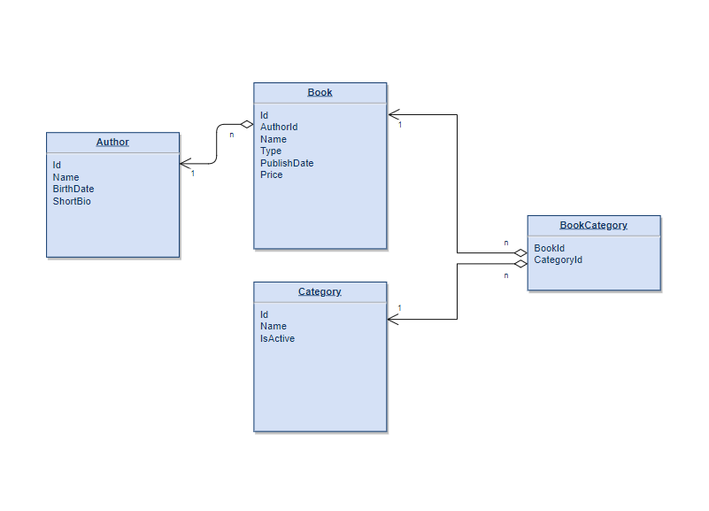

# Many to Many Relationship with ABP and EF Core

## Introduction 

In this article, we'll create a **BookStore** application like in [the ABP tutorial](https://docs.abp.io/en/abp/latest/Tutorials/Part-1?UI=MVC&DB=EF) and add an extra `Category` feature to demonstrate how we can manage the many-to-many relationship with ABP-based applications (by following DDD rules).

You can see the ER Diagram of our application under below. This diagram will be helpful for us to demonstrate the relations between our entities.



When we've examined the ER Diagram, we can see the one-to-many relationship between **Author** and **Book** tables and also the many-to-many relationship (**BookCategory** table) between **Book** and **Category** tables. Cause, there can be more than one category on each book and vice-versa in our scenario.

### Source Code

You can find the source code of the application at https://github.com/EngincanV/ABP-Many-to-Many-Relationship-Demo .
## Creating the Solution

In this article, I will create a new startup template with EF Core as a database provider and MVC for UI framework.

* We can create a new startup template by using [ABP CLI](https://docs.abp.io/en/abp/latest/CLI):

```bash
abp new BookStore -t app --version 5.0.0-beta.2
```

* Our project boilerplate will be ready after the download is finished. Then, we can open the solution and starts to the development.

## Starting the Development

Let's start with creating our Domain Entities. 

### Step 1 - (Creating the Domain Entities)

We can create a folder-structure under the `BookStore.Domain` project like in the below image.


Open the entity classes and add the following codes to each of these classes.

* **Author.cs**

```csharp
using System;
using JetBrains.Annotations;
using Volo.Abp;
using Volo.Abp.Domain.Entities.Auditing;

namespace BookStore.Authors
{
    public class Author : FullAuditedAggregateRoot<Guid>
    {
        public string Name { get; private set; }
        
        public DateTime BirthDate { get; set; }
        
        public string ShortBio { get; set; }
        
        /* This constructor is for deserialization / ORM purpose */
        private Author()
        {
        }

        public Author(Guid id, [NotNull] string name, DateTime birthDate, [CanBeNull] string shortBio = null)
            : base(id)
        {
            SetName(name);
            BirthDate = birthDate;
            ShortBio = shortBio;
        }

        public void SetName([NotNull] string name)
        {
            Name = Check.NotNullOrWhiteSpace(
                name,
                nameof(name),
                maxLength: AuthorConsts.MaxNameLength
            );
        }
    }
}
```

> We'll create the `AuthorConsts` class later in this step.

* **Book.cs**

```csharp
using System;
using Volo.Abp.Domain.Entities.Auditing;

namespace BookStore.Books
{
    public class Book : FullAuditedAggregateRoot<Guid>
    {
        public Guid AuthorId { get; set; }

        public string Name { get; set; }

        public BookType Type { get; set; }

        public DateTime PublishDate { get; set; }

        public float Price { get; set; }
        
        /* This constructor is for deserialization / ORM purpose */
        private Book()
        {
        }

        public Book(Guid id, Guid authorId, string name, BookType type, DateTime publishDate, float price) 
            : base(id)
        {
            AuthorId = authorId;
            Name = name;
            Type = type;
            PublishDate = publishDate;
            Price = price;
        }
    }
}
```

> We'll create the `BookType` enum later in this step.

* **Category.cs**

```csharp
using System;
using Volo.Abp;
using Volo.Abp.Domain.Entities.Auditing;

namespace BookStore.Categories
{
    public class Category : AuditedAggregateRoot<Guid>
    {
        public string Name { get; private set; }

        public bool IsActive { get; set; }

        /* This constructor is for deserialization / ORM purpose */
        private Category()
        {
        }

        public Category(Guid id, string name, bool isActive = true) : base(id)
        {
            SetName(name);
            IsActive = isActive;
        }

        public Category SetName(string name)
        { 
            Name = Check.NotNullOrWhiteSpace(name, nameof(name), BookConsts.MaxNameLength);
            return this;
        }
    }
}
```

> We'll create the `BookConsts` class later in this step.

* **BookCategory.cs**

```csharp
using System;
using Volo.Abp.Domain.Entities;

namespace BookStore.Books
{
    public class BookCategory : Entity
    {
        public Guid BookId { get; protected set; }

        public Guid CategoryId { get; protected set; }

        private BookCategory()
        {
        }

        public BookCategory(Guid bookId, Guid categoryId)
        {
            BookId = bookId;
            CategoryId = categoryId;
        }
        
        public override object[] GetKeys()
        {
            return new object[] {BookId, CategoryId};
        }
    }
}
```

Here, as you can notice we've defined the `BookCategory` as the **Join Table** for our many-to-many relationship and ensure the required properties (BookId and CategoryId) must be set to create this object.

And also we've derived this class from `Entity` class and therefore we've had to override the **GetKeys** method of this class to define **Composite Key**

> The composite key is composed of `BookId` and `CategoryId` in our case. 

>  For more information about **Entities with Composite Keys**, you can read the relavant section from [Entites documentation](https://docs.abp.io/en/abp/latest/Entities#entities-with-composite-keys)


* After defining our entities, now we can open the `BookStore.Domain.Shared` project and add the relevant constants and enums from there.

* 

### Step 2 - (Database Integration)


---

* Create the Domain Entities ✓
* Database Integration ✓
* Db migration ✓
* app services (category -> crud app service)
* ui