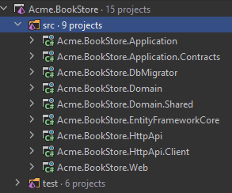
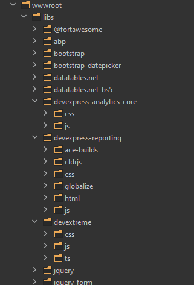
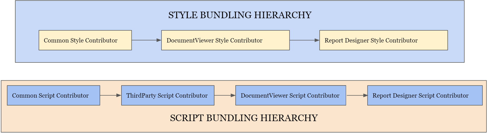
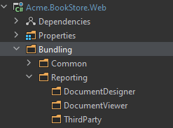
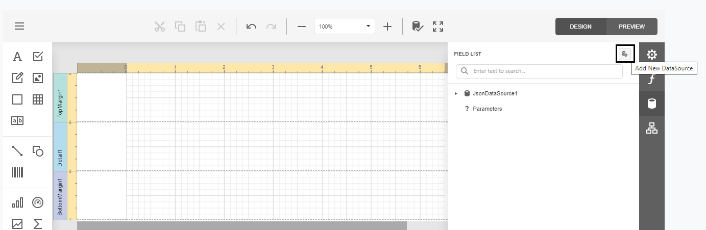
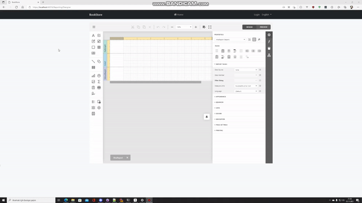

# Integrating DevExpress ASP.NET Core Reporting to ABP MVC Application

In this step by step article, I will demonstrate how to integrate DevExpress Reporting [DocumentViewer](https://docs.devexpress.com/XtraReports/400248/web-reporting/asp-net-core-reporting/document-viewer-in-asp-net-core-applications) and [End-User Report Designer](https://docs.devexpress.com/XtraReports/400249/web-reporting/asp-net-core-reporting/end-user-report-designer-in-asp-net-core-applications) components to an existing ABP application. We will also create core bundling packages for styling, DevExpress javascript components and also DocumentViewer specific bundling packages.

## Create the Project (Optional)

ABP Framework offers startup templates to get to business faster. We can download a new startup template using [ABP CLI](https://docs.abp.io/en/abp/latest/CLI):

````bash
abp new Acme.BookStore
````

After the download is finished, open the solution in Visual Studio (or your favorite IDE):



Run the `Acme.BookStore.DbMigrator` application to create the database and seed the initial data (which creates the admin user, admin role, related permissions, etc). Then we can run the `Acme.BookStore.Web` project to see our application working.

> _Default admin username is **admin** and password is **1q2w3E\***_

## Installing Packages

You can also follow [this documentation](https://js.devexpress.com/Documentation/17_1/Guide/ASP.NET_MVC_Controls/Prerequisites_and_Installation/) to install DevExpress packages into your computer. We will be installing both nuget references and npm references.

> Don't forget to add _"DevExpress NuGet Feed"_ to your **Nuget Package Sources**.

### Adding NuGet Packages

- Add the `<PackageReference Include="DevExtreme.AspNet.Core" Version="21.2.3" />` NuGet package reference to the **Acme.BookStore.Application.Contracts.csproj**. Or run 

  ```csharp
  Install-Package DevExtreme.AspNet.Core
  ```

  command under **Acme.BookStore.Application.Contracts** project.

- Add the `<PackageReference Include="DevExpress.AspNetCore.Reporting" Version="21.2.3" />` NuGet package reference to the **Acme.BookStore.Web.csproj**. Or run 

  ```csharp
  Install-Package DevExpress.AspNetCore.Reporting
  ```

  command under the **Acme.BookStore.Web** project. **Note:** You need a commercial license to use this package.

### Adding NPM Packages

Open your `Acme.BookStore.Web` project folder with a command line. Add **devextreme** and [other required third party NPM packages](https://docs.devexpress.com/XtraReports/401763/web-reporting/asp-net-core-reporting/end-user-report-designer-in-asp-net-applications/quick-start/add-an-end-user-report-designer-to-an-aspnet-core-application):

- `npm install devexpress-reporting @devexpress/analytics-core devextreme` 
- `npm install globalize jquery-ui-dist cldrjs`

At the end, your `package.json` should look as shown below:

```json
{
  "version": "1.0.0",
  "name": "my-app",
  "private": true,
  "dependencies": {
    "@abp/aspnetcore.mvc.ui.theme.basic": "^5.0.0-rc.1",
    "@devexpress/analytics-core": "^21.2.3",
    "cldrjs": "^0.5.5",
    "devexpress-reporting": "^21.2.3",
    "devextreme": "^21.2.3",
    "globalize": "^1.7.0",
    "jquery-ui-dist": "^1.12.1"
  }
}
```

### Adding Resource Mappings

The `devextreme` and third party NPM packages will be saved under the `node_modules` folder. We need to move the needed files in our `wwwroot/libs` folder to use them in the web project. We can do it using the ABP [client side resource mapping](https://docs.abp.io/en/abp/latest/UI/AspNetCore/Client-Side-Package-Management) system.

Open the `abp.resourcemapping.js` file in your `Acme.BookStore.Web` project and add definitions  inside the `mappings` object so the final `abp.resourcemapping.js` file can look as shown below:

```javascript
module.exports = {
    aliases: {
        
    },
    mappings: {
        "@node_modules/devextreme/dist/**/*": "@libs/devextreme/",
        "@node_modules/jquery-ui-dist/jquery-ui.min.js": "@libs/devextreme/js/",
        "@node_modules/@devexpress/analytics-core/dist/**/*": "@libs/devexpress-analytics-core/",
        "@node_modules/devexpress-reporting/dist/**/*": "@libs/devexpress-reporting/",
        "@node_modules/knockout/build/output/knockout-latest.js":"@libs/devexpress-reporting/js/",
        "@node_modules/cldrjs/dist/cldr.js":"@libs/devexpress-reporting/cldrjs/",
        "@node_modules/cldrjs/dist/cldr/event.js":"@libs/devexpress-reporting/cldrjs/",
        "@node_modules/cldrjs/dist/cldr/supplemental.js":"@libs/devexpress-reporting/cldrjs/",
        "@node_modules/cldrjs/dist/cldr/unresolved.js":"@libs/devexpress-reporting/cldrjs/",
        "@node_modules/globalize/dist/globalize.js":"@libs/devexpress-reporting/globalize/",
        "@node_modules/globalize/dist/globalize/message.js":"@libs/devexpress-reporting/globalize/",
        "@node_modules/globalize/dist/globalize/number.js":"@libs/devexpress-reporting/globalize/",
        "@node_modules/globalize/dist/globalize/currency.js":"@libs/devexpress-reporting/globalize/",
        "@node_modules/globalize/dist/globalize/date.js":"@libs/devexpress-reporting/globalize/",
        "@node_modules/ace-builds/src-min-noconflict/ace.js":"@libs/devexpress-reporting/ace-builds/",
        "@node_modules/ace-builds/src-min-noconflict/ext-language_tools.js":"@libs/devexpress-reporting/ace-builds/",
        "@node_modules/ace-builds/src-min-noconflict/theme-dreamweaver.js":"@libs/devexpress-reporting/ace-builds/",
        "@node_modules/ace-builds/src-min-noconflict/theme-ambiance.js":"@libs/devexpress-reporting/ace-builds/",
        "@node_modules/ace-builds/src-min-noconflict/snippets/text.js":"@libs/devexpress-reporting/ace-builds/"
    }
};
```

Open your `Acme.BookStore.Web` project folder with a command line and run the `abp install-libs` command. This command will copy the needed library files into the `/wwwroot/libs/devextreme/` folder.

````bash
abp install-libs
````

You can see `devextreme`, `devexpress-reporting` and `devexpress-analytics-core` folders inside the `wwwroot/libs`:




## Bundling

We will create [bundle contributors](https://docs.abp.io/en/abp/latest/UI/AspNetCore/Bundling-Minification) to add the devextreme css and javascript files for DevExpress [DocumentViewer](https://docs.devexpress.com/XtraReports/400248/web-reporting/asp-net-core-reporting/document-viewer-in-asp-net-core-applications) and [End-User Report Designer](https://docs.devexpress.com/XtraReports/400249/web-reporting/asp-net-core-reporting/end-user-report-designer-in-asp-net-core-applications) components.

To utilize bundling better, we will create  hierarchical contributors for both styles and scripts as seen below:



It is recommended to follow this hierarchy because some of the scripts and styles need to be added before one another. Once you grab the relations between the dependent scripts and styles, you are free to modify the `Bundling hierarchy` as you desire and re-use the contributors for other DevExpress components.

We'll start with creating folders in the `Acme.BookStore.Web` project starting with a folder named **Bundling**. Create the following folders for future usage:

- Create a `Common` folder under `Bundling` folder
- Create a `Reporting` folder under `Bundling` folder
- Create a `ThirdParty` folder under `Reporting ` folder
- Create a `DocumentViewer` folder under `Reporting ` folder
- Create a `DocumentDesigner` folder under `Reporting ` folder

At the end, you should have a folder structure as shown below:



With this structured foldering, you can easily add other devexpress components in an isolated and maintained way.

### Adding the Common Style Contributor

Create a `DevExtremeCommonStyleContributor.cs` file under the `Bundling/Common` folder with the following content:

```csharp
using System.Collections.Generic;
using Volo.Abp.AspNetCore.Mvc.UI.Bundling;

namespace Acme.BookStore.Web.Bundling.Common;

public class DevExtremeCommonStyleContributor : BundleContributor
{
    public override void ConfigureBundle(BundleConfigurationContext context)
    {
        context.Files.AddIfNotContains("/libs/devextreme/css/dx.common.css");
        context.Files.AddIfNotContains("/libs/devextreme/css/dx.light.css");
    }
}
```

> You can choose other themes than the light theme. Check the `/libs/devextreme/css/` folder and the DevExtreme documentation for other themes.

Now we will add the common bundle to the global style bundles. Open your `Acme.BookStoreWebModule.cs` file in your `Acme.BookStore.Web` project and add the following code into the `ConfigureServices` method:

```csharp
Configure<AbpBundlingOptions>(options =>
{
    options
        .StyleBundles
        .Get(StandardBundles.Styles.Global)
        .AddContributors(typeof(DevExtremeCommonStyleContributor));
});
```

### Adding the Document Viewer Style Contributor

Create a `DevExpressDocumentViewerStyleContributor.cs` file under the `Bundling/Reporting/DocumentViewer` folder with the following content:

```csharp
using System.Collections.Generic;
using Acme.BookStore.Web.Bundling.Common;
using Volo.Abp.AspNetCore.Mvc.UI.Bundling;
using Volo.Abp.Modularity;

namespace Acme.BookStore.Web.Bundling.Reporting.DocumentViewer;

[DependsOn(
    typeof(DevExtremeCommonStyleContributor)
)]
public class DevExpressDocumentViewerStyleContributor : BundleContributor
{
    public override void ConfigureBundle(BundleConfigurationContext context)
    {
        context.Files.AddIfNotContains("/libs/devexpress-reporting/css/dx-reporting-skeleton-screen.css");
        context.Files.AddIfNotContains("/libs/devexpress-analytics-core/css/dx-analytics.common.css");
        context.Files.AddIfNotContains("/libs/devexpress-analytics-core/css/dx-analytics.light.css");
        context.Files.AddIfNotContains("/libs/devexpress-reporting/css/dx-webdocumentviewer.css");
    }
}
```

### Adding the Document Designer Style Contributor

Create a `DevExtremeDocumentDesignerStyleContributor.cs` file under the `Bundling/Reporting/DocumentDesigner` folder with the following content:

```csharp
using System.Collections.Generic;
using Acme.BookStore.Web.Bundling.Reporting.DocumentViewer;
using Volo.Abp.AspNetCore.Mvc.UI.Bundling;
using Volo.Abp.Modularity;

namespace Acme.BookStore.Web.Bundling.Reporting.DocumentDesigner;

[DependsOn(
    typeof(DevExtremeDocumentViewerStyleContributor)
)]
public class DevExtremeDocumentDesignerStyleContributor : BundleContributor
{
    public override void ConfigureBundle(BundleConfigurationContext context)
    {
        context.Files.AddIfNotContains("/libs/devexpress-analytics-core/css/dx-querybuilder.css");
        context.Files.AddIfNotContains("/libs/devexpress-reporting/css/dx-reportdesigner.css");
    }
}
```

### Adding the Reporting Common Script Contributor

Create a `DevExtremeReportingCommonScriptContributor.cs` file under the `Bundling/Common` folder with the following content:

```csharp
using System.Collections.Generic;
using Volo.Abp.AspNetCore.Mvc.UI.Bundling;
using Volo.Abp.AspNetCore.Mvc.UI.Packages.JQuery;
using Volo.Abp.Modularity;

namespace Acme.BookStore.Web.Bundling.Common;

[DependsOn(
    typeof(JQueryScriptContributor)
)]
public class DevExtremeReportingCommonScriptContributor : BundleContributor
{
    public override void ConfigureBundle(BundleConfigurationContext context)
    {
        context.Files.AddIfNotContains("/libs/devextreme/js/jquery-ui.min.js");
        context.Files.AddIfNotContains("/libs/devexpress-reporting/js/knockout-latest.js");
        context.Files.AddIfNotContains("/libs/devextreme/js/dx.all.js"); // Has to be added after jquery and knockout
    }
}
```

The `DevExtremeReportingCommonScriptContributor` depends on the  `JQueryScriptContributor` which adds JQuery related files before the DevExpress packages (see the [bundling system](https://docs.abp.io/en/abp/latest/UI/AspNetCore/Bundling-Minification) for details).

> Since not all of the components of DevExtreme use scripts like `knockout.js` and `jquery-ui.js`, we used *ReportingCommon* naming. You can choose another name or a *Common* contributor by only adding `dx.all.js`.

### Adding the Third Party Script Contributor

Create a `DevExpressReportingThirdPartyScriptContributor.cs` file under the `Bundling/Reporting/ThirdParty` folder with the following content:

```csharp
using System.Collections.Generic;
using Acme.BookStore.Web.Bundling.Common;
using Volo.Abp.AspNetCore.Mvc.UI.Bundling;
using Volo.Abp.Modularity;

namespace Acme.BookStore.Web.Bundling.Reporting.ThirdParty;

[DependsOn(
    typeof(DevExtremeReportingCommonScriptContributor)
)]
public class DevExpressReportingThirdPartyScriptContributor : BundleContributor
{
    public override void ConfigureBundle(BundleConfigurationContext context)
    {
        // cldrj related scripts
        context.Files.AddIfNotContains("/libs/devexpress-reporting/cldrjs/cldr.js");
        context.Files.AddIfNotContains("/libs/devexpress-reporting/cldrjs/event.js");
        context.Files.AddIfNotContains("/libs/devexpress-reporting/cldrjs/supplemental.js");
        context.Files.AddIfNotContains("/libs/devexpress-reporting/cldrjs/unresolved.js");
        // globalize related scripts
        context.Files.AddIfNotContains("/libs/devexpress-reporting/globalize/globalize.js");
        context.Files.AddIfNotContains("/libs/devexpress-reporting/globalize/currency.js");
        context.Files.AddIfNotContains("/libs/devexpress-reporting/globalize/date.js");
        context.Files.AddIfNotContains("/libs/devexpress-reporting/globalize/message.js");
        context.Files.AddIfNotContains("/libs/devexpress-reporting/globalize/number.js");
        // ace-builds related scripts
        context.Files.AddIfNotContains("/libs/devexpress-reporting/ace-builds/ace.js");
        context.Files.AddIfNotContains("/libs/devexpress-reporting/ace-builds/ext-language_tools.js");
        context.Files.AddIfNotContains("/libs/devexpress-reporting/ace-builds/theme-ambiance.js");
        context.Files.AddIfNotContains("/libs/devexpress-reporting/ace-builds/theme-dreamweaver.js");
        context.Files.AddIfNotContains("/libs/devexpress-reporting/ace-builds/text.js");
    }
}
```

The `DevExpressReportingThirdPartyScriptContributor` depends on the newly created `DevExtremeReportingCommonScriptContributor` which adds the specified scripts before third party scripts.

### Adding the Document Viewer Script Contributor

Create a `DevExpressDocumentViewerScriptContributor.cs` file under the `Bundling/Reporting/DocumentViewer` folder with the following content:

```csharp
using System.Collections.Generic;
using Acme.BookStore.Web.Bundling.Reporting.ThirdParty;
using Volo.Abp.AspNetCore.Mvc.UI.Bundling;
using Volo.Abp.Modularity;

namespace Acme.BookStore.Web.Bundling.Reporting.DocumentViewer;

[DependsOn(typeof(DevExpressReportingThirdPartyScriptContributor))]
public class DevExpressDocumentViewerScriptContributor : BundleContributor
{
    public override void ConfigureBundle(BundleConfigurationContext context)
    {
        context.Files.AddIfNotContains("/libs/devexpress-analytics-core/js/dx-analytics-core.min.js");
        context.Files.AddIfNotContains("/libs/devexpress-reporting/js/dx-webdocumentviewer.min.js");
    }
}
```

Note that the `DevExpressDocumentViewerScriptContributor` depends on the newly created `DevExpressReportingThirdPartyScriptContributor`.

### Adding the Document Designer Script Contributor

```csharp
using System.Collections.Generic;
using Acme.BookStore.Web.Bundling.Reporting.DocumentViewer;
using Volo.Abp.AspNetCore.Mvc.UI.Bundling;
using Volo.Abp.Modularity;

namespace Acme.BookStore.Web.Bundling.Reporting.DocumentDesigner;

[DependsOn(
    typeof(DevExpressDocumentViewerScriptContributor)
)]
public class DevExpressDocumentDesignerScriptContributor : BundleContributor
{
    public override void ConfigureBundle(BundleConfigurationContext context)
    {
        context.Files.AddIfNotContains("/libs/devexpress-analytics-core/js/dx-querybuilder.min.js");
        context.Files.AddIfNotContains("/libs/devexpress-reporting/js/dx-reportdesigner.min.js");
    }
}
```

## End User Report Designer Integration

> You are free to create your desired pages and rooting. This sample will be creating a **Designer** page to demonstrate the layout for the DevExpress reporting components individually.

Create a `Reporting` folder under `Pages` in the `Acme.BookStore.Web` project .

### Adding a Document Designer Page

Create a `Designer.cshtml` Razor page under the `Pages/Reporting` folder and add the following:

```csharp
@page
@using Acme.BookStore.Web.Bundling.Reporting.DocumentDesigner
@using DevExpress.AspNetCore
@model Acme.BookStore.Web.Pages.Reporting.Designer

@{
    var designerRender = Html.DevExpress().ReportDesigner("reportDesigner")
        .Height("1000px");
    @designerRender.RenderHtml()
}

@section Scripts {
    <abp-style type="typeof(DevExpressDocumentDesignerStyleContributor)"/>

    <abp-script type="typeof(DevExpressDocumentDesignerScriptContributor)"/>
    @designerRender.RenderScripts()
}
```

### Adding Controllers

Create a `Controllers` folder and add a `ReportingController.cs` file to contain customized controllers for reporting endpoints:

```csharp
using DevExpress.AspNetCore.Reporting.QueryBuilder;
using DevExpress.AspNetCore.Reporting.QueryBuilder.Native.Services;
using DevExpress.AspNetCore.Reporting.ReportDesigner;
using DevExpress.AspNetCore.Reporting.ReportDesigner.Native.Services;
using DevExpress.AspNetCore.Reporting.WebDocumentViewer;
using DevExpress.AspNetCore.Reporting.WebDocumentViewer.Native.Services;

namespace Acme.BookStore.Web.Controllers;

public class CustomWebDocumentViewerController : WebDocumentViewerController
{
    public CustomWebDocumentViewerController(IWebDocumentViewerMvcControllerService controllerService)
        : base(controllerService)
    {
    }
}

public class CustomReportDesignerController : ReportDesignerController
{
    public CustomReportDesignerController(IReportDesignerMvcControllerService controllerService)
        : base(controllerService)
    {
    }
}

public class CustomQueryBuilderController : QueryBuilderController
{
    public CustomQueryBuilderController(IQueryBuilderMvcControllerService controllerService)
        : base(controllerService)
    {
    }
}
```

### Service Configuration and Midware Update

Update the `ConfigureServices` method of the `BookStoreWebModule.cs` file in **Acme.BookStore.Web** project with the following:

```csharp
context.Services.AddDevExpressControls();
context.Services.AddTransient<CustomReportDesignerController>();
context.Services.AddTransient<CustomQueryBuilderController>();
context.Services.AddTransient<CustomWebDocumentViewerController>();
// UnComment this line if you want to use report storage which is used for menus like "Save as" etc.
//context.Services.AddScoped<ReportStorageWebExtension, CustomReportStorageWebExtension>();
```

Add `UseDevExpressControls` before `UseConfiguredEndpoints` in `OnApplicationInitialization` as the following:

```csharp
...
app.UseDevExpressControls();

app.UseCorrelationId();
...
```

### Adding Custom Report Storage (Optional)

Create `CustomReportStorageWebExtension.cs` under the **Acme.BookStore.Web** project as below:

```csharp
using System;
using System.Collections.Generic;
using System.IO;
using System.Linq;
using DevExpress.XtraReports.UI;
using Microsoft.AspNetCore.Hosting;

namespace Acme.BookStore.Web;

public class CustomReportStorageWebExtension : DevExpress.XtraReports.Web.Extensions.ReportStorageWebExtension
{
    readonly string ReportDirectory;
    const string FileExtension = ".repx";

    public CustomReportStorageWebExtension(IWebHostEnvironment env)
    {
        ReportDirectory = Path.Combine(env.ContentRootPath, "Reports");
        if (!Directory.Exists(ReportDirectory))
        {
            Directory.CreateDirectory(ReportDirectory);
        }
    }

    public override bool CanSetData(string url)
    {
        return true;
    }

    public override bool IsValidUrl(string url)
    {
        return true;
    }

    public override byte[] GetData(string url)
    {
        try
        {
            if (Directory.EnumerateFiles(ReportDirectory).Select(Path.GetFileNameWithoutExtension).Contains(url))
            {
                return File.ReadAllBytes(Path.Combine(ReportDirectory, url + FileExtension));
            }

            if (ReportsFactory.Reports.ContainsKey(url))
            {
                using (MemoryStream ms = new MemoryStream())
                {
                    ReportsFactory.Reports[url]().SaveLayoutToXml(ms);
                    return ms.ToArray();
                }
            }

            throw new DevExpress.XtraReports.Web.ClientControls.FaultException(
                string.Format("Could not find report '{0}'.", url));
        }
        catch (Exception)
        {
            throw new DevExpress.XtraReports.Web.ClientControls.FaultException(
                string.Format("Could not find report '{0}'.", url));
        }
    }

    public override Dictionary<string, string> GetUrls()
    {
        return Directory.GetFiles(ReportDirectory, "*" + FileExtension)
            .Select(Path.GetFileNameWithoutExtension)
            .Concat(ReportsFactory.Reports.Select(x => x.Key))
            .ToDictionary<string, string>(x => x);
    }

    public override void SetData(XtraReport report, string url)
    {
        report.SaveLayoutToXml(Path.Combine(ReportDirectory, url + FileExtension));
    }

    public override string SetNewData(XtraReport report, string defaultUrl)
    {
        SetData(report, defaultUrl);
        return defaultUrl;
    }
}

public class ReportsFactory
{
    public static Dictionary<string, Func<XtraReport>> Reports { get; set; }
}
```

> You can check more about it at [DevExpress Report Storage documentation](https://docs.devexpress.com/XtraReports/400211/web-reporting/asp-net-core-reporting/end-user-report-designer-in-asp-net-applications/add-a-report-storage).

### Adding a DataSource To Designer

Update `Designer.cshtml.cs` under `Pages/Reporting` in the **Acme.BookStore.Web** project with the following:

```csharp
using System;
using System.Collections.Generic;
using DevExpress.DataAccess.ConnectionParameters;
using DevExpress.DataAccess.Json;
using DevExpress.DataAccess.Sql;
using DevExpress.XtraReports.UI;
using Microsoft.AspNetCore.Mvc.RazorPages;

namespace Acme.BookStore.Web.Pages.Reporting;

public class Designer : PageModel
{
    public ReportDesignerModel DesignerModel { get; set; }

    public void OnGet()
    {
        // Create a SQL data source.
        // MsSqlConnectionParameters parameters = new MsSqlConnectionParameters("localhost",
        //     "dbName", "userName", "password", MsSqlAuthorizationType.SqlServer);
        // SqlDataSource dataSource = new SqlDataSource(parameters);
        // SelectQuery query = SelectQueryFluentBuilder.AddTable("Products").SelectAllColumnsFromTable().Build("Products");
        // dataSource.Queries.Add(query);
        // dataSource.RebuildResultSchema();
        
        // Create a JSON data source.
        JsonDataSource jsonDataSource = new JsonDataSource();
        jsonDataSource.JsonSource = new UriJsonSource(new Uri("https://raw.githubusercontent.com/DevExpress-Examples/DataSources/master/JSON/customers.json"));
        jsonDataSource.Fill();


        DesignerModel = new ReportDesignerModel
        {
            Report = new XtraReport(),
            DataSources = new Dictionary<string, object>()
        };
        // DesignerModel.DataSources.Add("BookStoreDb", dataSource);
        DesignerModel.DataSources.Add("JsonDataSource", jsonDataSource);
    }

    public class ReportDesignerModel
    {
        public XtraReport Report { get; set; }
        public Dictionary<string, object> DataSources { get; set; }
    }
}
```

This will allow binding the `data-source` for your report designer. Also update `Designer.cshtml` to use these data sources:

```csharp
@{
    var designerRender = Html.DevExpress().ReportDesigner("reportDesigner")
        .Height("1000px")
        .Bind(Model.DesignerModel.Report)
        .DataSources(configureDS =>
        {
            foreach (var ds in Model.DesignerModel.DataSources)
            {
                configureDS.Add(ds.Key, ds.Value);
            }
        });
    @designerRender.RenderHtml()
}
```

You can now see the **Add New DataSource** icon in the Field List:


> You can check [DevExpress Reporting Use Data Sources and Connections documentation](https://docs.devexpress.com/XtraReports/401896/web-reporting/asp-net-core-reporting/end-user-report-designer-in-asp-net-applications/use-data-sources-and-connections) for more information.

## Document Viewer Integration

> You are free to create your desired pages and rooting. This sample will be creating a **Viewer** page to demonstrate the layout for the DevExpress reporting components individually.

Since End User Report Designer already implements the required controllers for features, you should only add a new page for document viewing.

### Adding a Document Viewer Page

Create a `Viewer.cshtml` Razor page under the `Pages/Reporting` folder and add the following:

```csharp
@page
@using Acme.BookStore.Web.Bundling.Reporting.DocumentViewer
@using DevExpress.AspNetCore
@model Acme.BookStore.Web.Pages.Reporting.Viewer

@{
    var viewerRender = Html.DevExpress().WebDocumentViewer("DocumentViewer")
        .Height("1000px")
        .Bind("TestReport");
    @viewerRender.RenderHtml()
}

@section Scripts {
    <abp-style type="typeof(DevExpressDocumentViewerStyleContributor)"/>

    <abp-script type="typeof(DevExpressDocumentViewerScriptContributor)"/>
    @viewerRender.RenderScripts()
}
```

> Note: `TestReport.repx` file must be found under `Reports` folder in **Acme.BookStore.Web** project.

### Adding the Antiforgery Token or Passing Bearer Token

While exporting data, you may come across **HTTP 400** error which logs as `[ERR] The required antiforgery request token was not provided in either form field "__RequestVerificationToken" or header value "RequestVerificationToken".` Or you may want to pass **Bearer Token**.

To add these functionalities, update the `Viewer.cshtml` file under the `Pages/Reporting` folder in the **Acme.BookStore.Web** project as shown below:

```csharp
@page
@using Acme.BookStore.Web.Bundling.Reporting.DocumentViewer
@using DevExpress.AspNetCore
@model Acme.BookStore.Web.Pages.Reporting.Viewer
@inject Microsoft.AspNetCore.Antiforgery.IAntiforgery Xsrf

@functions{
    public string GetAntiXsrfRequestToken()
    {
        return Xsrf.GetAndStoreTokens(HttpContext).RequestToken;
    }
}

<script type="text/javascript">
    function SetupJwt(bearerToken, xsrf) {
        DevExpress.Analytics.Utils.ajaxSetup.ajaxSettings = {
            headers: {
                //'Authorization': 'Bearer ' + bearerToken,
                'RequestVerificationToken': xsrf
            }
        }; 
    }
    
    function AttachXSRFToken_OnExport(args, xsrf) {
        args.FormData["__RequestVerificationToken"] = xsrf;
    }

    function WebDocumentViewer_BeforeRender(s, e) {
        SetupJwt('bearer token can be passed here', "@GetAntiXsrfRequestToken()");
        $(window).on('beforeunload', function(e) {
            s.Close();
        });
    }
    function OnViewerExport(_s, e) {
        AttachXSRFToken_OnExport(e, "@GetAntiXsrfRequestToken()");
    }
</script>

<input type="hidden" id="RequestVerificationToken" name="RequestVerificationToken" value="@GetAntiXsrfRequestToken()">

@{
    var viewerRender = Html.DevExpress().WebDocumentViewer("DocumentViewer")
        .ClientSideEvents(x =>
        {
            x.BeforeRender("WebDocumentViewer_BeforeRender");
            x.OnExport("OnViewerExport");
        })
        .Height("1000px")
        .Bind("CustomerReport");
    @viewerRender.RenderHtml()
}

@section Scripts {
    <abp-style type="typeof(DevExpressDocumentViewerStyleContributor)"/>

    <abp-script type="typeof(DevExpressDocumentViewerScriptContributor)"/>
    @viewerRender.RenderScripts()
}
```

> You can also add similar configuration to Report Designer for exporting in Preview Mode.

## Result



## Source Code

- You can download the source code from [here](https://github.com/abpframework/abp-samples/tree/master/DevExtreme-Reports-Mvc).
