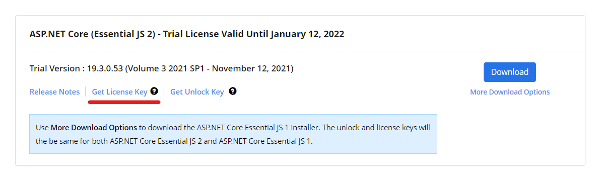
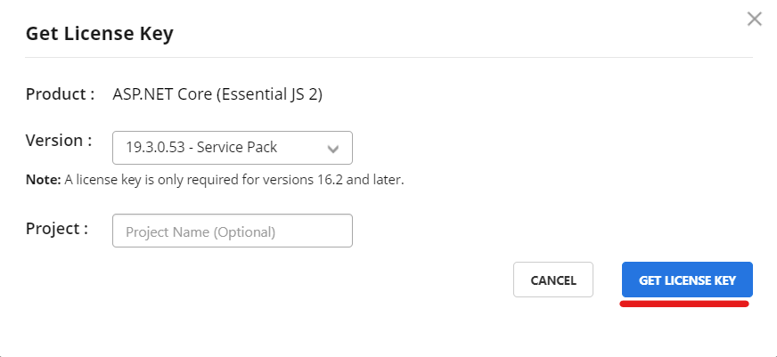
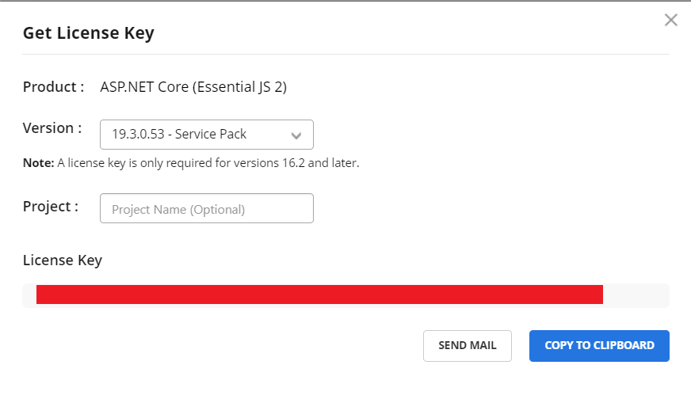
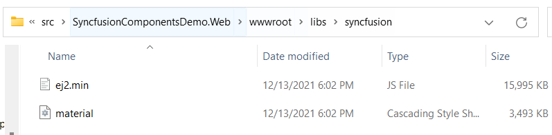
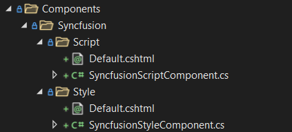
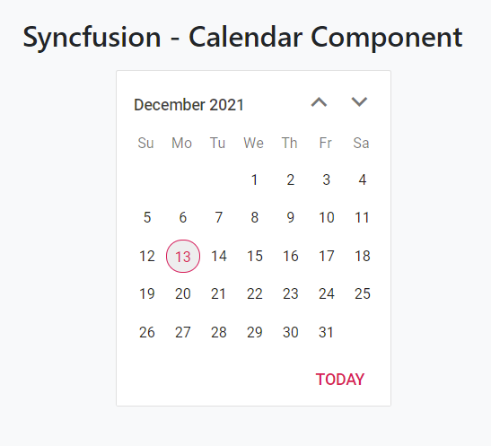

# Integrating the Syncfusion MVC Components to the ABP MVC UI

## Introduction

In this article we will see how we can integrate the Syncfusion MVC Components into our ABP application.

## Source Code

You can find the source code of the application at https://github.com/EngincanV/ABP-Syncfusion-Components-Demo.

## Prerequisites

* [.NET 6](https://dotnet.microsoft.com/en-us/download/dotnet/6.0)

    * In this article, we will create a new startup template in v5.0.0-rc.2 and if you follow this article from top to bottom and create a new startup template with me, you need to install the [.NET 6 SDK](https://dotnet.microsoft.com/en-us/download/dotnet/6.0) before starting.
   
**NOTE:** ABP v5.X stable version has been released. You can replace v5.0.0-rc.2 with the latest stable version in your steps.

Also, you need to update your ABP CLI to the v5.0.0-rc.2, you can use the command below to update your CLI version:

```bash
dotnet tool update Volo.Abp.Cli -g --version 5.0.0-rc.2
```

or install it if you haven't installed it before:

```bash
dotnet tool install Volo.Abp.Cli -g --version 5.0.0-rc.2
```

## Creating the Solution

In this article, we will create a new startup template with EF Core as a database provider and MVC for the UI framework. But if you already have a project with MVC UI, you don't need to create a new startup template, you can directly implement the following steps to your existing project.

> If you already have a project with MVC/Razor Pages UI, you can skip this section.

We can create a new startup template by using the [ABP CLI](https://docs.abp.io/en/abp/latest/CLI):

```bash
abp new SyncfusionComponentsDemo -t app --preview
```

Our project boilerplate will be ready after the download is finished. Then, we can open the solution and start developing.

## Starting the Development

### Pre-requisite

> If you've already had a license from Syncfusion, you can skip this section.

* The first thing we need to do is create an account to be able to get a license from Syncfusion. 

* So, let's navigate to https://www.syncfusion.com/aspnet-core-ui-controls and click the "Download Free Trial" button. 

* Then fill the form and start your 30-day free trial.

* After that, navigate to https://www.syncfusion.com/account/manage-trials/downloads to get our license key that will be used in our application. 



Click the "Get License Key" link for "ASP.NET Core (Essential JS 2)".



Then a modal will be opened like in the above image, select a version and click the "Get License Key" button.



Lastly, copy the generated license key value. 

In order to use the relevant components, Syncfusion needs to check this license key to know that our license is valid. 

### Configurations

After providing a license key from Syncfusion, we can start with the configuration that needs to be done in our application.

#### 1-) Install the Syncfusion.EJ2.AspNet.Core package

We need to install the `Syncfusion.EJ2.AspNet.Core` Nuget package to our Web project (*.Web). 

We can install it via **Visual Studio's Nuget Package Manager**:


or via dotnet cli: 

```bash
dotnet add package Syncfusion.EJ2.AspNet.Core --version 19.3.0.57
```

> In this article, I've used the package in version 19.3.0.57.

#### 2-) Register the License Key

* After installing the package, we need to register our license key to be able to use the Syncfusion Components. 

* To register the license key, open your web module class and update the `ConfigureServices` method as follows:

```csharp
public override void ConfigureServices(ServiceConfigurationContext context)
{
    var hostingEnvironment = context.Services.GetHostingEnvironment();
    var configuration = context.Services.GetConfiguration();

    //Register Syncfusion license
    Syncfusion.Licensing.SyncfusionLicenseProvider.RegisterLicense(licenseKey: configuration["Syncfusion:LicenseKey"].ToString());

    ConfigureUrls(configuration);
    ConfigureBundles();
    ConfigureAuthentication(context, configuration);
    ConfigureAutoMapper();
    ConfigureVirtualFileSystem(hostingEnvironment);
    ConfigureLocalizationServices();
    ConfigureNavigationServices();
    ConfigureAutoApiControllers();
    ConfigureSwaggerServices(context.Services);
}
```

Instead of writing the license key directly in here we can define it in the **appsettings.json** file and use it here by using the Configuration system of .NET.


* Open your **appsettings.json** file and add a new section named "Syncfusion" as below:

```json
{  
  //...
  
  "Syncfusion": {
    "LicenseKey": "<your-license-key>"
  }
}
```

> Replace the `<your-license-key> part with your license key that we've obtained in the previous section.`

* To be able to use the Syncfusion Components we need to define them in our **_ViewImports.cshtml** file. By doing that we can use the Syncfusion components everywhere in our application.

* Open your **/Pages/_ViewImports.cshtml** file and add a new tag helper:

```cshtml
@addTagHelper *, Microsoft.AspNetCore.Mvc.TagHelpers
@addTagHelper *, Volo.Abp.AspNetCore.Mvc.UI
@addTagHelper *, Volo.Abp.AspNetCore.Mvc.UI.Bootstrap
@addTagHelper *, Volo.Abp.AspNetCore.Mvc.UI.Bundling
@addTagHelper *, Syncfusion.EJ2 //use Syncfusion components
```

#### 3-) Adding Syncfusion styles and scripts to our application

Firstly, let's install the `@syncfusion/ej2` package from **npm**. 

* Open your **package.json** file and add the `@syncfusion/ej2` package with version **19.3.57**:

```json
{
  "version": "1.0.0",
  "name": "my-app",
  "private": true,
  "dependencies": {
    "@abp/aspnetcore.mvc.ui.theme.basic": "^5.0.0-rc.2",
    "@syncfusion/ej2": "^19.3.57"
  }
}
```

* Then, open the **abp.resourcemapping.js** file and update the **mappings** section:

```js
module.exports = {
    aliases: {
        
    },
    mappings: {
        "@node_modules/@syncfusion/ej2/dist/ej2.min.js": "@libs/syncfusion/",
        "@node_modules/@syncfusion/ej2/material.css": "@libs/syncfusion/"
    }
};
```

> ABP copies related packages from **node_modules** folder to the **libs** folder by examining this file. You can read this [document](https://docs.abp.io/en/abp/latest/UI/AspNetCore/Client-Side-Package-Management#mapping-the-library-resources) for more info.

* Then run the `abp install-libs` to install the dependencies and copy them into the libs folder by your mappings configuration. After running this command, in your **libs** folder it should be a folder named **syncfusion** folder.



The last thing we need to do is, add some style and script files provided by Syncfusion, between our head-body tags. 

* We can do this by creating two view components (one for Styles and the other for Scripts). Let's do that.

First, create a folder structure as shown below under the **Components** folder.



Then open the related files and add the following codes to each of these files.

* **Default.cshtml** (/Components/Syncfusion/Script/Default.cshtml)

```cshtml
@addTagHelper *, Syncfusion.EJ2 //add this line

<!-- Syncfusion Essential JS 2 Scripts -->
<script src="/libs/syncfusion/ej2.min.js"></script>

<!-- Syncfusion Essential JS 2 ScriptManager -->
<ejs-scripts></ejs-scripts>
```

* **SyncfusionScriptComponent.cs**

```csharp
using Microsoft.AspNetCore.Mvc;
using Volo.Abp.AspNetCore.Mvc;

namespace SyncfusionComponentsDemo.Web.Components.Syncfusion.Script
{
    public class SyncfusionScriptComponent : AbpViewComponent
    {
        public IViewComponentResult Invoke()
        {
            return View("~/Components/Syncfusion/Script/Default.cshtml");
        }
    }
}
```

* **Default.cshtml** (/Components/Syncfusion/Style/Default.cshtml)

```cshtml
<!-- Syncfusion Essential JS 2 Styles -->
<link rel="stylesheet" href="/libs/syncfusion/material.css">
```

* SyncfusionStyleComponent.cs

```csharp
using Microsoft.AspNetCore.Mvc;
using Volo.Abp.AspNetCore.Mvc;

namespace SyncfusionComponentsDemo.Web.Components.Syncfusion.Style
{
    public class SyncfusionStyleComponent : AbpViewComponent
    {
        public IViewComponentResult Invoke()
        {
            return View("~/Components/Syncfusion/Style/Default.cshtml");
        }
    }
}
```

After creating these two components, we can use the [**Layout Hooks**](https://docs.abp.io/en/abp/latest/UI/AspNetCore/Layout-Hooks) system of ABP to inject these two components between head and script tags.

To do this, open your web module class and update the `ConfigureServices` method as below:


```csharp
public override void ConfigureServices(ServiceConfigurationContext context)
{
    var hostingEnvironment = context.Services.GetHostingEnvironment();
    var configuration = context.Services.GetConfiguration();

    //Register Syncfusion license
    var licenseKey = configuration["Syncfusion:LicenseKey"].ToString();
    Syncfusion.Licensing.SyncfusionLicenseProvider.RegisterLicense(licenseKey: licenseKey);

    Configure<AbpLayoutHookOptions>(options =>
    {
        //Now, the SyncfusionStyleComponent code will be inserted in the head of the page as the last item.
        options.Add(LayoutHooks.Head.Last, typeof(SyncfusionStyleComponent));
        
        //the SyncfusionScriptComponent will be inserted in the body of the page as the last item.
        options.Add(LayoutHooks.Body.Last, typeof(SyncfusionScriptComponent));
    });

    ConfigureUrls(configuration);
    ConfigureBundles();
    ConfigureAuthentication(context, configuration);
    ConfigureAutoMapper();
    ConfigureVirtualFileSystem(hostingEnvironment);
    ConfigureLocalizationServices();
    ConfigureNavigationServices();
    ConfigureAutoApiControllers();
    ConfigureSwaggerServices(context.Services);
}
```

After injecting the Syncfusion style and script into our application, our configurations have been completed. We can try with a simple component to see if it works as we expected.

* Let's try with the [Calendar](https://www.syncfusion.com/aspnet-core-ui-controls/calendar) component. Open your **Index.cshtml** file and update with the below content:

```cshtml
@page
@using Microsoft.AspNetCore.Mvc.Localization
@using SyncfusionComponentsDemo.Localization
@using Volo.Abp.Users
@model SyncfusionComponentsDemo.Web.Pages.IndexModel

@section styles {
	<abp-style src="/Pages/Index.css" />
}

@section scripts {
	<abp-script src="/Pages/Index.js" />
}

<div class="container">
	<h2>Syncfusion - Calendar Component</h2>
	<ejs-calendar id="calendar"></ejs-calendar>
</div>
```

* Then when we run the application, we need to see the relevant calendar component as below.



### Conclusion

In this article, we've explained how to integrate the **Syncfusion Components** into our applications. After following this article, you can use the Syncfusion components in your application.

Thanks for reading the article, I hope you've found it useful :)
