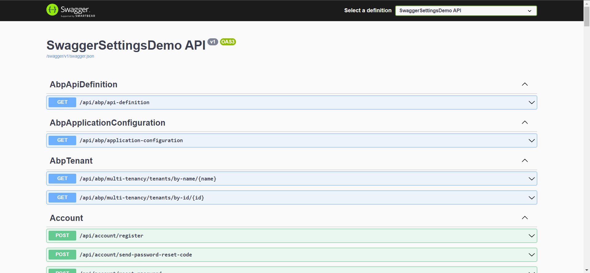
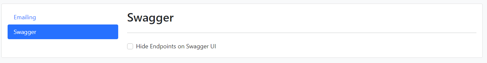
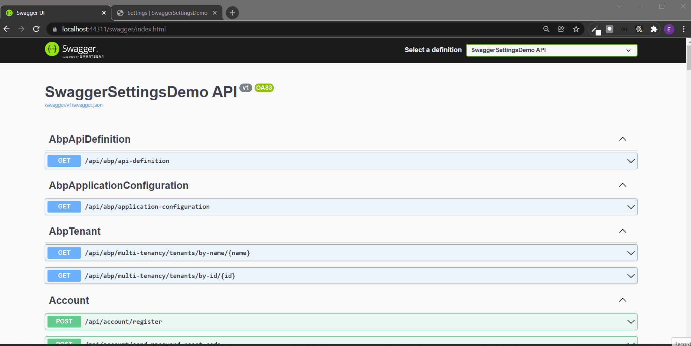

# How to Hide ABP Related Endpoints on Swagger UI

In this article, we will show how to show/hide ABP related endpoints on Swagger UI by enabling/disabling them on the Setting Management page. 

I wanted to write an article about this topic because there was a Github issue and when I saw it, it seemed that so many people needed to hide the ABP related endpoints since they didn't need to see them as they were developing an application, they only need to see their own endpoints most of the time.

In the issue, there are helpful comments about hiding the ABP related endpoints such as creating a **Document Filter** or removing **Application Parts** from the application etc.

I thought it would be be better to enable/disable showing endpoints on runtime by simply selecting a checkbox on the Setting Management page and in this article I wanted to show you how, so let's dive in.

## Source Code

You can find the source code of the application at https://github.com/EngincanV/ABP-Hide-Swagger-Endpoint-Demo.

## Creating the Solution

In this article, we will create a new startup template with EF Core as a database provider and MVC for the UI framework.

> But if you already have a project with MVC UI, you don't need to create a new startup template, you can directly implement the following steps to your existing project.

We can create a new startup template by using the [ABP CLI](https://docs.abp.io/en/abp/latest/CLI):

```bash
abp new <your-project-name> -t app -csf
```

Our project boilerplate will be ready after the download is finished. Open the solution and run the `*.DbMigrator` project to seed the initial data. Then, we can run the `*.Web` project to see our application working.

> Default credentials -> Username: admin and Password: 1q2w3E*

## Starting the Development

After we've run the application and signed in, we can navigate to **/swagger** to see our application's endpoints.



In our scenario, we will hide endpoints that start with "/api/abp". So let's start to do this.

> In this sample project, we only hide our endpoints that start with the "/api/abp" prefix by definining it in our [CustomSwaggerFilter](https://github.com/EngincanV/ABP-Hide-Swagger-Endpoint-Demo/blob/main/src/SwaggerSettingsDemo.Web/Filters/CustomSwaggerFilter.cs#L29). If you want to hide some other endpoints, you can update the class.

* Firstly, create a class named `SwaggerSettingConsts` (under `*.Domain.Shared` project):

```csharp
namespace SwaggerSettingsDemo;

public class SwaggerSettingConsts
{
    public const string HideEndpoint = "SwaggerHideEndpoint";
}
```

We've created a class with a constant variable to avoid using the magic strings. This variable will be our setting name.

ABP provides us a [Settings System](https://docs.abp.io/en/abp/latest/Setting) to easily define settings for our applications. We only need to create a class that derives from the `SettingDefinitionProvider` class, but we don't even need to do this because the ABP startup templates come with a pre-defined setting provider class.

* So open the setting definition provider class (`SwaggerSettingsDemoSettingDefinitionProvider` in our case, it's under the /Settings folder of your domain layer) and update the class:

```csharp
using SwaggerSettingsDemo.Localization;
using Volo.Abp.Localization;
using Volo.Abp.Settings;

namespace SwaggerSettingsDemo.Settings;

public class SwaggerSettingsDemoSettingDefinitionProvider : SettingDefinitionProvider
{
    public override void Define(ISettingDefinitionContext context)
    {
        context.Add(new SettingDefinition(
                name: SwaggerSettingConsts.HideEndpoint,
                defaultValue: "false",
                displayName: L("SwaggerHideEndpoints"),
                description: L("SwaggerHideEndpointsDescription"),
                isVisibleToClients: true
            )
        );
    }
    
    private static LocalizableString L(string name)
    {
        return LocalizableString.Create<SwaggerSettingsDemoResource>(name);
    }
}
```

Here we've defined a setting to use in our application.

> ABP automatically discovers this class and registers the setting definitions.

After defining a setting, now we can create an application service interface and add two methods to simply get or update the value of our setting.

* Create an application service interface named `ISwaggerSettingAppService` (or any name you want):

```csharp
using System.Threading.Tasks;
using Volo.Abp.Application.Services;

namespace SwaggerSettingsDemo;

public interface ISwaggerSettingAppService : IApplicationService
{
    Task<string> GetSettingByNameAsync(string name);

    Task UpdateSettingAsync(string name, string value);
}
```

* Implement the application service interface:

```csharp
using System.Threading.Tasks;
using Volo.Abp.SettingManagement;
using Volo.Abp.Settings;

namespace SwaggerSettingsDemo;

public class SwaggerSettingAppService : SwaggerSettingsDemoAppService, ISwaggerSettingAppService
{
    private readonly ISettingProvider _settingProvider;
    private readonly ISettingManager _settingManager;

    public SwaggerSettingAppService(ISettingProvider settingProvider, ISettingManager settingManager)
    {
        _settingProvider = settingProvider;
        _settingManager = settingManager;
    }
    
    public async Task<string> GetSettingByNameAsync(string name)
    {
        return await _settingProvider.GetOrNullAsync(name);
    }

    public async Task UpdateSettingAsync(string name, string value)
    {
        await _settingManager.SetGlobalAsync(name, value);
    }
}
```

We've injected two interfaces for the application service implementation: `ISettingProvider` and `ISettingManager`

> **ISettingProvider**: Used for getting the value of a setting or getting the values of all settings. It's recommended to use it to read the setting values because it implements caching.

> **ISettingManager**: Used for getting and setting the values of the settings.

After implementing our application service, now we can add a new group to our "Setting Management UI".

* Open the `*.Web` project and create a file named `SwaggerHideEndpointsViewComponent`(/Components/SwaggerHideEndpoints/SwaggerHideEndpointsViewComponent.cs):

```csharp
using System.Threading.Tasks;
using Microsoft.AspNetCore.Mvc;
using SwaggerSettingsDemo.Web.Models;
using Volo.Abp.AspNetCore.Mvc;
using Volo.Abp.AspNetCore.Mvc.UI.Widgets;

namespace SwaggerSettingsDemo.Web.Components.SwaggerHideEndpoints;

[Widget(ScriptFiles = new []{ "/Components/SwaggerHideEndpoints/Default.js" })]
public class SwaggerHideEndpointsViewComponent : AbpViewComponent
{
    private readonly ISwaggerSettingAppService _swaggerSettingAppService;

    public SwaggerHideEndpointsViewComponent(ISwaggerSettingAppService swaggerSettingAppService)
    {
        _swaggerSettingAppService = swaggerSettingAppService;
    }


    public virtual async Task<IViewComponentResult> InvokeAsync()
    {
        var swaggerHideEndpointSetting = await _swaggerSettingAppService.GetSettingByNameAsync(SwaggerSettingConsts.HideEndpoint);

        return View("~/Components/SwaggerHideEndpoints/Default.cshtml", new SwaggerHideEndpointViewModel
        {
            HideEndpoints = !string.IsNullOrEmpty(swaggerHideEndpointSetting) && 
                            bool.TryParse(swaggerHideEndpointSetting, out var hideEndpoints) && hideEndpoints
        });
    }
}
```

Here we've created a simple view component that gets the current value of our setting by using the `ISwaggerSettingAppService.GetSettingByNameAsync` method and passing it to our page model.

As you can see we've passed a modal to our page named `SwaggerHideEndpointViewModel`, but we haven't created it yet, so let's create it.

* Create a model named `SwaggerHideEndpointViewModel`(/Models/SwaggerHideEndpointViewModel.cs) :

```csharp
public class SwaggerHideEndpointViewModel
{
    public bool HideEndpoints { get; set; }
}
```

* After creating the model, now we can create the **Default.cshtml** (/Components/SwaggerHideEndpoints/Default.cshtml) file (which will render in our Setting Management page as a new group):

```cshtml
@model SwaggerSettingsDemo.Web.Models.SwaggerHideEndpointViewModel

<form id="SwaggerHideEndpointsForm">
    <div class="form-check">
        <input class="form-check-input" type="checkbox" asp-for="HideEndpoints">
        <label class="form-check-label" for="SwaggerHideEndpoints">
            Hide Endpoints on Swagger UI
        </label>
    </div>
</form>

```

* Create the `Default.js` file (/Components/SwaggerHideEndpoints/Default.js):

```js
(function ($) {

    $(function () {

        $("input[name='HideEndpoints']").change(function() {
            $("#SwaggerHideEndpointsForm").submit();
        });
        
        $("#SwaggerHideEndpointsForm").submit(function(e) {
            e.preventDefault();
            
            var form = $(this).serializeFormToObject();
            var value = form.hideEndpoints;

            swaggerSettingsDemo.swaggerSetting.updateSetting("SwaggerHideEndpoint", value)
                .then(function() {
                    $(document).trigger("AbpSettingSaved");
                });
        });
    });

})(jQuery);

```

After we've selected the select box which enables/disables to showing endpoints on Swagger UI, it should update the setting value by our choice (enable or disable).

Here, when the user selects the checkbox, it will submit the form and update the setting value by our choice.

Until now, we've defined a view component that we want to render on the Setting Management page, but we didn't add it to the UI yet. To do that, we need to add a settings group to the UI, so we need to create a class and that class should be inherited from the `ISettingPageContributor` interface and implement its' `ConfigureAsync` method.

* Create a class named `SwaggerSettingPageContributor` (/Settings/SwaggerSettingPageContributor.cs) in the `*.Web` layer:

```csharp
using System.Threading.Tasks;
using SwaggerSettingsDemo.Web.Components.SwaggerHideEndpoints;
using Volo.Abp.SettingManagement.Web.Pages.SettingManagement;

namespace SwaggerSettingsDemo.Web.Settings;

public class SwaggerSettingPageContributor : ISettingPageContributor
{
    public Task ConfigureAsync(SettingPageCreationContext context)
    {
        context.Groups.Add(
            new SettingPageGroup(
                "MySwaggerSettingWrapper",
                "Swagger",
                typeof(SwaggerHideEndpointsViewComponent)
            )
        );

        return Task.CompletedTask;
    }

    public Task<bool> CheckPermissionsAsync(SettingPageCreationContext context)
    {
        //we can check a permission in here, but for now just assume the permission is granted.
        return Task.FromResult(true);
    }
}
```

To see our new setting group on the Setting Management page, we need to do one more thing.

* So, open the `*WebModule.cs` class and configure the `SettingManagementPageOptions`:

```csharp
public override void ConfigureServices(ServiceConfigurationContext context)
{
    var hostingEnvironment = context.Services.GetHostingEnvironment();
    var configuration = context.Services.GetConfiguration();

    ConfigureUrls(configuration);
    ConfigureBundles();
    ConfigureAuthentication(context, configuration);
    ConfigureAutoMapper();
    ConfigureVirtualFileSystem(hostingEnvironment);
    ConfigureLocalizationServices();
    ConfigureNavigationServices();
    ConfigureAutoApiControllers();
    ConfigureSwaggerServices(context.Services);
        
    //add the setting page contributor   
    Configure<SettingManagementPageOptions>(options =>
    {
        options.Contributors.Add(new SwaggerSettingPageContributor());
    });
}
```

After all these steps, if we run our application and navigate to **/SettingManagement** page we need to see our setting group on this page.



To hide/show ABP related endpoints on Swagger UI, we can create a [`DocumentFilter`](https://github.com/domaindrivendev/Swashbuckle.AspNetCore#document-filters). By creating a document filter, we can have full control over the endpoints that need to be shown.

* Create a document filter class named `CustomSwaggerFilter`(/Filters/CustomSwaggerFilter.cs) in the `.Web` layer:

```csharp
using System.Linq;
using Microsoft.OpenApi.Models;
using Swashbuckle.AspNetCore.SwaggerGen;
using Volo.Abp.Threading;

namespace SwaggerSettingsDemo.Web.Filters;

public class CustomSwaggerFilter : IDocumentFilter
{
    private readonly ISwaggerSettingAppService _swaggerSettingAppService;

    public CustomSwaggerFilter(ISwaggerSettingAppService swaggerSettingAppService)
    {
        _swaggerSettingAppService = swaggerSettingAppService;
    }

    public void Apply(OpenApiDocument swaggerDoc, DocumentFilterContext context)
    {
        //AsyncHelper.RunSync => runs async method as sync
        var swaggerHideEndpointSetting = AsyncHelper.RunSync(() => _swaggerSettingAppService.GetSettingByNameAsync(SwaggerSettingConsts.HideEndpoint));

        if (string.IsNullOrEmpty(swaggerHideEndpointSetting) || !bool.TryParse(swaggerHideEndpointSetting, out var hideEndpoints) || !hideEndpoints)
        {
            return;
        }
        
        swaggerDoc.Paths
            .Where(x => x.Key.ToLowerInvariant().StartsWith("/api/abp"))
            .ToList()
            .ForEach(x => swaggerDoc.Paths.Remove(x.Key));
    }
}
```

We've created a simple class that implements `IDocumentFilter.Apply` method. And in that method, we simply need to get our setting value to see whether should we enable hiding ABP related endpoints or not. To do this, we've used the `ISwaggerSettingAppService.GetSettingByNameAsync` method to get the setting value, but as you can see we've wrapped it with the `AsyncHelper.RunSync` method because `IDocumentFilter.Apply` is not an async method so we need to run this method synchronously.

After getting the setting value, we need to ensure that it's both a valid and true setting value, otherwise we don't need to filter the endpoints and show all of them.

If the setting value is true, we can simply remove the paths that start with "/api/abp" prefix.

> ABP provides us a class named AsyncHelper and this class provides some helper methods to work with async methods. E.g. RunSync method in here runs the async method synchronously.


* Finally, we can add this document filter as a swagger document filter. To do this we need to open the `ConfigureSwaggerServices` method in the `*WebModule.cs` class and update the content as below:

```csharp
private void ConfigureSwaggerServices(IServiceCollection services)
    {
        services.AddAbpSwaggerGen(
            options =>
            {
                //...

                options.DocumentFilter<CustomSwaggerFilter>(); //add a new document filter
            }
        );
    }
```

That's it. Now we can open the Setting Management page and enable/disable the swagger option and see its effect.



Thanks for reading.