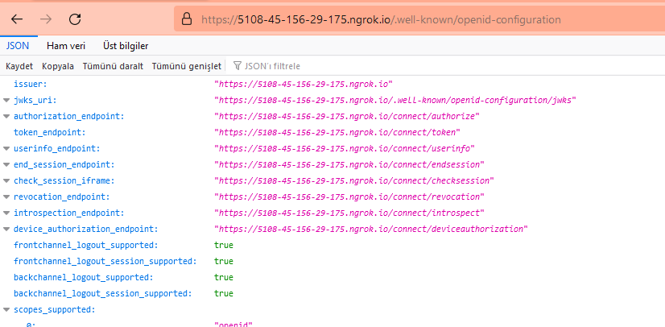
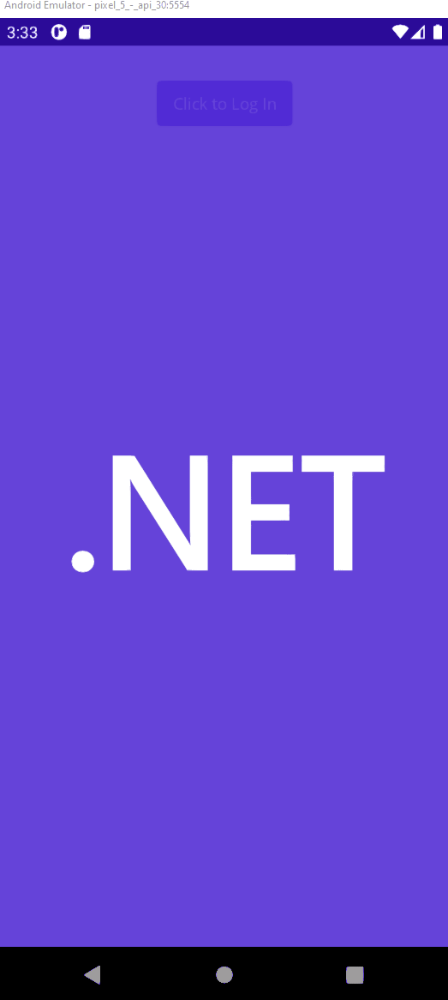
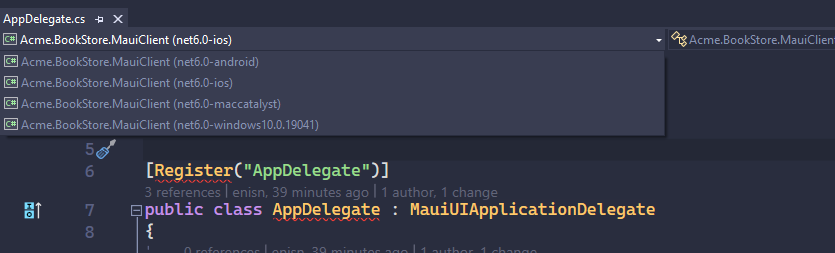
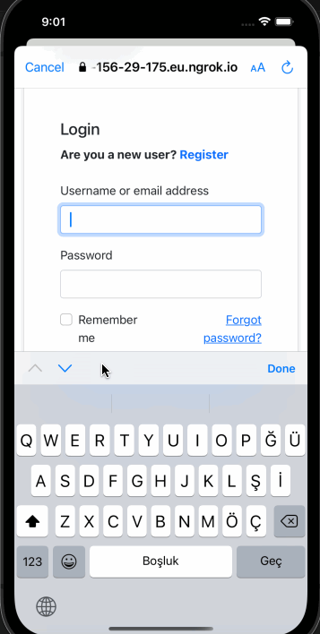
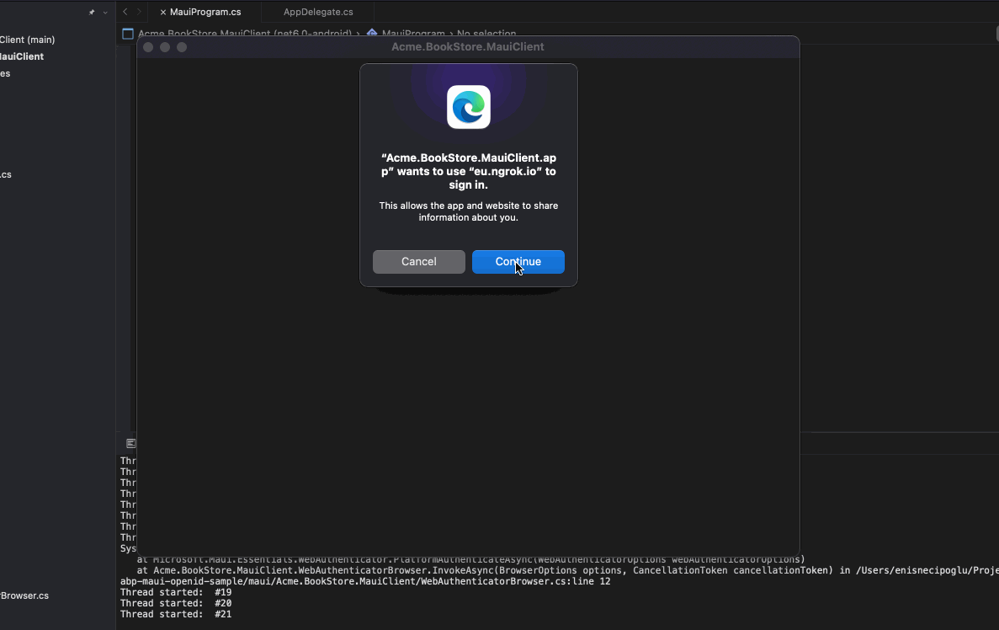
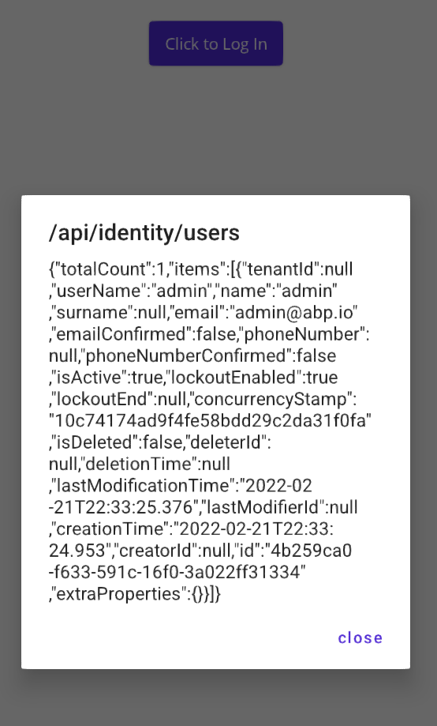

# Integrating MAUI Client via using OpenID Connect
 This is a demonstration for connecting ABP backend from MAUI app via using openid connect.

 In this flow, a web browser will be opened when user tries to log in and user will perform login operation in the browser. Then IdentityServer will redirect user to application with login credentials (state, token etc.) will be handled by application.

> This is by intent. The code flow does not allow the user to log in using a native view in the app. The reason being that this flow ensures that the username and password are never seen by the client (except the browser, which is part of the OS system - aka we trust it). You could enable using a native login view with the Resource Owner Password Credentials (ROPC) flow. But this is also an attack vector. Suppose someone makes a fraud duplicate of your application and tricking users into entering their credentials. The fraudulent app could store those credentials in-between. You just got to enjoy those tin-foil-hat moments when doing security. In other words, using the code flow does not give an attacker that opportunity and therefore is the recommended option for mobile clients.
>
> - [@Mark Allibone](https://mallibone.com/post/xamarin-oidc)

By the way, my motivation for building this sample is presenting just another way for authentication. **Resource Owner Password Credentials** authentication is already provided and it's more common way to do. This is yet another way to authenticate users.

## Source Code
You can also find source code on GitHub in ABP-Samples.
- [abpframework/abp-samples/MAUI-OpenId](https://github.com/abpframework/abp-samples/tree/master/MAUI-OpenId)

## Creating projects
- Create an ABP project without UI

```bash
abp new Acme.BookStore -t app --no-ui -d mongodb --no-random-ports
```

- Create a maui application

```bash
mkdir maui
cd maui
dotnet new maui -n Acme.BookStore.MauiClient
```

There is a long way for configuring scopes and callback urls for both server and clients. We'll use [WebAuthenticator](https://docs.microsoft.com/en-us/xamarin/essentials/web-authenticator?tabs=android) to perform this operation.

## Configuring IdentityServer

- Go to DbMigrator folder and MAUI client in **appsettings.json**. Add following client code in **IdentityServer:Clients** path:

```json
    "BookStore_Maui": {
        "ClientId": "BookStore_Maui",
        "ClientSecret": "1q2w3e*",
        "RootUrl": "bookstore://"
    }
```

- Go to **IdentityServerDataSeedContributor** in Domain project under IdentityServer folder. Append following code section into **CreateClientsAsync()** method.

```csharp
// Maui Client
var mauiClientId = configurationSection["BookStore_Maui:ClientId"];
if (!mauiClientId.IsNullOrWhiteSpace())
{
    var mauiRootUrl = configurationSection["BookStore_Maui:RootUrl"];

    await CreateClientAsync(
        name: mauiClientId,
        scopes: commonScopes,
        grantTypes: new[] { "authorization_code" },
        secret: configurationSection["BookStore_Maui:ClientSecret"]?.Sha256(),
        requireClientSecret: false,
        redirectUri: $"{mauiRootUrl}"
    );
}
```

- Run DbMigrator

- Then run HttpApi.Host

### Configuring NGROK
Client will check configuration from `/.well-known/openid-configuration` path and it must be a secured connection between client & server. I prefer to use ngrok to open my backend app to entire web. 

- Go to [getting started](https://dashboard.ngrok.com/get-started/setup) page of ngrok _(login or register first)_ and download the ngrok tool.

- Don't forget to login from tool:

    ```bash
    ngrok authtoken XXX
    ```

    _A sample command is being displayed at dashboard where you download ngrok from_

- Open your HttpApi.Host with ngrok

    ```bash
    .\ngrok.exe http https://localhost:44350
    ```

- You'll see a generated xxx.ngrok.io url. Navigate to `/.well-known/openid-configuration` to check if it's working right.

    You should see something like that:
    
    Issuer must be your URL, not localhost! If you see still localhost, try to disable host header rewrite.


- Also, ValidIssuers must be defined to validate tokens.

    - Add **ValidIssuers** section to your `appsettings.json` of HttpApi.Host

        ```js
        "AuthServer": {
            "Authority": "https://localhost:44350",
            "RequireHttpsMetadata": "false",
            "SwaggerClientId": "BookStore_Swagger",
            "SwaggerClientSecret": "1q2w3e*",
            "ValidIssuers": [
                "https://46fd-45-156-29-175.ngrok.io"
            ]
        },
        ```

    - Then define it in **ConfigureAuthentication** method in Module class

        ```csharp
        private void ConfigureAuthentication(ServiceConfigurationContext context, IConfiguration configuration)
        {
            context.Services.AddAuthentication()
                .AddJwtBearer(options =>
                {
                    // ...
                    options.TokenValidationParameters.ValidIssuers = configuration.GetSection("AuthServer:ValidIssuers").Get<string[]>();
                });
        }
        ```

We're done with backend. Let's continue with MAUI app.


## Developing MAUI App

Before we go, there is something to do like configuring dependency injection to get rid of unnecessary huge class coupling.

### Configuring Dependency Injection

- Go to **MauiApplication** class and add `MainPage` in services.

    ```csharp
    public static MauiApp CreateMauiApp()
    {
        var builder = MauiApp.CreateBuilder();
        builder
            .UseMauiApp<App>()
            .ConfigureFonts(fonts =>
            {
                fonts.AddFont("OpenSans-Regular.ttf", "OpenSansRegular");
            });

        builder.Services.AddTransient<MainPage>();

        return builder.Build();
    }
    ```

- And inject MainPage from constructor in **App.xaml.cs**

    ```csharp
    public App(MainPage mainPage)
    {
        InitializeComponent();

        MainPage = mainPage;
    }
    ```

Now MainPage is ready for injecting dependencies to it.


### Configuring OIDC

- Add `IdentityModel.OidcClient` package to project

    ```xml
    <ItemGroup>
        <PackageReference Include="IdentityModel.OidcClient" Version="5.0.0" />
    </ItemGroup>
    ```

- Create **WebAuthenticatorBrowser**

    ```csharp
    internal class WebAuthenticatorBrowser : IBrowser
    {
        public async Task<BrowserResult> InvokeAsync(BrowserOptions options, CancellationToken cancellationToken = default)
        {
            try
            {
                WebAuthenticatorResult authResult =
                    await WebAuthenticator.AuthenticateAsync(new Uri(options.StartUrl), new Uri(options.EndUrl));
                var authorizeResponse = ToRawIdentityUrl(options.EndUrl, authResult);

                return new BrowserResult
                {
                    Response = authorizeResponse
                };
            }
            catch (Exception ex)
            {
                Debug.WriteLine(ex);
                return new BrowserResult()
                {
                    ResultType = BrowserResultType.UnknownError,
                    Error = ex.ToString()
                };
            }
        }

        public string ToRawIdentityUrl(string redirectUrl, WebAuthenticatorResult result)
        {
            IEnumerable<string> parameters = result.Properties.Select(pair => $"{pair.Key}={pair.Value}");
            var values = string.Join("&", parameters);

            return $"{redirectUrl}#{values}";
        }
    }
    ```

- Configure **OidcClient** in **MauiProgram**

    ```csharp
    builder.Services.AddTransient<WebAuthenticatorBrowser>();

    builder.Services.AddTransient<OidcClient>(sp =>
        new OidcClient(new OidcClientOptions
        {
            // Use your own ngrok url:
            Authority = "https://46fd-45-156-29-175.ngrok.io",
            ClientId = "BookStore_Maui",
            RedirectUri = "bookstore://",
            Scope = "openid email profile role BookStore",
            ClientSecret = "1q2w3E*",
            Browser = sp.GetRequiredService<WebAuthenticatorBrowser>(),
        })
    );
    ```

- Go to **MainPage.xaml**, remove everyting and add a button for login

    ```xml
    <ContentPage xmlns="http://schemas.microsoft.com/dotnet/2021/maui"
                xmlns:x="http://schemas.microsoft.com/winfx/2009/xaml"
                x:Class="MauiApp1.MainPage">

        <ScrollView>
            <Grid RowSpacing="25" RowDefinitions="Auto,Auto,Auto,Auto,*"
                Padding="{OnPlatform iOS='30,60,30,30', Default='30'}">

                <Button Text="Click to Log In" Clicked="OnLoginClicked" VerticalOptions="CenterAndExpand" HorizontalOptions="Center"/>

            </Grid>
        </ScrollView>
    </ContentPage>
    ```

- Inject **OidcClient** in **MainPage.xaml.cs** and make login operation.

    ```csharp
    using IdentityModel.OidcClient;

    namespace Acme.BookStore.MauiClient;

    public partial class MainPage : ContentPage
    {
        protected OidcClient OidcClient { get; }

        public MainPage(OidcClient oidcClient)
        {
            InitializeComponent();
            OidcClient = oidcClient;
        }

        private async void OnLoginClicked(object sender, EventArgs e)
        {
            try
            {
                var loginResult = await OidcClient.LoginAsync(new LoginRequest());
                await DisplayAlert("Login Result", "Access Token is:\n\n" + loginResult.AccessToken, "Close");

            }
            catch (Exception ex)
            {
                await DisplayAlert("Error", ex.ToString(), "ok");
            }
        }
    }
    ```
It still won't work because there is something more to do for each platform. Check out the next step and configure the platforms that you're using. 


## Platform Specific Configurations

Each platform (UWP, OSX, iOS and Android) requires some configuration to use authentication from browser. In that step, we'll open a browser and user will login on the browser. After that, as you see in IdentityServer configurations, IdentityServer will redirect 'bookstore://' url that only contains scheme and that scheme is not http. Our application will handle that scheme and will be launched with parameters.

### Android

- Start with creating a new Activity named **BookStoreWebAuthenticatorCallbackActivity**

    ```csharp
    using Android.App;
    using Android.Content;
    using Android.Content.PM;

    namespace Acme.BookStore.MauiClient.Platforms.Android;

    [Activity(NoHistory = true, LaunchMode = LaunchMode.SingleTop)]
    [IntentFilter(new[] { Intent.ActionView },
        Categories = new[] { Intent.CategoryDefault, Intent.CategoryBrowsable },
        DataScheme = CALLBACK_SCHEME)]
    public class BookStoreWebAuthenticatorCallbackActivity : Microsoft.Maui.Essentials.WebAuthenticatorCallbackActivity
    {
        const string CALLBACK_SCHEME = "bookstore";
    }
    ```

- Add `CustomTabsService` to **AndroidManifest.xml** as below. _(queries tags only.)_

    ```xml
    <?xml version="1.0" encoding="utf-8"?>
    <manifest xmlns:android="http://schemas.android.com/apk/res/android">
        <uses-sdk android:minSdkVersion="21" android:targetSdkVersion="30" />
        <application android:allowBackup="true" android:icon="@mipmap/appicon" android:roundIcon="@mipmap/appicon_round" android:supportsRtl="true"></application>
        <uses-permission android:name="android.permission.ACCESS_NETWORK_STATE" />
    <queries>
        <intent>
        <action android:name="android.support.customtabs.action.CustomTabsService" />
        </intent>
    </queries>
    </manifest>
    ```

    > For some reason, an error occurs with my emulator while targeting SDK 31, so I've changed the target SDK to 30.

- Run the Application and perform a login operation.
AccessToken will be retrieved.

    

---

### iOS/MacCatalyst

- Add following key to **Info.plist**

    ```xml
    <key>CFBundleURLTypes</key>
    <array>
        <dict>
            <key>CFBundleURLName</key>
            <string>mauiessentials</string>
            <key>CFBundleURLSchemes</key>
            <array>
                <string>bookstore</string>
            </array>
            <key>CFBundleTypeRole</key>
            <string>Editor</string>
        </dict>
    </array>
    ```

- Open **AppDelegate** class and override `OpenUrl` and `ContinueUserActivity` methods

    ```csharp
    public override bool OpenUrl(UIApplication app, NSUrl url, NSDictionary options)
    {
        if (Microsoft.Maui.Essentials.Platform.OpenUrl(app, url, options))
            return true;

        return base.OpenUrl(app, url, options);
    }

    public override bool ContinueUserActivity(UIApplication application, NSUserActivity userActivity, UIApplicationRestorationHandler completionHandler)
    {
        if (Microsoft.Maui.Platform.ContinueUserActivity(application, userActivity, completionHandler))
            return true;
        return base.ContinueUserActivity(application, userActivity, completionHandler);
    }
    ```

- Make all steps for MacCatalyst, too.


 > **Tip:** If your IDE struggles while displaying references and namespace suggestions, make sure you're displaying that file with iOS Target Framework.
 > 
 > You'll find it at the top of the editor.
 > 







---

### UWP (Windows)

- Add following protocol extension in `Package.appxmanifest` file.

    ```xml
    <Applications>
        <Application Id="App"
        Executable="$targetnametoken$.exe"
        EntryPoint="$targetentrypoint$">
        <Extensions>
                <uap:Extension Category="windows.protocol">
                <uap:Protocol Name="bookstore">
                    <uap:DisplayName>BookStore</uap:DisplayName>
                </uap:Protocol>
                </uap:Extension>
            </Extensions>
        </Application>
    </Applications>
    ```

    > Currently UWP has a bug in MAUI Essentials, I believe the MAUI team will solve it as soon as possible. You can track the status of issue:
    > https://github.com/dotnet/maui/issues/2702

- That's it on Windows side. Run the application.


## Refreshing the access token

IdentityServer doesn't return a refresh token by default. So we have to add `offline_access` to our scope while sending login request.

- Add `offline_access` to scope in **MauiApplication.cs** that we configured before.

    ```csharp
    builder.Services.AddTransient<OidcClient>(sp =>
                new OidcClient(new OidcClientOptions
                {
                    // Use your own ngrok url:
                    Authority = "https://46fd-45-156-29-175.ngrok.io",
                    ClientId = "BookStore_Maui",
                    RedirectUri = "bookstore://",
                    Scope = "openid email profile role BookStore offline_access", // <-- Final state must be like this.
                    ClientSecret = "1q2w3E*",
                    Browser = sp.GetRequiredService<WebAuthenticatorBrowser>(),
                })
            );
    ```

- Then check if it's working or not in **MainPage.xaml.cs**. Update OnLoginClicked method as below
    ```csharp
    private async void OnLoginClicked(object sender, EventArgs e)
    {
        try
        {
            var loginResult = await OidcClient.LoginAsync(new LoginRequest());
            await DisplayAlert("Login Result", "Access Token is:\n\n" + loginResult.AccessToken, "Close");

            var refreshResult = await OidcClient.RefreshTokenAsync(loginResult.RefreshToken);
            await DisplayAlert("Refresh Result", "New Access Token is: \n\n" + refreshResult.AccessToken, "Close");
        }
        catch (Exception ex)
        {
            await DisplayAlert("Error", ex.ToString(), "ok");
        }
    }
    ```

## Storing the access token

In this step we have to store access token & refresh token for future requests.

> [Secure Storage](https://docs.microsoft.com/en-us/xamarin/essentials/secure-storage?tabs=android) is highly recommended to store this kind of sensitive data. But it's not topic of this article. You can configure and use SecureStorage on your own. I'll go with `App Properties`.

- Add following class to store key names instead of using magic strings in code.
    ```csharp
    namespace Acme.BookStore.MauiClient;

    public static class OidcConsts
    {
        internal const string AccessTokenKeyName = "__access_token";
        internal const string RefreshTokenKeyName = "__refresh_token";
    }
    ```

- Then go back to **MainPage.xaml.cs** and save our tokens after a successfull login.

    ```csharp
    private async void OnLoginClicked(object sender, EventArgs e)
    {
        try
        {
            var loginResult = await OidcClient.LoginAsync(new LoginRequest());

            App.Current.Properties[OidcConsts.AccessTokenKeyName] = loginResult.AccessToken;
            App.Current.Properties[OidcConsts.RefreshTokenKeyName] = loginResult.RefreshToken;

            await App.Current.SavePropertiesAsync();

            // Navigate to an inner page here.
        }
        catch (Exception ex)
        {
            await DisplayAlert("Error", ex.ToString(), "ok");
        }
    }
    ```

- Add following **AccessTokenHttpMessageHandler** to append AccessToken to our requests & refresh token when required.

    ```csharp
    public class AccessTokenHttpMessageHandler : DelegatingHandler
    {
        protected OidcClient OidcClient { get; }

        public AccessTokenHttpMessageHandler(OidcClient oidcClient) : base(new HttpClientHandler())
        {
            OidcClient = oidcClient;
        }

        protected override async Task<HttpResponseMessage> SendAsync(HttpRequestMessage request, CancellationToken cancellationToken)
        {
            if (App.Current.Properties.TryGetValue(OidcConsts.AccessTokenKeyName, out object currentTokenValue) && currentTokenValue != null)
            {
                request.SetBearerToken(currentTokenValue?.ToString());
                request.Headers.Accept.Add(new System.Net.Http.Headers.MediaTypeWithQualityHeaderValue("application/json"));
            }

            var response = await base.SendAsync(request, cancellationToken);

            if (response.StatusCode == System.Net.HttpStatusCode.Unauthorized)
            {
                if (App.Current.Properties.TryGetValue(OidcConsts.RefreshTokenKeyName, out object refreshTokenValue) && refreshTokenValue != null)
                {
                    var refreshResult = await OidcClient.RefreshTokenAsync(refreshTokenValue?.ToString());

                    App.Current.Properties[OidcConsts.AccessTokenKeyName] = refreshResult.AccessToken;
                    App.Current.Properties[OidcConsts.RefreshTokenKeyName] = refreshResult.RefreshToken;
                    await App.Current.SavePropertiesAsync();

                    request.SetBearerToken(refreshResult.AccessToken);

                    return await base.SendAsync(request, cancellationToken);
                }
                else
                {
                    var result = await OidcClient.LoginAsync(new LoginRequest());
                    request.SetBearerToken(result.AccessToken);

                    App.Current.Properties[OidcConsts.AccessTokenKeyName] = result.AccessToken;
                    App.Current.Properties[OidcConsts.RefreshTokenKeyName] = result.RefreshToken;
                    await App.Current.SavePropertiesAsync();
                    request.SetBearerToken(result.AccessToken);

                    return await base.SendAsync(request, cancellationToken);
                }
            }

            return response;
        }
    }
    ```

- Then register to dependency injection.

    ```csharp
    builder.Services.AddSingleton<AccessTokenHttpMessageHandler>();
    builder.Services.AddTransient<HttpClient>(sp =>
        new HttpClient(sp.GetRequiredService<AccessTokenHttpMessageHandler>())
        {
            BaseAddress = new Uri("https://46fd-45-156-29-175.ngrok.io")
        });
    ```

- Now make we can send request to backend with authentication. Go to **MainPage.xaml.cs** and send a request right after authentication.

    ```csharp
    private async void OnLoginClicked(object sender, EventArgs e)
    {
        try
        {
            var loginResult = await OidcClient.LoginAsync(new LoginRequest());

            App.Current.Properties[OidcConsts.AccessTokenKeyName] = loginResult.AccessToken;
            App.Current.Properties[OidcConsts.RefreshTokenKeyName] = loginResult.RefreshToken;

            await App.Current.SavePropertiesAsync();

            var json = await httpClient.GetStringAsync("/api/identity/users");

            await DisplayAlert("/api/identity/users", json, "close");
        }
        catch (Exception ex)
        {
            await DisplayAlert("Error", ex.ToString(), "ok");
        }
    }
    ```

- Following result will be returned from API.

    

---

## Recap

The purpose of this arcitle is connecting to ABP backend with access token and it's working properly.

I'm planning to integrate HttpApi.Client library of backend project instead of making requests manually as a second part of this article. I'll get inspired by [hikalkan/maui-abp-playing](https://github.com/hikalkan/maui-abp-playing) repo to achive that.

