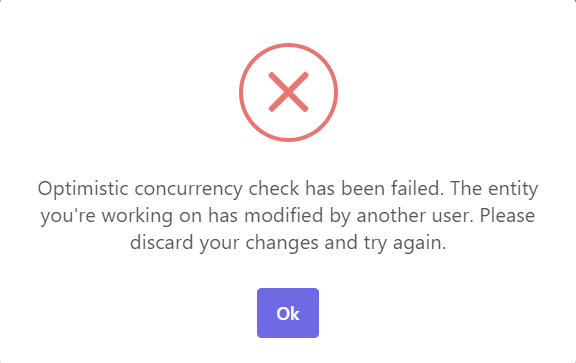
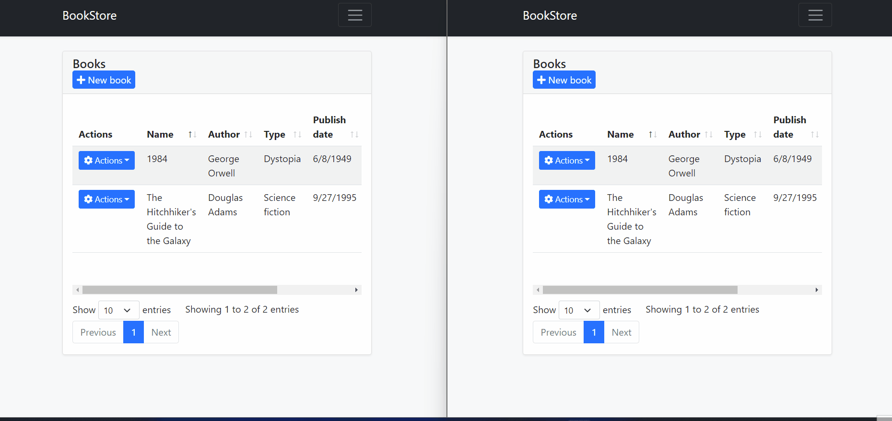

# Handle Concurrency with EF Core in an ABP Framework Project with ASP.NET Core MVC 

In this article, we'll create a basic application to demonstrate how "Concurrency Check/Control" can be implemented in an ABP project.

## Creating the Solution

For this article, we will create a simple BookStore application and add CRUD functionality to the pages. Hence we deal with the concurrency situation.

> To keep the article simple and short, we'll only add the **Book** entity and ignore the **Author** part.

We can create a new startup template with EF Core as a database provider and MVC for the UI Framework.

> If you already have a project, you don't need to create a new startup template, you can directly implement the following steps to your project. So you can skip this section.

We can create a new startup template by using the [ABP CLI](https://docs.abp.io/en/abp/latest/CLI).

```bash
abp new Acme.BookStore -t app -csf
```

After running the above command, our project boilerplate will be downloaded. Then we can open the solution and start the development.

## Starting the Development

Let's start with defining our entities.

### Creating Entities

Create a `Book.cs` (/Books/Book.cs) class in the `.Domain` layer:

```csharp
public class Book : AuditedAggregateRoot<Guid>
{
    public string Name { get; set; }

    public BookType Type { get; set; }

    public DateTime PublishDate { get; set; }

    public float Price { get; set; }
}
```

* To enable **Concurrency Check** for our entities, our entities should be implemented the `IHasConcurrencyStamp` interface, directly or indirectly.

* [Aggregate Root](https://docs.abp.io/en/abp/5.2/Entities#aggregateroot-class) entity classes already implement the `IHasConcurrencyStamp` interface, so if we inherit our entities from one of these entity classes then we won't need to manually implement the `IHasConcurrencyStamp` interface.

* And we've derived the `Book` entity from `AuditedAggregateRoot<TKey>` here, so we don't need to implement the `IHasConcurrencyStamp` interface because `AuditedAggregateRoot` class already implemented the `IHasConcurrencyStamp` interface.

> You can read more details from the [Concurrency Check](https://docs.abp.io/en/abp/5.2/Concurrency-Check) documentation.

Then, create a `BookType` (/Books/BookType.cs) enum in the `.Domain.Shared` layer:

```csharp
public enum BookType
{
    Undefined,
    Adventure,
    Biography,
    Dystopia,
    Fantastic,
    Horror,
    Science,
    ScienceFiction,
    Poetry
}
```

### Database Integration

Open the `BookStoreDbContext` (/EntityFrameworkCore/BookStoreDbContext.cs) class in the `*.EntityFrameworkCore` project and add the following `DbSet<Book>` statement:

```csharp
namespace Acme.BookStore.EntityFrameworkCore;

[ReplaceDbContext(typeof(IIdentityDbContext))]
[ReplaceDbContext(typeof(ITenantManagementDbContext))]
[ConnectionStringName("Default")]
public class BookStoreDbContext :
    AbpDbContext<BookStoreDbContext>,
    IIdentityDbContext,
    ITenantManagementDbContext
{
    //Entities from the modules

    public DbSet<Book> Books { get; set; } //add this line
}
```

Then we can navigate to the `OnModelCreating` method in the same class and configure our tables/entities:

```csharp
protected override void OnModelCreating(ModelBuilder builder)
{
    base.OnModelCreating(builder);

    /* Include modules to your migration db context */

    builder.ConfigurePermissionManagement();
    ...

    //* Configure your own tables/entities inside here */

    builder.Entity<Book>(b =>
    {
        b.ToTable(BookStoreConsts.DbTablePrefix + "Books",
            BookStoreConsts.DbSchema);
        b.ConfigureByConvention(); //auto configure for the base class props
        b.Property(x => x.Name).IsRequired().HasMaxLength(128);
    });
}
```

After the mapping configurations, we can create a new migration and apply changes to the database.

To do this, open your command line terminal in the directory of the `EntityFrameworkCore` project and run the below command:

```bash
dotnet ef migrations add Added_Books
```

After this command, a new migration will be generated and then we can run the `*.DbMigrator` project to apply the last changes to the database such as creating a new table named `Books` according to the last created migration.

### Defining DTOs and Application Service Interfaces

We can start to define the use cases of the application.

Create the DTO classes (under the **Books** folder) in the `Application.Contracts` project:

**BookDto.cs**

```csharp
public class BookDto : AuditedEntityDto<Guid>, IHasConcurrencyStamp
{
    public string Name { get; set; }

    public BookType Type { get; set; }

    public DateTime PublishDate { get; set; }

    public float Price { get; set; }
    
    public string ConcurrencyStamp { get; set; }
}
```

* The `AuditedEntityDto<TKey>` class is not implemented from the `IHasConcurrencyStamp` interface, so for the **BookDto** class we need to implement the `IHasConcurrencyStamp`.

* This is important, because we need to return books with their **ConcurrencyStamp** value.

**CreateBookDto.cs**

```csharp
public class CreateBookDto
{
    [Required]
    [StringLength(128)]
    public string Name { get; set; }

    [Required]
    public BookType Type { get; set; } = BookType.Undefined;

    [Required]
    [DataType(DataType.Date)]
    public DateTime PublishDate { get; set; } = DateTime.Now;

    [Required]
    public float Price { get; set; }
}
```

**UpdateBookDto.cs**

```csharp
public class UpdateBookDto : IHasConcurrencyStamp
{
    [Required]
    [StringLength(128)]
    public string Name { get; set; }

    [Required]
    public BookType Type { get; set; } = BookType.Undefined;

    [Required]
    [DataType(DataType.Date)]
    public DateTime PublishDate { get; set; } = DateTime.Now;

    [Required]
    public float Price { get; set; }

    public string ConcurrencyStamp { get; set; }
}
```

* Here, we've implemented the `IHasConcurrencyStamp` interface for the **UpdateBookDto** class.

* We will use this value while updating an existing book. ABP Framework will compare the current book's **ConcurrencyStamp** value with the provided one, if values are matched, this means everything is as it is supposed to be and will update the record. 

* If values are mismatched, then it means the record that we're trying to update is already updated by another user and we need to get the latest changes to be able to make changes on it.

* Also, in that case, `AbpDbConcurrencyException` will be thrown by the ABP Framework and we can either handle this exception manually or let the ABP Framework handle it on behalf of us and show a user-friendly error message as in the image below.



Create a new `IBookAppService` (/Books/IBookAppService.cs) interface in the `Application.Contracts` project:

```csharp
public interface IBookAppService :
    ICrudAppService<BookDto, Guid, PagedAndSortedResultRequestDto, CreateBookDto, UpdateBookDto> 
{
}
```
* We've implemented the `ICrudAppService` here, because we just need to perform CRUD operations and this interface helps us define common CRUD operation methods.

### Application Service Implementations

Create a `BookAppService` (/Books/BookAppService.cs) class inside the `*.Application` project and implement the application service methods, as shown below:

```csharp
public class BookAppService :
    CrudAppService<Book, BookDto, Guid, PagedAndSortedResultRequestDto, CreateBookDto, UpdateBookDto>, 
    IBookAppService 
{
    public BookAppService(IRepository<Book, Guid> repository)
        : base(repository)
    {
    }
    
    public override async Task<BookDto> UpdateAsync(Guid id, UpdateBookDto input)
    {
        var book = await Repository.GetAsync(id);
        
        book.Name = input.Name;
        book.Price = input.Price;
        book.Type = input.Type;
        book.PublishDate = input.PublishDate;
        
        book.SetConcurrencyStampIfNotNull(input.ConcurrencyStamp);

        var updatedBook = await Repository.UpdateAsync(book);
        return ObjectMapper.Map<Book, BookDto>(updatedBook);
    }
}
```

* We've used the `CrudAppService` base class. This class implements all common CRUD operations and if we want to change a method, we can simply override the method and change it to our needs.

> Normally, you don't need to override the `UpdateAsync` method to do **Concurrency Check**. I wanted to override this method to show what we need to do for **Concurrency Check**.

* We can look closer to the `UpdateAsync` method here, because as we've mentioned earlier we need to pass the provided **ConcurrencyStamp** value to be able to do **Concurrency Check/Control** to our entity while updating. We've used the `SetConcurrencyStampIfNotNull` extension method to set the **ConcurrencyStamp** value to our entity and update the record. 

* At that point, if the given record is already updated by any other user, a **ConcurrencyStamp** mismatch will occur and `AbpDbConcurrencyException` will be thrown thanks to the **Concurrency Check** system of ABP, data-consistency will be provided and the current record won't be overridden.

* And if the values are matched, the record will be updated successfully.

After implementing the application service methods, we can do the related mapping configurations, so open the `BookStoreApplicationAutoMapperProfile.cs` and update the content as below:

```csharp
public class BookStoreApplicationAutoMapperProfile : Profile
{
    public BookStoreApplicationAutoMapperProfile()
    {
        CreateMap<Book, BookDto>();
        CreateMap<CreateBookDto, Book>();
    }
}
```

### User Interface

So far, we've applied the all necessary steps for the **Concurrency Check** system, let's see it in action.

Create a razor page in the `.Web` layer named `Index` (**/Pages/Books/Index.cshtml**), open this file and replace the content with the following code block:

```html
@page
@using Acme.BookStore.Localization
@using Microsoft.Extensions.Localization
@model Acme.BookStore.Web.Pages.Books.Index

@section scripts
{
    <abp-script src="/Pages/Books/Index.js" />
}

<abp-card>
    <abp-card-header>
        <abp-row>
            <abp-column size-md="_6">
                <abp-card-title>Books</abp-card-title>
            </abp-column>
            <abp-column size-md="_6" class="text-end">
                <abp-button id="NewBookButton"
                            text="New Book"
                            icon="plus"
                            button-type="Primary"/>
            </abp-column>
        </abp-row>
    </abp-card-header>
    <abp-card-body>
        <abp-table striped-rows="true" id="BooksTable"></abp-table>
    </abp-card-body>
</abp-card>
```

* We've defined a table and "New Book" button inside a card element here, we'll fill the table with our book records in the next step by using the **Datatables** library.

Create an `Index.js` (**/Pages/Books/Index.js**) file and add the following code block:

```js
$(function () {
    var l = abp.localization.getResource('BookStore');
    var createModal = new abp.ModalManager(abp.appPath + 'Books/CreateModal');
    var editModal = new abp.ModalManager(abp.appPath + 'Books/EditModal');

    var dataTable = $('#BooksTable').DataTable(
        abp.libs.datatables.normalizeConfiguration({
            serverSide: true,
            paging: true,
            order: [[1, "asc"]],
            searching: false,
            scrollX: true,
            ajax: abp.libs.datatables.createAjax(acme.bookStore.books.book.getList),
            columnDefs: [
                {
                    title: l('Actions'),
                    rowAction: {
                        items:
                            [
                                {
                                    text: l('Edit'),
                                    action: function (data) {
                                        editModal.open({ id: data.record.id });
                                    }
                                }
                            ]
                    }
                },
                {
                    title: l('Name'),
                    data: "name"
                },
                {
                    title: l('Type'),
                    data: "type",
                    render: function (data) {
                        return l('Enum:BookType:' + data);
                    }
                },
                {
                    title: l('PublishDate'),
                    data: "publishDate",
                    render: function (data) {
                        return luxon
                            .DateTime
                            .fromISO(data, {
                                locale: abp.localization.currentCulture.name
                            }).toLocaleString();
                    }
                },
                {
                    title: l('Price'),
                    data: "price"
                },
                {
                    title: l('CreationTime'), 
                    data: "creationTime",
                    render: function (data) {
                        return luxon
                            .DateTime
                            .fromISO(data, {
                                locale: abp.localization.currentCulture.name
                            }).toLocaleString(luxon.DateTime.DATETIME_SHORT);
                    }
                }
            ]
        })
    );

    createModal.onResult(function () {
        dataTable.ajax.reload();
    });

    editModal.onResult(function () {
        dataTable.ajax.reload();
    });

    $('#NewBookButton').click(function (e) {
        e.preventDefault();
        createModal.open();
    });
});
```

* We've used the [Datatables](https://datatables.net/) to list our books.

* Also defined **create** and **update** modals by using [ABP Modal Manager](https://docs.abp.io/en/abp/latest/UI/AspNetCore/Modals#modalmanager-reference), but we didn't create them yet, so let's create the modals.

First, create a **CreateModal** razor page and update the **CreateModal.cshtml** and **CreateModal.cshtml.cs** files as below:

**CreateModal.cshtml**

```html
@page
@using Acme.BookStore.Web.Pages.Books
@using Volo.Abp.AspNetCore.Mvc.UI.Bootstrap.TagHelpers.Modal
@model CreateModalModel
@{
    Layout = null;
}
<abp-dynamic-form abp-model="Book" asp-page="/Books/CreateModal">
    <abp-modal>
        <abp-modal-header title="New Book"></abp-modal-header>
        <abp-modal-body>
            <abp-form-content />
        </abp-modal-body>
        <abp-modal-footer buttons="@(AbpModalButtons.Cancel|AbpModalButtons.Save)"></abp-modal-footer>
    </abp-modal>
</abp-dynamic-form>
```

* We've used `abp-dynamic-form` tag-helper and passed it a `Book` model, this tag helper will simply create form contents (inputs, select boxes etc.) on behalf of us.

* **CreateModal.cshtml.cs**

```csharp
using System.Threading.Tasks;
using Acme.BookStore.Books;
using Microsoft.AspNetCore.Mvc;

namespace Acme.BookStore.Web.Pages.Books;

public class CreateModalModel : BookStorePageModel
{
    [BindProperty]
    public CreateBookDto Book { get; set; }

    private readonly IBookAppService _bookAppService;

    public CreateModalModel(IBookAppService bookAppService)
    {
        _bookAppService = bookAppService;
    }

    public void OnGet()
    {
        Book = new CreateBookDto();
    }

    public async Task<IActionResult> OnPostAsync()
    {
        await _bookAppService.CreateAsync(Book);
        return NoContent();
    }
}
```

* In this file, we simply define **CreateBookDto** as a bind property and we'll use this class's properties in the form. Thanks to the `abp-dynamic-form` tag-helper we don't need to define all of these form elements one by one, it will generate on behalf of us.

We can create an **EditModal** razor page and update the **EditModal.cshtml** and **EditModal.cshtml.cs** files as below:

**EditModal.cshtml**

```html
@page
@using Acme.BookStore.Web.Pages.Books
@using Volo.Abp.AspNetCore.Mvc.UI.Bootstrap.TagHelpers.Modal
@model EditModalModel
@{
    Layout = null;
}
<form asp-page="/Books/EditModal">
    <abp-modal>
        <abp-modal-header title="Update"></abp-modal-header>
        <abp-modal-body>
            <abp-input asp-for="Id"/>
            <abp-input asp-for="Book.Name"/>
            <abp-input asp-for="Book.Price"/>
            <abp-select asp-for="Book.Type"/>
            <abp-input asp-for="Book.PublishDate"/>
            <abp-input asp-for="Book.ConcurrencyStamp" type="hidden"/>
        </abp-modal-body>
        <abp-modal-footer buttons="@(AbpModalButtons.Cancel|AbpModalButtons.Save)"></abp-modal-footer>
    </abp-modal>
</form>
```

* Here, we didn't use the `abp-dynamic-form` tag-helper and added all the necessary form elements to our form one by one.

* As you may have noticed, we've set the input type as **hidden** for the **ConcurrencyStamp** input, because the end-user should not see this value.

> Instead of doing it like that, we could create a view model class and use the `[HiddenInput]` data attribute for the **ConcurrencyStamp** property and use the `abp-dynamic-form` tag-helper. But to simplify the article I didn't want to do that, if you want you can create a view model and define the necessary data attributes for properties.

**EditModal.cshtml.cs**

```csharp
public class EditModalModel : BookStorePageModel
{
    [HiddenInput]
    [BindProperty(SupportsGet = true)]
    public Guid Id { get; set; }

    [BindProperty]
    public UpdateBookDto Book { get; set; }

    private readonly IBookAppService _bookAppService;

    public EditModalModel(IBookAppService bookAppService)
    {
        _bookAppService = bookAppService;
    }

    public async Task OnGetAsync()
    {
        var bookDto = await _bookAppService.GetAsync(Id);
        Book = ObjectMapper.Map<BookDto, UpdateBookDto>(bookDto);
    }

    public async Task<IActionResult> OnPostAsync()
    {
        await _bookAppService.UpdateAsync(Id, Book);
        return NoContent();
    }
}
```

Lastly, we can define the necessary mapping configurations and run the application to see the result.

Open the `BookStoreWebAutoMapperProfile.cs` class and update the content as below:

```csharp
public class BookStoreWebAutoMapperProfile : Profile
{
    public BookStoreWebAutoMapperProfile()
    {
        CreateMap<BookDto, UpdateBookDto>();
    }
}
```

Then we can run the application, navigate to the **/Books** endpoint and see the result.



* In the image above, we can see that multiple users open the edit model to change a record and try to update the relevant record independently of each other.

* After the first user updated the record, the second user tries to update the same record without getting the last state of the record. And therefore `AbpDbConcurrencyException` is thrown because **ConcurrencyStamp** values are different from each other.

* The second user should close and re-open the model to get the last state of the record and then they can make changes to the current record.
