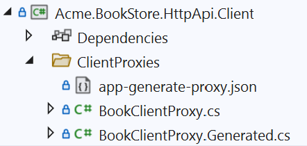

# Consuming REST APIs from a .NET Client Using ABP's Client Proxy System
In this article, we will show how to consume Rest API  by creating a new project and converting that from the dynamic client proxy to the static client proxy. Also, I will glance at the differences and similarities between static and dynamic generic proxies.

Article flow
* Create a new ABP application with ABP CLI
* Create application service interface
* Implement the application service 
* Consume the app service from the console application
* Convert application to use static client proxies 
* Add authorization to the application service endpoint
* Grant the permission 
* Further reading

### Create a new ABP application with ABP CLI
Firstly create a new template via ABP CLI. 

````shell
abp new Acme.BookStore -t app
````

> If you haven't installed it yet, you should install the [ABP CLI](https://docs.abp.io/en/abp/latest/CLI).

After restoring the project will download the NuGet packages.

Now you should run the DbMigrator project to up your database and your project is ready for running.

From now on, we will add some files to show the case to you.  

### Create application service interface
Define an interface for the application service. Create an `IBookAppService` interface in the `Books` folder (namespace) of the `Acme.BookStore.Application.Contracts` project:

````csharp
using System.Threading.Tasks;
using Volo.Abp.Application.Dtos;
using Volo.Abp.Application.Services;

namespace Acme.BookStore.Books
{
    public interface IBookAppService : IApplicationService
    {
        Task<PagedResultDto<BookDto>> GetListAsync(PagedAndSortedResultRequestDto input);
    }
}
````

Create a `Books` folder (namespace) in the `Acme.BookStore.Application.Contracts` project and add a `BookDto` class inside it: 

```csharp
using System;
using Volo.Abp.Application.Dtos;

namespace Acme.BookStore.Books
{
    public class BookDto : AuditedEntityDto<Guid>
    {
        public string AuthorName { get; set; }

        public string Name { get; set; }

        public DateTime PublishDate { get; set; }

        public float Price { get; set; }
    }
}
```

# Implement the application service
It is time to implement the `IBookAppService` interface. Create a new class, named `BookAppService` in the `Books` namespace (folder) of the `Acme.BookStore.Application` project:

```csharp
using Acme.BookStore.Permissions;
using Microsoft.AspNetCore.Authorization;
using System.Collections.Generic;
using System.Threading.Tasks;
using Volo.Abp.Application.Dtos;
using Volo.Abp.Application.Services;

namespace Acme.BookStore.Books
{
    public class BookAppService : ApplicationService, IBookAppService
    {
        public Task<PagedResultDto<BookDto>> GetListAsync(PagedAndSortedResultRequestDto input)
        {
            var bookDtos = new List<BookDto>()
            {
                new BookDto(){ Name = "Anna Karenina", AuthorName ="Tolstoy", Price = 50},
                new BookDto(){ Name = "Crime and Punishment", AuthorName ="Dostoevsky", Price = 60},
                new BookDto(){ Name = "Mother", AuthorName ="Gorki", Price = 70}
            };
            return Task.FromResult(new PagedResultDto<BookDto>(
               bookDtos.Count,
               bookDtos
           ));
        }
    }
}
```
It simply returns a list of books. You probably want to get the books from a database, but it doesn't matter for this article. To do it you can visit [here](https://docs.abp.io/en/abp/latest/Tutorials/Part-1?UI=MVC&DB=EF)

### Consume the app service from the console application
Change `ClientDemoService` as shown the following in the `Acme.BookStore.HttpApi.Client.ConsoleTestApp` project under the test folder.

```csharp
using Acme.BookStore.Books;
using System;
using System.Linq;
using System.Threading.Tasks;
using Volo.Abp.Application.Dtos;
using Volo.Abp.DependencyInjection;

namespace Acme.BookStore.HttpApi.Client.ConsoleTestApp;

public class ClientDemoService : ITransientDependency
{
    private readonly IBookAppService _bookAppService;

    public ClientDemoService(IBookAppService bookAppService )
    {
        _bookAppService = bookAppService;
    }

    public async Task RunAsync()
    {
        var listOfBooks = await _bookAppService.GetListAsync(new PagedAndSortedResultRequestDto());
        Console.WriteLine($"Books: {string.Join(", ", listOfBooks.Items.Select(p => p.Name).ToList())}");
    }
}
```

The output should be 
> Books: Anna Karenina, Crime and Punishment, Mother

### Convert application to use static client proxies
Before showing you how to use static client proxies instead of dynamic client proxies, I ask you to talk differences between both approaches. Their similarities, advantages and disadvantages to each other.

##### Benefits
* Maps C# method calls to remote server HTTP calls by considering the HTTP method, route, query string parameters, request payload and other details.
* Authenticates the HTTP Client by adding access token to the HTTP header.
* Serializes to and deserialize from JSON.
* Handles HTTP API versioning.
* Add correlation id, current tenant id and the current culture to the request.
* Properly handles the error messages sent by the server and throws proper exceptions.

##### Differences
Static generic proxies provide better performance because it doesn't need to run on runtime, but you should **re-generate** once changing API endpoint definition. Dynamic generic proxies don't need **re-generate** again because it works on the runtime but it happens more a bit time. 

Now focus on how to do it,
Firstly add Volo.Abp.Http.Client NuGet package to your client project:
````shell
Install-Package Volo.Abp.Http.Client
````

> The [application startup template](https://docs.abp.io/en/abp/latest/Startup-Templates/Application) comes pre-configured for the **dynamic** client proxy generation, in the `HttpApi.Client` project. If you want to switch to the **static** client proxies, change `context.Services.AddHttpClientProxies` to `context.Services.AddStaticHttpClientProxies` in the module class of your `HttpApi.Client` project.

```csharp
public class BookStoreHttpApiClientModule : AbpModule
{
    public const string RemoteServiceName = "Default";

    public override void ConfigureServices(ServiceConfigurationContext context)
    {
       //Other configurations

        context.Services.AddStaticHttpClientProxies(
            typeof(BookStoreApplicationContractsModule).Assembly,
            RemoteServiceName
        );
    }
}
```

`AddStaticHttpClientProxies` method gets an assembly, finds all service interfaces in the given assembly, and prepares for static client proxy generation.


Now you're ready to generate the client proxy code by running the following command in the root folder of your client project when your project is running.

````bash
abp generate-proxy -t csharp -u http://localhost:44397/
````

You should have seen the generated files under the selected folder.


Now you can run your test console application and you should see the same output.
> Books: Anna Karenina, Crime and Punishment, Mother

### Add authorization
ABP Framework provides an authorization system based on the ASP.NET Core's authorization infrastructure.
Even so, to use that need to make some configurations.

Under `Acme.BookStore.Application.Contracts` open `BookStorePermissions` and paste the below code
```csharp
namespace Acme.BookStore.Permissions;

public static class BookStorePermissions
{
    public const string GroupName = "BookStore";

    public static class Books
    {
        public const string Default = GroupName + ".Books";
    }

}
```
Also need to change `BookStorePermissionDefinitionProvider` under the same folder and project as follows.
```csharp
using Acme.BookStore.Localization;
using Volo.Abp.Authorization.Permissions;
using Volo.Abp.Localization;

public class BookStorePermissionDefinitionProvider : PermissionDefinitionProvider
{
    public override void Define(IPermissionDefinitionContext context)
    {
        var bookStoreGroup = context.AddGroup(BookStorePermissions.GroupName, L("Permission:BookStore"));
        bookStoreGroup.AddPermission(BookStorePermissions.Books.Default, L("Permission:Books"));
    }

    private static LocalizableString L(string name)
    {
        return LocalizableString.Create<BookStoreResource>(name);
    }
}
```
And now you should add [Authorize(BookStorePermissions.Books.Default)] to `BookAppService`
If you don't give permission you should see the following error on the console application.

> Authorization failed. These requirements were not met:
PermissionRequirement: BookStore.Books
AuthenticationScheme: Identity.Application was forbidden.
Request finished HTTP/1.1 GET https://localhost:44397/api/app/book?SkipCount=0&MaxResultCount=10&api-version=1.0 - - - 403 0 - 156.9766ms

After completing that you can make the localization configuration and you should give permission at the Admin UI side. You can see the same output again and all will be alright.

### Further Reading
In this small tutorial, I explained how you can create an example project and apply static client proxy instead of dynamic client proxy. Also summarized the differences between both approaches.

If you want to get more information, you can read the following documents:

* [Static C# API Client Proxies](https://docs.abp.io/en/abp/latest/API/Static-CSharp-API-Clients)
* [Dynamic C# API Client Proxies](https://docs.abp.io/en/abp/latest/API/Dynamic-CSharp-API-Clients)
* [Web Application Development Tutorial ](https://docs.abp.io/en/abp/latest/Tutorials/Part-1?UI=MVC&DB=EF)
