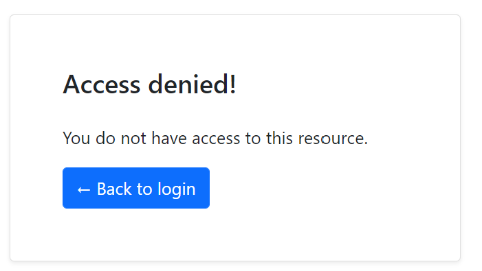
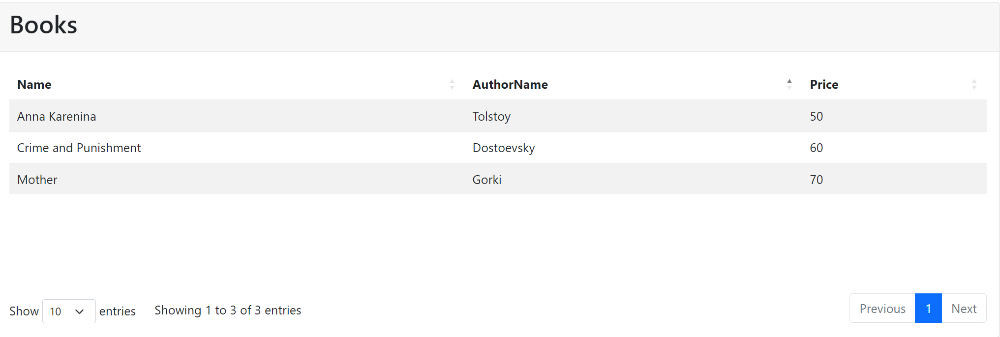

# Consuming REST APIs from a .NET Client Using ABP's Client Proxy System
In this article, we will show how to consume rest api by using static client proxy by creating a new project and converting that from dynamic client proxy to static client proxy. Also, I will glance at the differences between static and dynamic generic proxies.

Article flow
* Create a new ABP application with ABP CLI
* Create application service interface
* Implement the application service 
* Consume the app service from the console application
* Convert application to use static client proxies 
* Add authorization to the application service endpoint
* Grant the permission 
* Further reading

### Create a new ABP application with ABP CLI
Firstly create a new template via ABP CLI. 

````shell
abp new Acme.BookStore -t app
````

> If you haven't installed it yet, you should install the [ABP CLI](https://docs.abp.io/en/abp/latest/CLI).

At the same folder build the project with the following command on the cli.
````shell
dotnet build /graphbuild
````

It will restore the project and download the NuGet packages.

Now you should run the DbMigrator project to up your database.

Now your project is ready you can run it properly.


From now on, we will add some files to show the case to you.  


### Create application service interface
You should open your web application then find `Pages` folder and a create new folder named `Books`.
You should create a new razor page and a new js file as named index.

Change the Pages/Books/Index.cshtml as the following:   
```csharp
@page
@using Acme.BookStore.Localization
@using Acme.BookStore.Web.Pages.Books
@using Microsoft.Extensions.Localization
@model IndexModel
@inject IStringLocalizer<BookStoreResource> L
@section scripts
{
    <abp-script src="/Pages/Books/index.js" />
}
<abp-card>
    <abp-card-header>
        <h2>@L["Books"]</h2>
    </abp-card-header>
    <abp-card-body>
        <abp-table striped-rows="true" id="BooksTable"></abp-table>
    </abp-card-body>
</abp-card>
```

Now change index.js file as the following content
```js
$(function () {
    var l = abp.localization.getResource('BookStore');
    $('#BooksTable').DataTable(
        abp.libs.datatables.normalizeConfiguration({
            serverSide: true,
            paging: true,
            order: [[1, "asc"]],
            searching: false,
            scrollX: true,
            ajax: abp.libs.datatables.createAjax(acme.bookStore.books.book.getList),
            columnDefs: [
                {
                    title: l('Name'),
                    data: "name"
                },
                {
                    title: l('AuthorName'),
                    data: "authorName"
                },
                {
                    title: l('Price'),
                    data: "price"
                }
            ]
        })
    );
});
```

# Implement the application service
Assume that we have an `IBookAppService` interface:

````csharp
using System.Collections.Generic;
using System.Threading.Tasks;
using Volo.Abp.Application.Services;

namespace Acme.BookStore.Books
{
    public interface IBookAppService : IApplicationService
    {
        Task<List<BookDto>> GetListAsync();
    }
}
````

That uses a `BookDto` defined as shown:

```csharp
using System;
using Volo.Abp.Application.Dtos;

namespace Acme.BookStore.Books
{
    public class BookDto : AuditedEntityDto<Guid>
    {
        public string AuthorName { get; set; }

        public string Name { get; set; }

        public DateTime PublishDate { get; set; }

        public float Price { get; set; }
    }
}
```

```csharp
namespace Acme.BookStore.Books
{
    public class BookAppService : ApplicationService, IBookAppService
    {
        public Task<PagedResultDto<BookDto>> GetListAsync(PagedAndSortedResultRequestDto input)
        {
            var bookDtos = new List<BookDto>()
            {
                new BookDto(){ Name = "Anna Karenina", AuthorName ="Tolstoy", Price = 50},
                new BookDto(){ Name = "Crime and Punishment", AuthorName ="Dostoevsky", Price = 60},
                new BookDto(){ Name = "Mother", AuthorName ="Gorki", Price = 70}
            };
            return Task.FromResult(new PagedResultDto<BookDto>(
               bookDtos.Count,
               bookDtos
           ));
        }
    }
}
```
It simply returns a list of books. You probably want to get the books from a database, but it doesn't matter for this article. To do it you can visit [here] (https://docs.abp.io/en/abp/latest/Tutorials/Part-1?UI=MVC&DB=EF)

### Consume the app service from the console application
Add a new test class, named BookAppService_Tests in the Application.Tests

```csharp
using System.Threading.Tasks;
using Xunit;

namespace Acme.BookStore.Books
{
    public class BookAppService_Tests : BookStoreApplicationTestBase
    {
        private readonly IBookAppService _bookAppService;

        public BookAppService_Tests()
        {
            _bookAppService = GetRequiredService<IBookAppService>();
        }

        [Fact]
        public async Task Should_Get_List_Of_Books()
        {
            var result = await _bookAppService.GetListAsync();
            Assert.Equal(3, result.Count);
        }
    }
}
```

### Convert application to use static client proxies
Before showing you how to use static client proxies instead of dynamic client proxy, I ask for talk differences between both approach. Their similarty, advantages and disadvantages to each other.

##### Benefits
* Maps C# method calls to remote server HTTP calls by considering the HTTP method, route, query string parameters, request payload and other details.
* Authenticates the HTTP Client by adding access token to the HTTP header.
* Serializes to and deserialize from JSON.
* Handles HTTP API versioning.
* Add correlation id, current tenant id and the current culture to the request.
* Properly handles the error messages sent by the server and throws proper exceptions.

##### Differences
Static generic proxies provide better performance because it doesn't need to run on runtime, but you should **re-generate** once changing API endpoint definition. Dynamic generic proxies don't need **re-generate** again because working on the runtime can take more a bit of time. 

First, add Volo.Abp.Http.Client NuGet package to your client project:
````shell
Install-Package Volo.Abp.Http.Client
````
Then add AbpHttpClientModule dependency to your module:
```csharp
[DependsOn(
    typeof(AbpHttpClientModule)
    //the other dependencies
    )]

public class BookStoreApplicationModule : AbpModule
{
    public override void ConfigureServices(ServiceConfigurationContext context)
    {
       //Other configurations

        // Prepare for static client proxy generation
        context.Services.AddStaticHttpClientProxies(
            typeof(BookStoreApplicationContractsModule).Assembly
        );
    }
}
```

`AddStaticHttpClientProxies` method gets an assembly, finds all service interfaces in the given assembly, and prepares for static client proxy generation.

> The [application startup template](https://docs.abp.io/en/abp/latest/Startup-Templates/Application) comes pre-configured for the **dynamic** client proxy generation, in the `HttpApi.Client` project. If you want to switch to the **static** client proxies, change `context.Services.AddHttpClientProxies` to `context.Services.AddStaticHttpClientProxies` in the module class of your `HttpApi.Client` project.

Now you're ready to generate the client proxy code by running the following command in the root folder of your client project when your project is running.

````bash
abp generate-proxy -t csharp -u http://localhost:44397/
````

Also, you should then run the below command under your web project for the UI side for MVC
````bash
abp generate-proxy -t js -u http://localhost:44397/
````

You have been should the generated files under the runned folder.

### Add authorization
ABP Framework provides an authorization system based on the ASP.NET Core's authorization infrastructure.
Even so, to use that need to make some configurations.

Under `Acme.BookStore.Application.Contracts` open `BookStorePermissions` and paste the below code
```csharp
public static class BookStorePermissions
{
    public const string GroupName = "BookStore";

    public static class Books
    {
        public const string Default = GroupName + ".Books";
    }

}
```
Also need to change `BookStorePermissionDefinitionProvider` under the same folder and project as following.
```csharp
public class BookStorePermissionDefinitionProvider : PermissionDefinitionProvider
{
    public override void Define(IPermissionDefinitionContext context)
    {
        var bookStoreGroup = context.AddGroup(BookStorePermissions.GroupName, L("Permission:BookStore"));
        bookStoreGroup.AddPermission(BookStorePermissions.Books.Default, L("Permission:Books"));
    }

    private static LocalizableString L(string name)
    {
        return LocalizableString.Create<BookStoreResource>(name);
    }
}
```
And now you should add [Authorize(BookStorePermissions.Books.Default)] to `BookAppService`
If you don't give permission you should see the following screen.


After completing that you can make localization configuration and you should give permission from the Admin UI side. Now you should the following screen.


### Further Reading
In this small tutorial, I explained how you can create an example project and apply static client proxy instead of dynamic client proxy. Also summarized the differences between both approaches.

If you want to get more information, you can read the following documents:

* [Static C# API Client Proxies](https://docs.abp.io/en/abp/latest/API/Static-CSharp-API-Clients)
* [Dynamic C# API Client Proxies](https://docs.abp.io/en/abp/latest/API/Dynamic-CSharp-API-Clients)
* [Web Application Development Tutorial ](https://docs.abp.io/en/abp/latest/Tutorials/Part-1?UI=MVC&DB=EF)
