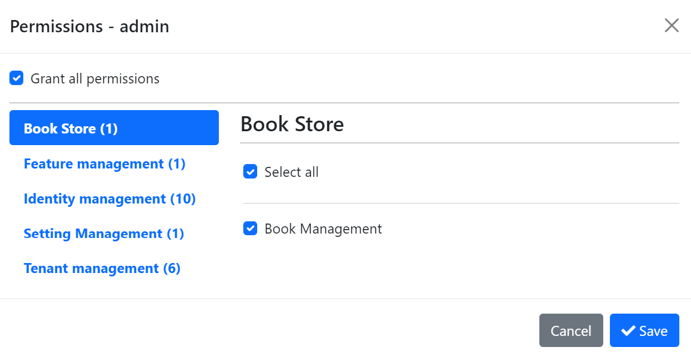

# Consuming HTTP APIs from a .NET Client Using ABP's Client Proxy System

In this article, I will explain how to consume HTTP APIs from a .NET application using ABP's [dynamic](https://docs.abp.io/en/abp/latest/API/Dynamic-CSharp-API-Clients) and [static](https://docs.abp.io/en/abp/latest/API/Static-CSharp-API-Clients) client-side proxy systems. I will start by creating a new project and consume the HTTP APIs from a .NET console application using dynamic client proxies. Then I will switch to static client proxies. Finally, I will glance at the differences and similarities between static and dynamic generic proxies.

Here the main benefits of using the client-side proxy system (either dynamic or static):

* Automatically maps C# method calls to remote server HTTP calls by considering the HTTP method, route, query string parameters, request payload and other details.
* Authenticates the HTTP Client by adding an access token to the HTTP header.
* Serializes to and deserialize from JSON.
* Handles HTTP API versioning.
* Adds correlation id, current tenant id and the current culture to the request.
* Properly handles the error messages sent by the server and throws proper exceptions.

## Create a new ABP application with the ABP CLI
Firstly create a new solution via [ABP CLI](https://docs.abp.io/en/abp/latest/CLI):

```shell
abp new Acme.BookStore
```

> See ABP's [Getting Started document](https://docs.abp.io/en/abp/latest/Getting-Started-Setup-Environment?UI=MVC&DB=EF&Tiered=No) to learn how to create and run your application, if you haven't done it before.

## Create the application service interface
I will start by creating an application service and exposing it as an HTTP API to be consumed by remote clients. First, define an interface for the application service; Create an `IBookAppService` interface in the `Books` folder (namespace) of the `Acme.BookStore.Application.Contracts` project:

````csharp
using System.Threading.Tasks;
using Volo.Abp.Application.Dtos;
using Volo.Abp.Application.Services;

namespace Acme.BookStore.Books
{
    public interface IBookAppService : IApplicationService
    {
        Task<PagedResultDto<BookDto>> GetListAsync();
    }
}
````

Also add a `BookDto` class inside the same `Books` folder:

```csharp
using System;
using Volo.Abp.Application.Dtos;

namespace Acme.BookStore.Books
{
    public class BookDto
    {
        public string Name { get; set; }
        public string AuthorName { get; set; }
        public float Price { get; set; }
    }
}
```

## Implement the application service
It is time to implement the `IBookAppService` interface. Create a new class named `BookAppService` in the `Books` namespace (folder) of the `Acme.BookStore.Application` project:

```csharp
using Acme.BookStore.Permissions;
using Microsoft.AspNetCore.Authorization;
using System.Collections.Generic;
using System.Threading.Tasks;
using Volo.Abp.Application.Dtos;
using Volo.Abp.Application.Services;

namespace Acme.BookStore.Books
{
    public class BookAppService : ApplicationService, IBookAppService
    {
        public Task<PagedResultDto<BookDto>> GetListAsync()
        {
            var bookDtos = new List<BookDto>()
            {
                new BookDto(){ Name = "Hunger", AuthorName ="Knut Hamsun", Price = 50},
                new BookDto(){ Name = "Crime and Punishment", AuthorName ="Dostoevsky", Price = 60},
                new BookDto(){ Name = "For Whom the Bell Tolls", AuthorName ="Ernest Hemingway", Price = 70}
            };
            return Task.FromResult(new PagedResultDto<BookDto>(
               bookDtos.Count,
               bookDtos
           ));
        }
    }
}
```
It simply returns a list of books. You probably want to get the books from a database, but it doesn't matter for this article. If you want it, you can fully implement [this tutorial](https://docs.abp.io/en/abp/latest/Tutorials/Part-1?UI=MVC&DB=EF).

## Consume the app service from the console application
The startup solution comes with an example .NET console application (`Acme.BookStore.HttpApi.Client.ConsoleTestApp`) that is fully configured to consume your HTTP APIs remotely. Change `ClientDemoService` as shown in the following `Acme.BookStore.HttpApi.Client.ConsoleTestApp` project (it is under the `test` folder).

```csharp
using Acme.BookStore.Books;
using System;
using System.Linq;
using System.Threading.Tasks;
using Volo.Abp.Application.Dtos;
using Volo.Abp.DependencyInjection;

namespace Acme.BookStore.HttpApi.Client.ConsoleTestApp;

public class ClientDemoService : ITransientDependency
{
    private readonly IBookAppService _bookAppService;

    public ClientDemoService(IBookAppService bookAppService )
    {
        _bookAppService = bookAppService;
    }

    public async Task RunAsync()
    {
        var listOfBooks = await _bookAppService.GetListAsync(new PagedAndSortedResultRequestDto());
        Console.WriteLine($"Books: {string.Join(", ", listOfBooks.Items.Select(p => p.Name).ToList())}");
    }
}
```

We are basically injecting the `IBookAppService` interface to consume the remote service. ABP handles all the details (performing HTTP request, deserializing the resulting JSON object, etc) for us.

You can run the application to see the output:

```
Books: Hunger, Crime and Punishment, For Whom the Bell Tolls
```

## Convert the application to use static client proxies
The [application startup template](https://docs.abp.io/en/abp/latest/Startup-Templates/Application) comes pre-configured for the **dynamic** client proxy generation, in the `HttpApi.Client` project. If you want to switch to the **static** client proxies, you should change `context.Services.AddHttpClientProxies` to `context.Services.AddStaticHttpClientProxies` in the module class of your `HttpApi.Client` project:

```csharp
public class BookStoreHttpApiClientModule : AbpModule
{
    public const string RemoteServiceName = "Default";

    public override void ConfigureServices(ServiceConfigurationContext context)
    {
       // Other configurations...

        context.Services.AddStaticHttpClientProxies(
            typeof(BookStoreApplicationContractsModule).Assembly,
            RemoteServiceName
        );
    }
}
```

The `AddStaticHttpClientProxies` method gets an assembly, finds all service interfaces in the given assembly, and prepares for static client proxy generation.


Now you're ready to generate the client proxy code by running the following command in the root folder of your client project **while your server-side project is running**:

````bash
abp generate-proxy -t csharp -u http://localhost:44397/
````

> The URL (`-u` parameter's value) might be different for your application. It should be the server's root URL.

You should see the generated files under the selected folder:


Now you can run the console client application again. You should see the same output:

````
Books: Hunger, Crime and Punishment, For Whom the Bell Tolls
````

## Add authorization
The ABP Framework provides an [authorization system](https://docs.abp.io/en/abp/latest/Authorization) based on [ASP.NET Core's authorization infrastructure](https://docs.microsoft.com/en-us/aspnet/core/security/authorization/introduction). We can define permissions and restrict access to some of our application's functionalities, so only the allowed users/clients can use these functionalities. Here, I will define a permission to be able to get the list of books.

### Defining a permission

Under `Acme.BookStore.Application.Contracts` open `BookStorePermissions` and paste the below code:
```csharp
namespace Acme.BookStore.Permissions;

public static class BookStorePermissions
{
    public const string GroupName = "BookStore";

    public static class Books
    {
        public const string Default = GroupName + ".Books";
    }

}
```
You also need to change `BookStorePermissionDefinitionProvider` under the same folder and project as follows:
```csharp
using Acme.BookStore.Localization;
using Volo.Abp.Authorization.Permissions;
using Volo.Abp.Localization;

public class BookStorePermissionDefinitionProvider : PermissionDefinitionProvider
{
    public override void Define(IPermissionDefinitionContext context)
    {
        var bookStoreGroup = context.AddGroup(BookStorePermissions.GroupName);
        bookStoreGroup.AddPermission(BookStorePermissions.Books.Default);
    }
}
```
### Authorizing the application service

We can now add the `[Authorize(BookStorePermissions.Books.Default)]` attribute to the `BookAppService` class:

```csharp
[Authorize(BookStorePermissions.Books.Default)]
public class BookAppService : ApplicationService, IBookAppService
{
    ...
}
```

If you run the server now, then run the console client application, you will see the following error on the console application:

```
Unhandled exception. Volo.Abp.Http.Client.AbpRemoteCallException: Forbidden at
Volo.Abp.Http.Client.ClientProxying.ClientProxyBase`1
.ThrowExceptionForResponseAsync(HttpResponseMessage response)...
```

To fix the problem, we should grant permission to the admin user. We are granting permission to the admin user because the console application is configured to use the Resource Owner Password Grant Flow. That means the client application is consuming services on behalf of the admin user. You can see the configuration in the `appsettings.json` file of the console application.

### Granting the permission

Once you define the permissions, you can see them on the permission management modal.

Go to the Administration -> Identity -> Roles page, select the Permissions action for the admin role to open the permission management modal:

Grant the permissions you want and save the modal.

## Dynamic vs static proxies

Static generic proxies provide **better performance** because they don't need to run on runtime, but you should **re-generate** them once you change the API endpoint definition. Dynamic generic proxies don't need to be re-generated because they work on the runtime but they have a slight performance penalty.

## Further Reading
In this tutorial, I explained how you can create an example project and apply a static client proxy instead of a dynamic client proxy. I also summarized the differences between both approaches. If you want to get more information, you can read the following documents:

* [Static C# API Client Proxies](https://docs.abp.io/en/abp/latest/API/Static-CSharp-API-Clients)
* [Dynamic C# API Client Proxies](https://docs.abp.io/en/abp/latest/API/Dynamic-CSharp-API-Clients)
* [Web Application Development Tutorial](https://docs.abp.io/en/abp/latest/Tutorials/Part-1?UI=MVC&DB=EF)
