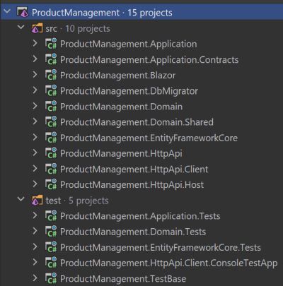
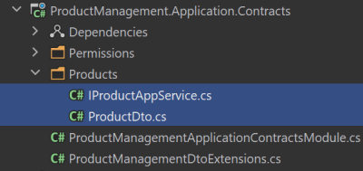
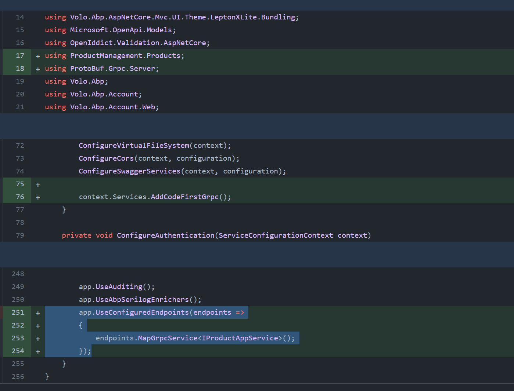
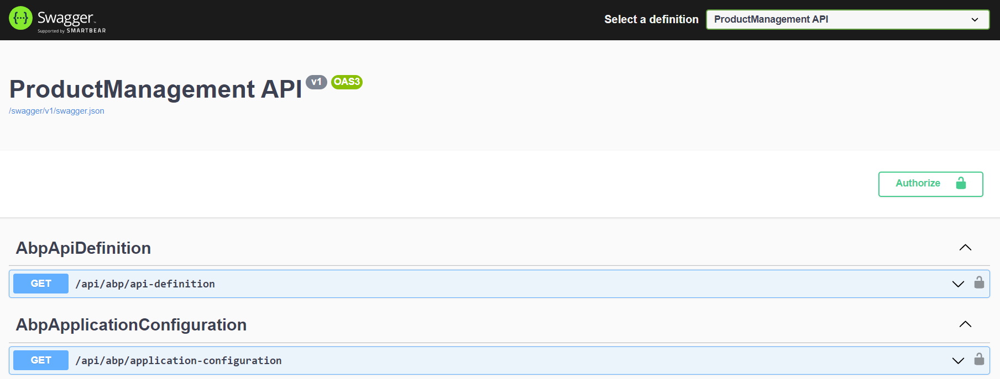
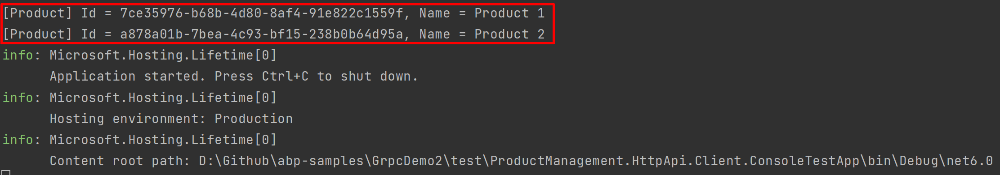

# Using gRPC with the ABP Framework

[gRPC](https://grpc.io/) defines itself as an open source, language agnostic, universal, high-performance **Remote Procedure Call (RPC)** framework.

In this article, I will show you how to create a gRPC service and consume it from a console application with the ABP Framework. While the client application is console in this article, it can easily be a service consuming another service in a microservice system.

> **This article will be a step by step tutorial.** I wrote the article based on Microsoft's [Code-first gRPC services and clients with .NET](https://docs.microsoft.com/en-us/aspnet/core/grpc/code-first) document. You can read that document for more details about gRPC and the code-first approach.

## Creating the Application

Install the [ABP CLI](https://docs.abp.io/en/abp/latest/CLI) if you haven't installed it yet:

````bash
dotnet tool install -g Volo.Abp.Cli
````

or update to the latest version if you've already installed an old version:

````bash
dotnet tool update Volo.Abp.Cli -g
````

Create an empty folder, open a command-line terminal and type the following command in the terminal window to create a new ABP solution using the ABP CLI:

````bash
abp new ProductManagement -u blazor -t app --preview
````

I've created an application with the Blazor UI, but the UI is not important for this tutorial, you can select your favorite UI option. 

## Open the Solution

Open the solution in your favorite IDE. I like [Rider](https://www.jetbrains.com/rider/), but Visual Studio, VS Code or any other IDE perfectly works. The following figure shows the solution structure in Rider:



Run the `ProductManagement.DbMigrator` project (a console application) to create the database and seed the initial data.

## Defining the Service Contract

We are starting by defining the service contract and DTO classes that will be shared between the server and the client applications.

Create a `Products` folder in the `ProductManagement.Application.Contracts` project and add a new interface named `IProductAppService`:

````csharp
using System.Collections.Generic;
using System.ServiceModel;
using System.Threading.Tasks;
using Volo.Abp.Application.Services;

namespace ProductManagement.Products;

[ServiceContract]
public interface IProductAppService : IApplicationService
{
    Task<List<ProductDto>> GetListAsync();
}
````

Your IDE will complain about the `[ServiceContract]` attribute, but it is necessary for the contract-first gRPC library we will be using later. So, add the [System.ServiceModel.Primitives](https://www.nuget.org/packages/System.ServiceModel.Primitives) NuGet package to the `ProductManagement.Application.Contracts` project, and it should be fixed. You can simply edit the `ProductManagement.Application.Contracts.csproj` file and add the following line in an `ItemGroup` tag:

````xml
<PackageReference Include="System.ServiceModel.Primitives" Version="4.7.0" />
````

Or you can use your IDE to find and add that NuGet package, it is up to you.

I've also used the `ProductDto` class, but haven't defined it yet. Create a new class in the same folder with the `IProductAppService` file:

````csharp
using System;
using System.Runtime.Serialization;

namespace ProductManagement.Products;

[DataContract]
public class ProductDto
{
    [DataMember(Order = 1)]
    public Guid Id { get; set; }

    [DataMember(Order = 2)]
    public string Name { get; set; }
}
````

The `[DataContract]` and `[DataMember]` properties are needed for serialization. In gRPC, property serialization orders are important, because property names are not transferred to the target application, to keep the serialized data small.

After adding these classes, the `ProductManagement.Application.Contracts` project should look as in the following figure:



The contracts part is over. We actually didn't have any dependency to gRPC at that point. Our service and DTOs are pretty plain classes, except a few standard attributes, which are already defined in the .NET Core framework. Now, we can implement the `IProductAppService`.

## Implementing the Service

We are implementing the application services in the `ProductManagement.Application` project. So, add a new `Products` folder to that project and define a `ProductAppService` class inside it:

````csharp
using System;
using System.Collections.Generic;
using System.Threading.Tasks;

namespace ProductManagement.Products;

public class ProductAppService : ProductManagementAppService, IProductAppService
{
    public async Task<List<ProductDto>> GetListAsync()
    {
        return new List<ProductDto>
        {
            new ProductDto { Id = Guid.NewGuid(), Name = "Product 1" },
            new ProductDto { Id = Guid.NewGuid(), Name = "Product 2" },
        };
    }
}
````

This is a pretty standard, plain [application service ](https://docs.abp.io/en/abp/latest/Application-Services)class. All the ABP application service features (validation, audit logging, unit of work, etc.) are available. You can inject [repositories](https://docs.abp.io/en/abp/latest/Repositories) and perform database queries. To keep this article simple, I am returning hard-coded data from here.

> `ProductManagementAppService` is a base class coming in the ABP startup template. While you don't have to inherit from it, it provides useful base properties and methods you typically need in an application service.

The application service part is over. Again, we didn't write any gRPC specific code. Don't worry, we will write in the next section.

## Configuring the gRPC Server

In this solution, `ProductManagement.HttpApi.Host` is the project that configures and runs the server-side application. So, we will make changes in that project.

First, add the [protobuf-net.Grpc.AspNetCore](https://www.nuget.org/packages/protobuf-net.Grpc.AspNetCore) NuGet package to the `ProductManagement.HttpApi.Host` project:

````xml
<PackageReference Include="protobuf-net.Grpc.AspNetCore" Version="1.0.177" />
````

Then open the `ProductManagementHttpApiHostModule.cs` file, find the `ConfigureServices` method and add the following line into this method:

````csharp
context.Services.AddCodeFirstGrpc();
````

This will register code-first gRPC services to the [dependency injection](https://docs.abp.io/en/abp/latest/Dependency-Injection) system. Then find the `app.UseConfiguredEndpoints()` line in the `OnApplicationInitialization` method and change it as shown below:

````csharp
app.UseConfiguredEndpoints(endpoints =>
{
    endpoints.MapGrpcService<IProductAppService>();
});
````

We've configured the `IProductAppService` to handle gRPC requests to that service. The following figure shows the whole change done in the `ProductManagementHttpApiHostModule` class:



gRPC handles requests with the HTTP/2 protocol and should listen an endpoint other than the default HTTP endpoint used by the application. We can easily configure the Kestrel server to listen two endpoints, one for our HTTP APIs, the other one for gRPC services. Add the following configuration inside the `appsettings.json` file of the `ProductManagement.HttpApi.Host` project:

````json
"Kestrel": {
  "Endpoints": {
    "Https": {
      "Url": "https://localhost:44388",
      "Protocols": "Http1AndHttp2"
    },
    "gRPC": {
      "Url": "https://localhost:10042",
      "Protocols": "Http2"
    }
  }
}
````

Note that `https://localhost:44388` may be different for your case, since ABP CLI assignes a random port while you're creating a new solution. You can check your port by running the `ProductManagement.HttpApi.Host` project and looking at the address bar on your browser.

The server-side configuration is done. It is ready to receive gRPC requests. Now, we can change the client to consume the gRPC service we've created.

## Implementing the Client Side

The ABP startup solution template comes with a console application to test consuming your HTTP APIs. For this example, the project is named as `ProductManagement.HttpApi.Client.ConsoleTestApp` and located under the `test` folder in the solution.

First, add the [Grpc.Net.Client](https://www.nuget.org/packages/Grpc.Net.Client) and the [protobuf-net.Grpc](https://www.nuget.org/packages/protobuf-net.Grpc) NuGet packages to the `ProductManagement.HttpApi.Client.ConsoleTestApp` project.

````xml
<PackageReference Include="Grpc.Net.Client" Version="2.49.0-pre1" />
<PackageReference Include="protobuf-net.Grpc" Version="1.0.177" />
````

Now, open the `ClientDemoService.cs` file under the `ProductManagement.HttpApi.Client.ConsoleTestApp` project and change its contents with the following code block:

````csharp
using System;
using System.Threading.Tasks;
using Grpc.Net.Client;
using ProductManagement.Products;
using ProtoBuf.Grpc.Client;
using Volo.Abp.DependencyInjection;

namespace ProductManagement.HttpApi.Client.ConsoleTestApp;

public class ClientDemoService : ITransientDependency
{
    public async Task RunAsync()
    {
        using (var channel = GrpcChannel.ForAddress("https://localhost:10042"))
        {
            var productAppService = channel.CreateGrpcService<IProductAppService>();
            var productDtos = await productAppService.GetListAsync();

            foreach (var productDto in productDtos)
            {
                Console.WriteLine($"[Product] Id = {productDto.Id}, Name = {productDto.Name}");
            }
        }
    }
}
````

We are simply creating a gRPC channel, then creating a client proxy for the `IProductAppService` service. Then we can call its method just like local method calls. You can run the applications to test it.

## Run the Applications

First run the `ProductManagement.HttpApi.Host` application. It should show a Swagger UI as shown below:



If you see that page, it means your server-side is up and running. Now, you can run the `ProductManagement.HttpApi.Client.ConsoleTestApp` console application to call the gRPC service defined on the server.

The test console application should produce an output as shown below:



As you see, products are returned from the server. That's all, you've done it!

## Conclusion

In this article, I've used the [code-first approach](https://docs.microsoft.com/en-us/aspnet/core/grpc/code-first) to implement a gRPC server and consume it in a client application. Code-first approach is very practical if both of your client and server applications are built with .NET. By the help of ABP's layered solution structure, we even didn't add any gRPC dependency into our server-side and contracts. We've just configured gRPC in the hosting side, with a small amount of code.

gRPC on .NET has different approaches, features, configurations and more details. I suggest you to read [Microsoft's documentation](https://docs.microsoft.com/en-us/aspnet/core/grpc) to learn more about it. All the approaches can work with the ABP Framework. Enjoy coding!

## The Source Code

* You can find the completed source code here: https://github.com/abpframework/abp-samples/tree/master/GrpcDemo2

* You can also see all the changes I've done in this article here: https://github.com/abpframework/abp-samples/pull/200/files
