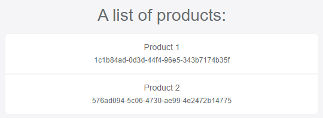

# Consuming gRPC Services from Blazor WebAssembly Application Using gRPC-Web

> **WARNING: I've demonstrated [Using gRPC with the ABP Framework](https://community.abp.io/posts/using-grpc-with-the-abp-framework-2dgaxzw3) in my latest post. If you haven't seen it, you should read it before this article, since this is a continuation of that article.**

In this second part, I will show how to consume the gRPC service from the Blazor WebAssembly application, using the gRPC-Web technology.

This will be a short article, based on Microsoft's [gRPC-Web in ASP.NET Core gRPC apps](https://learn.microsoft.com/en-us/aspnet/core/grpc/grpcweb) and [Code-first gRPC services and clients with .NET](https://learn.microsoft.com/en-us/aspnet/core/grpc/code-first) documents. For more information, I suggest to check these documents. Let's get started...

## Configuring the Server Side

First of all, the server-side should support gRPC-Web. Follow the steps below to enable it:

### Add Grpc.AspNetCore.Web Package

Add [Grpc.AspNetCore.Web](https://www.nuget.org/packages/Grpc.AspNetCore.Web) NuGet package to the `ProductManagement.HttpApi.Host` project.

### Add GrpcWeb Middleware

Add the following line just before the `app.UseConfiguredEndpoints(...)` line to add the GrpcWeb middleware to your ASP.NET Core request pipeline:

````csharp
app.UseGrpcWeb(new GrpcWebOptions { DefaultEnabled = true });
````

### Configure Cors

ABP's startup template already configures Cors when you create a new solution. However, we need to allow some extra headers in our Cors configuration.

Add the following line just after the `.WithAbpExposedHeaders()` line in the `OnApplicationInitialization` method of the `ProductManagementHttpApiHostModule` class:

````csharp
.WithExposedHeaders("Grpc-Status", "Grpc-Message", "Grpc-Encoding", "Grpc-Accept-Encoding")
````

Finally, call `RequireCors` extension method just after the `MapGrpcService` calls:

````csharp
app.UseConfiguredEndpoints(endpoints =>
{
    endpoints
        .MapGrpcService<IProductAppService>()
        .RequireCors("__DefaultCorsPolicy"); // Configure Cors for the product service
});
````

`__DefaultCorsPolicy` may seem a magic string here. Let me explain it: ABP startup template configures the default Cors policy with the `context.Services.AddCors(...)` method (you can see it in the source code). If we define a named policy, we should use the same name here. However, when we don't specify, ASP.NET Core uses `__DefaultCorsPolicy` as the policy name by default. If you don't want to use the magic string, you can resolve the `IOptions<CorsOptions>` service and get the `DefaultPolicyName` from the `CorsOption` object.

Anyway, that's all on the server-side. We can work on he client now.

## Configuring the Client Side

`ProductManagement.Blazor` is the Blazor WebAssembly application in the solution I'd created in the [first article](https://community.abp.io/posts/using-grpc-with-the-abp-framework-2dgaxzw3). We will configure that project to be able to consume the server-side gRPC services from our Blazor application.

### Add Client-side Nuget Packages

Add [Grpc.Net.Client](https://www.nuget.org/packages/Grpc.Net.Client), [Grpc.Net.Client.Web](https://www.nuget.org/packages/Grpc.Net.Client.Web) and [protobuf-net.Grpc](https://www.nuget.org/packages/protobuf-net.Grpc) NuGet packages to the `ProductManagement.Blazor` project. We are ready to consume the gRPC services.

### Consume the Product Service

Change the `Pages/Index.razor.cs` file's content with the following code block:

````csharp
using System.Collections.Generic;
using System.Net.Http;
using System.Threading.Tasks;
using Grpc.Net.Client;
using Grpc.Net.Client.Web;
using ProductManagement.Products;
using ProtoBuf.Grpc.Client;

namespace ProductManagement.Blazor.Pages;

public partial class Index
{
    private List<ProductDto> Products { get; set; } = new();

    protected override async Task OnInitializedAsync()
    {
        var channel = GrpcChannel.ForAddress("https://localhost:10042", new GrpcChannelOptions
        {
            HttpHandler = new GrpcWebHandler(new HttpClientHandler())
        });

        var productAppService = channel.CreateGrpcService<IProductAppService>();
        Products = await productAppService.GetListAsync();
    }
}
````

* We've created a gRPC channel for the server-side endpoint (surely, you get the address from a configuration) with channel options by specifying that we will use the `GrpcWebHandler`.
* We've created a service proxy object using the `CreateGrpcService` extension method that is defined by the [protobuf-net.Grpc](https://www.nuget.org/packages/protobuf-net.Grpc) NuGet package.
* We've used the service proxy object, `productAppService`, to consume remote endpoint just like a local service.

That's all. If we want to show the products on the page, we can add the following markup into the `Pages/Index.razor` view:

````xml
<h2>A list of products:</h2>

<ul class="list-group">
    @foreach(var product in Products)
    {
        <li class="list-group-item">
            @product.Name <br/>
            <small>@product.Id.ToString()</small>
        </li>
    }
</ul>
````

Run the applications (first run the `ProductManagement.HttpApi.Host` project, then run the `ProductManagement.Blazor` project in the solution) to see it in action:



## Conclusion

In the first part of this article, I'd demonstrated how to implement a gRPC service and consume it in a client application, using the [code-first approach](https://docs.microsoft.com/en-us/aspnet/core/grpc/code-first). In this article, I've demonstrated how to consume the same gRPC service from a Blazor WebAssembly application, using the [gRPC-Web](https://learn.microsoft.com/en-us/aspnet/core/grpc/grpcweb) technology. As you see in these two articles, using gRPC with the ABP Framework is straightforward.

## The Source Code 

- You can find the completed source code here: https://github.com/abpframework/abp-samples/tree/master/GrpcDemo2
- You can also see all the changes I've done in this article here: https://github.com/abpframework/abp-samples/pull/201/files