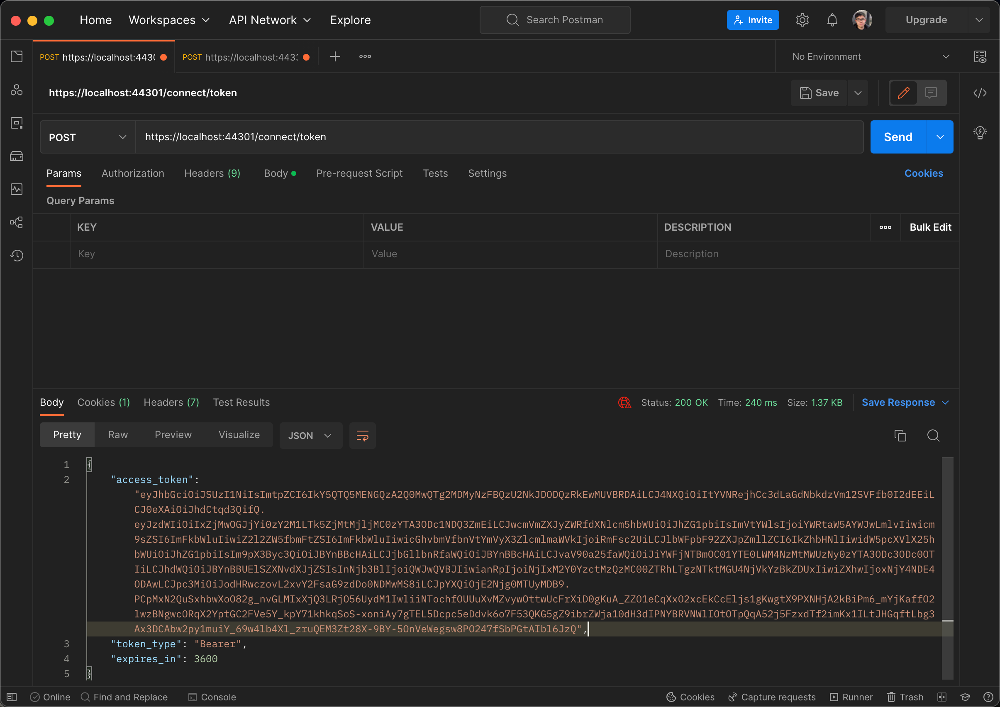
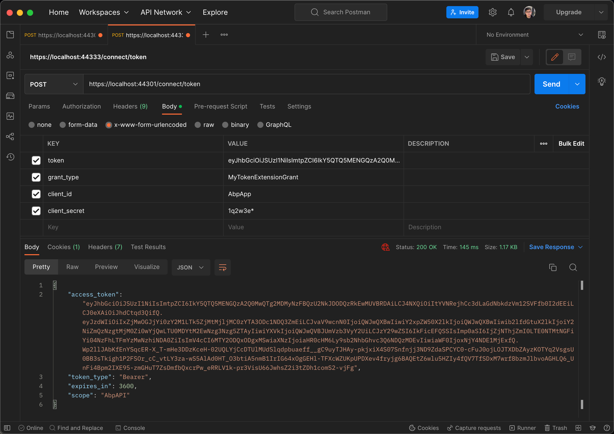

# How to add a custom grant type in OpenIddict

## ITokenExtensionGrant

Create a class that inherits `ITokenExtensionGrant`, and then register it with the framework. 

In the `MyTokenExtensionGrant` class below we try to get the token details, The `ForbidResult` handles the failure case and `SignInResult` returns a new token response, You can pass more parameters to implement business checks.

```cs
public class MyTokenExtensionGrant : ITokenExtensionGrant
{
    public const string ExtensionGrantName = "MyTokenExtensionGrant";

    public string Name => ExtensionGrantName;
    public async Task<IActionResult>  HandleAsync(ExtensionGrantContext context)
    {
        var userToken = context.Request.GetParameter("token").ToString();

        if (string.IsNullOrEmpty(userToken))
        {
            return new ForbidResult(
                new[] {OpenIddictServerAspNetCoreDefaults.AuthenticationScheme},
                properties: new AuthenticationProperties(new Dictionary<string, string>
                {
                    [OpenIddictServerAspNetCoreConstants.Properties.Error] = OpenIddictConstants.Errors.InvalidRequest
                }!));
        }

        var transaction = await context.HttpContext.RequestServices.GetRequiredService<IOpenIddictServerFactory>().CreateTransactionAsync();
        transaction.EndpointType = OpenIddictServerEndpointType.Introspection;
        transaction.Request = new OpenIddictRequest
        {
            ClientId = context.Request.ClientId,
            ClientSecret = context.Request.ClientSecret,
            Token = userToken
        };

        var notification = new OpenIddictServerEvents.ProcessAuthenticationContext(transaction);
        var dispatcher = context.HttpContext.RequestServices.GetRequiredService<IOpenIddictServerDispatcher>();
        await dispatcher.DispatchAsync(notification);

        if (notification.IsRejected)
        {
            return new ForbidResult(
                new []{ OpenIddictServerAspNetCoreDefaults.AuthenticationScheme },
                properties: new AuthenticationProperties(new Dictionary<string, string>
                {
                    [OpenIddictServerAspNetCoreConstants.Properties.Error] = notification.Error ?? OpenIddictConstants.Errors.InvalidRequest,
                    [OpenIddictServerAspNetCoreConstants.Properties.ErrorDescription] = notification.ErrorDescription,
                    [OpenIddictServerAspNetCoreConstants.Properties.ErrorUri] = notification.ErrorUri
                }));
        }

        var principal = notification.GenericTokenPrincipal;
        if (principal == null)
        {
            return new ForbidResult(
                new []{ OpenIddictServerAspNetCoreDefaults.AuthenticationScheme },
                properties: new AuthenticationProperties(new Dictionary<string, string>
                {
                    [OpenIddictServerAspNetCoreConstants.Properties.Error] = notification.Error ?? OpenIddictConstants.Errors.InvalidRequest,
                    [OpenIddictServerAspNetCoreConstants.Properties.ErrorDescription] = notification.ErrorDescription,
                    [OpenIddictServerAspNetCoreConstants.Properties.ErrorUri] = notification.ErrorUri
                }));
        }

        var userId = principal.FindUserId();
        var userManager = context.HttpContext.RequestServices.GetRequiredService<IdentityUserManager>();
        var user = await userManager.GetByIdAsync(userId.Value);
        var userClaimsPrincipalFactory = context.HttpContext.RequestServices.GetRequiredService<IUserClaimsPrincipalFactory<IdentityUser>>();
        var claimsPrincipal = await userClaimsPrincipalFactory.CreateAsync(user);
        claimsPrincipal.SetScopes(principal.GetScopes());
        claimsPrincipal.SetResources(await GetResourcesAsync(context, principal.GetScopes()));

        //abp version < 7.3
        await context.HttpContext.RequestServices.GetRequiredService<AbpOpenIddictClaimDestinationsManager>().SetAsync(claimsPrincipal);

        //For abp version >= 7.3
        await context.HttpContext.RequestServices.GetRequiredService<AbpOpenIddictClaimsPrincipalManager>().HandleAsync(context.Request, claimsPrincipal);

        return new SignInResult(OpenIddictServerAspNetCoreDefaults.AuthenticationScheme, claimsPrincipal);
    }

    private async Task<IEnumerable<string>> GetResourcesAsync(ExtensionGrantContext context, ImmutableArray<string> scopes)
    {
        var resources = new List<string>();
        if (!scopes.Any())
        {
            return resources;
        }

        await foreach (var resource in context.HttpContext.RequestServices.GetRequiredService<IOpenIddictScopeManager>().ListResourcesAsync(scopes))
        {
            resources.Add(resource);
        }
        return resources;
    }
}
```

```cs
public override void PreConfigureServices(ServiceConfigurationContext context)
{
    //...
    PreConfigure<OpenIddictServerBuilder>(builder =>
    {
        builder.Configure(openIddictServerOptions =>
        {
            openIddictServerOptions.GrantTypes.Add(MyTokenExtensionGrant.ExtensionGrantName);
        });
    });
    //...
}

public override void ConfigureServices(ServiceConfigurationContext context)
{
    //...
    Configure<AbpOpenIddictExtensionGrantsOptions>(options =>
    {
        options.Grants.Add(MyTokenExtensionGrant.ExtensionGrantName, new MyTokenExtensionGrant());
    });
    //...
}
```






## Source code

https://github.com/abpframework/abp/commit/3210f138454697647689b4868c8d4b7b3da02d44


