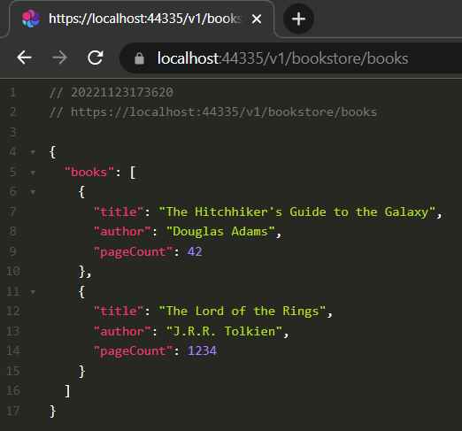

# gRPC - JSON Transcoding

In this article, I'll show you one of the new features that came with .NET 7: **JSON Transcoding**. 

> I've created a community article to highlight some interesting features (briefly) that are now available with the release of .NET 7. You can check it from [here](https://community.abp.io/posts/whats-new-with-.net-7-tlq2g43w).

## What is gRPC? What are the pros and cons?

[gRPC](https://grpc.io/) is a high-performance RPC framework and uses HTTP/2 and Protobuf (protocol buffers).

### gRPC - Advantages

* **Lightweight messages**: Payload is much smaller than JSON.
* **High performance**: Much faster than REST and JSON communication.
* **Faster serialization/deserialization**: Protobufs are binary encoded. This means that it will use fewer CPU cycles to serialize/deserialize the messages.

### gRPC - Disadvantages

* **Lack of maturity**
* **Limited browser support - hard to test (in a way)**: Since gRPC relies on HTTP/2, you can’t call a gRPC service from a web browser directly. This is where JSON Transcoding comes into play.

## What is JSON Transcoding?

Despite the benefits that gRPC provides, REST APIs have an important place in modern web applications. We can easily create, expose and test them. 

On the other hand, gRPC services are not easy to test as mentioned above. We can’t access a gRPC service yet through the browser since browsers don’t understand binary protocols. We need to use some tools to access endpoints, such as [gRPCurl](https://github.com/fullstorydev/grpcurl).


JSON Transcoding is an extension for ASP.NET Core that creates RESTful JSON APIs for gRPC services and overcomes this problem. You can see an illustration down below:


By using JSON Transcoding, we can expose our gRPC services and access them via HTTP call. Let's see it in action.

## Creating & Exposing gRPC Services in ABP Based Applications

> You can find the source code of the application at https://github.com/EngincanV/abp-grpc-json-transcoding.

### Creating the Application

Create an empty folder, open a command-line terminal and type the following command in the terminal window to create a new ABP solution using the ABP CLI:

```csharp
abp new BookStore -t app --ui angular --preview
```

I've created an application with the Angular UI, but the UI is not important for this tutorial, you can select your favorite UI.

> **Note:** Your application should be ABP 7.0+.

### Configuring gRPC & JSON Transcoding

In this solution, `*.HttpApi.Host` is the project that configures and runs the server-side application. So, we will make changes in that project.

First, we need to add two packages ([Grpc.AspNetCore](https://www.nuget.org/packages/Grpc.AspNetCore) and [Microsoft.AspNetCore.Grpc.JsonTranscoding](https://www.nuget.org/packages/Microsoft.AspNetCore.Grpc.JsonTranscoding)) into this project with the following commands:

```bash
dotnet add package Grpc.AspNetCore 
dotnet add package Microsoft.AspNetCore.Grpc.JsonTranscoding
```

Then, add the [*google/api/http.proto*](https://github.com/dotnet/aspnetcore/blob/main/src/Grpc/JsonTranscoding/test/testassets/Sandbox/google/api/http.proto) and [*google/api/annotations.proto*](https://github.com/dotnet/aspnetcore/blob/main/src/Grpc/JsonTranscoding/test/testassets/Sandbox/google/api/annotations.proto) files under to the **google/api** folder. These files are required for JSON Transcoding and contain all the stuff related to that.


Then, open the module class (`BookStoreHttpApiHostModule.cs`) and update it as below:

```csharp
public class BookStoreHttpApiHostModule : AbpModule
{
    public override void ConfigureServices(ServiceConfigurationContext context)
    {
        // other configurations...

        context.Services.AddGrpc().AddJsonTranscoding(); //add this line

    }

    public override void OnApplicationInitialization(ApplicationInitializationContext context)
    {
        var app = context.GetApplicationBuilder();
        
        // other middlewares...

        app.UseConfiguredEndpoints(builder =>
        {
            builder.MapGrpcService<BookAppService>(); //add this line
        });
    }
}
```

* Here, we've registered the related gRPC services into the DI container by calling the `AddGdpr()` and `AddJsonTranscoding()` methods.
* Also, we've defined our gRPC service: `BookAppService`. We have not created this service yet and will create it in the next section.

So far, we've added the required packages to our project and made the related configurations. Now we can start creating our gRPC services.

### Implementing gRPC Services

Create a **Protos** folder and define a `bookstore.proto` file in it. Then fill it with the below content:

```proto
syntax = "proto3";

import "google/api/annotations.proto"; //import related Google APIs

option csharp_namespace = "BookStore";

message Book {
    string title = 1;
    string author = 2;
    int32 page_count = 3;
    optional string language = 4;
}

message GetBookListRequest {}

message GetBookListResponse { repeated Book books = 1; }

service BookApp {
    rpc GetBookList(GetBookListRequest) returns (GetBookListResponse) {
        option (google.api.http) = {
            get: "/v1/book-store/books" //expose from this url
        };
    }
}
```

* Here, we've defined the `bookstore.proto` file. You can consider this file as a contract that the server and client have agreed on.
* An important point here, we've imported the `google/api/annotations.proto` (we added this file under the **google/api** folder in the previous section) and by using the `google.api.http` we are exposing this gRPC service (with the specified URL). 
* So, when we run the application we can send a request to that endpoint and see the result. 
* Thanks to JSON Transcoding, we don't need to use any other tools to test our gRPC services anymore!

Let's mark the `bookstore.proto` file as our protobuf file in the `*.HttpApi.Host.csproj` file:

```xml
  <ItemGroup>
    <Protobuf Include="Protos\bookstore.proto" GrpcServices="Server" />
  </ItemGroup>
```

For the final step, we just need to define a service that corresponds to the service that we've defined in the `bookstore.proto` file. Voilà 🎉!

So, create a new class named `BookAppService` under the `Services` folder:

```csharp
using System.Threading.Tasks;
using Grpc.Core;

namespace BookStore.Services;

public class BookAppService : BookApp.BookAppBase
{
    //notice: we did not create GetBookListResponse and GetBookListRequest classes
    //Grpc.AspNetCore package did behalf of us
    public override Task<GetBookListResponse> GetBookList(GetBookListRequest request, ServerCallContext context)
    {
        var response = new GetBookListResponse();
        response.Books.Add(new Book
        {
            Title = "The Hitchhiker's Guide to the Galaxy",
            Author = "Douglas Adams",
            PageCount = 42
        });
        response.Books.Add(new Book
        {
            Title = "The Lord of the Rings",
            Author = "J.R.R. Tolkien",
            PageCount = 1234
        });
        
        return Task.FromResult(response);
    }
}
```

* Here, as you notice we've inherited our service from the `BookAppBase` class. You might wonder where it came from.
* The **Grpc.AspNetCore** package creates auto-generated classes from our protobuf file (`bookstore.proto`). We just need to inherit from `BookAppService` class (it's matched with the service name that we've defined in protobuf file), override the `GetBookList` method and implement it. That's it.
* Also, notice we did not create the other classes such as `Book`, `GetBookListRequest` and `GetBookListResponse`. These are all auto-generated from our protobuf file.

We've created a gRPC service and now let's run our application (before running the application, run the `*.DbMigrator` project to create the database and seed the initial data) and see it in action.



## Conclusion 

In this article, I've briefly introduced the JSON Transcoding feature that was shipped with .NET 7 and showed it in an ABP Based application.

> See the [gRPC JSON transcoding in ASP.NET Core gRPC apps](https://learn.microsoft.com/en-us/aspnet/core/grpc/json-transcoding?view=aspnetcore-7.0) documentation for more information.

## References

* https://devblogs.microsoft.com/dotnet/announcing-grpc-json-transcoding-for-dotnet/
* https://learn.microsoft.com/en-us/aspnet/core/release-notes/aspnetcore-7.0?view=aspnetcore-7.0#json-transcoding
* https://learn.microsoft.com/en-us/aspnet/core/grpc/json-transcoding?view=aspnetcore-7.0
* https://sahansera.dev/building-grpc-server-dotnet/
