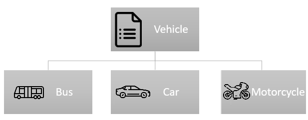

# Inheritance Strategies in Entity Framework Core 7

In this article, I'll show you all the object mapping strategies of EF Core and especially the new one: **TPC Inheritance Mapping**.  TPC mapping is the new feature introduced with Entity Framework Core 7. It's called Table Per Concrete type inheritance mapping. I'll explain the EF Core's inheritance mapping strategies with how the inherited entity and the specific information are saved into a relational database. I'll also explain which strategy is best for your case.

By default, EF Core maps an inheritance hierarchy of .NET types to a single database table. And it's called TPH (table-per-hierarchy) mapping.

In the previous versions EF Core , Table Per Hierarchy (TPH) or Table Per Type (TPT) were supported. And now TPC came!

To explain in a more clear way, I'll use the following entity model.
`Car`, `Bus` and `Motorcylce` are inherited from the `Vehicle` object. 

```csharp
public abstract class Vehicle
{
    public int Id { get; set; }
    public string VehicleModel { get; set; }
}

//////////////////////////////////////

public class Car : Vehicle
{
    public string Segment { get; set; }
}

//////////////////////////////////////

public class Bus : Vehicle
{
    public int? SeatCount { get; set; }
}

//////////////////////////////////////

public class Motorcycle : Vehicle
{
    public int CylinderCount { get; set; }
}
```




Here's the list of available strategies to map `Car`, `Bus` and `Motorcylce`:

## TPH (Table Per Hierarchy)

TPH maps an inheritance hierarchy of .NET types to **a single database table**. So a single table is created for all types. This is the default behavior of EF Core. If you explicitly want to use this strategy, you can write `UseTphMappingStrategy()` to the root entity in the `OnModelCreating()` method in the `DbContext` class.  As you see from the following table, it adds an extra column, `Discriminator` to separate the `Car`, `Bus` and `Motorcycle`. This way of persistence is an unnormalized form.

```sql
CREATE TABLE [Vehicles] (
    [Id] int NOT NULL IDENTITY,   
    [Discriminator] nvarchar(max) NOT NULL,  -- "Car", "Bus", "Motorcylce"
    [VehicleModel] nvarchar(max) NOT NULL,
    [Segment] nvarchar(max) NULL,
    [SeatCount] int NULL,
    [CylinderCount] int NOT NULL
);
```

## TPT (Table per Type)

With the TPT strategy, a different table is created for every type. The table itself is used to determine the type of the object saved, and each table contains only columns for the properties of that type. The data is saved in multiple tables, and this way of persistence is normalized form.

```sql
CREATE TABLE [Vehicles] (
    [Id] int NOT NULL IDENTITY,
    [VehicleModel] nvarchar(max) NOT NULL
); 

CREATE TABLE [Car] (
    [Id] int NOT NULL,
    [Segment] nvarchar(max) NULL
);

CREATE TABLE [Bus] (
    [Id] int NOT NULL,
    [SeatCount] int NULL,
);

CREATE TABLE [Motorcycle] (
    [Id] int NOT NULL,
    [CylinderCount] int NOT NULL
);
```

If you explicitly want to use this strategy, you can write `UseTptMappingStrategy()` to the root entity in the `OnModelCreating()` method in the `DbContext` class. 

## TPC (Table Per Concrete type)

It's the new strategy that has been introduced with EF Core 7. In this way, a different table is created for each concrete type. While in the TPT, the table itself indicates the type of the object saved, in TPC, each table contains columns for every property in the concrete type *and its base types*. As you see from the following tables, no `Vehicles` table is being created. The `VehicleModel` field is common in each table.

 

```sql
CREATE TABLE [Car] (
    [Id] int NOT NULL DEFAULT (NEXT VALUE FOR [VehicleIds]),
    [VehicleModel] nvarchar(max) NOT NULL, -- common field for each type
    [Segment] nvarchar(max) NULL
);

CREATE TABLE [Bus] (
    [Id] int NOT NULL DEFAULT (NEXT VALUE FOR [VehicleIds]),
    [VehicleModel] nvarchar(max) NOT NULL, -- common field for each type
    [SeatCount] int NULL 
);

CREATE TABLE [Motorcycle] (
    [Id] int NOT NULL DEFAULT (NEXT VALUE FOR [VehicleIds]),
    [VehicleModel] nvarchar(max) NOT NULL, -- common field for each type
    [CylinderCount] int NOT NULL
);
```

This strategy maps each .NET type to **a different database table**. You write `UseTpcMappingStrategy()` to the root entity in the root entity in the `OnModelCreating()` method in the `DbContext` class.


## How do you choose which mapping type is best for you?

* **TPH:** In most cases, the TPH mapping is a good choice which is the default one. This way, the table columns increase because all the properties are saved in the same table, but it's easy to query in a single table.

* **TPT**  In this form, data is persisted in a normalized form. For this reason, you can choose TPT, but generally, it's not being used. But the disadvantage is when you filter by `VehicleModel` column, it must join `Vehicles`, `Bus`, `Car`, `Motorcycle` tables. So it's not a feasible fetching way.
* **TPC:** This new strategy is similar to TPT but resolves some of the TPT problems. Because it stores the data in its own table, it doesn't divide across multiple tables. This option can be chosen when the mapped hierarchy is large and has many concrete types, each with many properties.

For example, if `Car`, `Bus`, or `Motorcycle` have 20 properties for each type, then it's better to store them in a separate table, so we should use TPC. But if these entities have only 3-5 properties, then TPH is the way to go. 


> ### Jeremy Likness says;
>
> - If your code mostly queries entities of a single leaf type, then use TPC because the storage requirements are smaller since there are no null columns and no discriminator no index is ever needed on the discriminator column, which would slow down updates and possibly also queries. An index may not be needed when using TPH either, but that depends on various factors. If your code mostly queries for entities of many types, such as writing queries against the base type, lean towards TPH. If your database system supports it (for example SQL Server), then consider using sparse columns for columns that will be rarely populated. Use TPT only if constrained to do so by external factors.


*References:*

* https://devblogs.microsoft.com/dotnet/announcing-ef7-preview5/#primary-keys