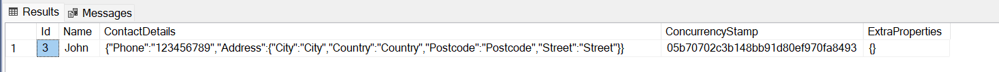

# JSON Columns in Entity Framework Core 7

In this article, we will see how to use the new **JSON Columns** features that came with EF Core 7 in an ABP based application (with examples).

## JSON Columns

Most relational databases support columns that contain JSON documents. The JSON in these columns can be drilled into with queries. This allows, for example, filtering and sorting by the elements of the documents, as well as projection of elements out of the documents into results. JSON columns allow relational databases to take on some of the characteristics of document databases, creating a useful hybrid between these two database management approaches.

EF7 contains provider-agnostic support for JSON columns, with an implementation for SQL Server. This support allows the mapping of aggregates built from .NET types to JSON documents. Normal LINQ queries can be used on the aggregates, and these will be translated to the appropriate query constructs needed to drill into the JSON. EF7 also supports updating and saving changes to JSON documents.

> You can find more information about JSON columns in EF Core's [documentation](https://docs.microsoft.com/en-us/ef/core/what-is-new/ef-core-7.0/whatsnew#json-columns).

### Mapping JSON Columns

In EF Core, aggregate types can be defined using `OwnsOne` and `OwnsMany` methods. `OwnsOne` can be used to map a single aggregate and the `OwnsMany` method can be used to map a collection of aggregates.

With EF 7, we have a new extension method for mapping  property to a JSON Column: `ToJson`. We can use this method to mark a property as a JSON Column. The property can be of any type that can be serialized to JSON.

The following example shows how to map a JSON column to an aggregate type:

```csharp	
public class ContactDetails
{
    public Address Address { get; set; }
    public string? Phone { get; set; }
}

public class Address
{
    public Address(string street, string city, string postcode, string country)
    {
        Street = street;
        City = city;
        Postcode = postcode;
        Country = country;
    }

    public string Street { get; set; }
    public string City { get; set; }
    public string Postcode { get; set; }
    public string Country { get; set; }
}

public class Person : AggregateRoot<int>
{
    public string Name { get; set; } = null!;
    public ContactDetails ContactDetails { get; set; } = null!;
}
```

* Above, we have defined an aggregate type `ContactDetails` that contains an `Address` and a `Phone` number. The aggregate type is configured in `OnModelCreating` using `OwnsOne` and `ToJson` methods below. 
* The `Address` property is mapped to a JSON column using `ToJson`, and the `Phone` property is mapped to a regular column. This requires just one call to **ToJson()** when configuring the aggregate type:

```csharp	

public class MyDbContext : AbpDbContext<MyDbContext>
{
    public DbSet<Person> Persons { get; set; }

    public MyDbContext(DbContextOptions<MyDbContext> options)
        : base(options)
    {
    }

    protected override void OnModelCreating(ModelBuilder builder)
    {
        base.OnModelCreating(builder);

        builder.Entity<Person>(b =>
        {
            b.ToTable(MyProjectConsts.DbTablePrefix + "Persons", MyProjectConsts.DbSchema);
            b.ConfigureByConvention();
            b.OwnsOne(x=>x.ContactDetails, c =>
            {
                c.ToJson(); //mark as JSON Column
                c.OwnsOne(cd => cd.Address);
            });
        });
    }
}
```

### Querying JSON Columns

Queries into JSON columns work just the same as querying into any other aggregate type in EF Core. That's it, just use the LINQ! Here are some examples:

```csharp
var persons = await (await GetDbSetAsync()).ToListAsync();

var contacts = await (await GetDbSetAsync()).Select(person => new
{
    person,
    person.ContactDetails.Phone, //query over JSON column
    Addresses = person.ContactDetails.Address //query over JSON column
}).ToListAsync();

var addresses = await (await GetDbSetAsync()).Select(person => new
{
    person,
    Addresses = person.ContactDetails.Address //query over JSON column
}).ToListAsync();
```

### Updating JSON Columns

You can update JSON columns the same as updating any record by using the `UpdateAsync` method. The following example shows how to update a JSON column:

```csharp
var person = await (await GetDbSetAsync()).FirstAsync();

person.ContactDetails.Phone = "123456789";
person.ContactDetails.Address = new Address("Street", "City", "Postcode", "Country");
await UpdateAsync(person, true);
```

### JSON Column in a Database

After you've configured the database relations, created a new migration and applied it to database you will have a database table like below:



As you can see, thanks to JSON Columns feature the **ContactDetails** row has JSON content and we can use it in a query or update it from our application with the LINQ JSON query support that mentioned above.

### Conclusion

In this article, I've briefly introduced the JSON Columns feature that was shipped with EF Core 7. It's pretty straightforward to use JSON Columns in an ABP based application. You can see the examples above and give it a try!

### The Source Code
* You can find the full source code of the example application [here](https://github.com/abpframework/abp-samples/tree/master/EfCoreJSONColumnDemo).

### References

* [https://docs.microsoft.com/en-us/ef/core/what-is-new/ef-core-7.0/whatsnew#json-columns](https://docs.microsoft.com/en-us/ef/core/what-is-new/ef-core-7.0/whatsnew#json-columns)
* [https://docs.microsoft.com/en-us/ef/core/modeling/owned-entities](https://docs.microsoft.com/en-us/ef/core/modeling/owned-entities)