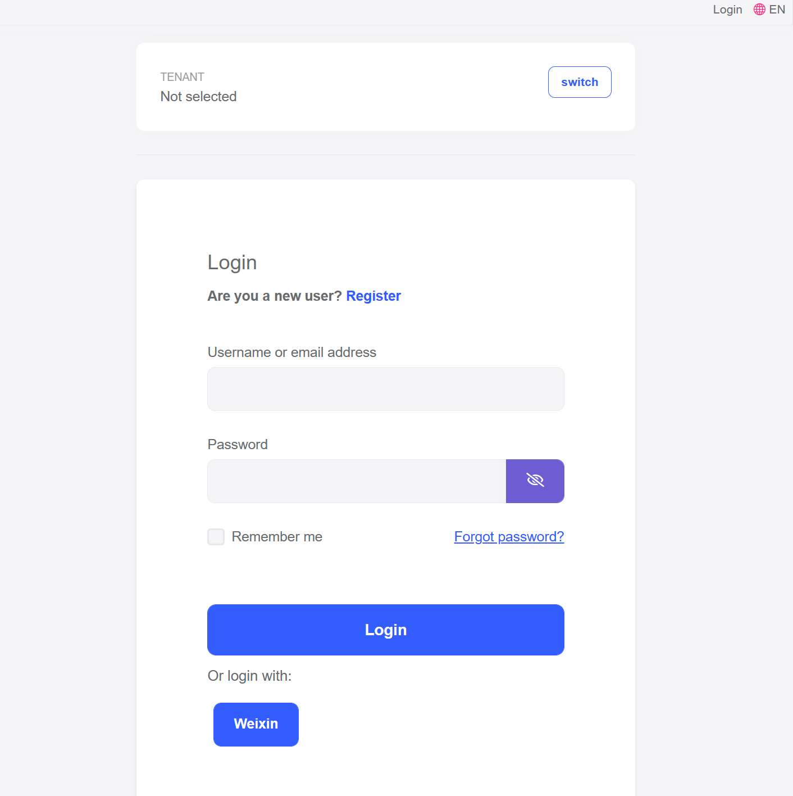
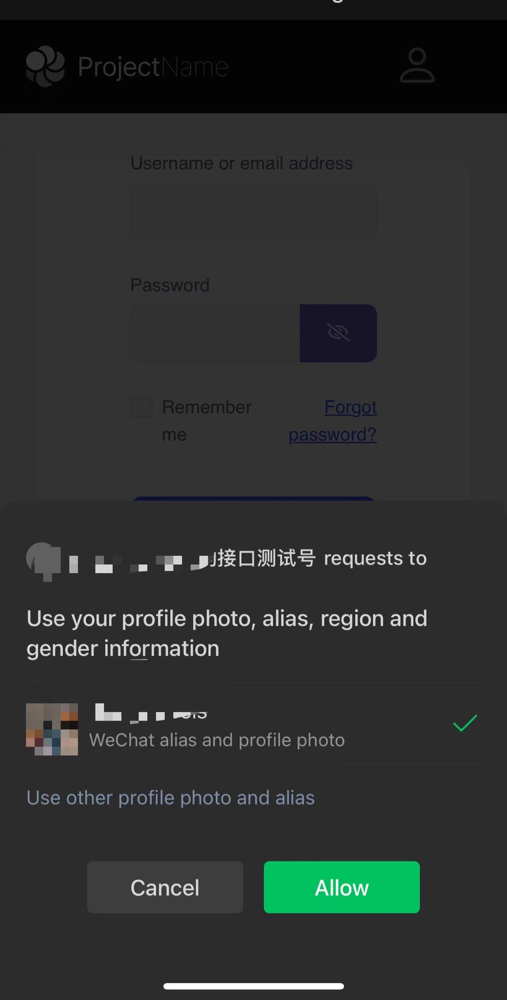

# How to Use the Weixin Authentication for MVC / Razor Page Applications

This guide demonstrates how to integrate Weixin to an ABP application that enables users to sign in using OAuth 2.0 with credentials.

## Create a sandbox account

If you don't have a production account, you can create a sendbox account for testing: https://mp.weixin.qq.com/debug/cgi-bin/sandboxinfo?action=showinfo&t=sandbox/index

In this article we will use the sandbox account.

> You should configure the callback domain name on the Weixin open platform

## AddWeixin

You need to install `AspNet.Security.OAuth.Weixin` package to your **.Web** project.

In your **.Web** project, locate your **ApplicationWebModule** and modify `ConfigureAuthentication` method with the following:

```csharp
private void ConfigureAuthentication(ServiceConfigurationContext context)
{
    var configuration = context.Services.GetConfiguration();
    context.Services.ForwardIdentityAuthenticationForBearer(OpenIddictValidationAspNetCoreDefaults.AuthenticationScheme);
    context.Services.AddAuthentication()
        .AddWeixin(options =>
        {
            options.ClientId = configuration["Weixin:ClientId"];
            options.ClientSecret = configuration["Weixin:ClientSecret"];
        });
}
```

Updating `appsettings.json` to add `Weixin` section:

````json
  "Weixin": {
    "ClientId": "<your-app-id>",
    "ClientSecret": "<your-app-secret>"
  }
````

## Web page authorization

Now you can run the application to login with Weixin.



It will redirect to weixin platform to scan the QR code.

> The sandbox account lacks the necessary scope, so it may not work properly.

## Official account authorization

Updating `AddWeixin`:

```csharp
context.Services.AddAuthentication()
    .AddWeixin(options =>
    {
        options.ClientId = configuration["Weixin:ClientId"];
        options.ClientSecret = configuration["Weixin:ClientSecret"];
        options.AuthorizationEndpoint = "https://open.weixin.qq.com/connect/oauth2/authorize";
    });
```

Now you can use WeChat app to open the web application URL to login with weixin.

