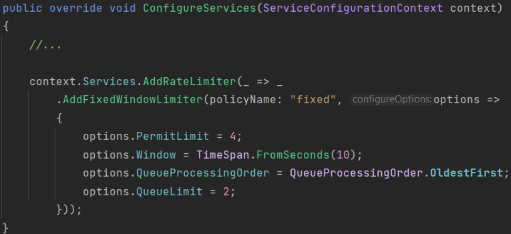
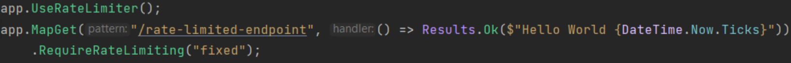
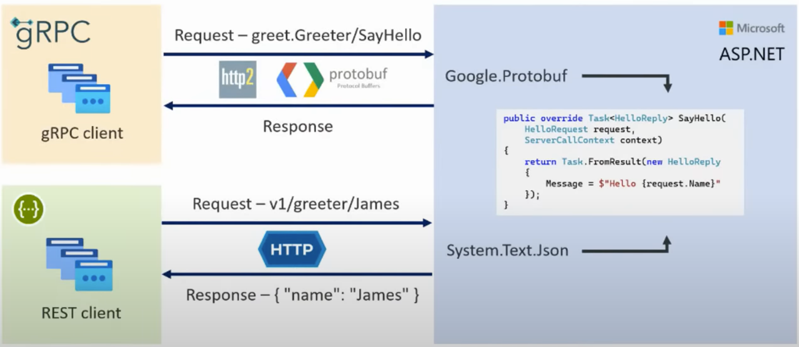
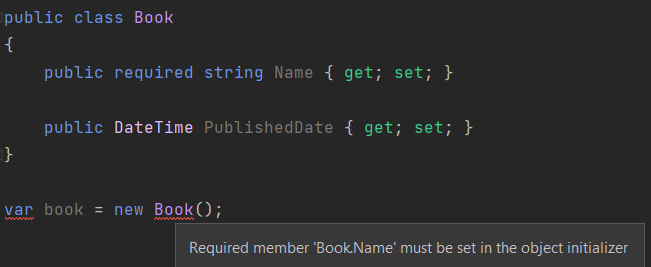
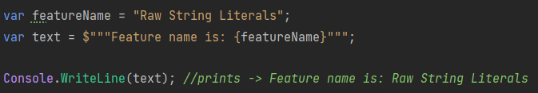
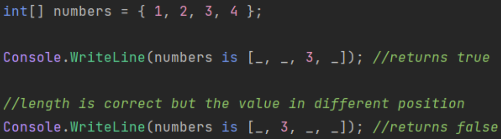
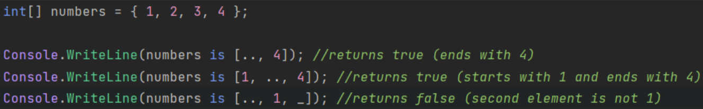
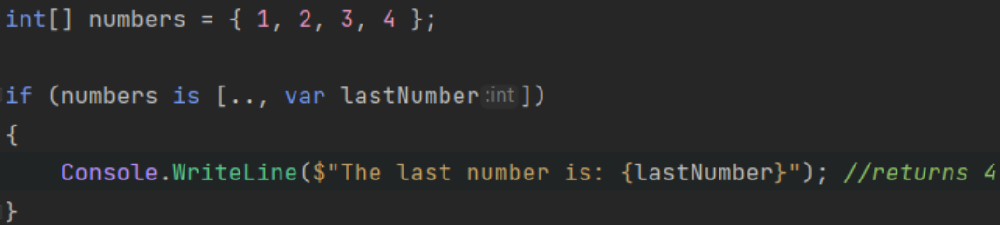
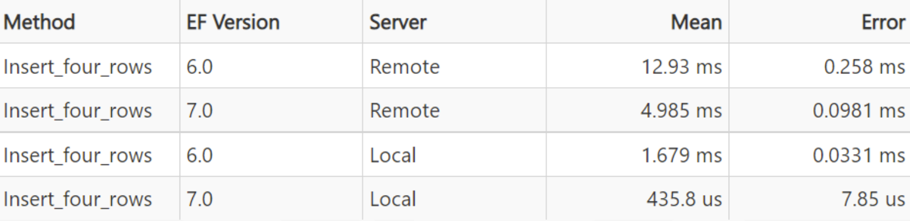

# What's new with .NET 7?

In this article, I will highligt a few interesting features that are now available with the release of C# 11 and .NET 7.

> If you are considering to use ABP 7.0, you should update your projects to .NET 7. There is a good community article you might want to check 👉 "[Upgrade Your Existing Projects to .NET7](https://community.abp.io/posts/upgrade-your-existing-projects-to-.net7-nmx6vm9m)".

There are many new features came with this release. We are going to examine new features within 4 sub-section: ASP.NET Core, C#11, EF 7 and MAUI. Let's start with ASP.NET Core.

## ASP.NET Core

We will see the following features in this section:

* Rate Limiting
* Output Caching
* Built-in HTTP/3 Support
* gRPC - JSON Transcoding
* Blazor
    * Custom Elements
    * Improvements on JavaScript Interop for WASM

### Rate Limiting

Rate limiting is a way to limit request frequency for a limit of time. Before, .NET 7 we weren’t have built-in support so we would needed to implement it ourselves or use some NuGet packages around or let the CDN provider do this on server level behalf of us (like Cloudflare).

With .NET 7, built-in Rate Limiting support have been added and we can easily define rate-limiting policies and attach them with our endpoints.

*Defining rate-limiting policy and registring the required services to DI container*:



*Adding the middleware to the request pipeline and using the defined policy*:



### Output Caching

Output Caching is a new middleware that provides a caching mechanism and allow to store results from your web application and serve them from a cache rather than computing everytime. This improves performance and frees up resources for other tasks.

It’s pretty straightforward to use output caching in minimal APIs. 
You just need to create an endpoint and use the `CacheOutput` method with an expire time. Then when someone sends a request to your endpoint, it will be cached for specified time and not calculate the result every time.

For the following example, result will be same for 10 minutes:

```csharp
app.MapGet("/cached-output", () => $"Minute: {DateTime.Now.Minute}")
    .CacheOutput(options => 
    {
        output.Expire(TimeSpan.FromMinutes(10));
    });
```

### Built-in HTTP/3 Support

In .NET 6, HTTP/3 was introduced for an experimental purposes and with .NET 7 now it’s fully supported. But it's not enabled by default, it's understandable since it's still new and only %20 of the applications currently uses it, on the other hand HTTP/2 uses by almost every application.

To enable the HTTP/3 support, we need to configure it our **Program.cs** file:

```csharp
var builder = WebApplication.CreateBuilder(args);

builder.WebHost.ConfigureKestrel((context, options) =>
{
    options.ListenAnyIP(5001, listenOptions =>
    {
        listenOptions.Protocols = HttpProtocols.Http1AndHttp2AndHttp3;
        listenOptions.UseHttps();
    });
});
```

### gRPC - JSON Transcoding

gRPC is a high-performance RPC framework and uses HTTP/2 and Protobuf. Despite the benefits that gRPC brings, REST APIs have an important place in modern web applications.

gRPC - JSON Transcoding is an extension for ASP.NET Core that creates RESTful JSON APIs for gRPC services.



It's really good feature and allow us to expose our gRPC services as REST APIs. It's worth checking out 👉 [JSON Transcoding](https://learn.microsoft.com/en-us/aspnet/core/grpc/json-transcoding?view=aspnetcore-7.0).

### Blazor

We are going to cover two new features for Blazor:

* Custom Elements
* Improvements on JavaScript Interop for WASM

#### Custom Elements

Blazor Custom Elements provide a way to dynamically render Razor Components from other SPA frameworks/libraries such as Angular and React.

To be able to use custom elements, there are two steps need to be done:

**1-) Registering a Razor Component as a Custom Element:**

```csharp
builder.Services.AddServerSideBlazor(options => 
{
    options.RootComponents.RegisterCustomElement<Counter>("my-counter");
});
```

**2-)Using the Custom Element**

```html
<my-counter increment-amount={incrementAmount} />
```

#### Improvements on JavaScript Interop for WASM

JavaScript `[JsImport]` / `[JsExport]` interop API released with .NET 7.

* To import a JS function to call it from C# -> `[JsImport]`
* To export a .NET method so that it can be called from JavaScript -> `[JsExport]` attributes should be used.

## C# 11

There are great features that came with C# 11. In this article, we are going to only cover the following ones:

* Required Members
* Generic Attributes
* Raw String Literals
* List Patterns

### Required Members

C# 11 introduces a new **required** keyword to allows us to ensure property initialization while object creation. 

We just need to use the **required** keyword before the property type. That’s it. Then if we try to create an object without initializing the required properties, compile-time errors will shown. 



### Generic Attributes

Generic Attributes is also one of the good features that came with C# 11. Before C#11, creating a typed attribute was cumbersome. We would need to pass **Type** object as argument to our constructor and assign it to a property in our attribute class and do stuff with this **Type** property.

With C#11, Generic Attributes is introduced. Now, it’s possible to easily create generic attributes like creating generic classes:

```csharp
//defining a generic attribute
public class GenericAttribute<T> : Attribute { }

//using the attribute
[GenericAttribute<int>]
public int MyMethod() => default;
```

### Raw String Literals

Raw String Literals is a great syntactic-sugar that came with C#11. It allows containing of arbitrary text without escaping. 

By wrapping a string with three double quotes (”””...”””), we are free to put any string value into variables:

```csharp
var jsonContent = """
{
    "name": ".NET 7",
    "feature": "Raw String Literals"
}
""";
```

Also, we can use string interpolation with this new syntax. We just need to add $ sign before the first triple quotes.



### List Patterns

C# 11 introduces the “List Pattern”. It expands the pattern matching for list and arrays. There are three different ways for list pattern matching:

#### 1-) Discard Pattern

This pattern can be helpful to match one or more elements from a sequence, if we know the length of the sequence.



#### 2-) Range Pattern

If the length of the sequence is not know, then range pattern may be useful. We can use this pattern to check the first or/and last element from a sequence.



#### 3-) var Pattern

This pattern allows us to capture a element at that position and use the variable in our code.



## Entity Framework Core 7

There are too many improvements and new features that shipped with EF Core 7. Here's what we are going to cover in this article:

* JSON Columns
* Improvements on Bulk Updates & Deletes
* Performance Improvements on SaveChanges & SaveChangesAsync

### JSON Columns

EF 7 supports JSON Columns and this allows mapping of aggregates built from .NET types to JSON documents. Thus, it's kind a combine relational database and document-based databases in a way.

We can easily mark a column as JSON column on the `OnModelCreating` method of our `DbContext` class:

```csharp
protected override void OnModelCreating(ModelBuilder modelBuilder)
{
    modelBuilder.Entity<Author>().OwnsOne(
        author => author.Contact, ownedNavigationBuilder =>
        {
            ownedNavigationBuilder.ToJson();

            ownedNavigationBuilder.OwnsOne(contactDetails => contactDetails.Address);
        });
}
```

Also with this version, LINQ JSON query support have been announced. So, we can query over JSON Columns using LINQ like below:

```csharp
var posts = await context.Posts
    .AsNoTracking()
    .Select(
        post => new
        {
            post.Author!.Name,
            post.Metadata!.Views,
            Searches = post.Metadata.TopSearches,
            Commits = post.Metadata.Updates
        })
    .ToListAsync();
```

### Improvements on Bulk Updates & Deletes

EF 7 introduces the new **ExecuteUpdateAsync** and **ExecuteDeleteAsync** methods. By using these methods while making bulk updates or deletes, we can not involving the change tracker into this process and this brings great performance gains. 

Example:

```csharp
await (await GetDbContextAsync()).Tags
    .Where(tag => tag.Description.Contains("ABP"))
    .ExecuteDeleteAsync();
```

### Performance Improvements on SaveChanges & SaveChangesAsync

With EF 7, there are significant performance improvements on SaveChanges & SaveChangesAsync methods. According to the EF Core team, in some cases saving changes are now four times faster that EF 6. You can see a simple benchmark result from the EF Core blog post in here. 



Even inserting just four records there is a great performance gain.

## .NET MAUI 7

As you know, .NET MAUI is a cross-platform framework for creating native mobile and desktop applications by using C# and XAML. By using the .NET MAUI, apps can be developed that can run on Android, IOS, macOS and Windows from a single-code base.

It’s a new technology, so it's evolving and .NET MAUI team introduces good features with every release.

In this article, I will only mention about a new feature called "Map Control" and some enhancements made with this release.

### Map Control

.NET MAUI 7 introduces the Map Control. This provides us a good native map experience.

It supports pins, poligons, circles, geolocations and much more...


### Improvements on Mobile Rendering & Desktop Enhancements

.NET MAUI 7 came with optimized rendering for mobile application and much faster than .NET MAUI 6.

Also, there are some good enhancements on the desktop side:

* Window size and position,
* Context Menus (which there was a kind of bug and was not seen on some MAUI Controls for Windows applications),
* Tooltips,
* Gestures and more...

---

## Conclusion 

In this article, I've highlighted some features that shipped with .NET 7.

> I'm adding references section down below, so you can check the references and see other features came with this version.

Thanks for reading the article and I hope you find it helpful. See you in the next one!

## References

* https://devblogs.microsoft.com/dotnet/announcing-dotnet-7/
* https://devblogs.microsoft.com/dotnet/announcing-asp-net-core-in-dotnet-7
* https://devblogs.microsoft.com/dotnet/announcing-ef7
* https://devblogs.microsoft.com/dotnet/dotnet-maui-dotnet-7
* https://devblogs.microsoft.com/dotnet/welcome-to-csharp-11
* https://www.milanjovanovic.tech/blog/whats-new-in-dotnet-7
