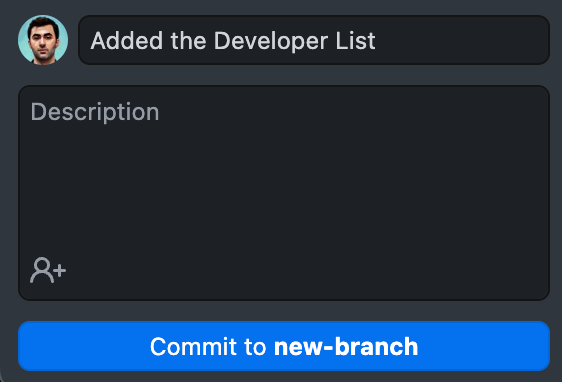
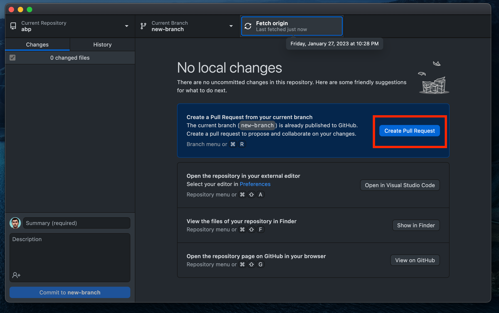
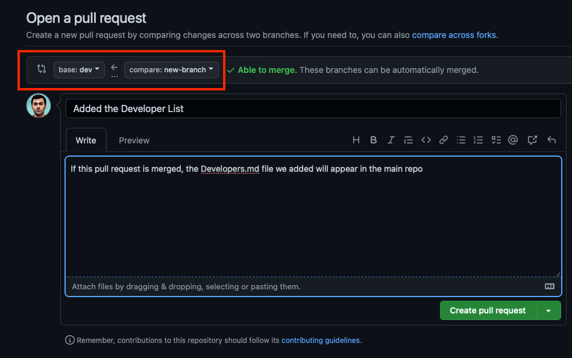

# How to Contribute to ABP Framework

## Introduction

In this article I will explain how you can contribute to the open source ABP Framework. You will not only learn about the ABP Framework, but also how to contribute to an open source project, what are the standard rules, some git operations, etc.

## What is Open Source?

Open source software is code designed to be publicly available. Anyone can view, use, modify and distribute the project and code. The fact that the code is open source makes it a natural community and open for improvement. This enables ideas and thoughts to spread rapidly.

## What is ABP Framework?

ABP Framework is a complete infrastructure for building modern web applications following the best practices and guidelines of software development. ABP Framework is completely free, [open source](https://github.com/abpframework) and community driven. ABP is a modular framework and Application Modules provide pre-built application functionalities.

## Before Contribution

Before making any changes and trying to push them to the target repository we need to create a new [issue](https://github.com/abpframework/abp/issues) if there are no issues with the work. If there is an existing issue, you can proceed through this issue. This way, no other developer will work on the same issue and your PR will have a better chance to be accepted.

Previous ABP Community Talk on this topic can be found [here](https://www.youtube.com/watch?v=Wz4Z-O-YoPg).

## GitHub Issues
You may want to fix a known bug or work on a planned enhancement. See the [issue list](https://github.com/abpframework/abp/issues) on GitHub.

## Feature Requests
If you have a feature idea for the framework or modules, create an issue on GitHub or attend an existing discussion. Then you can implement it if it's embraced by the community.

## How to Contribute to an Open Source Software?
There are some steps to contribute to OSS projects. You can follow the steps below.

## Step 1: Fork the Project

The first thing we need to do now is to fork the open source project. Forking will create a copy of the project in your own GitHub account. This will allow users to make changes to the code without affecting the original repository. Just press the fork key in the project.

After forking, it will create a new repo in your own GitHub profile.

## Step 2: Clone the Project

In order to develop the project, you need to clone it to your local. After clicking on the code button, select your preferred cloning method and copy the link. You can run the copied link on your local machine with the `git clone` command, but we will use GitHub Desktop. Press `Open with GitHub Desktop` and the repo will be installed on your local machine. 

or alternatively use the `git clone https://github.com/username/abp.git` command

## Step 3: Create a New Branch

In this step, you need to create a new branch of your own before you start developing it. Open the repo on GitHub Desktop and create a new branch. When creating a new branch, be careful which branch you create it on.

or alternatively use the `git checkout -b new-branch` command

## Step 4: Development

Choose a suitable IDE to develop on the new branch you created. In order not to complicate things, we will create a `Developers.md` file and process it. Let's enter a sample text in the Developers file.

As you can see, all changes made to the repo are reflected directly on GitHub Desktop.

## Step 5: Commit

The commit operation is used to save the changes you have made. It is useful to commit after certain operations are done in the project. It is useful to write a short sentence describing what you've done for the changes made in each commit. Press the `Commit to <branch-name>` button to commit. 

or alternatively use the `git add .` and `git commit -m "Added the Developer List"` command

## Step 6: Publish the Changes

The changes you have made so far are only visible on your local machine. You need to publish these changes to submit them to your forked repository. Please press the publish branch button to publish. 

or alternatively use the `git push origin new-branch` command

## Step 7: Create a Pull Request

After the push, the pull request `Create Pull Request` button will appear on GitHub Desktop. Click it and create a pull request.

You can also make a pull request from the repo in your GitHub profile.

Before creating the pull request, make sure that the branch you created is making changes to the correct branch. After briefly describing your changes in the title and description, click the `Create pull request` button. This will send a pull request to the original repository. If the pull request is approved and merged by the community, your changes will also appear in the main repository.

That's it! You have contributed your development to an open source project.

## Conclusion
In this article, I showed you how you could contribute to the ABP Framework, an open source and community driven project. Thank you for reading the article, I hope it was useful. See you soon!

## References
- https://opensource.guide/how-to-contribute/
- https://docs.abp.io/en/abp/latest/Contribution/Index

