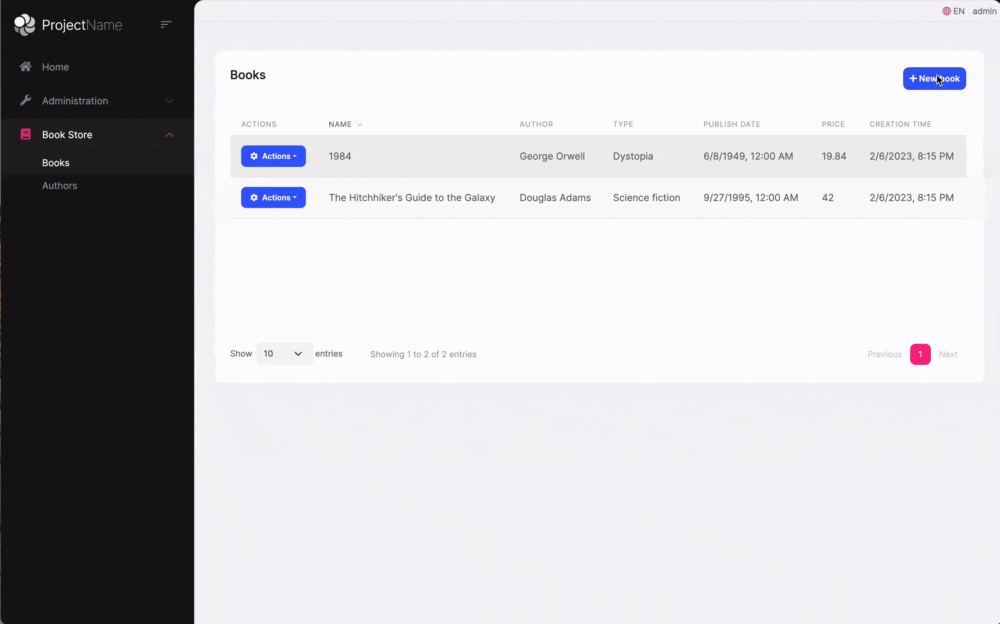
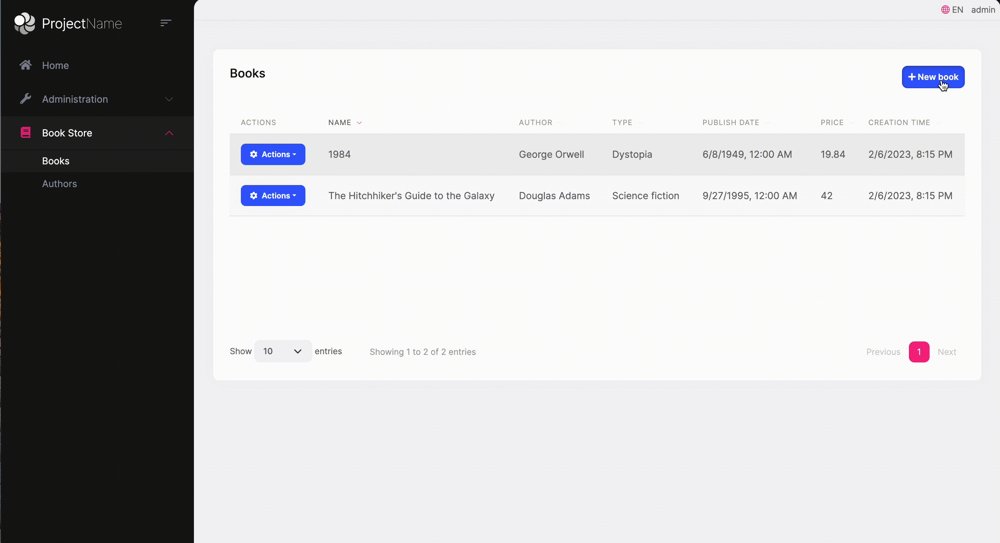

# Converting Create/Edit Modal to Page

In this document we will explain how to convert BookStore's `Books` create & edit modals to regular razor pages.

## Before


## Now


## Index page

Repalce `abp-button(NewBookButton)` buttom with `<a class="btn btn-primary" href="/Books/CreateModal"><i class="fa fa-plus"></i> @L["NewBook"].Value</a>`.

## Index js file

Remove the related codes of `createModal` and `editModal`.

Change the `Edit row action` with `location.href = "/Books/EditModal?id=" + data.record.id;`


## Create/Edit Book page

Remove `Layout = null;` and add some custom style and javascript code to `CreateModal.cshtml` & `EditModal.cshtml`.

```csharp
@section styles {
    <style>
        .abp-view-modal .modal {
                position: static;
                display: block;
                opacity: inherit !important;
        }
        .abp-view-modal .modal.fade .modal-dialog {
            transition: inherit !important;
            transform: inherit !important;;
        }
        .abp-view-modal .modal-header .btn-close {
            display: none;
        }
    </style>
}
@section scripts {
    <script>
        $(".abp-view-modal form").abpAjaxForm().on('abp-ajax-success', function () {
            location.href = "/Books";
        });
    </script>
}
```

Add a `div` element with `abp-view-modal` class to wrap the `abp-dynamic-form`, Set size of `abp-modal` to `ExtraLarge` and remove the `AbpModalButtons.Cancel` button from `abp-modal-footer`.

### CreateModal
```csharp
<div class="abp-view-modal">
    <abp-dynamic-form abp-model="Book" asp-page="/Books/CreateModal">
        <abp-modal static="true" size="ExtraLarge">
            <abp-modal-header title="@L["NewBook"].Value"></abp-modal-header>
            <abp-modal-body>
                <abp-form-content />
            </abp-modal-body>
            <abp-modal-footer buttons="@(AbpModalButtons.Save)"></abp-modal-footer>
        </abp-modal>
    </abp-dynamic-form>
</div>
```

### EditModal
```csharp
<div class="abp-view-modal">
    <abp-dynamic-form abp-model="Book" asp-page="/Books/EditModal">
        <abp-modal size="ExtraLarge">
            <abp-modal-header title="@L["Update"].Value"></abp-modal-header>
            <abp-modal-body>
                <abp-form-content />
            </abp-modal-body>
            <abp-modal-footer buttons="@(AbpModalButtons.Save)"></abp-modal-footer>
        </abp-modal>
    </abp-dynamic-form>
</div>
```

You can check this Git commit for details.

https://github.com/abpframework/abp-samples/commit/f3014e0ec422cb2d8816d0e00dd6ab9cc1adfc21
