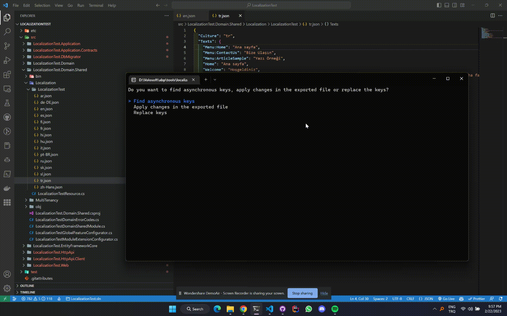
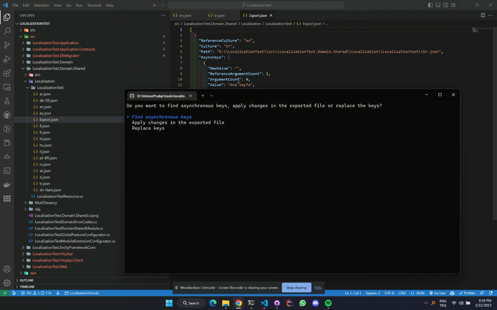
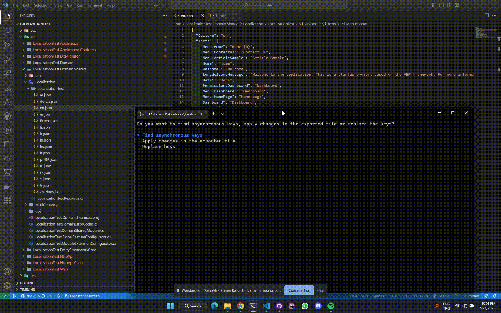

## Streamline Localization in Your ABP Project

Making localization changes to an ABP project can be a daunting task, especially if you're dealing with multiple languages and translations. During development, it's easy to overlook some changes and that leads to inconsistencies across different languages. Fortunately, I have developed a tool that can help streamline the localization process and ensure consistency across different languages.

The tool is a console application that uses JSON files to manage localization keys and their translations. It addresses three common scenarios that can arise during localization:

1. When the argument count of a key changes, it can be difficult to update the translations for all languages. My tool solves this problem by scanning all JSON files in the project folder and identifying any keys that have mismatched argument counts. It then offers two options to the user: delete the mismatched translations or export them as a JSON file for manual editing.

2. When a new key is added to the project, forgetting to add its translations to all the other languages is easy. My tool helps to avoid this issue by scanning the default language's JSON file and identifying any keys that don't have translations in other languages. It then exports these keys as a JSON file that can be used to add missing translations.

3. When a key's name is changed, it's important to update its translations in all the other languages. My tool makes this task simple by scanning all the JSON files in the project folder and updating any translations of the old key name with the new one.

The tool also includes an export feature that allows users to modify translations outside of the application and import them back into the JSON files.

## How it Helps

With my Localization Key Synchronizer tool, you can perform complex localization changes more quickly and easily than by manually sifting through files and making changes one-by-one. This can save you significant time and effort, especially if you're working with a large number of languages or translations.

## How it Works

When you run the Localization Key Synchronizer tool, it presents you with three options:

1. Find Asynchronous Keys
2. Apply Changes in the Exported File
3. Replace Keys

If you select "Find Asynchronous Keys," the tool prompts you to enter the default language path. Once you've entered the path, the tool displays all of the JSON files in the same folder as a multi-select list. After selecting one or more files, you are asked whether you want to find keys that do not match the number of arguments, missing keys, or both. If you select "Missing Keys," the tool prompts you to enter the absolute path to export the missing keys. After you've entered the path, the export process starts, and the tool closes.

If you select "Apply Changes in the Exported File" at the main menu, the tool prompts you to enter the path to the exported file. After you've entered the path, the import process starts, and the tool closes.

If you select "Replace Keys," the tool prompts you to enter the localization folder path, the old key, the new key, and the JSON files to apply the changes to. Once you've entered all the required information and made your selections, the tool performs the replacements and closes.

## Conclusion

If you're struggling to manage localization changes in an ABP project, give my Localization Key Synchronizer tool a try. It can help streamline your workflow and make the process much more manageable. You can find the tool on [GitHub](https://github.com/abpframework/abp/tree/dev/tools/localization-key-synchronizer).

To use the tool, simply run the console application and follow the prompts. It's a user-friendly solution that helps to ensure localization consistency in your ABP project. Give it a try and let me know what you think!
