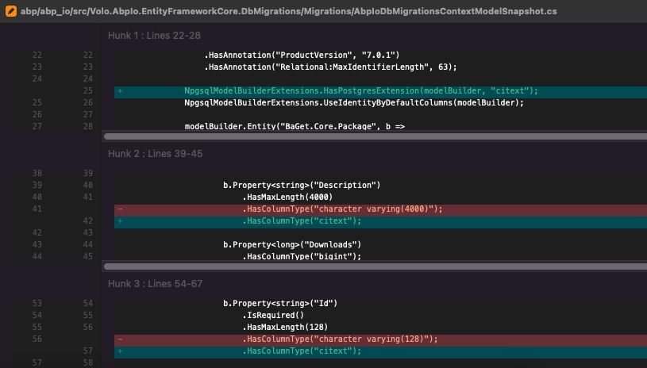
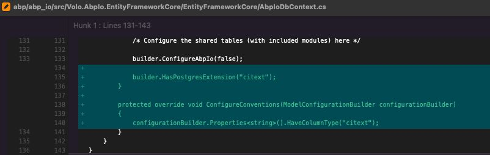

# Migrating from MS-SQL to Postgresql

## Introduction

Database migration is a common practice for organizations that want to move from one database system to another. This can be for a variety of reasons, including cost, performance, and features. In this article, we will discuss the process of migrating a database from MS-SQL to PostgreSQL, the challenges that may arise during the migration, and how to overcome them. And we recently moved the main database of https://abp.io platform from MS-SQL to PostgreSQL. 

In our case, we decided to switch our database from Microsoft SQL Server (MS-SQL) to PostgreSQL because we wanted to move our on-premise platform to Azure. We’ve also found out that the cost of the license for MS-SQL on Azure was significantly higher than PostgreSQL. After conducting a cost-benefit analysis, we decided to migrate our database to PostgreSQL to save costs.

Before migrating to Azure, we decided to switch our database from MS-SQL to PostgreSQL on-premise first. This gave us the opportunity to test and fine-tune the migration process before making the final switch to Azure.

## Challenges

Despite using a third-party tool(DBConvert for MySQL & PostgreSQL) for the migration, we faced three main problems when exporting data to PostgreSQL. Firstly, some tables with plain text had utf-8 encoding problems. We overcame this problem by dump-restoring these tables.

Secondly, our database had to be case-insensitive, but PostgreSQL does not have this as a default configuration. We handled it using `citext` with the ABP migration service.

While everything was proceeding very smooth, we faced one last problem: importing binary data, such as the content of the NuGet packages. It was hard to understand that the binaries of the NuGet packages were different. Our paid commercial NuGet packages are being stored as binary data in the database. Therefore, it was the most compelling part of this migration to transfer the NuGet packages. Fortunately, we overcame the binary error. And we decided to write a custom .NET tool to move only the binary data from MS-SQL to PostgreSQL, thanks to the ABP Core team!

## Conclusion

One of the benefits of using PostgreSQL is the low license costs of the Azure platform. As the main contributors of ABP, we also use ABP Framework under the hood of our abp.io websites, we could easily switch to PostgreSQL. For those who want to switch their ABP project to PostgreSQL, check out [docs.abp.io/en/abp/latest/Entity-Framework-Core-PostgreSQL](https://docs.abp.io/en/abp/latest/Entity-Framework-Core-PostgreSQL). We had not used any MS-SQL specific function, therefore there was no need to make any changes in the repository classes. This means that the applications that were previously using MS-SQL can seamlessly switch to PostgreSQL without any modifications.

Thanks to the flexibility of ABP, it has [PostgreSQL package](https://www.nuget.org/packages/Volo.Abp.EntityFrameworkCore.PostgreSql) which is 100% compatible with PostgreSQL. This helped us to make this migration very smooth and seamless.

In conclusion, migrating a database from MS-SQL to PostgreSQL can be challenging, but it can bring significant cost savings in the long run. By testing and fine-tuning the migration process before making the final switch, we were able to overcome the challenges we’d faced during the migration process. Thanks to the flexibility of ABP, we were able to make the transition with minimal code changes. Also we didn't see any big performance differences between MS-SQL and PostgreSQL.

