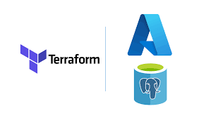

# Migration Abp.io Platform to Azure

Migrating a Kubernetes platform with a database from on-premise to Azure can be a daunting task, but it can be a necessary one to take advantage of the benefits that the cloud offers. In this article, we will discuss the reasons for migrating from an old platform at on-premise to Azure, the steps taken to create and configure an abp.io platform on Azure, and the benefits gained from the migration.

### Old Platform at On-Premise

There were several reasons why the decision was made to migrate from the old platform at on-premise to Azure. The first reason was that the Kubernetes cluster and the database were on the same Windows server. This configuration was not ideal as it posed a high risk of security and accessibility issues. Additionally, the virtual machines in Kubernetes were on Windows server and had limited resources. The platform was not in a private network, which further increased the risk of security breaches. Finally, the challenge of Kubernetes maintenance was another reason for the migration.

### Reasons for Moving to Azure

The decision to move to the cloud was made to eliminate the disadvantages of the old platform. The migration to Azure meant that the resources would be independent of each other but faster to communicate with each other. The platform would also take advantage of cloud security and availability. The managed Kubernetes service that Azure offers comes with autoscaling and loadbalancing, which makes the platform more reliable. Finally, the migration to Azure would provide better quality service to global customers and the community.

### Before Moving to Azure

Before migrating to Azure, we decided to switch our database from MSSQL to PostgreSQL on-premise first. This gave us the opportunity to test and fine-tune the migration process before making the final switch to Azure.You can check the details of database migration from this article [Migration from Mssql to Postgresql](https://community.abp.io/articles/migration-mssql-postgresql-1.html).

Before moving to Azure, the platform was tested in the staging environment. The staging environment was created on Azure to test the migration process. The staging environment was created with the same resources as the production environment. The staging environment was used to test the migration process and to optimize the migration process. The staging environment was also used to test the migration of the data from the old platform to Azure. The migration of the data from the old platform to Azure was tested several times to ensure that the migration process was successful.

### Creating and Configuring abp.io Platform on Azure

To create and configure abp.io platform on Azure, several steps were taken. Terraform was used to create the infrastructure, while Ansible was used to configure the resources on Azure. Azure DevOps pipelines and release were used for AKS deployment. The most time-consuming part in this process was to prepare, test and optimize the terraform and ansible settings files.

The most important step was to transfer the data in both the database and Kubernetes of the volumes. Rsync was used to transfer data from Kubernetes volumes to Azure NFS through the VPN machine. Additionally, pg_dump and pg_restore were used to transfer the PostgreSQL database through the machine with VPN. 

Before the production environment, the data migration was tested many times for the staging environment. It was discovered that the migration would take approximately 1.5 hours. The community was informed that there may be interruptions during the hours designated for the transition to Azure. During the migration of the production environment, the websites and databases were still up and running. After the data transfer, it remained only to direct the traffic of the already standing abp.io sites to Azure Kubernetes service via Cloudflare.

### Benefits of Moving to Azure

The migration to Azure resulted in several benefits. The platform is now more reliable and available for abp.io. Additionally, the critical resources are in a private network, making them more secure than the old environment. There were significant improvements in connection speeds after the migration, which resulted in speeds that were twice as fast as before.

In conclusion, migrating a Kubernetes platform with a database from on-premise to Azure is a complex process that requires careful planning and execution. However, the benefits gained from the migration make the process worthwhile. By moving to Azure, the abp.io platform now has a more reliable and available infrastructure that is more secure than the old environment. The migration also resulted in significant improvements in connection speeds, which ultimately provides better service to global customers and the community.

