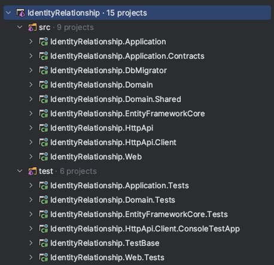
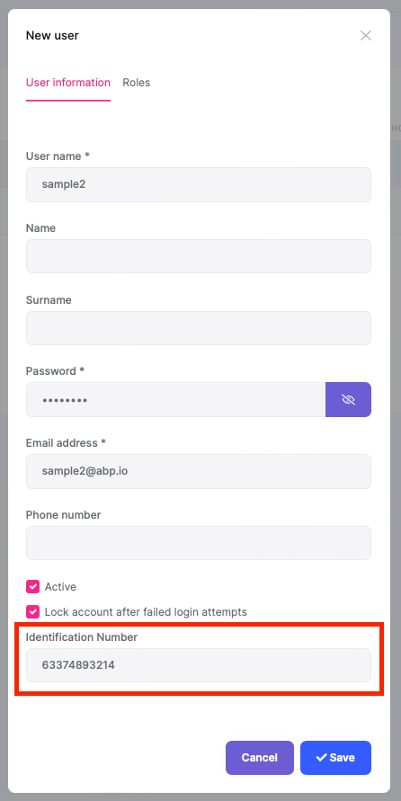
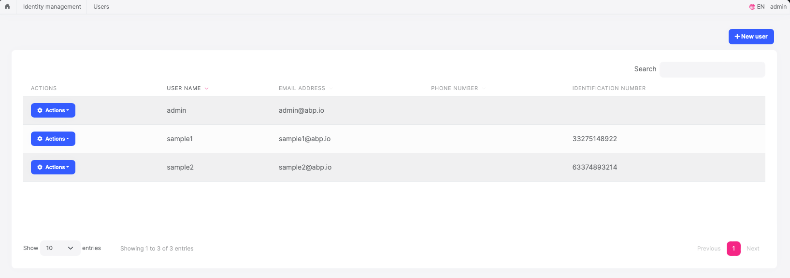
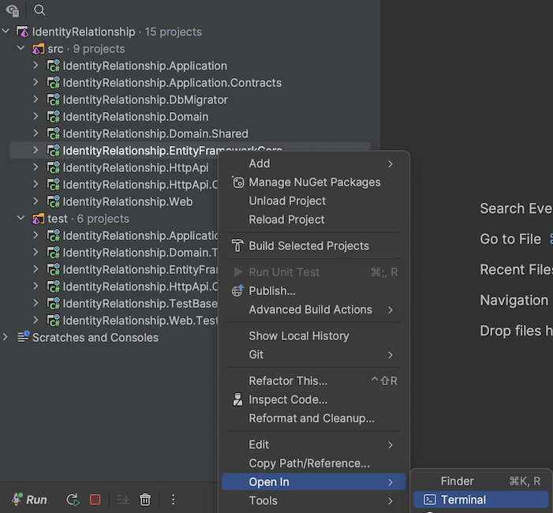
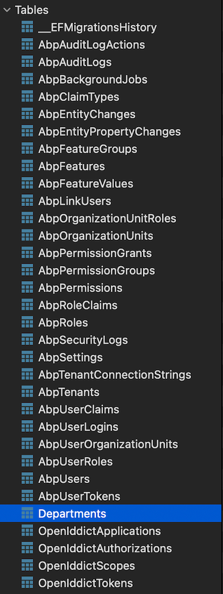
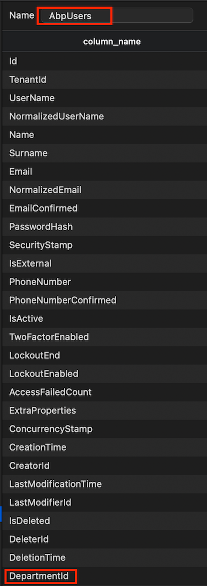
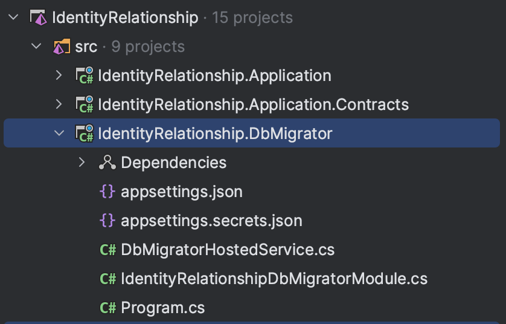
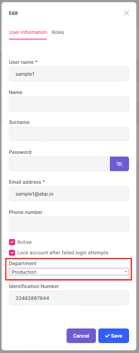

# Introduction
In this article, I will talk about the relationships of IdentityUser in every web application that can be created with the ABP framework. When you read this article, you will learn how to extend the user entity in the applications you develop using the ABP framework with a primitive type, extending the user by associating the user with another entity (User-many-to-one-X).


## Creating the Solution 
>For the source code of the application: https://github.com/onurpicakci/Abp-Identity-Relationship

In this article we will use EF Core as the database provider and MVC as the user interface framework. But Angular, Blazor Server and Blazor WebAssembly also work. ABP Framework offers starter templates to get started faster. We can create a new starter template using the ABP CLI:

```bash
abp new IdentityRelationship
```

After the project is created, you can run the `IdentityRelationship.DbMigrator` project to create the database and seed the initial data. You can then run the `IdentityRelationship.Web` project to see our application run.

> The default admin username is **admin** and the password is **1q2w3E\***



## Module Entity Extensions

The module entity extension system is a high level extension system that allows you to define new properties for existing entities of the depended modules. It automatically adds properties to the entity, database, HTTP API and the user interface in a single point.

### Extending the User Entity With a Primitive Type

Open the `IdentityRelationshipModuleExtensionConfigurator` class inside the `Domain.Shared` project of your solution and change the `ConfigureExtraProperties` method as shown below to add an `IdentificationNumber` property to the `IdentityUser` entity of the [Identity Module](https://docs.abp.io/en/abp/latest/Modules/Identity).

```csharp
public static void ConfigureExtraProperties()
{
    OneTimeRunner.Run(() =>
    {
        ObjectExtensionManager.Instance.Modules()
            .ConfigureIdentity(identity =>
            {
                identity.ConfigureUser(user =>
                {
                    user.AddOrUpdateProperty<string>( //property type: string
                        "IdentificationNumber", //property name
                        property =>
                        {
                            //validation rules
                            property.Attributes.Add(string.Empty);
                            property.Attributes.Add(
                                new StringLengthAttribute(64) {
                                    MinimumLength = 4
                                }
                            );

                            //...other configurations for this property
                        }
                    );
                });
            });
    });
}
```
> This method is called inside the IdentityRelationshipDomainSharedModule at the beginning of the application. OneTimeRunner is a utility class that guarantees to execute this code only one time per application, since multiple calls are unnecessary.

If you want to localize, open the `IdentityRelationship.Domain.Shared` project and create a new localization in your `/Localization/IdentityRelationship/en.json` file.

```json
 "IdentificationNumber": "Identification Number"
 ```
Once you define a property, it appears in the create and update forms of the related entity:

 

 New properties also appear in the data table of the related page:

 


## Navigation Properties / Foreign Keys

It is supported to add an extension property to an entity that is the Id of another entity (foreign key).

### Example: Let's associate a department in the database with a user

First, create a `Departments` folder in the `IdentityRelationship.Domain` project and add the `Department` class inside:
```csharp
using System;
using Volo.Abp.Domain.Entities;

namespace IdentityRelationship.Departments;

public class Department : AggregateRoot<Guid>
{
    public string Name { get; set; }
}
```

EF Core requires that you relate the entities with your `DbContext`. The easiest way to do so is adding a DbSet property to the `IdentityRelationshipDbContext` class in the `IdentityRelationship.EntityFrameworkCore` project, as shown below:

```csharp
    public DbSet<Department> Departments { get; set; }
```

Then in the `IdentityRelationship.EntityFrameworkCore` project of your solution, open the `/EntityFrameworkCore/IdentityRelationshipEfCoreEntityExtensionMappings` class and update your code:

```csharp
public static class IdentityRelationshipEfCoreEntityExtensionMappings
{
    private static readonly OneTimeRunner OneTimeRunner = new OneTimeRunner();

    public static void Configure()
    {
        IdentityRelationshipGlobalFeatureConfigurator.Configure();
        IdentityRelationshipModuleExtensionConfigurator.Configure();

        OneTimeRunner.Run(() =>
        {
            ObjectExtensionManager.Instance
                .MapEfCoreProperty<IdentityUser, Guid>(
                    "DepartmentId",
                    (entityBuilder, propertyBuilder) => { propertyBuilder.HasMaxLength(128); }
                );
                
        });
    }
}
```

This class can be used to map these extra properties to table fields in the database. Please read [this](https://docs.abp.io/en/abp/latest/Customizing-Application-Modules-Extending-Entities?_ga=2.21022651.140118448.1679289046-1173891759.1672473062) document to improve your understanding of what we are doing.

We need to create a new migration to see the changes in the database. Open your `EntityFrameworkCore` project in the terminal and run the following command (this depends on the IDE you are using).



```bash
dotnet ef migrations add Create_Department_Entity
```

Finally, run the `IdentityRelationship.DbMigrator` project to update the database.

When you look at your database, you can see that the `Department` table has been added and `DepartmentId` has been added to your `AbpUsers` table.





> It's good to have some initial data in the database before running the application. This section introduces the [Data Seeding](https://docs.abp.io/en/abp/latest/Data-Seeding) system of the ABP framework. You can skip this section if you don't want to create the data seeding, but it is suggested to follow along and learn this useful ABP Framework feature.

Create a class deriving from the `IDataSeedContributor` in the `IdentityRelationship.Domain` project by copying the following code:

```csharp
using System;
using System.Threading.Tasks;
using IdentityRelationship.Departments;
using Volo.Abp.Data;
using Volo.Abp.DependencyInjection;
using Volo.Abp.Domain.Repositories;

namespace IdentityRelationship;

public class IdentityRelationshipDataSeederContributor
    : IDataSeedContributor, ITransientDependency
{
    private readonly IRepository<Department, Guid> _departmentRepository;

    public IdentityRelationshipDataSeederContributor(IRepository<Department, Guid> departmentRepository)
    {
        _departmentRepository = departmentRepository;
    }

    public async Task SeedAsync(DataSeedContext context)
    {
        if (await _departmentRepository.GetCountAsync() <= 0)
        {
            await _departmentRepository.InsertAsync(
                new Department
                {
                    Name = "Human Resources"
                },
                autoSave: true
            );

            await _departmentRepository.InsertAsync(
                new Department
                {
                    Name = "Production"
                },
                autoSave: true
            );
        }
    }
}
```
- This code simply uses the `IRepository<Department, Guid>` (the default [repository](https://docs.abp.io/en/abp/latest/Repositories)) to insert two books to the database in case there weren't any books in it.

Run the `IdentityRelationship.DbMigrator` application to update the database:



Again, open the `IdentityRelationshipModuleExtensionConfigurator` class in the Domain.Shared project and add the following code:

```csharp

user.AddOrUpdateProperty<Guid>(
    "DepartmentId",
    property =>
    {
        property.UI.Lookup.Url = "/api/app/department";
        property.UI.Lookup.DisplayPropertyName = "name";
    }
);
```

The `UI.Lookup.Url` option takes a URL to get the list of departments to select on the edit/create forms. This endpoint can be a typical controller, an auto API controller or any type of endpoint that returns a proper JSON response.

To localize, open the `IdentityRelationship.Domain.Shared` project and add it to your `/Localization/IdentityRelationship/en.json` file:

```json
"DepartmentId": "Department"
```

Create a `Departments` folder in the `IdentityRelationship.Application.Contracts` project of your solution and add the `DepartmentDto` class in it

```csharp
using System;
using Volo.Abp.Application.Dtos;
namespace IdentityRelationship.Departments;

public class DepartmentDto : EntityDto<Guid>

{
    public string Name { get; set; }
}
```
Now let's create an `IDepartmentAppService` interface in the `Departments` folder

```csharp
using System.Threading.Tasks;
using Volo.Abp.Application.Dtos;
using Volo.Abp.Application.Services;

namespace IdentityRelationship.Departments;

public interface IDepartmentAppService : IApplicationService
{
    public Task<ListResultDto<DepartmentDto>> GetAsync();
}
```

Time to implement the `IDepartmentAppService` interface. Create a `Departments` folder in your `IdentityRelationship.Application` project and add the `DepartmentAppService` class inside. 

```csharp
using System;
using System.Collections.Generic;
using System.Threading.Tasks;
using IdentityRelationship.Departments;
using Volo.Abp.Application.Dtos;
using Volo.Abp.Domain.Repositories;

namespace IdentityRelationship.Department;

public class DepartmentAppService : IdentityRelationshipAppService, IDepartmentAppService
{
    private readonly IRepository<Departments.Department, Guid> _departmentRepository;

    public DepartmentAppService(IRepository<Departments.Department, Guid> departmentRepository)
    {
        _departmentRepository = departmentRepository;
    }

    public async Task<ListResultDto<DepartmentDto>> GetAsync()
    {
        var departments = await _departmentRepository.GetListAsync();
        return new ListResultDto<DepartmentDto>(
            ObjectMapper.Map<List<Departments.Department>, List<DepartmentDto>>(departments));
    }
}
```
`DepartmentAppService `is using the `ObjectMapper` to convert the `Department` objects to `DepartmentDto` objects. So, we need to define this mapping in the AutoMapper configuration.

Open the `IdentityRelationshipApplicationAutoMapperProfile` class inside the `IdentityRelationship.Application` project and add the following line to the constructor:

```csharp
using AutoMapper;
using IdentityRelationship.Departments;

namespace IdentityRelationship;

public class IdentityRelationshipApplicationAutoMapperProfile : Profile
{
    public IdentityRelationshipApplicationAutoMapperProfile()
    {
        CreateMap<Departments.Department, DepartmentDto>();
    }
}
```

Run your `IdentityRelationship.Web` project and add a department to one of your users.



And it shows the department name on the data table:


## Conclusion
In this article I talked about the use of the IdentityUser relationship and how to extend it. Thank you for reading the article, I hope it was useful. See you soon!

## References
- https://docs.abp.io/en/abp/latest/Module-Entity-Extensions
- https://learn.microsoft.com/en-us/ef/core/modeling/relationships
- https://community.abp.io/posts/how-to-add-custom-properties-to-the-user-entity-rixchoha