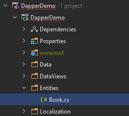
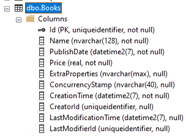
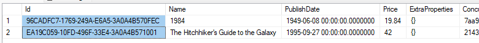

# Using Dapper with the ABP Framework

[Dapper](https://github.com/DapperLib/Dapper) is a simple and lightweight object mapper for .NET. A key feature of Dapper is its [high performance](https://github.com/DapperLib/Dapper#performance) compared to other ORMs. In this article, I will show how to use it in your ABP projects. But, we'll see when to use it first.

### Source Code

You can find the [full source code of the demo application here](https://github.com/abpframework/abp-samples/tree/master/Dapper).

## When to Use Dapper?

In the ABP Framework, we suggest to use Dapper in combination with Entity Framework Core (EF Core) for the following reasons:

* EF Core is much easier to use (you don't need to manually write SQL queries and work with low level database objects).
* EF Core abstracts different DBMS dialects, so it will be easier to change your DBMS later.
* The EF Core's change tracking system automatically updates the changes in the database.
* EF Core is better compatible with Object Oriented Programming (OOP) practices and is more type safe to work with. So, the EF Core code is more understandable and maintainable.

In most of your use cases, you typically work with one or a few entities and a maintainable codebase can be chosen instead of a slight performance difference. However, there may be certain places in your application where it matters:

* You may work with a lot of entities, so you'd like to query faster (Indeed, EF Core's [AsNoTracking()](https://learn.microsoft.com/en-us/ef/core/querying/tracking) extension can help in most cases).
* You may be performing too many database operations in a single request.
* EF Core may not create an optimized SQL query and you may want to manually write it for better performance.

For such cases, Dapper can be a good choice. You can easily write SQL queries and bind the result to your objects.

## Creating a new ABP Solution

To demonstrate the useage of Dapper, I've created an ABP solution. You can find the [full source code of the demo application here](https://github.com/abpframework/abp-samples/tree/master/Dapper). If you want to create the same solution from scratch, follow the steps below:

Install the ABP CLI if you haven't installed it before:

````bash
dotnet tool install -g Volo.Abp.Cli
````

Create a new solution with the ABP Framework's non-layered startup template with MVC UI and EF Core database:

````bash
abp new DapperDemo -t app-nolayers
````

> The startup template and UI selection don't matter for this article. I selected these options to keep the demo solution simple.

After creating the solution, run the following command to migrate the database (run the command in the folder of the `.csproj` file:

````csharp
dotnet run --migrate-database
````

> If you've created a layered solution, then run the `DbMigrator` application inside the solution. If you have trouble by creating the solution, please refer to the [Quick Start](https://docs.abp.io/en/abp/latest/Tutorials/Todo/Single-Layer/Index) document.

## Setting Up the Entity Framework Core Part

We will use EF Core with Dapper, so we need to configure EF Core first. I will use the following `Book` entity as an example:

````csharp
public class Book : AuditedAggregateRoot<Guid>
{
    public string Name { get; set; }
    public DateTime PublishDate { get; set; }
    public float Price { get; set; }
}
````

If you are using a layered solution, entities are located in the `Domain` project. For my demo solution, I just placed it in the `Entities` folder of the single-layer project:



Once I created the `Book` entity, I should add it to my `DbContext` class:

````csharp
public class DapperDemoDbContext : AbpDbContext<DapperDemoDbContext>
{
    // 1: ADD A DBSET PROPERTY
    public DbSet<Book> Books { get; set; }

    public DapperDemoDbContext(DbContextOptions<DapperDemoDbContext> options)
        : base(options)
    {
    }

    protected override void OnModelCreating(ModelBuilder builder)
    {
        //...other code parts
        
        // 2: MAP YOUR ENTITY TO A DATABASE TABLE
        builder.Entity<Book>(b =>
        {
            b.ToTable("Books");
            b.Property(x => x.Name).IsRequired().HasMaxLength(128);
        });
    }
}

````

Now, we can add a new database migration:

````bash
dotnet ef migrations add Added_Book
````

And apply the changes to the database:

````bash
dotnet ef database update
````

At this point, you should be able to see the Books table if you check your database:



> As you see, the `Books` table contains more fields than the `Book` entity's property count. Other properties are inherited from the `AuditedAggregateRoot` table. You could inherit from the `BasicAggregateRoot` class if you don't want these properties.

## Seeding the Database

ABP's [data seeding](https://docs.abp.io/en/abp/latest/Data-Seeding) system is a great way to add some test data to the database. The following class inserts two books to the `Books` table when I migrate the database:

````csharp
public class DapperDemoDataSeederContributor : IDataSeedContributor, ITransientDependency
{
    private readonly IRepository<Book, Guid> _bookRepository;

    public DapperDemoDataSeederContributor(IRepository<Book, Guid> bookRepository)
    {
        _bookRepository = bookRepository;
    }

    public async Task SeedAsync(DataSeedContext context)
    {
        if (await _bookRepository.GetCountAsync() > 0)
        {
            return;
        }

        await _bookRepository.InsertAsync(
            new Book
            {
                Name = "1984",
                PublishDate = new DateTime(1949, 6, 8),
                Price = 19.84f
            }
        );

        await _bookRepository.InsertAsync(
            new Book
            {
                Name = "The Hitchhiker's Guide to the Galaxy",
                PublishDate = new DateTime(1995, 9, 27),
                Price = 42.0f
            }
        );
    }
}
````

After creating the `DapperDemoDataSeederContributor` class, I can re-run the following command:

````bash
dotnet run --migrate-database
````

Now, I can see the records in the database:



Now, everything is ready to try querying from the `Books` table with Dapper.

## Using Dapper Without the Integration Package

ABP provides an integration package for Dapper. However, I first want to demonstrate using Dapper without the integration package.

### Installing the Dapper Package

First, install the [Dapper](https://www.nuget.org/packages/Dapper) package to your project. You can use a command-line terminal, locate the root path of your project (`.csproj` file that you want to install it in) and run the following command:

````bash
dotnet add package Dapper
````

> If your application is layered, then we suggest to add the `Dapper` package to your `EntityFrameworkCore` integration project in your solution.

### Executing a Dapper Query

I will query from the `Books` table, but I don't want to use the `Book` entity to map the result (because I don't need all the properties). So, I am creating a new class for the query result:

````csharp
public class BookDataView
{
    public Guid Id { get; set; }    
    public string Name { get; set; }
    public float Price { get; set; }
}
````

Now, we can use Dapper's `QueryAsync` extension method as shown below:

````csharp
public class DemoService : ITransientDependency
{
    private readonly IRepository<Book, Guid> _bookRepository;

    public DemoService(IRepository<Book, Guid> bookRepository)
    {
        _bookRepository = bookRepository;
    }
    
    [UnitOfWork]
    public virtual async Task<List<BookDataView>> GetListAsync()
    {
        var database = (await _bookRepository.GetDbContextAsync()).Database;
        var dbConnection = database.GetDbConnection();
        var dbTransaction = database.CurrentTransaction?.GetDbTransaction();
        
        var queryResult = await dbConnection.QueryAsync<BookDataView>(
            "SELECT Id, Name, Price FROM Books",
            transaction: dbTransaction
        );
        
        return queryResult.ToList();
    }
}
````

Let's examine this class:

* I've injected the ABP's standard [generic repository](https://docs.abp.io/en/abp/latest/Repositories) service into the `DemoService` constructor.
* `_bookRepository.GetDbContextAsync()` returns the underlying `DbContext` object of EF Core. We need to have the [Volo.Abp.EntityFrameworkCore](https://www.nuget.org/packages/Volo.Abp.EntityFrameworkCore) package reference to be able to access that method. If you have created a single-layer solution, the reference will already have existed. If you have created a layered solution you may need to manually add this package to the project that contains the `DemoService` class. Because the layered solution isolates the EF Core dependency from the rest of the solution.
* Dapper needs a `DbConnection` and a `DbTransaction` object (as optional) to execute a query. We are getting them over the `database` object obtained from the `DbContext`. We suggest to always pass the current `DbTransaction` object while working with Dapper. Because, if there is a database transaction on the same database connection that you execute queries on, and you don't pass the transaction object, you'll get an exception.
* Finally, we can use Dapper's `QueryAsync` extension method to execute the database query.
* Notice that the `GetListAsync` method is made as `virtual` and marked with the `UnitOfWork` attribute to enable the [Unit Of Work](https://docs.abp.io/en/abp/latest/Unit-Of-Work) for that method. It ensures the database connection is available in the body of the `GetListAsync` method.

That's all. You can execute any Dapper operation using the `DbConnection` and `DbTransaction` objects obtained from the `_bookRepository` object. Please refer to Dapper's documentation for other operations.

> We've obtained the `DbContext` object from a repository. However, a repository is not required to obtain a `DbContext`. Instead, you could inject the `IDbContextProvider<T>` service (`IDbContextProvider<DapperDemoDbContext>` for this demo) and call its `GetDbContextAsync` method.

## Using the Volo.Abp.Dapper Package

In the previous section, you saw that you don't need an ABP integration package to be able to use Dapper in your ABP applications. However, there is an integration package here: [Volo.Abp.Dapper](https://www.nuget.org/packages/Volo.Abp.Dapper). In fact, that package doesn't contain much services. It just provides a convenient base class to create Dapper based repository classes.

### Installing the Volo.Abp.Dapper Package

You can use the [ABP CLI](https://docs.abp.io/en/abp/latest/CLI#add-package) to easily install ABP packages to your projects. Execute the following command in the folder of the `.csproj` file that you want to install the package on:

````bash
abp add-package Volo.Abp.Dapper
````

> You can check the [ABP Dapper document](https://docs.abp.io/en/abp/latest/Dapper) for alternative installation options.

### Creating a Repository Class

In the `DemoService` example, we used database objects out of a [repository](https://docs.abp.io/en/abp/latest/Repositories) class. If you want to implement layering to your solution and abstracting database operations, it can be better to create a repository class to execute the Dapper operations.

Here's a repository class that executes the same database query:

````csharp
public class BookRepository : DapperRepository<DapperDemoDbContext>, ITransientDependency
{
    public BookRepository(IDbContextProvider<DapperDemoDbContext> dbContextProvider) 
        : base(dbContextProvider)
    {
    }
    
    public virtual async Task<List<BookDataView>> GetListAsync()
    {
        var connection = await GetDbConnectionAsync();
        var queryResult = await connection.QueryAsync<BookDataView>(
            "SELECT Id, Name, Price FROM Books",
            transaction: await GetDbTransactionAsync()
        );
        return queryResult.ToList();
    }
}
````

Let's examine this class:

* It inherits from the `DapperRepository` class, which provides useful methods and properties for database operations. It also implements the `IUnitOfWorkEnabled` interface, so ABP makes the database connection (and transaction if requested) available in the method body by implementing dynamic proxies (a.k.a. interception).
* The `GetListAsync` method's been made `virtual`.  That's needed to make the interception process working. It wouldn't be needed if we introduce `IBookRepository` to that class and always use it by injecting the `BookRepository` class (in this case, it will use interface proxying - however, this is too much details for the purpose of this article).
* We've used the `GetDbConnectionAsync` and `GetDbTransactionAsync` methods to obtain the current database connection and transaction (that is managed by ABP's [unit of work](https://docs.abp.io/en/abp/latest/Unit-Of-Work) system).

You can then inject the `BookRepository` class when you want to get a list of `BookDataView` whenever it is needed. In the demo project, I used it inside the `IndexModel.cshtml.cs` to show a list of books on the page:


## Conclusion

In this article, I've explained ABP's Dapper integration and demonstrated how you can execute Dapper operations in your applications. I suggest to use Dapper when it is really needed and adds any significant value (generally a performance gain) to your application. Otherwise, EF Core is much more convenient for most of the database operations and you will have a more maintainable codebase using EF Core.

## Source Code

You can find the [full source code of the demo application here](https://github.com/abpframework/abp-samples/tree/master/Dapper).

## See Also

* [ABP Dapper documentation](https://docs.abp.io/en/abp/latest/Dapper)
