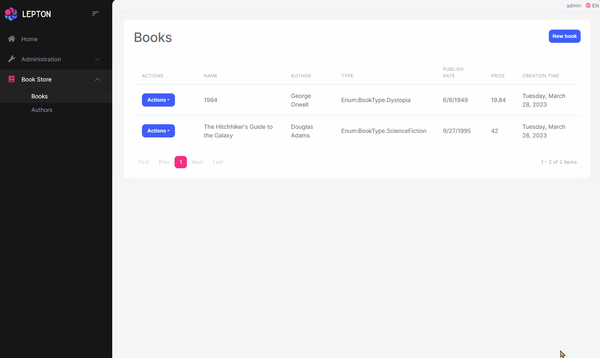
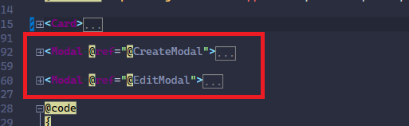
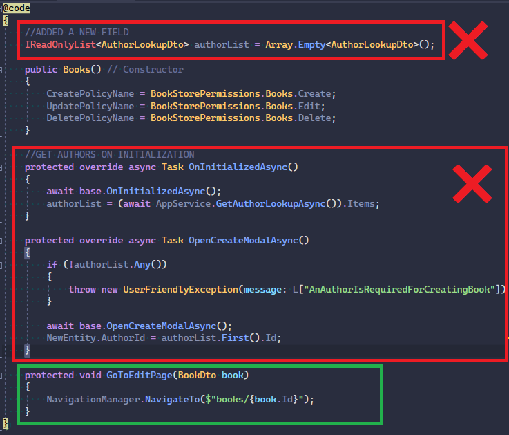

# Convert Create/Edit Modals to Page
In this document we will explain how to convert BookStore's Books create & edit modals to regular blazor pages.

## Before


## After




# Books.razor Page
Books.razor page is the main page of the books management. Create & Update operations are done in this page. So we'll remove create & update operations from this page and move a separate blazor component for each operation. Each component will be a page.

- Remove both Create & Update modals.

    

- Replace **NewBook** button with a link to **CreateBook** page.

    ```html
    <Button Color="Color.Primary" Type="ButtonType.Link" To="books/new">
        @L["NewBook"]
    </Button>
    ```

- Inject `NavigationManager` to `Books.razor` page.
    ```csharp
    @inject NavigationManager NavigationManager
    ```

- Replace **Edit** button with a link to **UpdateBook** page.

    ```html
    <Button Color="Color.Primary" Type="ButtonType.Link" OnClick="() => NavigateToEdit(book.Id)">
        @L["Edit"]
    </Button>
    ```

    ```csharp
    private void NavigateToEdit(Guid id)
    {
        NavigationManager.NavigateTo($"books/{id}/edit");
    }
    ```

- Remove all methods in the `Books.razor` page except constructor. And add `GoToEditPage` as below:
    
    ```csharp
    protected void GoToEditPage(BookDto book)
    {
        NavigationManager.NavigateTo($"books/{book.Id}");
    }
    ```

    

- Change Edit button to a link in the table.

    ```html
    <EntityAction TItem="BookDto"
                Text="@L["Edit"]"
                Visible=HasUpdatePermission
                Clicked="() => GoToEditPage(context)" />
    ```


# CreateBooks Page
Create new `CreateBook.razor` and `CreateBook.razor.cs` files in your project.

- `CreateBook.razor`

```html
@page "/books/new"
@attribute [Authorize(BookStorePermissions.Books.Create)]
@inherits BookStoreComponentBase

@using Acme.BookStore.Books;
@using Acme.BookStore.Localization;
@using Acme.BookStore.Permissions;
@using Microsoft.Extensions.Localization;
@using Volo.Abp.AspNetCore.Components.Web;

@inject IStringLocalizer<BookStoreResource> L
@inject AbpBlazorMessageLocalizerHelper<BookStoreResource> LH
@inject IBookAppService AppService
@inject NavigationManager NavigationManager

<Card>
    <CardHeader>
        <HeadContent>
            <ModalTitle>@L["NewBook"]</ModalTitle>
        </HeadContent>
    </CardHeader>
    <CardBody>
        <Validations @ref="@CreateValidationsRef" Model="@NewEntity" ValidateOnLoad="false">
            <Validation MessageLocalizer="@LH.Localize">
                <Field>
                    <FieldLabel>@L["Author"]</FieldLabel>
                    <Select TValue="Guid" @bind-SelectedValue="@NewEntity.AuthorId">
                        @foreach (var author in authorList)
                        {
                            <SelectItem TValue="Guid" Value="@author.Id">
                                @author.Name
                            </SelectItem>
                        }
                    </Select>
                </Field>
                <Field>
                    <FieldLabel>@L["Name"]</FieldLabel>
                    <TextEdit @bind-Text="@NewEntity.Name">
                        <Feedback>
                            <ValidationError />
                        </Feedback>
                    </TextEdit>
                </Field>
            </Validation>
            <Field>
                <FieldLabel>@L["Type"]</FieldLabel>
                <Select TValue="BookType" @bind-SelectedValue="@NewEntity.Type">
                    @foreach (int bookTypeValue in Enum.GetValues(typeof(BookType)))
                    {
                        <SelectItem TValue="BookType" Value="@((BookType) bookTypeValue)">
                            @L[$"Enum:BookType.{bookTypeValue}"]
                        </SelectItem>
                    }
                </Select>
            </Field>
            <Field>
                <FieldLabel>@L["PublishDate"]</FieldLabel>
                <DateEdit TValue="DateTime" @bind-Date="NewEntity.PublishDate" />
            </Field>
            <Field>
                <FieldLabel>@L["Price"]</FieldLabel>
                <NumericEdit TValue="float" @bind-Value="NewEntity.Price" />
            </Field>
        </Validations>
    </CardBody>
    <CardFooter>
        <Button Color="Color.Secondary" Type="ButtonType.Link" To="books">
            @L["Cancel"]
        </Button>
        <Button Color="Color.Primary"
                Type="@ButtonType.Submit"
                PreventDefaultOnSubmit="true"
                Clicked="CreateEntityAsync">
            @L["Save"]
        </Button>
    </CardFooter>
</Card>
```

- `CreateBook.razor.cs`

```csharp
using Acme.BookStore.Books;
using Blazorise;
using System;
using System.Collections.Generic;
using System.Linq;
using System.Threading.Tasks;
using Volo.Abp;

namespace Acme.BookStore.Blazor.Pages;

public partial class CreateBook
{
    protected Validations CreateValidationsRef;
    protected CreateUpdateBookDto NewEntity = new();
    IReadOnlyList<AuthorLookupDto> authorList = Array.Empty<AuthorLookupDto>();

    protected override async Task OnInitializedAsync()
    {
        await base.OnInitializedAsync();
        authorList = (await AppService.GetAuthorLookupAsync()).Items;

        if (!authorList.Any())
        {
            throw new UserFriendlyException(message: L["AnAuthorIsRequiredForCreatingBook"]);
        }

        NewEntity.AuthorId = authorList.First().Id;

        if (CreateValidationsRef != null)
        {
            await CreateValidationsRef.ClearAll();
        }
    }

    protected virtual async Task CreateEntityAsync()
    {
        try
        {
            var validate = true;
            if (CreateValidationsRef != null)
            {
                validate = await CreateValidationsRef.ValidateAll();
            }
            if (validate)
            {
                await AppService.CreateAsync(NewEntity);
                NavigationManager.NavigateTo("books");
            }
        }
        catch (Exception ex)
        {
            await HandleErrorAsync(ex);
        }
    }
}
```

# EditBooks Page
Create new `EditBook.razor` and `EditBook.razor.cs` files in your project.

- `EditBook.razor`

```html
@page "/books/{Id}"
@attribute [Authorize(BookStorePermissions.Books.Edit)]
@inherits BookStoreComponentBase
@using Acme.BookStore.Books;
@using Acme.BookStore.Localization;
@using Acme.BookStore.Permissions;
@using Microsoft.Extensions.Localization;
@using Volo.Abp.AspNetCore.Components.Web;

@inject IStringLocalizer<BookStoreResource> L
@inject AbpBlazorMessageLocalizerHelper<BookStoreResource> LH
@inject IBookAppService AppService
@inject NavigationManager NavigationManager

<Card>
    <CardHeader>
        <HeadContent>
            <ModalTitle>@EditingEntity.Name</ModalTitle>
        </HeadContent>
    </CardHeader>
    <CardBody>
        <Validations @ref="@EditValidationsRef" Model="@EditingEntity" ValidateOnLoad="false">
            <Validation MessageLocalizer="@LH.Localize">
                <Field>
                    <FieldLabel>@L["Author"]</FieldLabel>
                    <Select TValue="Guid" @bind-SelectedValue="@EditingEntity.AuthorId">
                        @foreach (var author in authorList)
                        {
                            <SelectItem TValue="Guid" Value="@author.Id">
                                @author.Name
                            </SelectItem>
                        }
                    </Select>
                </Field>
                <Field>
                    <FieldLabel>@L["Name"]</FieldLabel>
                    <TextEdit @bind-Text="@EditingEntity.Name">
                        <Feedback>
                            <ValidationError />
                        </Feedback>
                    </TextEdit>
                </Field>
            </Validation>
            <Field>
                <FieldLabel>@L["Type"]</FieldLabel>
                <Select TValue="BookType" @bind-SelectedValue="@EditingEntity.Type">
                    @foreach (int bookTypeValue in Enum.GetValues(typeof(BookType)))
                    {
                        <SelectItem TValue="BookType" Value="@((BookType) bookTypeValue)">
                            @L[$"Enum:BookType.{bookTypeValue}"]
                        </SelectItem>
                    }
                </Select>
            </Field>
            <Field>
                <FieldLabel>@L["PublishDate"]</FieldLabel>
                <DateEdit TValue="DateTime" @bind-Date="EditingEntity.PublishDate" />
            </Field>
            <Field>
                <FieldLabel>@L["Price"]</FieldLabel>
                <NumericEdit TValue="float" @bind-Value="EditingEntity.Price" />
            </Field>
        </Validations>
    </CardBody>
    <CardFooter>
        <Button Color="Color.Secondary" Type="ButtonType.Link" To="books">
            @L["Cancel"]
        </Button>
        <Button Color="Color.Primary"
                Type="@ButtonType.Submit"
                PreventDefaultOnSubmit="true"
                Clicked="UpdateEntityAsync">
            @L["Save"]
        </Button>
    </CardFooter>
</Card>
```

- `EditBook.razor.cs`

```csharp
using Acme.BookStore.Books;
using Blazorise;
using Microsoft.AspNetCore.Components;
using System;
using System.Collections.Generic;
using System.Linq;
using System.Threading.Tasks;
using Volo.Abp;

namespace Acme.BookStore.Blazor.Pages;

public partial class EditBook
{
    protected CreateUpdateBookDto EditingEntity = new();
    protected Validations EditValidationsRef;
    IReadOnlyList<AuthorLookupDto> authorList = Array.Empty<AuthorLookupDto>();

    [Parameter]
    public string Id { get; set; }

    public Guid EditingEntityId { get; set; }

    protected override async Task OnInitializedAsync()
    {
        await base.OnInitializedAsync();

        // Blazor can't parse Guid as route constraint currently.
        // See https://github.com/dotnet/aspnetcore/issues/19008
        EditingEntityId = Guid.Parse(Id);

        authorList = (await AppService.GetAuthorLookupAsync()).Items;

        if (!authorList.Any())
        {
            throw new UserFriendlyException(message: L["AnAuthorIsRequiredForCreatingBook"]);
        }

        var entityDto = await AppService.GetAsync(EditingEntityId);

        EditingEntity = ObjectMapper.Map<BookDto,CreateUpdateBookDto>(entityDto);

        if (EditValidationsRef != null)
        {
            await EditValidationsRef.ClearAll();
        }
    }

    protected virtual async Task UpdateEntityAsync()
    {
        try
        {
            var validate = true;
            if (EditValidationsRef != null)
            {
                validate = await EditValidationsRef.ValidateAll();
            }
            if (validate)
            {
                await AppService.UpdateAsync(EditingEntityId, EditingEntity);

                NavigationManager.NavigateTo("books");
            }
        }
        catch (Exception ex)
        {
            await HandleErrorAsync(ex);
        }
    }
}
```

You can check the following commit for details:
https://github.com/abpframework/abp-samples/commit/aae61ad6d66ebf6191dd4dcfb4e23d30bd680a4e