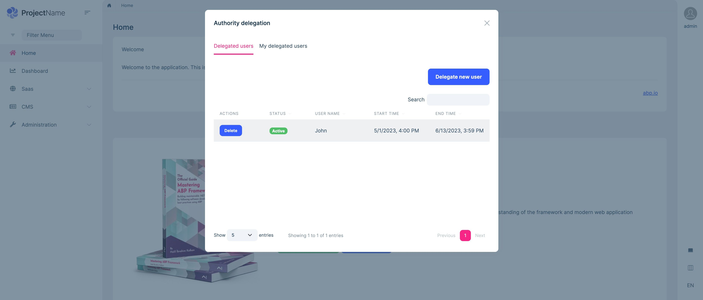
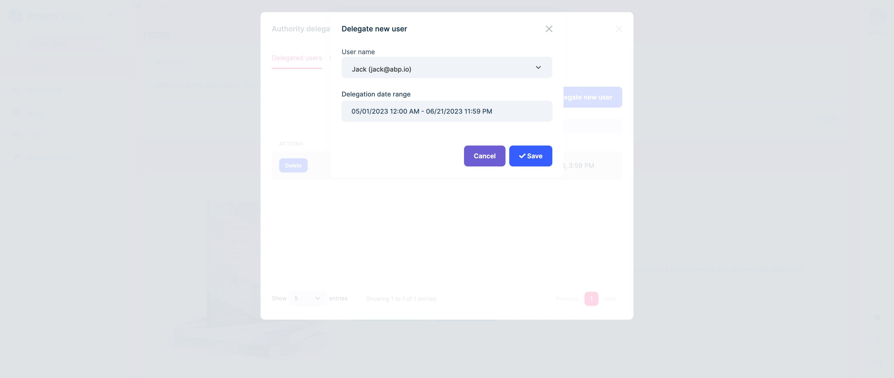
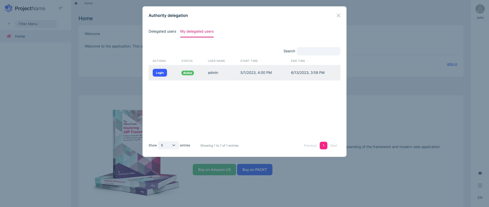

# Authority Delegation in ABP Commercial

In this post, I'll explain a new feature that comes with the ABP Commercial `v7.2.0`. It's called **Authority Delegation**.

## Authority Delegation

Authority Delegation is a way of delegating the responsibility of the current user to a different user(s) for a limited time. Thus, the user can switch to the delegated user's account and perform actions on their behalf.

> This feature is part of the [Account Pro module](https://commercial.abp.io/modules/Volo.Account.Pro), which is one of the application PRO modules of [ABP Commercial](https://commercial.abp.io/).

### Delegating a new user

After logging into the application, you can see the `Authority Delegation` menu item under the user menu. When you click the menu, a modal will open, and in the first tab of the modal, you will see the list of delegated users.

You can click the `Delegate New User` button to delegate a new user:

* You can specify a time range to ensure the delegation is only available within the time range.
* You can make multiple delegates to the same user and set different delegate time ranges.

> The delegation has three states: `Expired`, `Active`, and `Future`. These states are set automatically by checking the specified time interval.

### My delegated users

A list of users who delegated me to log in on behalf of them can be seen in the figure:

You can click the `Login` button to log in to the application as a delegated user and go back to your account by clicking the `Back to my account` icon.

> The **Authority Delegation** feature uses the [impersonation system](https://docs.abp.io/en/commercial/latest/modules/account/impersonation) internally.
