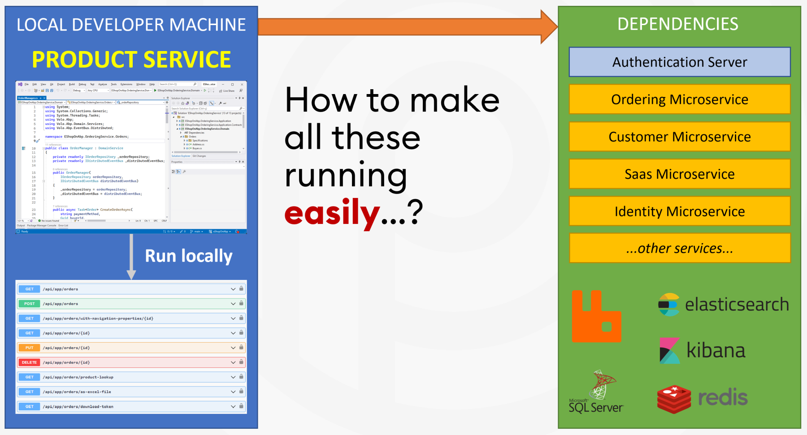
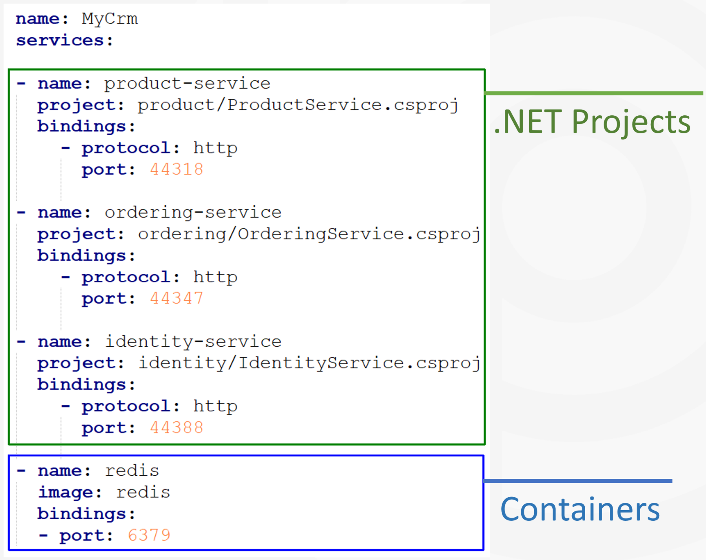
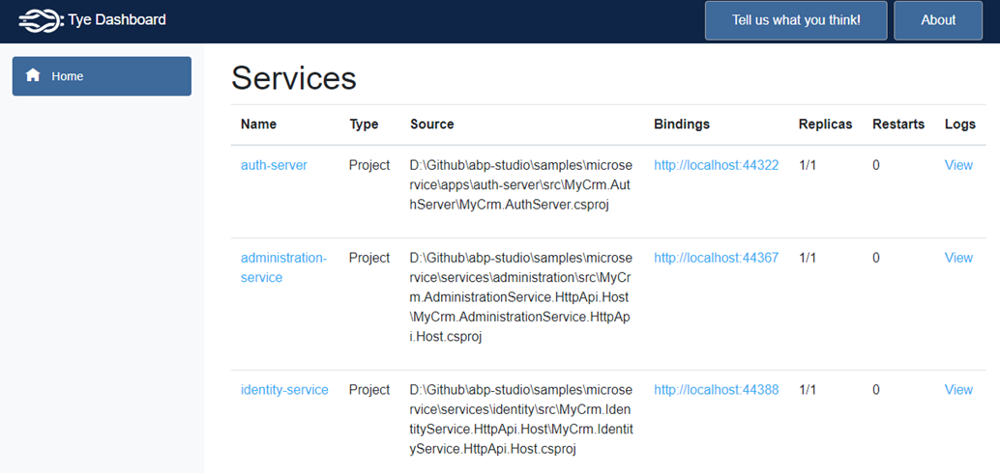
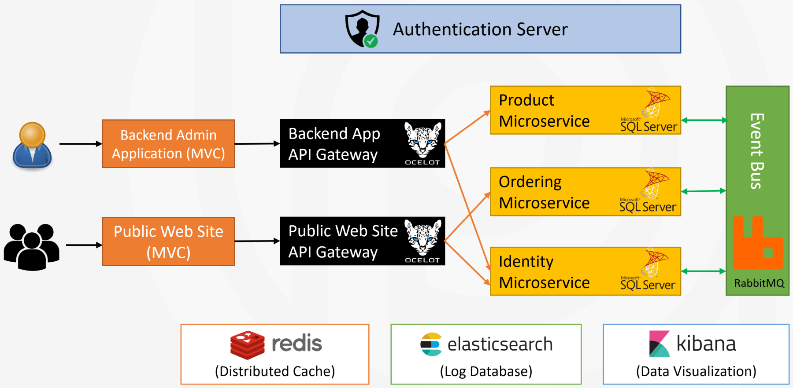
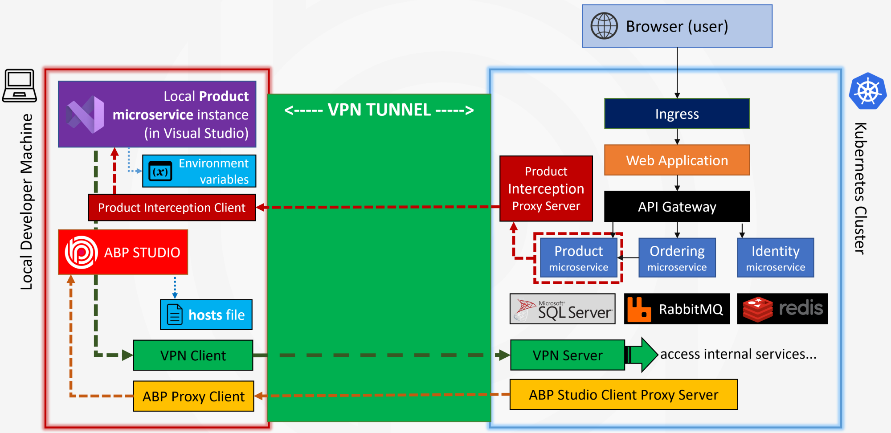

# Kubernetes Integrated Microservice Development with .NET and ABP Studio

## Abstract

**Microservice architecture** is a quite common approach to build **highly scalable** solutions with a large development team. While there are standard tools, like **Kubernetes**, to deploy, run and scale your microservices, the **development side** is not as mature as that. It is not easy to develop, run and test a single microservice that **depends on** other microservices and services. **Running** a copy of the entire system in the developer's machine is impractical.

In this article, I will introduce an **efficient** way of creating a **development environment** that is well **integrated to Kubernetes**. In this way, you can just run the microservice you are building and let Kubernetes run all your dependencies in your local machine or a remote server.

I will demonstrate the solution by introducing and using a brand new tool for ABP Developers: **ABP Studio**!

>**This article is based on my *[Kubernetes Integrated Microservice Development with ABP Studio](https://www.youtube.com/watch?v=XiPRcIHJ3NE)* talk performed in [ABP Dotnet Conf'23](https://abp.io/conference). You can watch that talk if you would like watching rather than reading.**

## Topics

Let’s start by introducing the main topics I will cover in this article:

* I will begin by defining the **problem**: Why it is hard to prepare a development environment for a microservice development.
* I will mention and demonstrate how **Microsoft’s Tye project** tries to solve the problem and why it falls short.
* Then I will introduce the **ABP Studio**, a brand new product for .NET developers, which has an efficient solution for **running multi-application solutions** locally.
* Finally, I will offer an efficient way of developing such complex solutions locally by **integrating Kubernetes into our development environment**, and demonstrate how ABP Studio automates it for us.

## Difficulties of a Microservice Development Environment

It is important to understand what is the essential problem when we try to set up a development environment for a microservice solution. To understand the main difficulty, let’s see what a microservice solution looks like:

A typical microservice solution consists of many components communicating to each other. In this example;

* We have **two applications** for users. One for back-office admin users and one for the end-users of the system, a public website.
* These applications use dedicated **API Gateways** since we are using the Backend For Frontend pattern here.
* There is a separate **authentication service** application to login and manage user accounts.
* Behind the API gateways, we typically have many API applications, called **microservices**. Here, I show only three microservices, but there will be tens of microservices even in a medium-size system. Each of these microservices may have their own databases.
* The microservices typically **interact** with each other using REST API calls or asynchronous messaging through an event bus service, like RabbitMQ here.

There will be much more **supporting services**, like Redis, Elasticsearch and so on. As you see, we have a lot of independent services and applications interacting with each other in a typical microservice solution.

### How to run a single service locally?

Generally, your responsibility is developing **one or a few of these microservices** or applications, not all of them. For example, you may be responsible for developing or testing the Product microservice:

All you want to do is to write your code, then run and test your service if it is correctly working. However, to be able to **develop**, **run**, **test** or **debug** the product microservice, all of the service and infrastructure dependencies need to be running and communicating to each other.

Okay, maybe not all, but most of them are needed. Otherwise, you can not open the application UI, login to the system, add products to basket and place an order to see if it is working properly, or you can not **live debug** your service code in case of trouble.

So, how to make the whole system up and running easily to be able to **focus on developing**, testing and debugging the Product microservice?

## The Project Tye

You are not the only one getting trouble to develop, run, test and debug a microservice solution. Microsoft also thought of it and introduced a tool called the [Project Tye](https://github.com/dotnet/tye). With its own words in their GitHub repository:

> Tye is a tool that makes developing, testing, and deploying microservices and distributed applications easier.

Tye can **simplify microservices development** by making it easy to run many services with one command, use dependencies in containers, discover addresses of other services using simple conventions. It can also deploy .NET applications to Kubernetes by automatically creating containers for .NET applications and generating Kubernetes manifests with minimal knowledge or configuration.

The deployment part is not mature and they have to do a lot of work. However, the solution runner part works very well.

Tye project consists of three major components:

* A **YAML file** to configure your services
* A **CLI tool** to run and deploy the solution
* And a **dashboard** to visualize the running services.

### The tye.yaml file

Tye uses a YAML file to configure your solution. It typically contains many service definitions. There are three type of services can be defined in this YAML file:

* You can add a **.NET Project**, so Tye runs it locally with **dotnet run**
* You can add a **container definition**, and Tye runs it using **Docker**
* And an arbitrary **executable application** that can be run using a terminal command

Here, an example content of a `tye.yaml` file:

### The Tye CLI

Once you define your YAML file, Tye can run all the services with a single terminal command: **tye run**. It builds all .NET applications before running them. If you specify the **watch parameter**, it watches the changes in your .NET projects, re-builds and runs them when a change happens. There are also [other commands](https://github.com/dotnet/tye/blob/main/docs/reference/commandline/README.md) to build and deploy your solution.

### The Tye Dashboard

The final major component is the Tye Dashboard. With this dashboard, you can see the **list of the services** with their statuses. You can also view their **logs** and open their **UI** with a single click.

A screenshot from the Tye Dashboard:

### The Example Microservice Solution

I’ve prepared a microservice solution for demos in this article and I will use the same solution in all demos. Here, an overall diagram of the example solution:

We have two web applications, two API Gateways, 5 microservices. 3 of them are shown here: Product, Ordering and Identity microservices. Every microservice has its independent SQL Server database. They communicate through REST API calls and distributed events via RabbitMQ.

### The Project Tye Demo

You can watch my 6-minutes demo to see the Project Tye in action:

<iframe width="560" height="315" src="https://www.youtube.com/embed/S0-z29lMokA" title="YouTube video player" frameborder="0" allow="accelerometer; autoplay; clipboard-write; encrypted-media; gyroscope; picture-in-picture; web-share" allowfullscreen></iframe>

[Click here to watch the demo on YouTube](https://www.youtube.com/watch?v=S0-z29lMokA)

### Tye: Shortcomings

The demo shows how the Tye project is useful. However, there are many missing points and problems with the current project state. Let’s talk about them;

* The first problem is that it **starts very slow**, because every time you run it, it builds all the services. It takes more than 1 minute for a solution with only ten services.
* It currently can run everything in your **local computer**. Even if you want to develop a single service, running tens of services locally consumes your system resources. You need a lot of RAM and CPU if you want to work a large solution locally.
* The **UI part** is currently very simple. For example, if you want to debug one of your services by running it in Visual Studio, you need to stop all the services, change the YAML file to exclude that service from Tye, then run all the services again. Only after that you can run your service in Visual Studio to debug it as integrated to other services. Obviously this process is not easy and comfortable.
* We can only see the application logs in the UI. **More insights** about the internals of services would be very helpful.
* Tye currently has some **partial documents** in its GitHub repository. However, the documentation is far away from being complete.
* Finally, and most importantly, there is **no active development** on the Tye project on GitHub. It was already an experimental project with its early state, as declared in its GitHub repository.

So, basically, it seems Microsoft has no further interest in this project and you can expect it will be retired in the near future.

## ABP Studio

Okay, now we came to the ABP Studio part. At [Volosoft](https://www.volosoft.com/), we were silently working on the ABP Studio project for more than one year.

ABP Studio is a **cross-platform desktop application** for ABP developers. It is **well integrated** to the ABP Framework and aims to provide a comfortable development environment for you by **automating things**, **providing insights** about your solution, making **develop**, **run** and **deploy** your solutions much easier.

We are planning to release a **beta version** in **Q3 of 2023**. You can expect the following features shipping with the initial release:

* You can **create new ABP solutions** and modules easily with a lot of options.
* You can easily **install or uninstall modules** to your solution.
* You can **explore** the fundamental **structures** of your solution or used modules, like entities, repositories, application services, UI pages, HTTP APIs, database tables and much more.
* You can build **multi-module monolith applications** or distributed microservice solutions by easily adding modules and services into your solution.
* You can easily **run multiple applications** and services with a single click, just like I demonstrated with the Project Tye. However, it has much more features.
* You can run your service by **integrating** it into a **Kubernetes** cluster, so you don’t need to run all your dependencies and all other services in your local development environment. This is the essential topic of this talk and I will later demonstrate how it works.

## ABP Studio Solution Runner

I've prepared a demo of the ABP Studio Solution Runner, but first I want to mention the main features of the solution runner:

* First of all, it can run one, **multiple** or **all services** with a single click. In this way, it is very easy to stop a service, run it in Visual Studio to **test** or **debug**.
* All the services are **connected to ABP Studio** and send their internal data to **visualize** on the ABP Studio UI.
* In the **overall view**, you can see a list of services, view **real-time** HTTP Request and exception counts for each service.
* You can see all details of all **HTTP requests** coming to any service.
* You can see **exception details** as real-time in any service, easily filter and search.
* Just like Tye, you can see the **application logs**. But as more, you can filter logs by log level or search in the log texts.
* Last but not least, ABP Studio has an **integrated Chrome browser** inside it. You can browse the UI of your application without leaving the solution runner.

### ABP Studio Solution Runner Demo

You can watch my 9-minutes demo to see ABP Studio Solution Runner in action:

<iframe width="560" height="315" src="https://www.youtube.com/embed/sSCxyccoHqE" title="YouTube video player" frameborder="0" allow="accelerometer; autoplay; clipboard-write; encrypted-media; gyroscope; picture-in-picture; web-share" allowfullscreen></iframe>

[Click here to watch the demo on YouTube](https://www.youtube.com/watch?v=sSCxyccoHqE)

## ABP Studio Kubernetes Tunnel

Finally, we came to the essential topic I want to talk about. Until that point, we had a good understanding of the problem and possible solutions. In this part, we will make a final touch to the solution to have **a great development environment for a microservice solution**.

ABP Studio Kubernetes Tunnel System allows you to **connect your local development environment to a local or remote Kubernetes cluster**, where that cluster already runs your microservice solution. In this way, you can access any service in Kubernetes with their service name as DNS, just like they are running in your local computer. This is established with a secure VPN connection.

Secondly, you can **intercept any service** in that cluster, so all the **traffic to the intercepted service is automatically redirected to your service** that is running in your local machine. When your service needs to use any service in Kubernetes, the traffic is redirected back to the cluster, just like your local service is running inside the Kubernetes. In this way, you don’t need to care about how all other services are configured and running. You just focus on the service you are responsible for developing, testing or debugging. You can use your favorite IDE since you are running your service in your local machine as you always do.

The solution runner is a great way of running multiple services locally. However, if your solution consists of hundreds of services, running all them in your local machine will consume your system resources and slow down your development speed. The best news is that: You can use the **Kubernetes Tunnelling combined with all the solution runner features** to have a perfect local microservice development environment.

### How ABP Studio Kubernetes Tunnel works

I am sure that you want to see it in action, but before that, let me explain how the solution works.

* **Kubernetes cluster** is shown on the right side and your **local development machine** is shown on the left side.
* As you know, when a **user requests a web page** from your web application, the request is accepted by an **Ingress Controller** inside your Kubernetes cluster.
* The Ingress controller forwards the request to your **web application**, which then uses an **API gateway** to consume your microservices.
* Assume that we have the **Product**, **Ordering** and **Identity** microservices.
* These microservices have their own SQL Server **database** and they are also using **RabbitMQ**, **Redis** and some other **infrastructure services**.
* On the other hand, we want to develop, run or test our **Product microservice** in our **own laptop** using our favorite IDE, let’s say using Visual Studio.
* If we don’t make anything special, the **product microservice in the Kubernetes cluster** will be used by the users, as you can expect. Even if you can somehow run the product microservice in your local computer, the Kubernetes system won’t have any knowledge about it. They are in different systems.
* At this point, ABP Studio comes into play. When you **connect** to the Kubernetes cluster with ABP Studio, it first installs a **VPN server** into your cluster and a **VPN client** into your local machine.
* Then it establishes a secure **VPN tunnel** between your computer and the target Kubernetes cluster. In this way, you can access all services in Kubernetes with their internal cluster IP addresses.
* ABP Studio also installs the **ABP Studio Client Proxy Server** pod into the Kubernetes cluster, and the **ABP Studio Proxy Client** into the developer machine. It is used to collect data from the services and show them in the ABP Studio UI, like HTTP Requests, exceptions, or logs as we’ve seen in the solution runner before.
* Finally, ABP Studio also adds **DNS records to your hosts file**, so you can access to internal Kubernetes services directly with their service names, in addition to their IP addresses.

All of these happen when you click the Connect button on the ABP Studio. Now, your computer can use the **internals of the Kubernetes cluster**. But, how the HTTP Requests coming to the Product service in the Kubernetes cluster are **redirected to your local machine**?

* When you want to run and test a service locally, you **intercept the matched service** in the Kubernetes cluster. When you Intercept a service, ABP Studio makes some more changes in your local computer and in your Kubernetes cluster.
* As first, it installs a **pod** and a **service** into the Kubernetes cluster to intercept the requests coming to the Product microservice and **proxies the requests to** a client application in **your local computer**.
* The local client application then **forwards requests** to the Product microservice instance you are running in your local machine. In this way, whenever the Product service is used in Kubernetes, your local product service is executed. You can easily run, test or debug your service as you normally do with your standard IDE, for example with Visual Studio.
* What happens when your local product service needs to **access** the SQL Server database or RabbitMQ, or another microservice in the Kubernetes cluster? It can **directly use** them just like local services, through the **VPN tunnel** we have already created.
* ABP Studio makes a final change in your local product microservice project: It overrides all the **environment variables** with the ones obtained from the product service in the Kubernetes pod. In this way, your local product service instance feels itself in the Kubernetes cluster. Database connection strings and all other settings will be the same with the Kubernetes environment. 

Don’t worry, ABP Studio **doesn’t change your local environment variables**. The change only affects the live product service instance, and it is **reverted** when you disable the interception in ABP Studio. Also, when you click the **Disconnect** button in ABP Studio, all the changes made to your cluster and your local computer will be cleared. It won’t leave any sign in your systems.

### ABP Studio Kubernetes Tunnel Demo

So, now we have a fully Kubernetes integrated development environment. Let’s see how it is used in ABP Studio in the following 9-minutes demo:

<iframe width="560" height="315" src="https://www.youtube.com/embed/CeUq2ysz-mQ" title="YouTube video player" frameborder="0" allow="accelerometer; autoplay; clipboard-write; encrypted-media; gyroscope; picture-in-picture; web-share" allowfullscreen></iframe>

[Click here to watch the demo on YouTube](https://www.youtube.com/watch?v=CeUq2ysz-mQ)

## ABP Studio Roadmap

In the next months, the team will be working on the following items:

* Our first goal is to **finalize and stabilize** the current features. We will also **document** how to use them. Only after that, we will open it to customers as a beta version.
* We’ve focused on the development part until now. We also want to add some **deployment** capabilities to ABP Studio in the future.
* Another goal is to make **module customizations** much easier than current by the help of ABP Studio. With ABP Studio, we have completely re-though how to discover and install modules. Based on that, we will also work on a common place to publish and consume application modules for the ABP Framework.

We have other great plans for that product. However, I can not declare them yet as they are secrets for now :) We’ve planned to release the first beta version in **Q3 of 2023**.

I want to notice that ABP Studio is not a new version or replacement of **ABP Suite**. We built the ABP Studio from scratch. Both products will be developed and shipped in parallel. ABP Suite will continue to focus on code generation. ABP Studio doesn’t have any code generation capabilities yet. So, you will use both of them together.

## Summary

Okay let’s summarize what I’ve explained in this article:

* First, I explained **why it is hard to set up a microservice development environment**. We’ve talked about the hardness of developing, running and testing a single microservice that depends on infrastructure services and other microservices.
* I’ve introduced **Project Tye**, a project developed by Microsoft to allow you to easily run multi-application solutions. We made a demo, then discussed its missing points.
* Then I **introduced ABP Studio**, a new product by Volosoft for ABP developers.
  As the first important feature, I explained the ABP Studio **Solution Runner** and demonstrated how it works and how you can develop and debug your services.
* Finally, I introduced ABP Studio’s **Kubernetes Tunneling** feature. First, I explained how it works with a complicated diagram. Then I made a short demo to see it in action. 

With that final part, we had a **great and easy to use microservice development environment**. It is great, because we can focus on only a single service, while we don’t care about all other parts of the solution. Also, we can save our local development machine system resources by delegating running the dependencies to a remote Kubernetes server.

## See Also

* ABP Dotnet Conf'23 Talk on YouTube: [Kubernetes Integrated Microservice Development with ABP Studio](https://www.youtube.com/watch?v=XiPRcIHJ3NE)