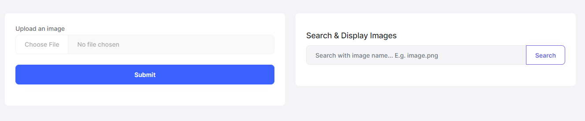
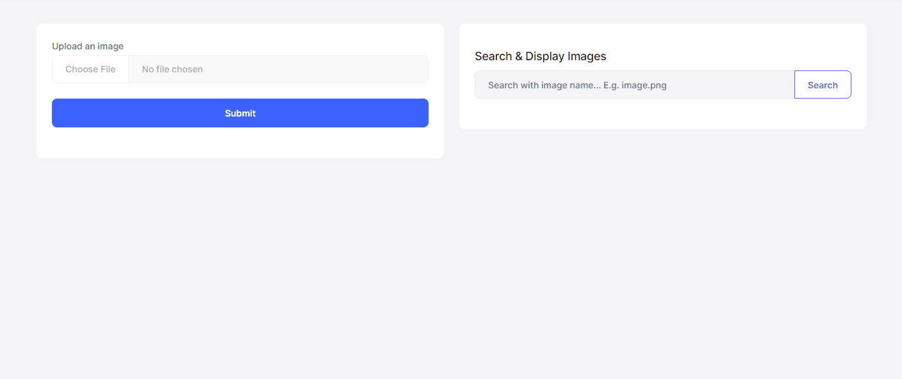

# Image Compression and Resize with ABP Framework

## Introduction

In this article, I will show how to compress and resize images easily with the ABP Framework's new [Image Manipulation System](https://docs.abp.io/en/abp/7.3/Image-Manipulation), which is introduced in v7.3.0.

ABP Framework provides services to compress and resize images and implements these services with popular [ImageSharp](https://sixlabors.com/products/imagesharp/) and [Magick.NET](https://github.com/dlemstra/Magick.NET) libraries. Currently, only these two providers are officially supported by the ABP Framework but thanks to the system being designed extensible, you can implement your own image resizer/compressor and use it in your application.

> Refer to the documentation for more info: [Image Manipulation](https://docs.abp.io/en/abp/7.3/Image-Manipulation)

### Source Code

You can find the source code of the application at [https://github.com/abpframework/abp-samples/tree/master/ImageManipulation](https://github.com/abpframework/abp-samples/tree/master/ImageManipulation). Don't hesitate to check the source code, if you are stuck on any point.

## Demo: Image Compression and Resize

The best way to see what ABP's Image Manipulation System is capable of is to see it in action. Thus, we can create a simple application that basically allows us to upload, search and display images.

### Creating a New ABP Solution

> I have created an ABP solution and you can find the [full source code of the demo application here](https://github.com/abpframework/abp-samples/tree/master/ImageManipulation). If you want to create the same solution from scratch, you can apply the following steps:

Install the ABP CLI, if you haven't installed it before:

```bash
dotnet tool install -g Volo.Abp.Cli
```

Create a new solution with the ABP Framework's Application Startup Template with MVC UI and EF Core database (default options): 

```bash
abp new ImageManipulationDemo -t app --version 7.3.0-rc.2
```

> As I have mentioned above, ABP introduced the Image Manipulation System in v7.3.0. So, ensure your application is v7.3.0 or higher.

After creating the application, let's create the database and seed the initial data by running the `*.DbMigrator` project. Also, you can run the application to see if it's working as expected.

### Configuring the BLOB Storing System

Since we are creating an image upload application, we need to store our images somewhere and read these image contents when it's needed. [BLOB Storing System](https://docs.abp.io/en/abp/latest/Blob-Storing) is a great solution to achieve this. Let's install & configure the BLOB Storing System into our application.

First, run the following command under the directory of your `*.HttpApi` project:

```bash
abp add-package Volo.Abp.BlobStoring
```

Then, we need to select and configure a storage provider to tell the BLOB Storing System where to store the file contents. There are [multiple providers](https://docs.abp.io/en/abp/latest/Blob-Storing#blob-storage-providers) that we can choose. For the simplicity of the demo, let's continue with the **database provider** and run the following command under the directory of your solution (`*.sln`):

```bash
abp add-module Volo.Abp.BlobStoring.Database
```

* This command adds all the NuGet packages to the corresponding layers of your solution.
* Also, it makes the necessary configurations, adds a new database migration, and updates the database.
* Since we are not configuring the connection string, the BLOB Storing system will use the default connection string in our application.

That's it. We have installed and configured the BLOB Storing System in our application. 

### Configuring the Image Manipulation System

After, configuring the BLOB Storing System, now we can install and configure the Image Manipulation System to be able to compress and resize images.

ABP Framework provides two image resizer/compressor implementations out of the box: [ImageSharp](https://docs.abp.io/en/abp/7.3/Image-Manipulation#imagesharp-provider) and [Magick.NET](https://docs.abp.io/en/abp/7.3/Image-Manipulation#magick-net-provider).

We can use the `Volo.Abp.Imaging.ImageSharp` as the provider for our application. To install the package, run the following command under the `*.HttpApi` project:

```bash
abp add-package Volo.Abp.Imaging.ImageSharp
```

* This package will provide the required services to compress and resize images.
* You can [configure the `ImageSharpCompressOptions`](https://docs.abp.io/en/abp/7.3/Image-Manipulation#configuration-1) to define *DefaultQuality* and encoders.


After installing the provider, now we can use the services to compress and resize our images, such as `IImageCompression` and `IImageResizer`. But there is an easier way. The `Volo.Abp.Imaging.AspNetCore` NuGet package defines some attributes for controller actions that can automatically compress and/or resize the uploaded files.

To be able to use these attributes, we need to install the `Volo.Abp.Imaging.AspNetCore` package. Type the following command under the `*.HttpApi` project:

```bash
abp add-package Volo.Abp.Imaging.AspNetCore
```

This package provides two attributes: `[CompressImage]` and `[ResizeImage]`. Whenever we use these attributes, the Image Manipulation System will automatically compress and/or resize uploaded files.

### Image Upload (with Compress & Resize)

After all the required package installations and configurations are done, now we can start implementing the API and UI for the Image Upload.

Let's start with creating the API. Create a controller in the `*.HttpApi` project named `ImageController` and perform the image upload and image display operations:

```csharp
using Microsoft.AspNetCore.Http;
using Microsoft.AspNetCore.Mvc;
using System.Threading.Tasks;
using Volo.Abp.BlobStoring;
using Volo.Abp.Imaging;

namespace ImageManipulationDemo.Controllers
{
    [Controller]
    [Route("api/image")]
    public class ImageController : ImageManipulationDemoController
    {
        private readonly IBlobContainer<ImageManipulationContainer> _blobContainer;

        public ImageController(IBlobContainer<ImageManipulationContainer> blobContainer)
        {
            _blobContainer = blobContainer;
        }

        [HttpPost("upload")]
        [CompressImage]
        [ResizeImage(width: 200, height: 200)]
        public async Task<IActionResult> UploadAsync(IFormFile file)
        {
            var fileBytes = await file.GetAllBytesAsync();
            var blobName = file.FileName;

            await _blobContainer.SaveAsync(blobName, fileBytes, overrideExisting: true);

            return Ok();
        }

        [HttpGet("")]
        public async Task<byte[]> GetImageAsync(string fileName)
        {
            return await _blobContainer.GetAllBytesAsync(fileName);
        }
    }
}
```

* Here, we have used both `CompressImage` and `ResizeImage` attributes to automatically compress & resize the uploaded file.
* As you can see, we used the `IBlobContainer<TContainer>` service to save our file content.
* Since we are using the *database provider* as BLOB storing provider, the file contents will be added to our database and then we will be able to fetch them whenever it's needed like we have done in the `GetImageAsync` method above.
* We simply used the required attributes (and they do the rest on behalf of us and call the related image resize and compress services) to resize & compress images and save the new resized/compressed image into the database.

Before implementing the UI side, as you may notice, we've injected the `IBlobContainer` as a typed service (`IBlobContainer<ImageManipulationContainer>`). A typed BLOB container system is a way of creating and managing multiple containers in an application. We haven't created the `ImageManipulationContainer` class yet.

Let's create this class as below:

```csharp
using Volo.Abp.BlobStoring;

namespace ImageManipulationDemo
{
    [BlobContainerName("image-manipulation-demo")]
    public class ImageManipulationContainer
    {
    }
}
```

* We have used the `BlobContainerName` attribute to define the name of the container.
* If we haven't used the `BlobContainerName` attribute, ABP Framework uses the full name of the class with its namespace.

We have implemented the endpoints and now can start implementing the UI side. You can see the following figure to see what we are going to design for the image upload page:



Let's start designing this page. Open the `Index.cshtml` file (*/Pages/Index.cshtml*) under the `*.Web` project and replace it with the following content:

```html
@page
@using Microsoft.AspNetCore.Mvc.Localization
@using ImageManipulationDemo.Localization
@using Volo.Abp.Users
@model ImageManipulationDemo.Web.Pages.IndexModel
@inject IHtmlLocalizer<ImageManipulationDemoResource> L
@inject ICurrentUser CurrentUser
@section styles {
    <abp-style src="/Pages/Index.css" />
}
@section scripts {
    <abp-script src="/Pages/Index.js" />
}

<div class="container">
    <div class="row">
        <div class="col">
            <div class="card">
                <div class="card-body">
                    <form method="post" id="upload-image" enctype="multipart/form-data">
                        <div class="mb-3">
                            <label for="formFile" class="form-label">Upload an image</label>
                            <input class="form-control" type="file" id="formFile" required/>
                        </div>

                        <div class="mb-3">
                            <button type="submit" class="btn btn-primary d-block w-100">Submit</button>
                        </div>
                    </form>
                </div>
            </div>
        </div>

        <div class="col">
            <div class="card">
                <div class="card-title">
                </div>
                <div class="card-body">
                    <h5 class="card-title my-2">Search & Display Images</h5>

                    <form method="get" id="search-image">
                        <div class="input-group mb-3">
                            <input id="img-search-input" type="text" class="form-control" placeholder="Search with image name... E.g. image.png" aria-label="Search with image name" aria-describedby="button-search" required>
                            <button class="btn btn-outline-secondary" type="submit" id="button-search">Search</button>
                        </div>
                    </form>

                    <div class="d-none" id="image-result">
                    </div>
                </div>
            </div>
        </div>
    </div>
</div>
```

Then, open the `index.js` file and replace it with the following content:

```js
$(function () {

    $("#upload-image").submit(function (e) {
        e.preventDefault();

        var file = document.getElementById("formFile").files[0];
        var formData = new FormData();
        formData.append("file", file);

        $.ajax(
            {
                url: "/api/image/upload",
                data: formData,
                processData: false,
                contentType: false,
                type: "POST",
                success: function (data) {
                    abp.message.success("Image saved successfully!");
                },
                error: function (err) {
                    abp.message.error("An error occured while saving the image.");
                }
            }
        );
    });

    $("#search-image").submit(function (e) {
        e.preventDefault();

        var imgResult = $("#image-result");
        imgResult.removeClass("d-none");

        imgResult.html("<p>Loading...</p>");

        var fileName = $("#img-search-input").val();

        imageManipulationDemo.controllers.image.getImage(fileName)
            .then(function (imageFile) {
                var src = "data:image/png;base64," + imageFile;
                var img = "";

                imgResult.html(img);
            })
            .catch(function (err) {
                imgResult.html("<p>Could not find the image...</p>");
            });
    });
});
```

Now, we can run the application and see the Image Manipulation System in action:



The results are impressive for the example above:

* The original image was 12 KB and now the compressed & resized image has been reduced to 8 KB. 
* The original image was 225x225 and now resized as 200x200.

## Conclusion

In this article, I have shown you how to compress and/or resize images with ABP Framework's Image Manipulation System by just defining some attributes to the top of the controller actions. 

Also, I have shown that you can use the BLOB Storing System to store file contents and compress/resize images before saving them into BLOB Storages thanks to the image resizers/compressors provided by ABP Framework.

## See Also

* [BLOB Storing](https://docs.abp.io/en/abp/latest/Blob-Storing)
* [Image Manipulation](https://docs.abp.io/en/abp/7.3/Image-Manipulation#iimageresizer)
