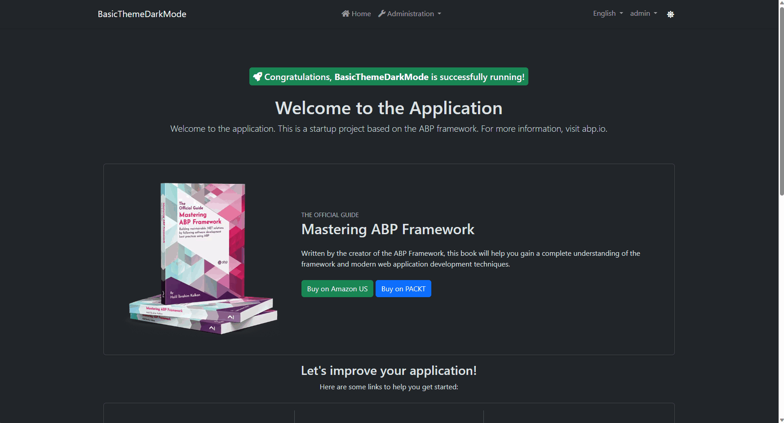
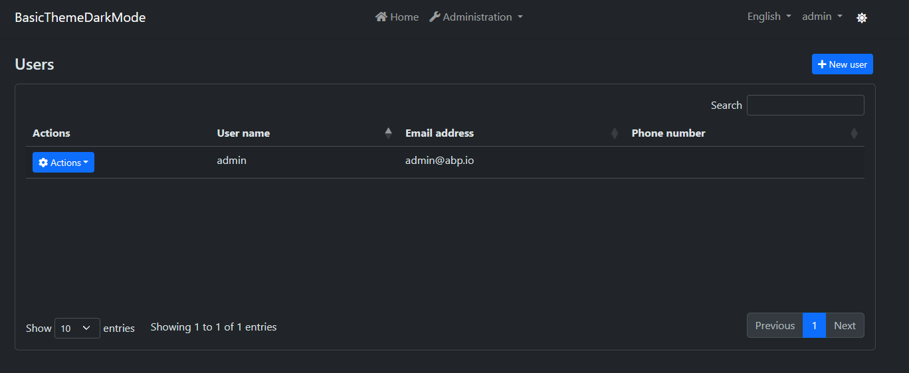
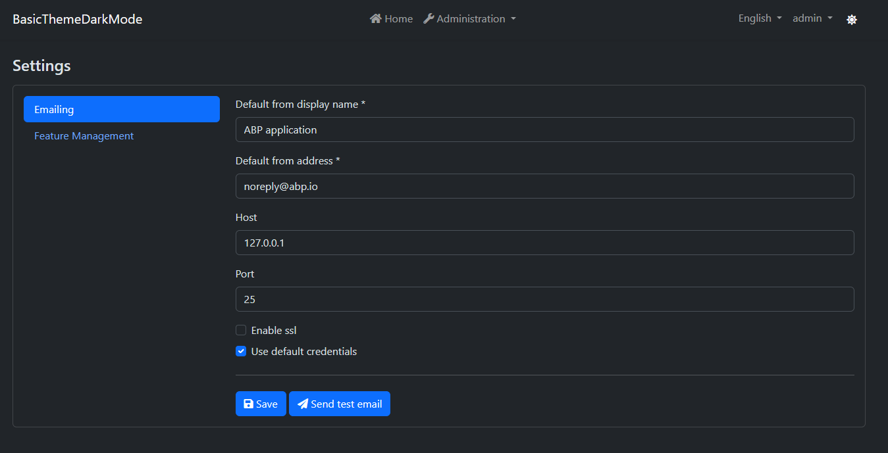
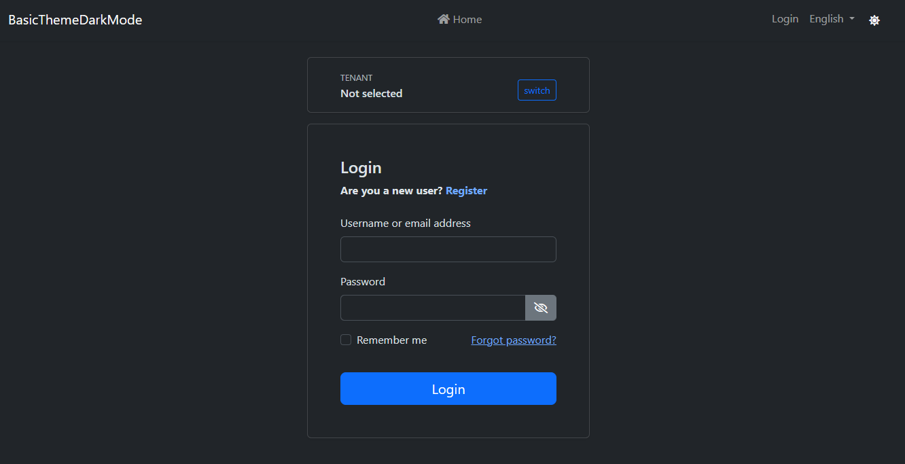

# Adding Dark Mode Support to the Basic Theme
Basic Theme uses plain bootstrap and does not have any custom colors & styles. This article will show you how to add dark mode support to the [Basic Theme](https://docs.abp.io/en/abp/latest/UI/AspNetCore/Basic-Theme).

Bootstrap brings the [Color Modes](https://getbootstrap.com/docs/5.3/customize/color-modes/#dark-mode) feature with version **5.3**. This feature allows you to add dark mode support to your website with a single line of code. Adding the `data-bs-theme="dark"` attribute changes the color mode of the element to dark mode.

## Instructions

1. Create a new project with the following command:
    ```bash
    abp new BasicThemeDarkMode -t app --theme basic
    ```

2. Create a component that toggles the color mode.

   - Create a new file named `Components/ChangeTheme/Default.cshtml`:
        ```html
        <div class="text-light mt-1">    
            <button class="btn text-light" href="#" id="ToolbarChangeTheme">
                <i class="fas fa-sun"></i>
            </button>
        </div>
        ```

   - Create a new file named `Components/ChangeTheme/ChangeThemeViewComponent.cs`:
        ```csharp
        using Microsoft.AspNetCore.Mvc;
        using Volo.Abp.AspNetCore.Mvc;

        namespace BasicThemeDarkMode.Web.Components.ChangeTheme;
        
        [Widget(ScriptFiles = new[]{"/Components/ChangeTheme/ChangeTheme.js"})]
        public class ChangeThemeViewComponent : AbpViewComponent
        {
            public IViewComponentResult Invoke()
            {
                return View("~/Components/ChangeTheme/Default.cshtml");
            }
        }
        ```

   - Create a JavaScript that manages the last selected theme and toggles the color mode. It stores the last selected theme in the *local storage*. So, you don't need to store it in the database.

     - Create a new file named `Components/ChangeTheme/ChangeTheme.js`:
        ```js
        $(function () {
            function changeTheme(theme) {
                window.localStorage.setItem('theme', theme);
                document.getElementsByTagName('body')[0].setAttribute('data-bs-theme', theme);
            }

            function toggleTheme(){
                getTheme() == 'light' ? changeTheme('dark') : changeTheme('light');
            }

            function getTheme(){
                return window.localStorage.getItem('theme') ?? 'dark';
            }

            function init(){
                let theme = getTheme();
                if(theme){
                    changeTheme(theme);
                }
            }

            document.getElementById('ToolbarChangeTheme').addEventListener('click', () => {
                toggleTheme();
            });

            init();
        });
        ```

3. Create a new [Toolbar Contributor](https://docs.abp.io/en/abp/latest/UI/AspNetCore/Toolbars) and add a newly created view component to the application toolbar.

    - Create a new class named `BasicThemeDarkModeToolbarContributor.cs`:
        ```csharp
        using BasicThemeDarkMode.Web.Components.ChangeTheme;
        using System.Threading.Tasks;
        using Volo.Abp.AspNetCore.Mvc.UI.Theme.Shared.Toolbars;

        namespace BasicThemeDarkMode.Web;

        public class BasicThemeDarkModeToolbarContributor : IToolbarContributor
        {
            public Task ConfigureToolbarAsync(IToolbarConfigurationContext context)
            {
                if (context.Toolbar.Name == StandardToolbars.Main)
                {
                    context.Toolbar.Items
                        .Add(new ToolbarItem(typeof(ChangeThemeViewComponent)));
                }

                return Task.CompletedTask;
            }
        }
        ```

    - Configure [Toolbar Options](https://docs.abp.io/en/abp/latest/UI/AspNetCore/Toolbars) and add a newly created contributor:
        ```csharp
        Configure<AbpToolbarOptions>(options =>
        {
            options.Contributors.Add(new BasicThemeDarkModeToolbarContributor());
        });
        ```

That's it! Now, you can toggle the color mode by clicking the sun icon in the toolbar:



- Users Page in Dark Mode:

    

- Settings Page in Dark Mode:

    

- Login Page in Dark Mode:

    

## Conclusion

The theme is stored in **local storage** and it's initialized on the client-side. You can use **Cookies** to render the page in the last selected theme on **server-side** to prevent the flash effect while navigating pages. This document shows the concept of adding dark mode support of bootstrap to the Basic Theme.
