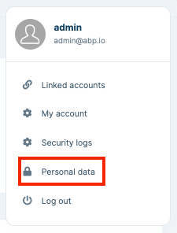
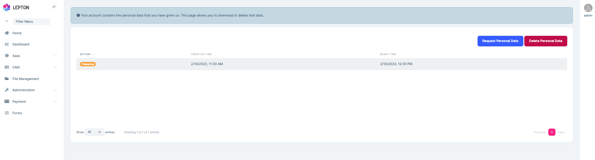
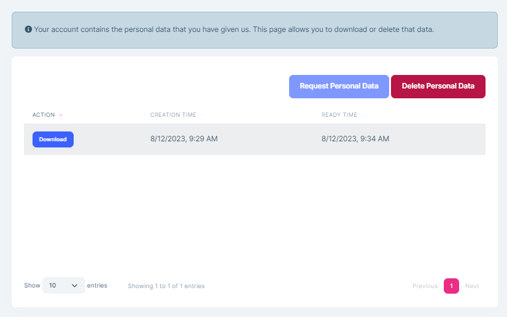
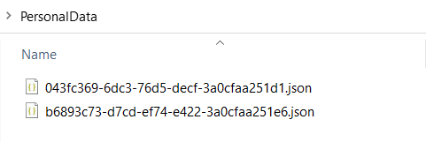

# ABP Commercial - GDPR Module Overview

In this article, I will highlight ABP Commercial's [GDPR Module](https://commercial.abp.io/modules/Volo.Gdpr) and show you how to provide personal data to the GDPR Module that is collected by your application and make it aligned with personal data download results.

## GDPR Module

[GDPR Module](https://docs.abp.io/en/commercial/latest/modules/gdpr) allows users to download and delete the data collected by the application. It's used for Personal Data Management obligating by the GDPR regulation and provides the following features:

* Allows users to request their personal data.
* Lists the personal data requests and users can download their personal data by the listed request times.
* Allows users to delete their personal data and their accounts permanently.

The GDPR module is pre-installed in the [Application](https://docs.abp.io/en/commercial/latest/startup-templates/application/index) and [Application (Single Layer)](https://docs.abp.io/en/commercial/latest/startup-templates/application-single-layer/index) Pro Startup templates for ABP Commercial customers. Therefore, most of the time you don't need to manually install it.

> If you need to install the GDPR Module manually, you can refer to the [GDPR Module documentation](https://docs.abp.io/en/commercial/latest/modules/gdpr#how-to-install).

Let's create an Application template with the following command and see the UI for the GDPR module:

```csharp
abp new GdprDemo -t app-pro
```

After the application is created, we can run the application and login to the application. Then, when we check the user menu, we should be able to see the "Personal Data" menu item:



We can click this menu item to navigate to the "Personal Data Management" page:



This page is used to manage personal data requests. You can view past requests, the current status of the latest request, create a new personal data download request, download the prepared personal data or delete all your personal data (makes the data anonymized) and account from the application.

### Downloading Personal Data

After a quick overview of the GDPR module, now we can deep dive into the Personal Data Download process.

The GDPR module requests information from the other modules that reference the `Volo.Abp.Gdpr.Abstractions` package and merges the response data into a single JSON file and the personal data can be downloaded later by the user from the "Personal Data Management" page when it's prepared (when the specified preparation time has been passed). 

Currently, only the [Identity Pro module](https://docs.abp.io/en/commercial/latest/modules/identity) provides some personal data to the GDPR Module because it's the only module that can be considered as collecting personal data, such as the user's name, surname, email address, and so on. Therefore, ABP makes everything that is needed such as getting all data collected when the personal data download request has been made or deleting/anonymizing the personal data when the personal data delete request has been made.

This might be enough for some of your applications and you would not need to collect any other sensitive data from a user. However, most of the time you would probably need to collect some personal data from users for certain reasons. 

In that case, you should provide the personal data that you collected for a certain user in your application/module or provider to the GPDR module. So, when the personal data download request has been made, the GDPR module can request the information from the different part of your application and merges the response data into a single JSON file to be downloaded. In other words, the data provided by you will be considered as personal data and whenever a user requests his/her personal data, it'll be included in the result.

In the next section, we will see how to provide personal data from a different module/provider. 

## Providing Personal Data

Let's assume that we have an e-commerce application and we need to get the address from a user to send their order. Address information is considered as personal data according to GDPR regulations. Therefore, we need to provide the address information to the GDPR Module.

For this purpose, we need to subscribe to the `GdprUserDataDeletionRequestedEto` and `GdprUserDataRequestEto` distributed events. These ETOs (event transfer objects) come from the `Volo.Abp.Gdpr.Abstractions` package, which is used to start deleting/anonymizing and downloading personal data requests. `Volo.Abp.Gdpr.Domain` package is pre-installed in the domain layer and has reference to that package, so most of the time you don't need to reference to the `Volo.Abp.Gdpr.Abstractions` package.

But, if you want to use these ETOs in a different project, you should add the `Volo.Abp.Gdpr.Abstractions` package. You can use the following command to add it to your project:

```bash
abp add-package Volo.Abp.Gdpr.Abstractions
```

After we have ensured that we have reference to the package, then we can create a new event handler class named `AddressGdprEventHandler` and subscribe to the `GdprUserDataDeletionRequestedEto` and `GdprUserDataRequestEto` distributed events:

```csharp
public class AddressGdprEventHandler :
    IDistributedEventHandler<GdprUserDataDeletionRequestedEto>,
    IDistributedEventHandler<GdprUserDataRequestedEto>,
    ITransientDependency
{
    //inject your services
    protected IDistributedEventBus EventBus { get; }

    public AddressGdprEventHandler(IDistributedEventBus eventBus)
    {
        EventBus = eventBus;
    }

    public Task HandleEventAsync(GdprUserDataDeletionRequestedEto eventData)
    {
        //anonymize the personal data

        return Task.CompletedTask;
    }

    public async Task HandleEventAsync(GdprUserDataRequestedEto eventData)
    {
        //assume we have retrieved the address for a certain user
        //by querying eventData.UserId
        var address = new Address
        {
            City = "Istanbul",
            Postcode = "...",

            //other properties...
        };

        var gdprDataInfo = new GdprDataInfo
        {
            { "City", address.City },
            { "Postcode", address.Postcode }
        };

        await EventBus.PublishAsync(
            new GdprUserDataPreparedEto
            {
                RequestId = eventData.RequestId,
                Data = gdprDataInfo, //collected personal data
                Provider = GetType().FullName //your module/provider name
            });
    }
}
```

* Here, we have subscribed to the `GdprUserDataDeletionRequestedEto` and `GdprUserDataRequestEto` distributed events.
* When a user made a personal data preparation request, then the `GdprUserDataRequestEto` is published by the GDPR module and the data preparation process starts. Modules/providers provide sensitive personal data by subscribing to this event and publishing a `GdprUserDataPreparedEto` distributed event, with the data and the provider information. Thanks to this, you can distinguish the personal data by the collected provider/module.
* Then, the GDPR module subscribes to the `GdprUserDataPreparedEto` distributed events that are published by multiple modules/providers and merge the response data into a single JSON file, and the personal data can be downloaded later by the user when the data preparation is done.
* On the other hand, when a user made a request to delete his/her personal data from the application, the `GdprUserDataDeletionRequestedEto` is published, so we can subscribe to the event and anonymize the personal data in our application.
* Also, the Identity Pro module deletes the user's account permanently.

Now, let's run the application once again and make a personal data download request. But before that, we can configure the `AbpGdprOptions` as follows to not wait for long and show our personal data result:

```csharp
Configure<AbpGdprOptions>(options =>
{
    options.MinutesForDataPreparation = 5; //wait 5 minutes for data-preperation
});
```

After we have made a personal data preparation request, we need to wait for 5 minutes for personal data to be collected and then we can download it. After 5 minutes have passed, we can see the "Download" action button for the request on the "Personal Data Management" page:



Then, when we clicked the download button, a zip file will be downloaded. We can unzip the file and examine the JSON files that contain our personal data. If you have followed and applied the steps from now, you should be seeing two JSON files. One of them is for user-specific information provided by the Identity Pro module and the other one is the address information provided by us (our application-specific personal data).



*Basic information for the user:*

```json
{"Username":"admin","Name":"admin","Surname":null,"Email":"admin@abp.io","Phone Number":null}
```

*Address information that we provided in this article:*

```json
{"City":"Istanbul","Postcode":"..."}
```

## Conclusion

In this article, I've explained the GDPR Module's data collection system and given you a brief overview of the module. GDPR Module allows you to request to download personal data, delete/anonymize your own personal data and delete your account permanently. It's pre-installed in the Application and Application(single layer) Pro Startup templates, but you can easily configure it to your existing application.
