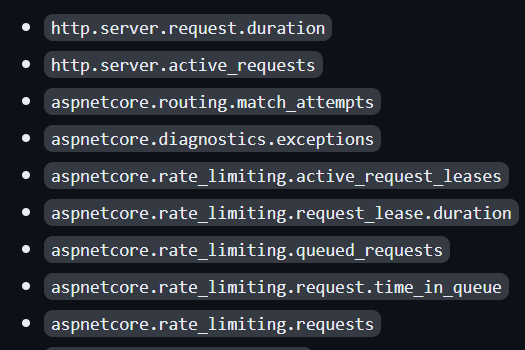

# .NET 8 - ASP.NET Core Metrics

In this article, I'll show you the new built-in metrics of .NET 8, which are basically numerical measurements reported over time in your application and can be used to monitor the health of your application and generate reports according to those numerical values. We will see what the metrics are, why to use them, and how to use them in detail. So, let's dive in.

## What are Metrics?

Metrics are numerical measurements reported over time. These measurements are crucial for monitoring the health of an application and generating alerts when necessary. In the context of a web service, various metrics can be tracked, such as:

* Requests per second.
* Response time.
* Status code counts etc...

These metrics are not just collected; they are reported to a monitoring system at regular intervals. By doing so, the development and operations teams can visualize these metrics on dashboards. These dashboards provide a real-time overview of the application's performance and health.

## Pre-Built Metrics

ASP.NET Core has many built-in metrics. You can see the following figure for a list of built-in metrics for ASP.NET Core:



> See https://learn.microsoft.com/en-us/dotnet/core/diagnostics/built-in-metrics-aspnetcore and https://github.com/dotnet/aspnetcore/issues/47536 for all built-in metrics and their descriptions.

For example, we have the `kestrel-current-connections` metric that shows the _number of connections that are currently active on the server_ and the `http-server-request-duration` metric that shows _the duration of HTTP requests on the server_. 

All of these and other built-in metrics are produced by using the [**System.Diagnostics.Metrics**](https://learn.microsoft.com/en-us/dotnet/api/system.diagnostics.metrics) API and with a small amount of code, we can use & view them.

## Using Pre-Built Metrics

Let's see the pre-built metrics in action.

Create a new ASP.NET Core app with the following command and change the directory to the created application folder:

```bash
dotnet new web -o MetricsDemo
cd MetricsDemo
```

After that, open the application in your favorite IDE and add the following service registration code to your application:

```csharp
var builder = WebApplication.CreateBuilder(args);

builder.Services.AddOpenTelemetry()
    .WithMetrics(builder =>
    {
        builder.AddPrometheusExporter();

        builder.AddMeter("Microsoft.AspNetCore.Hosting",
            "Microsoft.AspNetCore.Server.Kestrel");
        builder.AddView("http.server.request.duration",
            new ExplicitBucketHistogramConfiguration
            {
                Boundaries = new double[] { 0, 0.005, 0.01, 0.025, 0.05,
                    0.075, 0.1, 0.25, 0.5, 0.75, 1, 2.5, 5, 7.5, 10 }
            });
    });
```

Here, we have done the following steps:

* The `AddOpenTelemetry` method registers the required **OpenTelemetry** services into the DI container.
* In the `WithMetrics` method, we add pre-built metrics to the `OpenTelemetryBuilder` in the `AddMeter` method (_Microsoft.AspNetCore.Hosting_ and _Microsoft.AspNetCore.Server.Kestrel_ are pre-built metrics provided by ASP.NET Core). 
* We have also used the `AddView` method to customize the output of the metrics by the SDK. It can also be used to customize which [Instruments](https://github.com/open-telemetry/opentelemetry-specification/blob/main/specification/metrics/api.md#instrument) are to be processed or ignored.

After making the related configurations, let's add the middleware below and view the metrics: 

```csharp
app.MapPrometheusScrapingEndpoint();

app.MapGet("/", () =>
{
    Thread.Sleep(2000);
    
    return "Hello, ABP Community member: " + DateTime.Now.Ticks.ToString()[^3..];
});
```

* `MapPrometheusScrapingEndpoint`: Adds the OpenTelemetry Prometheus scraping endpoint middleware to the pipeline and then we can see the all metrics by navigating to the **/metrics** endpoints (optional):


### View Metrics

You can use the `dotnet-counters` command-line tool, which allows you to view live metrics for .NET Core apps. You can run the following command to install the tool:

```bash
dotnet tool update -g dotnet-counters
```

After the tool is installed, you can run the application and by running the `dotnet-counters` tool in a terminal, you can monitor for the specific metrics:

```bash
dotnet-counters monitor -n MetricsDemo --counters Microsoft.AspNetCore.Hosting
```

When you run the command, it will print a message like the one below and will wait for an initial request to your application:

```txt
Press p to pause, r to resume, q to quit. 
    Status: Waiting for initial payload...
```

If you send a request to your application, then the related built-in metrics that you have added will be collected and will be shown in the terminal instantly:


Also, you can check for the other metric that we have used in the configuration, which is _Microsoft.AspNetCore.Server.Kestrel_ by setting it as a counter as in the command below, and when you send a request to your application, you will see different metrics:

```bash
dotnet-counters monitor -n MetricsDemo --counters Microsoft.AspNetCore.Server.Kestrel
```

## Creating Custom Metrics in ASP.NET Core Applications

So far, we have seen what metrics are, which built-in metrics are provided by ASP.NET Core, the use of the built-in metrics and running the `dotnet-counters` global tool to view these metrics. At this point, let's see how we can create custom metrics and view them via the `dotnet-counters` tool. 

`IMeterFactory` is the recommended service to create *Meter* instances. ASP.NET Core registers the `IMeterFactory` in dependency injection (DI) by default. The meter factory integrates metrics with DI, making isolating and collecting metrics easy.

Assume that, we want to create a metric that holds the sold products in our application. For that purpose, as a first step, we can create a metric class as follows:

```csharp
using System.Diagnostics.Metrics;

namespace MetricsDemo;

public class ProductMetrics
{
    private readonly Counter<int> _soldProductsCount;

    public ProductMetrics(IMeterFactory meterFactory)
    {
        var meterInstance = meterFactory.Create("MetricsDemo.ProductStore");
        _soldProductsCount = meterInstance.CreateCounter<int>("metricsdemo.productstore.sold_products_count");
    }

    public void IncreaseSoldProductCount(int quantity)
    {
        _soldProductsCount.Add(quantity);
    }
}
```

In this class, we are creating a counter and defining metrics that we want to collect and view. `MetricsDemo.ProductStore` is the **counter name** and `metricsdemo.productstore.sold_products_count` is the **metric**. In our example, we need to register this class with a `Singleton` lifetime because we don't want to reset the counter and want to keep it during the application runtime. 

> The [System.Diagnostics.Metrics.Meter](https://learn.microsoft.com/en-us/dotnet/api/system.diagnostics.metrics.meter) type is the entry point for a library to create a named group of instruments. Instruments record the numeric measurements that are needed to calculate metrics. Here we used [CreateCounter](https://learn.microsoft.com/en-us/dotnet/api/system.diagnostics.metrics.meter.createcounter) to create a Counter instrument named _metricsdemo.productstore.sold_products_count_.

So, register the type with the DI container in the `Program.cs` file (or you can implement the `ISingletonDependency` interface, if you are using an ABP based application):

```csharp
builder.Services.AddSingleton<ProductMetrics>();
```

Then, we can inject this class and increase the sold product count whenever it's needed. Since we have registered it in DI, we can use it in minimal APIs as in the following example:

```csharp
app.MapPost("/complete-sale", ([FromBody] ProductSoldModel model, ProductMetrics metrics) =>
{
    // ... business logic such as saving the product to the database etc... ...

    metrics.IncreaseSoldProductCount(model.Quantity);
});
```

Whenever a request is made to this endpoint the metric that we've defined (_metricsdemo.productstore.sold_products_count_) will be increased and we can see this metric via the `dotnet-counters` global tool. You can run the following command to see the metrics:

```bash
dotnet-counters monitor -n MetricsDemo --counters MetricsDemo.ProductStore
```

Here is an example output that you would see if you have made a POST request to the `/complete-sale` endpoint:

```txt
Press p to pause, r to resume, q to quit.
    Status: Paused                                        

[MetricsDemo.ProductStore]
    metricsdemo.productstore.sold_products_count (Count / 1 sec)          20 
```

### Advanced: View Metrics in Prometheus & Grafana - Building Dashboards

It's a common requirement to build a dashboard and monitor the metrics and check the health of your applications. At that point, you can expose the metrics and scrape them using the [Prometheus](https://learn.microsoft.com/en-us/aspnet/core/log-mon/metrics/metrics?view=aspnetcore-8.0#set-up-and-configure-prometheus) and build a dashboard by using the [Grafana](https://learn.microsoft.com/en-us/aspnet/core/log-mon/metrics/metrics?view=aspnetcore-8.0#show-metrics-on-a-grafana-dashboard).

If you want to build a dashboard, you can see [this documentation from Microsoft](https://learn.microsoft.com/en-us/aspnet/core/log-mon/metrics/metrics?view=aspnetcore-8.0#view-metrics-in-grafana-with-opentelemetry-and-prometheus), which shows how to set up the **Prometheus server** and show metrics on a **Grafana** dashboard.

Also, you can check [this video](https://www.youtube.com/watch?v=A2pKhNQoQUU) if you want to see it in action.

## Conclusion 

In this article, I've shown you the new built-in metrics of .NET8, described what metrics are, which pre-built metrics are provided by ASP.NET Core, how to use & view these pre-built metrics and finally, I have shown you how to create custom metrics and view them in a dashboard. If you want to learn more about the **Metrics System of .NET**, you can check out the references that I have shared below.

## References

* https://learn.microsoft.com/en-us/aspnet/core/log-mon/metrics/metrics?view=aspnetcore-8.0
* https://devblogs.microsoft.com/dotnet/announcing-dotnet-8-preview-5/
* https://www.youtube.com/watch?v=A2pKhNQoQUU
