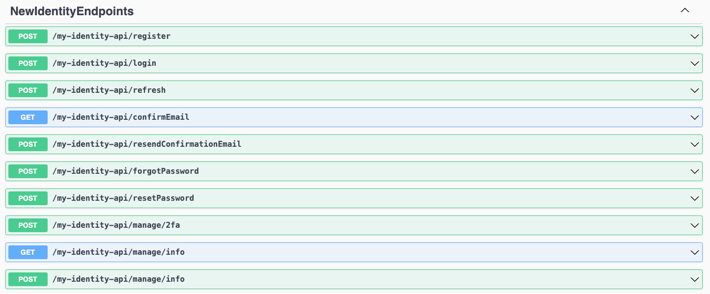

# ASP.NET 8: What's New About Authentication and Authorization

In ASP.NET 8, the concept of authentication and authorization is undergoing a transformation. Specifically, ASP.NET Core Identity is transitioning from a focus on traditional web pages to a more API-driven approach. We will see what the Identity API endpoints are, why we need them, and how to use them in detail. So, let's dive in.

## What is ASP.NET Core Identity?

ASP.NET Core Identity is like an extra toolkit that comes with ASP.NET Core. It offers a bunch of services to help you deal with user accounts in your ASP.NET Core application. These services include both basic concepts and ready-made solutions for each task.

With ASP.NET Core Identity, you can save user accounts in your app, handle user information, add extra security with two-factor authentication, and even connect other log in options, like social media logins, to user accounts. In simple terms, it's all about keeping user accounts in your app and making it easy for users to log in.


Prior to ASP.NET 8, there were limitations on using ASP.NET Identity in Single Page Applications (SPAs). Because the ASP.NET Core Identity framework is primarily tailored for traditional server-rendered web applications, like ASP.NET Core MVC or Razor Pages apps. However, the Identity API endpoints that come with ASP.NET 8 aim to solve token-based authentication and authorization in SPA without external dependencies. 

## Why do we need Identity APIs?

The introduction of Identity endpoints in ASP.NET 8 aims to streamline the process of integrating ASP.NET Core Identity into both API server applications and front-end SPAs like those built with JavaScript or Blazor. To understand the importance of these endpoints, let's first examine the disadvantages of using ASP.NET Core Identity before ASP.NET 8.

Let's delve into a common scenario:

Imagine you have a straightforward application composed of an ASP.NET Core backend that exposes APIs. On the client side, you have a SPA application that communicates with these APIs. Now, you want to incorporate user accounts, complete with authentication and authorization, into your application.

Before the advent of the identity endpoints, you could add ASP.NET Core Identity and the default Razor Pages UI to your app by adding a few packages, updating your database schema, and registering some services. However, this approach had some disadvantages. From a user experience perspective, the full-page refreshes of Razor Pages can be a major drawback especially compared to the fluidity of SPAs. On the other hand, from a developer's perspective, if you want the default pages to be compatible with the rest of your application, you may need to update more than 30 pages. Moreover, the default Razor Pages UI uses traditional cookie-based authentication, not bearer tokens.

In ASP.NET 8, identity endpoints were introduced to simplify the process of adding user accounts to ASP.NET Core API apps used with SPAs or mobile. These endpoints streamline the user management process by providing an alternative to the traditional Razor Page Identity UI pages. Additionally, a new endpoint is included for retrieving bearer tokens, which can be used for authentication. These changes directly address the concerns mentioned earlier, making it easier to create a user-friendly and integrated experience within your app, with no full-page refreshes or styling conflicts.

## How to add Identity APIs?

In this part, I'll create a demo application, add all of the required packages, and lastly map the Identity APIs. 

Create a new ASP.NET Core app with the following command and change the directory to the created application folder:

```bash
dotnet new webapi --name NewIdentityEndpoints -o IdentityDemo
cd IdentityDemo
```

After that, open the application in your favorite IDE and add the required packages: 

```csharp
<PackageReference Include="Microsoft.AspNetCore.Identity.EntityFrameworkCore" Version="8.0.0-rc.2.23480.2" />  
<PackageReference Include="Microsoft.EntityFrameworkCore.InMemory" Version="8.0.0-rc.2.23480.1" />
```

**Note:** I used the `.NET 8.0.100-rc.2-**` SDK for everything in this post. 

Then replace `Program.cs` as below:

```csharp
using System.Security.Claims;  
using Microsoft.AspNetCore.Identity;  
using Microsoft.AspNetCore.Identity.EntityFrameworkCore;  
using Microsoft.EntityFrameworkCore;  
  
var builder = WebApplication.CreateBuilder(args);  
  
builder.Services.AddAuthentication().AddBearerToken(IdentityConstants.BearerScheme);  
builder.Services.AddAuthorizationBuilder();  
  
builder.Services.AddDbContext<ApplicationDbContext>(options => options.UseInMemoryDatabase("AppDb"));  
  
builder.Services.AddIdentityCore<MyCustomUser>()  
.AddEntityFrameworkStores<ApplicationDbContext>()  
.AddApiEndpoints();  
  
builder.Services.AddEndpointsApiExplorer();  
builder.Services.AddSwaggerGen();  
  
var app = builder.Build();  
  
app.MapGroup("/my-identity-api").MapIdentityApi<IdentityUser>();  
  
app.MapGet("/", (ClaimsPrincipal user) => $"Hello {user.Identity!.Name}").RequireAuthorization();  
  
if (app.Environment.IsDevelopment())  
{  
  app.UseSwagger();  
  app.UseSwaggerUI();  
}  
  
app.Run();  
  
class MyCustomUser : IdentityUser { }  
  
class ApplicationDbContext : IdentityDbContext<MyCustomUser>  
{  
  public ApplicationDbContext(DbContextOptions<ApplicationDbContext> options) : base(options) { }  
}

```

When you run the application, you will see a result as the following:



## Custom Authorization Policies 

Prior to ASP.NET 8, adding a parameterized authorization policy to an endpoint required writing a lot of code.

- Implementing an `AuthorizeAttribute` for each policy
- Implementing an `AuthorizationPolicyProvider` to process a custom policy from a string-based contract
- Implementing an `AuthorizationRequirement` for the policy
- Implementing an `AuthorizationHandler` for each requirement

However, implementing the `IAuthorizationRequirementData` interface that comes with ASP.NET 8, your application code should look like this:

```csharp
class MinimumAgeAuthorizeAttribute : AuthorizeAttribute, IAuthorizationRequirement, IAuthorizationRequirementData
{
  public MinimumAgeAuthorizeAttribute(int age) => Age =age;
  public int Age { get; }

  public IEnumerable<IAuthorizationRequirement> GetRequirements()
  {
    yield return this;
  }
}

class MinimumAgeAuthorizationHandler : AuthorizationHandler<MinimumAgeAuthorizeAttribute>
{
  protected override Task HandleRequirementAsync(AuthorizationHandlerContext context, MinimumAgeAuthorizeAttribute requirement) 
  {
    ...
  }
}
```

See [here](https://gist.github.com/captainsafia/7c54e92d12df695ff0908e989fb8531f) for the complete code.

## Conclusion

In this article, I've shown you the Identity APIs introduced with ASP.NET 8, why we need them, and how we can add them to our application, and finally I explained how to define a custom authorization policy with fewer lines of code.

## References
- https://learn.microsoft.com/en-us/aspnet/core/release-notes/aspnetcore-8.0?view=aspnetcore-8.0#authentication-and-authorization
- https://auth0.com/blog/whats-new-dotnet8-authentication-authorization/
- https://andrewlock.net/exploring-the-dotnet-8-preview-introducing-the-identity-api-endpoints/
- https://andrewlock.net/should-you-use-the-dotnet-8-identity-api-endpoints/
