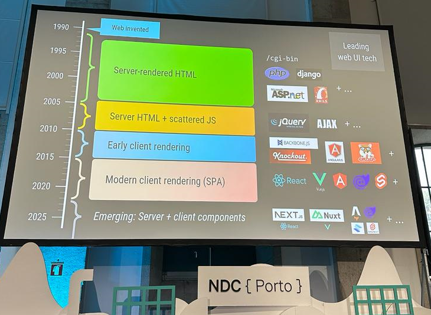
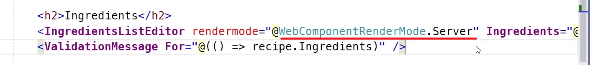
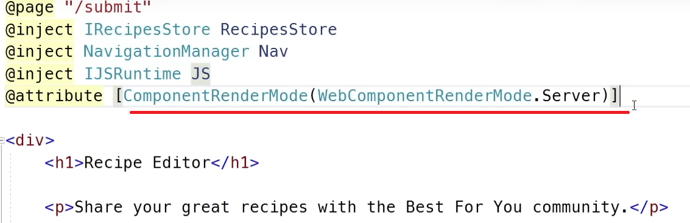
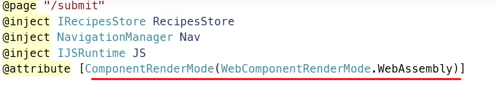
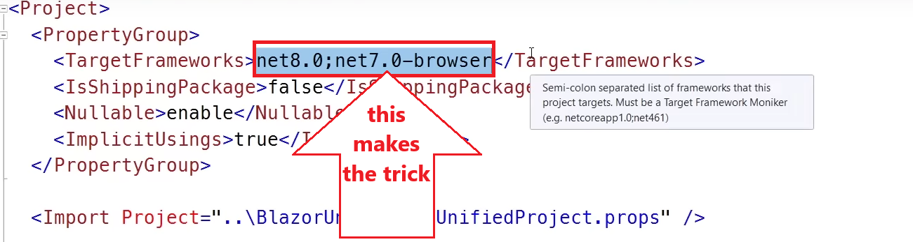
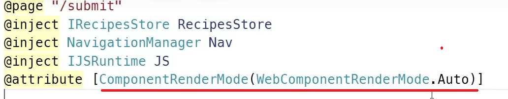

# Blazor's History and Full-stack Web UI

Blazor is a web framework that allows developers to build interactive web applications using .NET instead of JavaScript. The first version of Blazor was released on May 14, 2020.  Since its initial release, Blazor has evolved with the new versions. Until now, six different versions have been declared. Sometimes, it can be not very clear to see the differences between these approaches. First, let's try to understand these.

* **Blazor-Server**: >> *Loads fast at first* >> In this version, heavy things are done in the server. Browsers are thin clients and download a small page for the first load. The page updates are done via SignalR connection. This was released with .NET Core 3.
* **Blazor WebAssembly (WASM):** >> *Loads slow at first* >>  In this version, some binary files are being downloaded to the browser. This approach takes longer initialization time than the "Server" approach. The hard work is done on the browser. 
* **Blazor Hybrid:** It's a combination of Blazor and Xamarin.Forms. It allows you to run your app on iOS, Android, macOS, and Windows. Blazor Hybrid uses a WebView component to host the  Blazor-based user interface within the mobile app.
* **Blazor Native**: It runs natively on the devices and uses a common UI abstraction to render native controls for that device. This is very  similar to how frameworks like Xamarin Forms or React Native work today. It has also been considered but has not reached [the planning stage](https://devblogs.microsoft.com/dotnet/blazor-server-in-net-core-3-0-scenarios-and-performance/). 

* **Blazor United**: Recently, Microsoft updated this name to "Fullstack web UI". Blazor-Server and Blazor WASM both have some disadvantages and advantages. So, Microsoft decided to combine these two approaches and find an optimum solution for the entire Blazor version. We can call it *Best of Blazor* 😀

## Why is "Blazor Fullstack Web UI" the best?

These apps are a combination of both Blazor Server and Blazor WASM. It provides the advantages of Blazor Server and WASM. Developers would be able to more fine-tune the rendering mode. **This approach overcomes the large binary downloads of Blazor WASM, and it resolves the Blazor Server's problem, which always needs to be connected to the server via SignalR.** 

> Blazor Fullstack Web UI comes with the .NET 8, and it will be published on November 14, 2023.

I took the following photo from Steven Sanderson's talk at NDC Porto 2023. You can read my impressions of this conf at https://volosoft.com/blog/ndc-port-2023-impressions, but after reading this one.

   

There are two basic page styles:

* **HTML**; simple and loads fast! Eg: MVC, Razor Pages
* **Single Page Apps (SPA):** high interaction with the client and loads slower! Eg: Blazor WASM, Blazor Server...

## HTML + SPA => Blazor Fullstack

Blazor Fullstack (formerly United) is a technology that turns Blazor Server into a SPA style. 

.NET 8 will combine Blazor Server's server-side rendering and WebAssembly's client-side interaction.

You can switch between two rendering modes and even mix them on the same page. With .NET 8 there also comes amazing features like;

* [Streaming rendering](https://github.com/dotnet/aspnetcore/issues/46352): With this feature, most of the page will be rendered, and long async operations on the server will still be in progress. 

* [Progressive enhancement of form submission & navigation](https://github.com/dotnet/aspnetcore/issues/46399): With this feature, it doesn't fully reload the page after submitting the form. This gives the user a better and smoother experience.

## How it works?

### Rendering on Server

You can add `WebComponentRenderMode.Server` to your Blazor components so that these components will run interactively. In the below example, the list editor will make AJAX requests to the server like single-page applications.

And sure, you can add `WebComponentRenderMode.Server` to your page level, and the complete page will be rendered as a server component. All inputs on this page can work as an interactive server component like SPA mode.

### Rendering on Client

You can switch to WebAssembly mode by writing  `WebComponentRenderMode.WebAssembly` attribute to your page. By doing so, the whole page should run interactively using WebAssembly. This time there's no server connection anymore because it loads the binaries (WebAssembly runtimes) at the page load.

## Enabling the Blazor Fullstack UI?

To enable Blazor Full-stack Web UI, you need to write `net8.0;net7.0-browser` into the `TargetFrameworks` area of your `csproj` file. These two keywords change your app like this; `net8.0` framework renders on the server, and `net7.0-browser` framework renders on the browser.

## Let the System Decide WebAssembly or Server Approach

You can let the system decide whether it uses `WebAssembly` or `Server`. This can be done with the `Auto` mode of the `WebComponentRenderMode`. In this case, it will not load binary files (WebAssembly files) for the initial page that has  `WebComponentRenderMode.Server` attribute, but whenever the user navigates to a page that has `WebComponentRenderMode.WebAssembly`, it will download the runtimes. This will allow us to load the initial page very fast, and when we need interactivity, we can switch to `WebAssembly` and wait for the binaries to download. But this download will be done one time because it will be cached.

## Conclusion

I summarized the new generation Blazor in a very simple way. This architecture will be useful to everyone who uses Blazor.

---

*Resources:*

* You can check Dan Roth's GitHub issue 👉 [github.com/dotnet/aspnetcore/issues/46636](https://github.com/dotnet/aspnetcore/issues/46636).
* Steven Sanderson's YouTube video is very good for understanding these concepts 👉 [Blazor United Prototype Video](https://youtu.be/48G_CEGXZZM).
* "Full Stack Web UI with Blazor" — .NET Conf 2023 video 👉 [learn.microsoft.com/en-us/shows/dotnetconf-2023/full-stack-web-ui-with-blazor-in-dotnet-8](https://learn.microsoft.com/en-us/shows/dotnetconf-2023/full-stack-web-ui-with-blazor-in-dotnet-8)

