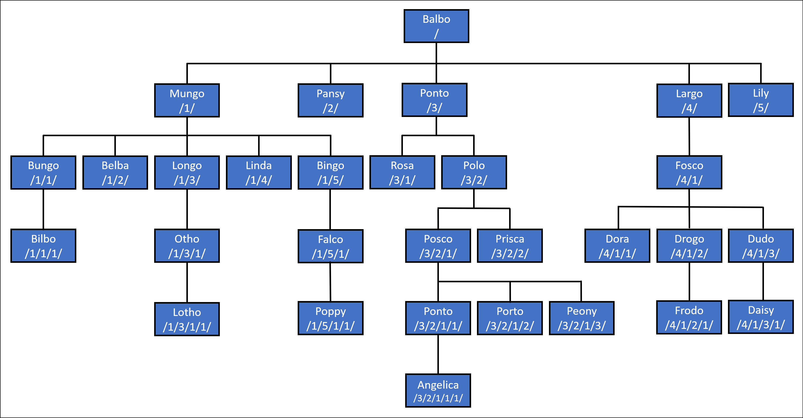

# HierarchyId Support in Entity Framework Core

Entity Framework Core has official support for HierarchyId, which allows you to store and query hierarchical data in SQL Server databases. Hierarchical data is a common data structure found in many applications. Whether you are dealing with organizational structures, product categories, or threaded discussions, handling hierarchies efficiently is crucial. In this blog post, we will explore how to manage hierarchical data using Entity Framework Core (EF Core) in combination with HierarchyId.

## How to use HierarchyId in EF Core

To use HierarchyId in EF Core, you need to install the [Microsoft.EntityFrameworkCore.SqlServer.HierarchyId](https://www.nuget.org/packages/Microsoft.EntityFrameworkCore.SqlServer.HierarchyId/) NuGet package. This package contains query and update support for HierarchyId. 

To configure EF Core to use HierarchyId, you need to call the `UseHierarchyId` method when configuring the SQL Server provider. 

```csharp
options.UseSqlServer(
    connectionString,
    x => x.UseHierarchyId());
```

## Modeling Hierarchies

The `HierarchyId` type can be used for properties of an entity type. For example, assume we want to model the personnel in an organization. Each person has a name and a manager. The manager is also a person. We can model this using the following entity type:

```csharp
public class Person
{
    public int Id { get; set; }
    public string Name { get; set; }
    public HierarchyId Manager { get; set; }
}
```

Each person can be traced from the patriarch down the tree using its `Manager` property. SQL Server uses a compact binary format for these paths, but it is common to parse to and from a human-readable string representation when working with code. In this representation, the position at each level is separated by a `/` character. 



## Querying Hierarchies

HierarchyId exposes several methods that can be used in LINQ queries.

* `GetAncestor(int level)` returns the ancestor at the specified level.

* `GetDescendant(HierarchyId? child1, HierarchyId? child2)` returns the descendant at the specified level.

* `GetLevel()` returns the level of the node in the hierarchy.

* `GetReparentedValue(HierarchyId? oldRoot, HierarchyId? newRoot)` returns the node with a new parent.

* `IsDescendantOf(HierarchyId? parent)` returns whether the node is a descendant of the specified node.

Example:

```csharp
// Get entities at a given level in the tree
var generation = await context.Persons.Where(x => x.Manager.GetLevel() == level).ToListAsync();

// Get the direct ancestor of an entity
var parent = await context.Persons.Where(x => x.Manager.GetAncestor(1) == manager).SingleAsync();
```

For example, your company may want to change the manager of an organizational unit. To do this, you can use the `GetReparentedValue` method to update the manager for all descendants of the organizational unit.

```csharp
var newManager = await context.Persons.SingleAsync(x => x.Id == newManagerId);

var descendants = await context.Persons
    .Where(x => x.Manager.IsDescendantOf(oldManager))
    .ToListAsync();

foreach (var descendant in descendants)
{
    descendant.Manager = descendant.Manager.GetReparentedValue(oldManager.Manager, newManager.Manager);
}

await context.SaveChangesAsync();
```

## References

For more information about hierarchy id, see the following resource:

- [https://learn.microsoft.com/en-us/ef/core/what-is-new/ef-core-8.0/whatsnew#hierarchyid-in-net-and-ef-core](https://learn.microsoft.com/en-us/ef/core/what-is-new/ef-core-8.0/whatsnew#hierarchyid-in-net-and-ef-core)
