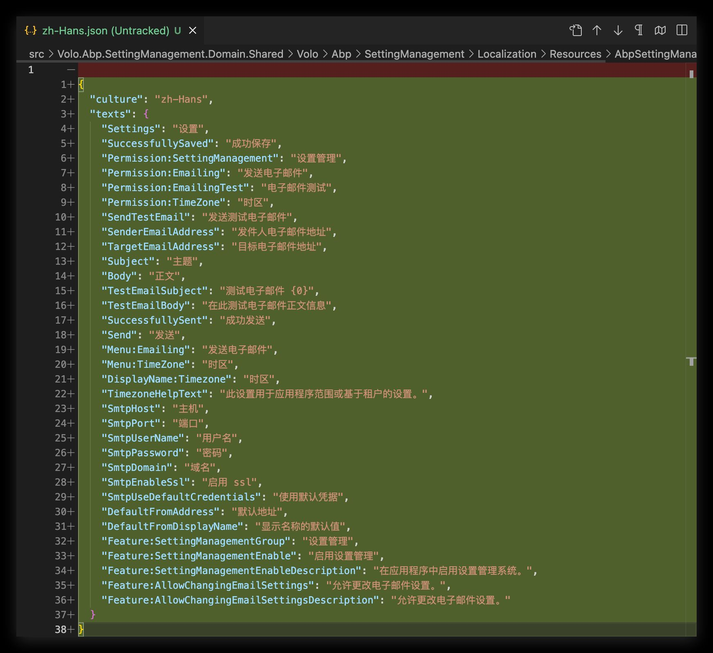

# Use Deepl to translate localization files

Translating localized text during the development of ABP modules is a boring job. For this reason, we have added the `translate` command to the CLI tool to translate the localization files, but it still requires manual translation of texts by the developer.

Now, we introduce a new way to translate the target language, which is to use the [Deepl](https://www.deepl.com/translator) translation service to translate the target language.

You can use the `translate --online` command in your module directory to translate the target language.

For example, if you have added all `en` localization texts to your module, and you want to translate them to `zh-Hans`, you can run the following command:

```
abp translate -r en -c zh-Hans --online --deepl-auth-key your_auth_key
```

*  `-r` parameter is used to specify the source language. It is usually a localized file that you have created.
*  `-c` parameter is used to specify the target language. It is usually a language that you want to translate.
*  `--online` parameter is used to indicate that the translation is performed from the Deepl service.
*  `--deepl-auth-key` parameter is the API key of your Deepl account. You can get it from [here](https://support.deepl.com/hc/en-us/articles/360020695820-Authentication-Key).


The output of the above command is as follows:

```
ABP CLI 8.0.0
Abp translate online...
Target culture: zh-Hans
Reference culture: en
Create translation: Settings => 设置
Create translation: SuccessfullySaved => 成功保存
Create translation: Permission:SettingManagement => 设置管理
Create translation: Permission:Emailing => 发送电子邮件
Create translation: Permission:EmailingTest => 电子邮件测试
Create translation: Permission:TimeZone => 时区
Create translation: SendTestEmail => 发送测试电子邮件
Create translation: SenderEmailAddress => 发件人电子邮件地址
Create translation: TargetEmailAddress => 目标电子邮件地址
Create translation: Subject => 主题
Create translation: Body => 正文
Create translation: TestEmailSubject => 测试电子邮件 {0}
Create translation: TestEmailBody => 在此测试电子邮件正文信息
Create translation: SuccessfullySent => 成功发送
Create translation: Send => 发送
Create translation: Menu:Emailing => 发送电子邮件
Create translation: Menu:TimeZone => 时区
Create translation: DisplayName:Timezone => 时区
Create translation: TimezoneHelpText => 此设置用于应用程序范围或基于租户的设置。
Create translation: SmtpHost => 主机
Create translation: SmtpPort => 端口
Create translation: SmtpUserName => 用户名
Create translation: SmtpPassword => 密码
Create translation: SmtpDomain => 域名
Create translation: SmtpEnableSsl => 启用 ssl
Create translation: SmtpUseDefaultCredentials => 使用默认凭据
Create translation: DefaultFromAddress => 默认地址
Create translation: DefaultFromDisplayName => 显示名称的默认值
Create translation: Feature:SettingManagementGroup => 设置管理
Create translation: Feature:SettingManagementEnable => 启用设置管理
Create translation: Feature:SettingManagementEnableDescription => 在应用程序中启用设置管理系统。
Create translation: Feature:AllowChangingEmailSettings => 允许更改电子邮件设置。
Create translation: Feature:AllowChangingEmailSettingsDescription => 允许更改电子邮件设置。
Write translation json to setting-management/src/Volo.Abp.SettingManagement.Domain.Shared/Volo/Abp/SettingManagement/Localization/Resources/AbpSettingManagement/zh-Hans.json.
```

The generated `zh-Hans.json` as follow:



In this example, It only translates one `en.json` to `zh-Hans.json`, but if there are multiple `en.json` files in the module, it will translate all `en.json` files to `zh-Hans.json`.

Of course, the translation is not always correct, you can update the translation in the generated `zh-Hans.json` files.

Enjoy it!
