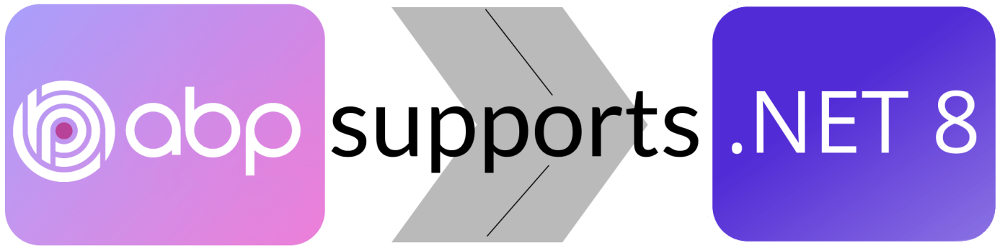

# ABP Now Supports .NET 8

Recently we have published ABP v8.0. With this version [the ABP Framework](https://github.com/abpframework/abp/blob/dev/templates/app/aspnet-core/src/MyCompanyName.MyProjectName.Web/MyCompanyName.MyProjectName.Web.csproj#L6) and ABP Commercial both supports for .NET 8, aligning itself with the latest enhancements and new features of the ASP.NET's new version 8. 

Here's the [related PR](https://commercial.abp.io/releases/pr/15676) for this upgrade. This update ensures that developers using ABP can leverage the new features and improvements of .NET 8, enhancing the capability and performance of their applications. With .NET 8 support, ABP 8.0 likely offers improved performance, enhanced security, and greater efficiency, making it a robust choice for building modern web applications. 
Here's the summary of .NET 8 features and enhancements:

## What's new in .NET 8

### .NET Aspire

[.NET Aspire](https://learn.microsoft.com/en-us/dotnet/aspire/) is a tool to observe and manage distributed web applications. It's still preview version. You can manage your containers, executables, logs, traces and metrics of your running web application. For more information see this article https://devblogs.microsoft.com/dotnet/introducing-dotnet-aspire-simplifying-cloud-native-development-with-dotnet-8/

### Serialization

12 features have been implemented for [System.Text.Json](https://learn.microsoft.com/en-us/dotnet/api/system.text.json) serialization and deserialization library with .NET 8.  See these enhancements
* [Built-in support for additional types](https://learn.microsoft.com/en-us/dotnet/core/whats-new/dotnet-8#built-in-support-for-additional-types)
* [Source generator](https://learn.microsoft.com/en-us/dotnet/core/whats-new/dotnet-8#source-generator)
* [Interface hierarchies](https://learn.microsoft.com/en-us/dotnet/core/whats-new/dotnet-8#interface-hierarchies)
* [Naming policies](https://learn.microsoft.com/en-us/dotnet/core/whats-new/dotnet-8#naming-policies)
* [Read-only properties](https://learn.microsoft.com/en-us/dotnet/core/whats-new/dotnet-8#read-only-properties)
* [Disable reflection-based default](https://learn.microsoft.com/en-us/dotnet/core/whats-new/dotnet-8#disable-reflection-based-default)
* [New JsonNode API methods](https://learn.microsoft.com/en-us/dotnet/core/whats-new/dotnet-8#new-jsonnode-api-methods)
* [Non-public members](https://learn.microsoft.com/en-us/dotnet/core/whats-new/dotnet-8#non-public-members)
* [Streaming deserialization APIs](https://learn.microsoft.com/en-us/dotnet/core/whats-new/dotnet-8#streaming-deserialization-apis)
* [WithAddedModifier extension method](https://learn.microsoft.com/en-us/dotnet/core/whats-new/dotnet-8#withaddedmodifier-extension-method)
* [New JsonContent.Create overloads](https://learn.microsoft.com/en-us/dotnet/core/whats-new/dotnet-8#new-jsoncontentcreate-overloads)
* [Freeze a JsonSerializerOptions instance](https://learn.microsoft.com/en-us/dotnet/core/whats-new/dotnet-8#freeze-a-jsonserializeroptions-instance)

### Time abstraction

You may mock time in test scenarios with the new [TimeProvider class](https://learn.microsoft.com/en-us/dotnet/api/system.timeprovider?view=net-8.0) and [ITimer interface](https://learn.microsoft.com/en-us/dotnet/api/system.threading.itimer?view=net-8.0), which add time abstraction functionality. 

### UTF8 improvements

The new [IUtf8SpanFormattable](https://learn.microsoft.com/en-us/dotnet/api/system.iutf8spanformattable) interface targets `UTF8` and `Span<byte>` instead of `UTF16` and `Span<char>`. Also the new [Utf8.TryWrite](https://learn.microsoft.com/en-us/dotnet/api/system.text.unicode.utf8.trywrite) methods provide a `UTF8` based counterpart to the existing [MemoryExtensions.TryWrite](https://learn.microsoft.com/en-us/dotnet/api/system.memoryextensions.trywrite) methods, which are UTF16-based.

### Data validation

There are new validation attributes for cloud-native services. The new properties were added to the [RangeAttribute](https://learn.microsoft.com/en-us/dotnet/api/system.componentmodel.dataannotations.rangeattribute) and [RequiredAttribute](https://learn.microsoft.com/en-us/dotnet/api/system.componentmodel.dataannotations.requiredattribute) types. See the list below for the new validation attributes:

| New Data Attribute                                           | Description                                                  |
| ------------------------------------------------------------ | ------------------------------------------------------------ |
| [MinimumIsExclusive](https://learn.microsoft.com/en-us/dotnet/api/system.componentmodel.dataannotations.rangeattribute.minimumisexclusive#system-componentmodel-dataannotations-rangeattribute-minimumisexclusive), [MaximumIsExclusive](https://learn.microsoft.com/en-us/dotnet/api/system.componentmodel.dataannotations.rangeattribute.maximumisexclusive#system-componentmodel-dataannotations-rangeattribute-maximumisexclusive) | Checks whether bounds are included in the allowable range    |
| [Length](https://learn.microsoft.com/en-us/dotnet/api/system.componentmodel.dataannotations.lengthattribute) | Checks both lower and upper bounds for strings or collections. For example, `[Length(5, 10)]` requires at least 5 elements and at most 10 elements in a collection |
| [Base64String](https://learn.microsoft.com/en-us/dotnet/api/system.componentmodel.dataannotations.base64stringattribute) | Checks that a string is a valid Base64 format                |
| [AllowedValues](https://learn.microsoft.com/en-us/dotnet/api/system.componentmodel.dataannotations.allowedvaluesattribute), [DeniedValues](https://learn.microsoft.com/en-us/dotnet/api/system.componentmodel.dataannotations.deniedvaluesattribute) | Checks if values are from the allowed or disallowed list  eg: `[AllowedValues("man", "woman", "child")]` |

### Randomness methods

The [System.Random](https://learn.microsoft.com/en-us/dotnet/api/system.random) and [System.Security.Cryptography.RandomNumberGenerator](https://learn.microsoft.com/en-us/dotnet/api/system.security.cryptography.randomnumbergenerator) types present 2 new approaches  to handling randomness.  

### Performance-focused types

* The new [System.Collections.Frozen](https://learn.microsoft.com/en-us/dotnet/api/system.collections.frozen) namespace includes the collection types [FrozenDictionary](https://learn.microsoft.com/en-us/dotnet/api/system.collections.frozen.frozendictionary-2) and [FrozenSet](https://learn.microsoft.com/en-us/dotnet/api/system.collections.frozen.frozenset-1).
* Methods like [MemoryExtensions.IndexOfAny](https://learn.microsoft.com/en-us/dotnet/api/system.memoryextensions.indexofany) look for the first occurrence of *any value in the passed collection*. 
* The new [System.Text.CompositeFormat](https://learn.microsoft.com/en-us/dotnet/api/system.text.compositeformat) type is useful for optimizing format strings that aren't known at compile time (for example, if the format string is loaded from a resource file). 
* New [System.IO.Hashing.XxHash3](https://learn.microsoft.com/en-us/dotnet/api/system.io.hashing.xxhash3) and [System.IO.Hashing.XxHash128](https://learn.microsoft.com/en-us/dotnet/api/system.io.hashing.xxhash128) types provide implementations of the fast XXH3 and XXH128 hash algorithms.

### System.Numerics and System.Runtime.Intrinsics

The [System.Numerics](https://learn.microsoft.com/en-us/dotnet/api/system.numerics) and [System.Runtime.Intrinsics](https://learn.microsoft.com/en-us/dotnet/api/system.runtime.intrinsics) namespaces introduces some hardware improvements with .NET 8. The following structs reimplemented for running with the best performance on ARM64. 

[Vector256](https://learn.microsoft.com/en-us/dotnet/api/system.runtime.intrinsics.vector256-1), [Matrix3x2](https://learn.microsoft.com/en-us/dotnet/api/system.numerics.matrix3x2), and [Matrix4x4](https://learn.microsoft.com/en-us/dotnet/api/system.numerics.matrix4x4) have improved

### Metrics

New APIs let you attach key-value pair tags to [Meter](https://learn.microsoft.com/en-us/dotnet/api/system.diagnostics.metrics.meter) and [Instrument](https://learn.microsoft.com/en-us/dotnet/api/system.diagnostics.metrics.instrument) objects when you create them. Aggregators of published metric measurements can use the tags to differentiate the aggregated values.

### Cryptography

[SHA-3](https://en.wikipedia.org/wiki/SHA-3) (Secure Hash Algorithm 3) is the latest member of the Secure Hash Algorithm family of standards. With .NET 8 SHA-3 is being supported.

### HTTPS proxy support

Before  [HttpClient](https://learn.microsoft.com/en-us/dotnet/api/system.net.http.httpclient) allows hackers to make [man-in-the-middle attack](https://en.wikipedia.org/wiki/Man-in-the-middle_attack) with .NET 8,  it creates an encrypted channel between the client and the proxy so all requests can be handled with full privacy.

### Stream-based ZipFile methods

The new [ZipFile.ExtractToDirectory](https://learn.microsoft.com/en-us/dotnet/api/system.io.compression.zipfile.extracttodirectory) provides a stream containing a zipped file and extract its contents into the filesystem.

### Hosted lifecycle services

Hosted services now have more options for execution during the application lifecycle. [IHostedService](https://learn.microsoft.com/en-us/dotnet/api/microsoft.extensions.hosting.ihostedservice) provided `StartAsync` and `StopAsync`, and now [IHostedLifecycleService](https://learn.microsoft.com/en-us/dotnet/api/microsoft.extensions.hosting.ihostedlifecycleservice) provides these additional methods:

- [StartingAsync(CancellationToken)](https://learn.microsoft.com/en-us/dotnet/api/microsoft.extensions.hosting.ihostedlifecycleservice.startingasync#microsoft-extensions-hosting-ihostedlifecycleservice-startingasync(system-threading-cancellationtoken))
- [StartedAsync(CancellationToken)](https://learn.microsoft.com/en-us/dotnet/api/microsoft.extensions.hosting.ihostedlifecycleservice.startedasync#microsoft-extensions-hosting-ihostedlifecycleservice-startedasync(system-threading-cancellationtoken))
- [StoppingAsync(CancellationToken)](https://learn.microsoft.com/en-us/dotnet/api/microsoft.extensions.hosting.ihostedlifecycleservice.stoppingasync#microsoft-extensions-hosting-ihostedlifecycleservice-stoppingasync(system-threading-cancellationtoken))
- [StoppedAsync(CancellationToken)](https://learn.microsoft.com/en-us/dotnet/api/microsoft.extensions.hosting.ihostedlifecycleservice.stoppedasync#microsoft-extensions-hosting-ihostedlifecycleservice-stoppedasync(system-threading-cancellationtoken))

### Native AOT support

The option to [publish as Native AOT](https://learn.microsoft.com/en-us/dotnet/core/deploying/native-aot/) was first introduced in .NET 7. Publishing an app with Native AOT creates a fully self-contained version of your app that doesn't need a runtime—everything is included in a single file. .NET 8 brings the following improvements to Native AOT publishing:

| Operating system                        | .NET 7  | .NET 8  |
| :-------------------------------------- | :------ | :------ |
| Linux x64 (with `-p:StripSymbols=true`) | 3.76 MB | 1.84 MB |
| Windows x64                             | 2.85 MB | 1.77 MB |

### Target iOS-like platforms with Native AOT

.NET 8 starts the work to enable Native AOT support for iOS-like platforms. You can now build and run .NET iOS and .NET MAUI applications with Native AOT on the following platforms:

- `ios`
- `iossimulator`
- `maccatalyst`
- `tvos`
- `tvossimulator`

### Performance improvements

.NET 8 includes improvements to code generation and just-in time (JIT) compilation:

- Arm64 performance improvements
- SIMD improvements
- Support for AVX-512 ISA extensions (see [Vector512 and AVX-512](https://learn.microsoft.com/en-us/dotnet/core/whats-new/dotnet-8#vector512-and-avx-512))
- Cloud-native improvements
- JIT throughput improvements
- Loop and general optimizations
- Optimized access for fields marked with [ThreadStaticAttribute](https://learn.microsoft.com/en-us/dotnet/api/system.threadstaticattribute)
- Consecutive register allocation. Arm64 has two instructions for table vector lookup, which require that all entities in their tuple operands are present in consecutive registers.
- JIT/NativeAOT can now unroll and auto-vectorize some memory operations with SIMD, such as comparison, copying, and zeroing, if it can determine their sizes at compile time.

### .NET SDK

This section contains the following subtopics:

- [CLI-based project evaluation](https://learn.microsoft.com/en-us/dotnet/core/whats-new/dotnet-8#cli-based-project-evaluation)
- [Terminal build output](https://learn.microsoft.com/en-us/dotnet/core/whats-new/dotnet-8#terminal-build-output)
- [Simplified output paths](https://learn.microsoft.com/en-us/dotnet/core/whats-new/dotnet-8#simplified-output-paths)
- ['dotnet workload clean' command](https://learn.microsoft.com/en-us/dotnet/core/whats-new/dotnet-8#dotnet-workload-clean-command)
- ['dotnet publish' and 'dotnet pack' assets](https://learn.microsoft.com/en-us/dotnet/core/whats-new/dotnet-8#dotnet-publish-and-dotnet-pack-assets)
- [Template engine](https://learn.microsoft.com/en-us/dotnet/core/whats-new/dotnet-8#template-engine)
- [Source Link](https://learn.microsoft.com/en-us/dotnet/core/whats-new/dotnet-8#source-link)
- [Source-build SDK](https://learn.microsoft.com/en-us/dotnet/core/whats-new/dotnet-8#source-build-sdk)

### ASP.NET composite images

As part of an effort to improve containerization performance, new ASP.NET Docker images are available that have a composite version of the runtime. This composite is built by compiling multiple MSIL assemblies into a single ready-to-run (R2R) output binary. Because these assemblies are embedded into a single image, jitting takes less time, and the startup performance of apps improves. The other big advantage of the composite over the regular ASP.NET image is that the composite images have a smaller size on disk.

### Source-generated COM interop

.NET 8 includes a new source generator that supports interoperating with COM interfaces. 

### Minimum support baselines for Linux

The minimum support baselines for Linux have been updated for .NET 8. .NET is built targeting Ubuntu 16.04, for all architectures. 

### AOT compilation for Android apps

To decrease app size, .NET and .NET MAUI apps that target Android use *profiled* ahead-of-time (AOT) compilation mode when they're built in Release mode. Profiled AOT compilation affects fewer methods than regular AOT compilation. .NET 8 introduces the `<AndroidStripILAfterAOT>` property that lets you opt-in to further AOT compilation for Android apps to decrease app size even more.

### Code analysis

.NET 8 includes several new code analyzers and fixers to help verify that you're using .NET library APIs correctly and efficiently. The following table summarizes the new analyzers.

### NuGet

Starting in .NET 8, NuGet verifies signed packages on Linux by default. NuGet continues to verify signed packages on Windows as well.

### C# Hot Reload supports modifying generics

Starting in .NET 8, C# Hot Reload [supports modifying generic types and generic methods](https://devblogs.microsoft.com/dotnet/hot-reload-generics/). When you debug console, desktop, mobile, or WebAssembly applications with Visual Studio, you can apply changes to generic classes and generic methods in C# code or Razor pages. For more information, see the [full list of edits supported by Roslyn](https://github.com/dotnet/roslyn/blob/main/docs/wiki/EnC-Supported-Edits.md)

*References:*

* https://learn.microsoft.com/en-us/dotnet/core/whats-new/dotnet-8