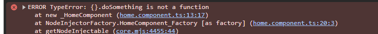
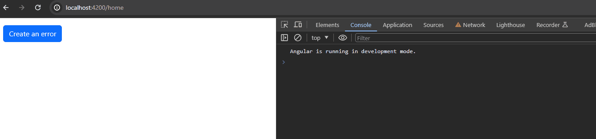
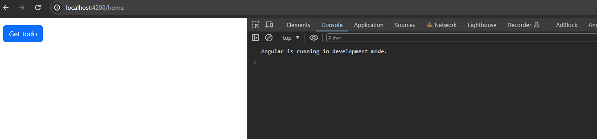
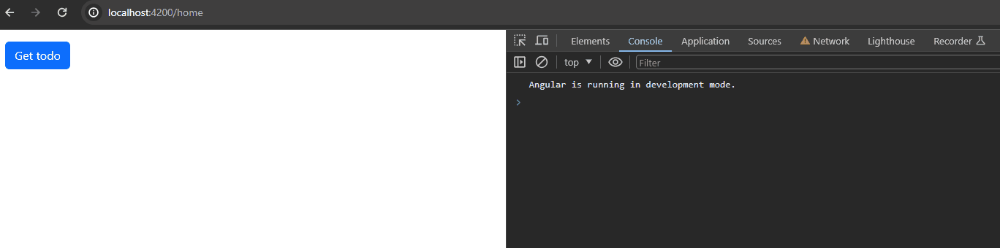

# Global Error Handling in Angular


Error handling is how we deal with errors that go wrong when we are running a program. There is no code that runs perfectly forever :) Things can go wrong and your application might crash. **So, in order to run your program smoothly you must handle errors.** It is just not for keeping your application in a running state. It is also useful to show messages about the error to the client. Like what went wrong, why it is not allowed to access this page etc.

### How to handle errors

-   First of all, you have to catch them 😀. You can catch them via **try-catch block**. See an example;
#### Create an basic error
```ts
({} as any).doSomething()
```



#### Handle it
```ts
try {
  ({} as any).doSomething();
} catch (error) {
  this.toastService.showError(error.message);
}
```



-   See, we catch the error and handle it.
-   In this case, we know where the error will be thrown. Most of the time we won't know where the error will appear. Should we cover the entire application with try-catch blocks? Of course not 😀
-   **We are going to handle errors globally**. Angular provides a great way to do it. Let's do it step by step;

### 1.Create a **service** and implement the **`ErrorHandler`** interface.

```ts
import { ErrorHandler, Injectable, inject } from '@angular/core';
import { ToastService } from './toast.service';

@Injectable({
  providedIn: 'root'
})
export class CustomErrorHandlerService implements ErrorHandler {
  toastService = inject(ToastService);
  
  //This method comes from interface
  handleError(error: any): void {
    this.toastService.showError(error.message);
  }
}

```

### 2.Provide the service by using the **`ErrorHandler`** class from **`@angular/core`**.

```ts
import { ErrorHandler } from '@angular/core';

providers: [
  { provide: ErrorHandler, useExisting: CustomErrorHandlerService }
]

```


-  It behaves exactly the same. Nice, now we catch the entire errors in one simple service.
-  Is it that simple? I wish it is but it's not 😀. This handling mechanism only works synchronously. When we start making http requests, our **`CustomErrorHandlerService`** won't catch the errors.

## How to handle HTTP Requests
Make an HTTP request and check if it's working.
    

    
As you can see it doesn’t work. So how can we catch the http errors? with **`catchError()`** operator in rxjs or **`observer object`**. I will go with **`catchError()`** operator.

```ts
getTodo(id: number) {
  this.http
      .get(`https://jsonplaceholder.typicode.com/todos/${id}`)
      .pipe(catchError((err) => {
  	 this.toastService.showError(err.message);
	 return EMPTY;
        })
       )
      .subscribe(todo => this.todo = todo);
}

```


- So are we going to add this **`catchError()`** operator to the entire http requests? **NO, we will use HTTP Interceptors!**
- Let's do it step by step.

### 1.Remove catchError pipe

```ts
getTodo(id: number) {
  this.http.get('https://jsonplaceholder.typicode.com/todos/${id}').subscribe(todo => this.todo = todo);
}
```

### 2.Create an HTTP Interceptor

```ts
import { Injectable, inject } from '@angular/core';
import { HttpHandler, HttpInterceptor, HttpRequest } from '@angular/common/http';
import { EMPTY, catchError } from 'rxjs';
import { ToastService } from './toast.service';

@Injectable({
  providedIn: 'root'
})
export class ToastInterceptor implements HttpInterceptor {
  toastService = inject(ToastService);

  intercept(req: HttpRequest<any>, next: HttpHandler) {
    return next.handle(req).pipe(catchError((error) => {
      this.toastService.showError(error.message);
      return EMPTY;
    }));
  }
}
```

### 3.Provide the interceptor

```ts
import { HTTP_INTERCEPTORS} from '@angular/common/http';

providers: [
  { provide: HTTP_INTERCEPTORS, useExisting: ToastInterceptor, multi: true }
]
```
Now everything has set up. Let's make an HTTP request and try again.


- So, now we are handling http errors globally. Whenever an error occurs, it will be catched from interceptor and will be showed via toast message.  
- But this method has a one little disadvantage. What if we dont want to show toast message for a spesific case? [related issue about this problem](https://github.com/angular/angular/issues/18155).   
- **[ABP Framework](https://abp.io/) has great solution for this problem. Let's understand the solution and apply it straightforwardly.**  
  - Create a singleton service called **`HttpErrorReporterService`.** This service is going to store **HttpError** in a subject, and share the httpError as an observable for subscribers.
  - Create a new service called **`RestService`** which is a layer on top of **`HttpClient`**, this new service is able to get a skipHandleError parameter. If skipHandleError value is **false** then it will be reported to the **`HttpErrorReporterService`** otherwise error will be throwed.
  - Create a service called **`ErrorHandler`**, This service is going to subscribe to observable in **`HttpErrorReporterService`** and handle the errors (in our case we will show toast message).
- When i first see this solution, i loved it. For more information and detail you can check the source code from the links below;   
  - [**Http Error Reporter Service**](https://github.com/abpframework/abp/blob/360a3395aa0e44fb77574ea7eac745e8ba94b82e/npm/ng-packs/packages/core/src/lib/services/http-error-reporter.service.ts#L6)
  - [**Rest Service**](https://github.com/abpframework/abp/blob/360a3395aa0e44fb77574ea7eac745e8ba94b82e/npm/ng-packs/packages/core/src/lib/services/rest.service.ts#L4)
  - [**Error Handler**](https://github.com/abpframework/abp/blob/360a3395aa0e44fb77574ea7eac745e8ba94b82e/npm/ng-packs/packages/theme-shared/src/lib/handlers/error.handler.ts#L19)

You can copy the source codes from ABP or use ABP directly 😀
Lets simulate the solution in our application, this simulation is not suitable for your application it just for demonstration.

**Rest Service**

```ts
import { HttpClient, HttpRequest } from '@angular/common/http';
import { Injectable, inject } from '@angular/core';
import { HttpErrorReporterService } from './http-error-reporter.service';
import { catchError, throwError } from 'rxjs';

@Injectable({
  providedIn: 'root'
})
export class RestService {
  http = inject(HttpClient);
  httpErrorReporterService = inject(HttpErrorReporterService);

  request(req: HttpRequest<any> | { method: string, url: string; }, skipHandleError = false) {
    const { method, url } = req;
    return this.http.request(method, url).pipe(catchError((err) => {
      if (!skipHandleError) {
        this.httpErrorReporterService.reportError(err);
      }
      return throwError(() => err);
    }));
  }
}

```

**HttpErrorReporterService**

```ts
import { HttpErrorResponse } from '@angular/common/http';
import { Injectable } from '@angular/core';
import { Subject } from 'rxjs';

@Injectable({
  providedIn: 'root'
})
export class HttpErrorReporterService {
  private _error$ = new Subject<HttpErrorResponse>();

  get error$() {
    return this._error$.asObservable();
  }

  reportError(error: HttpErrorResponse) {
    this._error$.next(error);
  }
}

```

**ErrorHandler**

```ts
import { Injectable, inject } from '@angular/core';
import { HttpErrorReporterService } from './http-error-reporter.service';
import { ToastService } from './toast.service';

@Injectable({
  providedIn: 'root'
})
export class ErrorHandlerService {
  httpErrorReporterService = inject(HttpErrorReporterService);
  toastMessageService = inject(ToastService);

  constructor(){
    this.httpErrorReporterService.error$.subscribe((error) => {
      this.toastMessageService.showError(error.message);
    });
  }
}

```

Now lets make an http request to check is it working

```ts
restService = inject(RestService);

getTodo() {
  this.restService.request(
    { method: 'GET', url: 'https://jsonplaceholder.typicode.com/todos/1111' },
  ).subscribe(todo => {
    this.todo = todo;
  });
}
```



Now let's pass **true to the `skipHandleError` parameter**, let's see if the **errorHandler** going to skip this error or not.

```ts
restService = inject(RestService);

getTodo() {
  this.restService.request(
    { method: 'GET', url: '<https://jsonplaceholder.typicode.com/todos/1111>' },
    skipHandleError: true,
  ).subscribe(todo => {
    this.todo = todo;
  });
}

```


### Conclusion
- To handle synchronous errors globally, you can use [Error Handler](https://angular.io/api/core/ErrorHandler).
- To handle http errors globally, you can use [HTTP - interceptor](https://angular.io/guide/http-interceptor-use-cases). But in this method, you won't be able to skip specific cases. I recommend you use the ABP Framework's solution.

Thanks for reading, if you have any advice please share it with me in the comments.
