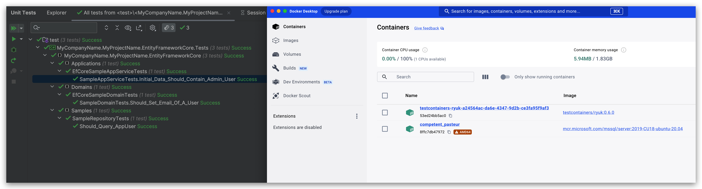
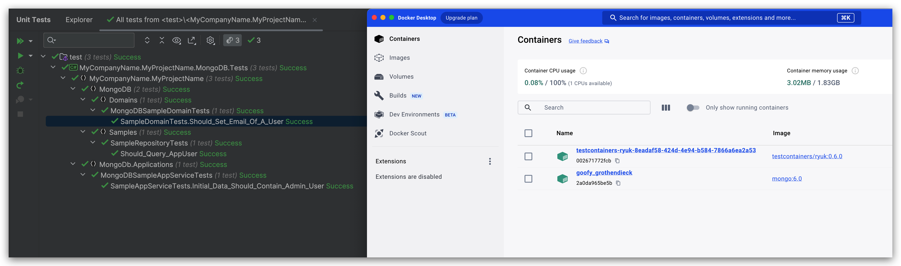

# Using Testcontainers in ABP Unit Test

## What is Testcontainers?

Testcontainers is a library that provides easy and lightweight APIs for bootstrapping local development and test dependencies with real services wrapped in Docker containers. 

Using Testcontainers, you can write tests that depend on the same services you use in production without mocks or in-memory services.

Get more information about Testcontainers from [https://testcontainers.com/](https://testcontainers.com/).

## How to Use Testcontainers in ABP Unit Test?

ABP Framework provides a built-in unit test infrastructure, allowing you to add your unit and integration tests easily.

It uses [SQLite in-memory](https://learn.microsoft.com/en-us/ef/core/testing/testing-without-the-database#sqlite-in-memory) and [EphemeralMongo](https://github.com/asimmon/ephemeral-mongo)  as the default database for unit tests and it's enough for most of the cases. However, you may need to test your code with a real database like PostgreSQL, MySQL, SQL Server, etc.

In this article, I will show you how to use Testcontainers in ABP unit tests to test your code with a real database from a Docker container.

> The Testcontainers will pull the Docker images of the databases you want to use. You can pull them manually before running the tests to speed them up.

```bash
docker pull mcr.microsoft.com/mssql/server:2019-CU18-ubuntu-20.04
docker pull mongo:6.0
```

### Code Changes For Entity Framework Core Tests

1. Remove `Volo.Abp.EntityFrameworkCore.Sqlite` package and add the `Testcontainers.MsSql` package to the `MyProjectName.EntityFrameworkCore.Tests` project.

```csharp
<Project Sdk="Microsoft.NET.Sdk">

  <Import Project="..\..\common.props" />

  <PropertyGroup>
    <TargetFramework>net8.0</TargetFramework>
    <Nullable>enable</Nullable>
    <RootNamespace>MyCompanyName.MyProjectName</RootNamespace>
  </PropertyGroup>

  <ItemGroup>
    <ProjectReference Include="..\..\src\MyCompanyName.MyProjectName.EntityFrameworkCore\MyCompanyName.MyProjectName.EntityFrameworkCore.csproj" />
    <ProjectReference Include="..\MyCompanyName.MyProjectName.Application.Tests\MyCompanyName.MyProjectName.Application.Tests.csproj" />
  </ItemGroup>

  <ItemGroup>
    <PackageReference Include="Microsoft.NET.Test.Sdk" Version="17.8.0" />
    <PackageReference Include="Testcontainers.MsSql" Version="3.7.0" />
  </ItemGroup>

</Project>
```

2. Update `MyProjectNameEntityFrameworkCoreFixture` class as shown below:

We start an SQL Server container in the `InitializeAsync` method and dispose of it in the `DisposeAsync` method. The `GetRandomConnectionString` method sets a random database for each test.

```csharp
using System;
using System.Threading.Tasks;
using Testcontainers.MsSql;
using Xunit;

namespace MyCompanyName.MyProjectName.EntityFrameworkCore;

public class MyProjectNameEntityFrameworkCoreFixture : IAsyncLifetime
{
    private readonly static MsSqlContainer _msSqlContainer = new MsSqlBuilder().Build();

    public async Task InitializeAsync()
    {
        await _msSqlContainer.StartAsync();
    }

    public static string GetRandomConnectionString()
    {
        var randomDbName = "Database=Db_" + Guid.NewGuid().ToString("N");
        return _msSqlContainer.GetConnectionString().Replace("Database=master", randomDbName, StringComparison.OrdinalIgnoreCase);
    }

    public async Task DisposeAsync()
    {
        await _msSqlContainer.DisposeAsync().AsTask();
    }
}
```

3. Update `MyProjectNameEntityFrameworkCoreTestModule` class as shown below:

```csharp
using Microsoft.EntityFrameworkCore;
using Microsoft.Extensions.DependencyInjection;
using Volo.Abp.EntityFrameworkCore;
using Volo.Abp.FeatureManagement;
using Volo.Abp.Modularity;
using Volo.Abp.PermissionManagement;
using Volo.Abp.SettingManagement;
using Volo.Abp.Uow;

namespace MyCompanyName.MyProjectName.EntityFrameworkCore;

[DependsOn(
    typeof(MyProjectNameApplicationTestModule),
    typeof(MyProjectNameEntityFrameworkCoreModule)
    )]
public class MyProjectNameEntityFrameworkCoreTestModule : AbpModule
{
    public override void ConfigureServices(ServiceConfigurationContext context)
    {
        ConfigureMsSqlDatabase(context.Services);
    }

    private void ConfigureMsSqlDatabase(IServiceCollection services)
    {
        var connectionString = MyProjectNameEntityFrameworkCoreFixture.GetRandomConnectionString();
        using (var context = new MyProjectNameDbContext(new DbContextOptionsBuilder<MyProjectNameDbContext>()
                   .UseSqlServer(connectionString)
                   .Options))
        {
            context.Database.Migrate();
        }
        services.Configure<AbpDbContextOptions>(options =>
        {
            options.Configure(context =>
            {
                context.DbContextOptions.UseSqlServer(connectionString);
            });
        });
    }
}
```

The EF Core unit tests results will be like the following:



### Code Changes For MongoDB Tests

1. Remove `EphemeralMongo` related packages and add the `Testcontainers.MongoDb` package to the `MyProjectName.EntityFrameworkCore.Tests` project.

```csharp
<Project Sdk="Microsoft.NET.Sdk">

  <Import Project="..\..\common.props" />

  <PropertyGroup>
    <TargetFramework>net8.0</TargetFramework>
    <Nullable>enable</Nullable>
    <RootNamespace>MyCompanyName.MyProjectName</RootNamespace>
  </PropertyGroup>

  <ItemGroup>
    <ProjectReference Include="..\..\src\MyCompanyName.MyProjectName.MongoDB\MyCompanyName.MyProjectName.MongoDB.csproj" />
    <ProjectReference Include="..\MyCompanyName.MyProjectName.Application.Tests\MyCompanyName.MyProjectName.Application.Tests.csproj" />
  </ItemGroup>

  <ItemGroup>
    <PackageReference Include="Microsoft.NET.Test.Sdk" Version="17.8.0" />
    <PackageReference Include="Testcontainers.MongoDb" Version="3.7.0" />
  </ItemGroup>

</Project>
```

2. Update `MyProjectNameMongoDbFixture` class as shown below:

We start a MongoDB container in the `InitializeAsync` method and dispose of it in the `DisposeAsync` method. The `GetRandomConnectionString` method sets a random database for each test.

```csharp
using System;
using System.Threading.Tasks;
using Testcontainers.MongoDb;
using Xunit;

namespace MyCompanyName.MyProjectName.MongoDB;

public class MyProjectNameMongoDbFixture : IAsyncLifetime
{
    private readonly static MongoDbContainer _mongoDbContainer = new MongoDbBuilder().WithCommand().Build();

    public async Task InitializeAsync()
    {
        await _mongoDbContainer.StartAsync();
    }

    public static string GetRandomConnectionString()
    {
        var randomDbName = "Db_" + Guid.NewGuid().ToString("N");
        return _mongoDbContainer.GetConnectionString().EnsureEndsWith('/') + randomDbName + "?authSource=admin";
    }

    public async Task DisposeAsync()
    {
        await _mongoDbContainer.DisposeAsync().AsTask();
    }
}
```

The MongoDB unit tests results will be like the following:



## Summary

The Testcontainers works well with ABP Framework and it's easy to use. If you need to test your code with a real database, Testcontainers is a good choice for you. 

While it still needs to be faster than in-memory databases, but its advantages are obvious.

Enjoy testing with Testcontainers!
