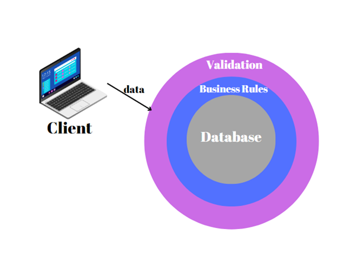
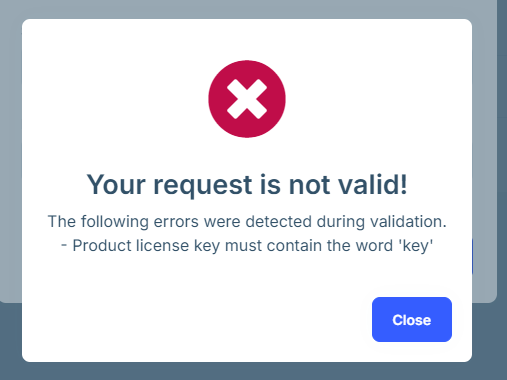

# Using FluentValidation with ABP Framework

## What is Validation? Why Do We Need to Validate?
Validation is checking whether data is valid or not. We can liken validations to the cell membrane of our application. Just as the cell does not want to let in harmful substances, we do not want to add erroneous data to the database, which is critical to our application. Validations allow data that follows the rules to reach the database. Data that does not comply with the rules will not access the database at all, and the operation will fail.



Validations make your application run more efficiently as they are not directly tied to the database. They should be implemented across various layers of the application, including the UI, backend, and database, to prevent malicious users from bypassing these checks. Fluent validation is frequently employed for creating backend validations.

## What is Fluent Validation?
Fluent validation is a library for checking whether data is valid or not. Fluent validation can be applied to your code in a fluent and understandable way.

## Why We Should Use Fluent Validation?
Fluent Validation allows you to define your validation rules in a clear and flexible way. This means you can comfortably handle complex validation scenarios in your code. This makes your development process much more manageable. The readability that Fluent Validation offers really makes things easier. Having a clear understanding of what your validation rules do is a huge advantage when working on your code. In short, your code is cleaner and clearer. Fluent Validation is also very functional in terms of testability. By defining your validation rules in separate classes, you can easily test and maintain these rules. Fluent Validation is a widely used validation library on the .NET platform. As such, it has become a common standard among .NET developers. This provides advantages in terms of community support and compatibility. So, using Fluent Validation simplifies your development process by making your code more understandable, manageable and testable.

In this section, I will show you how to use FluentValidation library within an ABP-based application. Therefore, I assume that you have an ABP-based application that has already been created. If you haven't created an ABP-based application yet, please follow the [Getting Started documentation](https://docs.abp.io/en/abp/latest/Getting-Started-Create-Solution?UI=MVC&DB=EF&Tiered=No).

Using Fluent validation with Abp is quite simple. Open a command line window in the folder of the project (.csproj file) and type the following command: 

```bash
abp add-package Volo.Abp.FluentValidation
```

If you have not created your abp project, review the [steps to create](https://docs.abp.io/en/abp/latest/Tutorials/Todo/Overall) it now.

Create the `Product` entity as below:

````csharp
  public class Product: FullAuditedAggregateRoot<Guid>
   {
       public string Name { get; set; } = string.Empty;
       public decimal Price { get; set; }
       public int Stock { get; set; }
       public string? LicenseKey { get; set; }
    }
````

You must have ProductCreateDto :

````csharp
      public class ProductCreateDto
    {
        public string Name { get; set; } 
        public decimal Price { get; set; }
        public int Stock { get; set; }
        public string? LicenseKey { get; set; }
     }
````
Create the `ProductCreateDtoValidator` class in the **Products** folder in the `Application.Contracts` project: 

````csharp
  public class ProductCreateDtoValidator :AbstractValidator<ProductCreateDto>
{
    public ProductCreateDtoValidator()
    {
        RuleFor(p=>p.Name).
          NotEmpty().
            WithMessage("Product name cannot be empty");
        
        RuleFor(p=>p.Name).
            MinimumLength(3).
            MaximumLength(100).
            WithMessage("Product name must be between 3 and 100 characters");

        RuleFor(p => p.Stock).
            GreaterThanOrEqualTo(0).
            WithMessage("Product stock should not be negative");

        RuleFor(p => p.Price).
           GreaterThanOrEqualTo(0).
           WithMessage("Product Price should not be negative");
    }
}
````
The validator class you create should inherit from `AbstractValidator`.  You should give `AbstractValidator` the class you want to validate generically. You have to create a constructor method. You must write the code in this constructor method. Fluent validation provides you with ready-made methods that you can use to write validations very easily. 

The **RuleFor** method allows you to write a validation rule. You must specify in the parameter for which property you want to write a validation rule. 

With the **NotEmpty** method you can specify that a property cannot be null.

With **MinimumLength** and **MaximumLength** you can specify the minimum and maximum number of characters the property can take.

With the **GreaterThanOrEqualTo** method you can specify that the value of the property must be greater than or equal to the value entered as a parameter.

**WithMessage** method you can specify the message to be sent when the validation fails.

You can add a method to write your own customized validation code. For example, let's write the code that requires the license key field to contain the word “key”.

````csharp
  private bool ContainsKey(string arg)
  {
      return arg.IndexOf("key", StringComparison.OrdinalIgnoreCase) >= 0;
  }
````

Add the code to the constructor to use this method: 

````csharp
RuleFor(p => p.LicenseKey).
	Must(ContainsKey).
	WithMessage("Product license key must contain the word 'key'");
	
````
Try to add data that does not meet the validation rules


If one of the validation rules does not meet the rules, then the following error will be received for the custom rule that we defined:	


 
For more information on fluent validation with abp framework, see the [documentation](https://docs.abp.io/en/abp/latest/FluentValidation)

For more information on fluent validation, see the [documentation](https://docs.fluentvalidation.net/en/latest/) 

