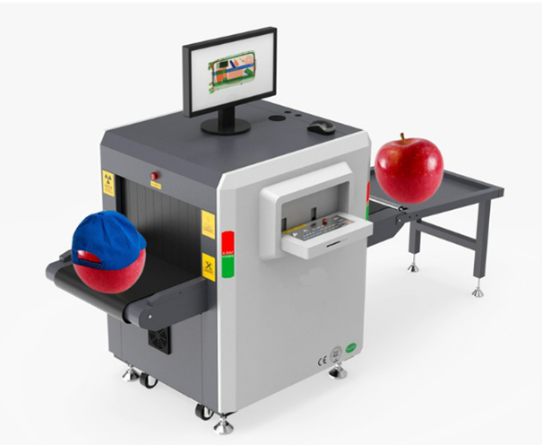
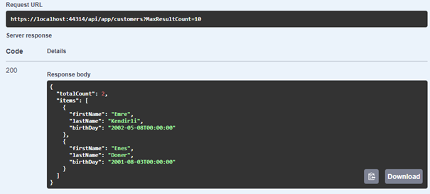
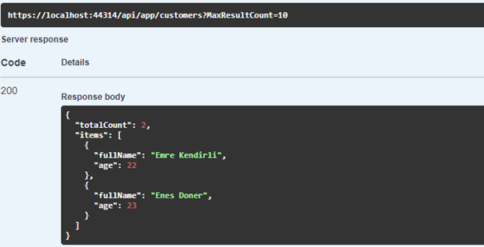

# What is Object to Object Mapping?

Mapping the properties of one object to the properties of another object is called **Object to Object Mapping**. Most of the time, you don't want to show the data you store in your database to end users as it is. Instead, you only return users the information they need for that operation and reduce the output size. 

For example, in database tables that contain relationships, we analyze the relationships and present meaningful data to users. Suppose we have a product and a category object, we keep a property called `categoryId` in the `Product` entity. However, it would be illogical to show the `categoryId ` property to users. Therefore, we can create a DTO (data transfer object) and show the **category name**  to the end users, instead of the `categoryId` directly. 

DTOs are used to transfer data of objects from one object to another one. We often need to map our entities to DTOs and DTOs to entities. For example, consider the code below:

````csharp
    public virtual async Task<CustomerDto> CreateAsync(CustomerCreateDto input)
    {

        var customer = await _customerManager.CreateAsync(
        input.BirthDay, input.MembershipDate, input.FirstName, input.LastName
        );
        CustomerDto customerDto = new CustomerDto
        {
            Id = customer.Id,
            FirstName = input.FirstName,
            LastName = input.LastName,
            // ...other
        };
        
        return customerDto;
    }

````
As can be seen here, it's repetitive and tedious to manually map an object to another similar object. Also, it violates the [DRY principle](https://en.wikipedia.org/wiki/Don%27t_repeat_yourself), makes your code more complicated and reduces readability. Instead of manually mapping objects, you can use the  [AutoMapper](https://automapper.org/) library to automatically map two objects' properties:


````csharp
        public virtual async Task<CustomerDto> CreateAsync(CustomerCreateDto input)
        {

            var customer = await _customerManager.CreateAsync(
            input.BirthDay, input.MembershipDate, input.FirstName, input.LastName
            );

            return ObjectMapper.Map<Customer, CustomerDto>(customer);
        }
````
The **ObjectMapper.Map** method allows you to convert your `Customer` entity to `CustomerDto`. `IObjectMapper` interface is a service, that comes from the **AutoMapper** library, so let's learn more about **AutoMapper** in the next section.

# What is AutoMapper?

Automapper is a .NET library that automates object-to-object mapping. ABP provides abstractions for object-to-object mapping and has an integration package to use [AutoMapper](http://automapper.org/) as the object mapper. 

Automapper is a library that transforms similar objects into each other. We can imagine Automapper as a machine that transforms an apple with a hat into an apple without a hat:



In this chapter, I will show you how to use the AutoMapper library in an ABP-based application. For this reason, I assume that you already have an ABP-based application created. If you have not yet created an ABP-based application, please follow the [Getting Started documentation](https://docs.abp.io/en/abp/latest/Getting-Started-Create-Solution?UI=MVC&DB=EF&Tiered=No).

Create a domain entity similar to this one: 

````csharp
    public class Customer : FullAuditedAggregateRoot<Guid>
    {
        public string? FirstName { get; set; }
        public string? LastName { get; set; }
        public DateTime BirthDay { get; set; }
        public DateTime MembershipDate { get; set; }
    }
````
`Customer` entity contains some properties (such as `FirstName`, `LastName`, ... and other audited properties coming from the base class - `DeleterId`, `IsDeleted`, `CreationTime` etc. -). Typically, you would not want to show/return all of these properties to end users, at that point, you can create a DTO class and only define the properties that you want to return to the end users.

Let's create the `CustomerGetDto` class in the `*.Application.Contracts` project as follows:

````csharp
    public class CustomerGetDto
    {
        public string? FirstName { get; set; }
        public string? LastName { get; set; }
        public DateTime BirthDay { get; set; }
    }
````

After creating our entity and output DTO classes, now in the application service implementation, we can return the `CustomerGetDto` class, as a result of listing the customers. For that reason, we can write a code as follows:

````csharp
public virtual async Task<PagedResultDto<CustomerGetDto>> GetListAsync(GetCustomersInput input)
 {
     var totalCount = await _customerRepository.GetCountAsync(input.FilterText, input.FirstName, input.LastName, input.BirthDayMin, input.BirthDayMax, input.MembershipDateMin, input.MembershipDateMax);
     var items = await _customerRepository.GetListAsync(input.FilterText, input.FirstName, input.LastName, input.BirthDayMin, input.BirthDayMax, input.MembershipDateMin, input.MembershipDateMax, input.Sorting, input.MaxResultCount, input.SkipCount);

     return new PagedResultDto<CustomerGetDto>
     {
         TotalCount = totalCount,
         Items = ObjectMapper.Map<List<Customer>, List<CustomerGetDto>>(items)
     };
 }
````
In this code, we first get the total number of our customers and all customers according to the specified filters, then we map `List<Customer>` to `List<CustomerGetDto>` using the `ObjectMapper.Map` method from the **ApplicationService** base class. This way we have full control over which properties are returned to the end users.

After mapping the `Customer` entity to the `CustomerGetDto` class. Before running our application, we should define the mappings in the `*AutoMapperProfile` class in the `*.Application` project as follows:

````csharp
public class YourApplicationAutoMapperProfile : Profile
{
    public YourApplicationAutoMapperProfile()
    {
        CreateMap<Customer, CustomerGetDto>();
    }
}
````
Finally, we can run our application and navigate to the **/swagger** endpoint to try our endpoint. When we send a request, we should get the result as follows:



## Advanced: Mapping Configurations

In some scenarios, you may want to make some customizations when mapping two objects. For example, let's assume that you want to create the `CustomerGetDto` class as follows:

````csharp
  public class CustomerGetDto
  {
      public string? FullName { get; set; }
      public int Age { get; set; }
  }
````
AutoMapper can't map these properties automatically, because they do not exist in the source object, which is the `Customer` entity. Therefore, you need to specify the exception and update your `YourApplicationAutoMapperProfile` class as follows:

````csharp

CreateMap<Customer, CustomerGetDto>().ForMember(c=>c.FullName,opt=> opt.MapFrom(src => src.FirstName + " " + src.LastName))
    .ForMember(c=>c.Age, opt=> opt.MapFrom(src=> DateTime.UtcNow.Year -src.BirthDay.Year));

````
This configuration concatenates and matches **FirstName** and **LastName** properties into the **FullName** property and subtracts **BirthDate** from today's year and assigns it to the customer's **Age**.
After these configurations, if you make a request to the relevant endpoint, the output will look like:



For more information on object-to-object mapping with [ABP Framework](https://abp.io/), see the [documentation](https://docs.abp.io/en/abp/latest/Object-To-Object-Mapping).
