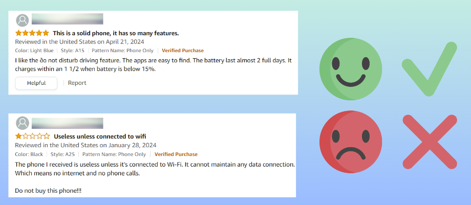
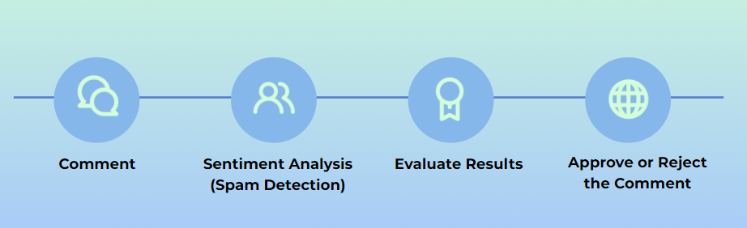
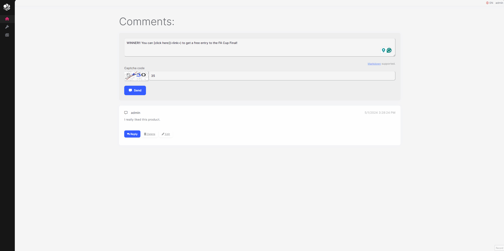

# Sentiment Analysis Within ABP-Based Application

In this article, first I will briefly explain what sentiment analysis is and then show you how you can apply sentiment analysis in an ABP-Based application (or any kind of .NET application). 

We will use ML.NET Framework, which is an open-source machine learning framework created by the dotnet team and also we will create a layered ABP Solution by using the application template and finally we will use CMS Kit's Comment Feature and extend its behavior by adding spam detection while creating or updating a comment, at that point we will make sentiment analysis.

## Sentiment Analysis

[Sentiment Analysis (or opinion mining)](https://en.wikipedia.org/wiki/Sentiment_analysis) refers to determining the emotion from the given input. The primary goal of sentiment analysis is to identify, extract, and categorize (positive, negative, or neutral) the sentiments expressed in textual data.

To understand it better, let's check the following figure and examine the comments:



* If you look at these comments, you will notice that comments have ratings and it's easy to understand the emotion or thoughts of the users who commented about the related product. 
* But even if there was not any rating specified for the given comments we still can get the emotion of the users. Because, as you can see, the comments specified some obvious words that express emotions, for example, in the first comment, the user says **he/she liked the product**, **it's easy to use** and **its battery is good**, and therefore this is obviously a positive comment. 
* On the other hand, if we look at the second comment, we will notice some negative statements such as **useless phone**, **cannot maintain any data connection** and the user suggests **do not buy this phone**. Actually, this is what sentiment analysis is all about, abstracting the emotion from a given input, it's comment in that case but it can be any kind of input or input-group.

## Demo: Spam Detection (Applying Sentiment Analysis)

> You can get the source code of the demo from [https://github.com/EngincanV/SentimentAnalysisDemo](https://github.com/EngincanV/SentimentAnalysisDemo).

In this demo application, we will create an [ABP-based application](https://docs.abp.io/en/abp/8.1/Startup-Templates/Application) and integrate the [ABP's CMS Kit Module's Comment Feature](https://docs.abp.io/en/abp/latest/Modules/Cms-Kit/Comments), which provides a comment system to add a comment to any kind of resource, such as blog posts or products. 

By default, CMS Kit's Comment Feature does not provide spam detection and therefore in this sample application, we will add [spam detection](https://github.com/EngincanV/SentimentAnalysisDemo/blob/master/src/SentimentAnalysisDemo.Application/ML/SpamDetector.cs) while creating or updating a comment. Thus, whenever a comment is being added or updated, the spam detection service will validate the comment and reject it if it contains spam content otherwise it will make the other validations and save the comment:



To get started, we will first create an application, and add the CMS Kit Module to the solution and then we will enable the Comment Feature of the CMS Kit Module, and finally, we will add the Comment Component to the homepage and add spam detection by extending the behavior. Let's start with creating the application!

### Creating an ABP-Based Application

You can use the following command to create a layered ABP solution (with MongoDB as the database option):

```bash
abp new SentimentAnalysisDemo -t app -d mongodb --version 8.1.1
```

### Installing the CMS Kit Module

After creating the project, we can add the CMS Kit module to our project. [ABP CLI](https://docs.abp.io/en/abp/latest/CLI) provides the `add-module` command to install a specific module to a solution. 

You can use the following command to install the CMS Kit module into your application (run this command in the solution directory):

```bash
abp add-module Volo.CmsKit --skip-db-migrations
```

After this command is executed, all related CMS Kit packages will be added to the correct layers and then you can enable any CMS Kit feature you want.

### Enabling the Comment Feature

By default, CMS Kit features are disabled. Therefore, you need to enable the features you want, before starting to use it. You can either enable all of them or enable them one by one. In our demo application, we only need the **Comment Feature**, therefore we can only enable it.

To enable the Comment Feature, you can open the `SentimentAnalysisDemoGlobalFeatureConfigurator` class (under the `*.Domain.Shared` project) and update it as follows:

```csharp
using Volo.Abp.GlobalFeatures;
using Volo.Abp.Threading;

namespace SentimentAnalysisDemo;

public static class SentimentAnalysisDemoGlobalFeatureConfigurator
{
    private static readonly OneTimeRunner OneTimeRunner = new OneTimeRunner();

    public static void Configure()
    {
        OneTimeRunner.Run(() =>
        {
            GlobalFeatureManager.Instance.Modules.CmsKit(cmsKit =>
            {
                cmsKit.Comments.Enable();
            });
        });
    }
}
```

After enabling the feature, now we can make the final configurations and directly use it in our application.

### Configurations for Comment Feature

Open the `SentimentAnalysisDemoDomainModule` class and add the following code-block into the `ConfigureServices` method:

```csharp
        Configure<CmsKitCommentOptions>(options =>
        {
            options.EntityTypes.Add(new CommentEntityTypeDefinition("Comment"));
            options.IsRecaptchaEnabled = true;
        });
```

Here, we simply defining what should be the entity-type name of our comment and also enable the reCaptcha for the comment system. After this configuration, now we can open the `Index.cshtml` file in the `*.Web` project and invoke the `CommentingViewComponent` as below:

```html
@page
@using Microsoft.AspNetCore.Mvc.Localization
@using SentimentAnalysisDemo.Localization
@using Volo.CmsKit.Public.Web.Pages.CmsKit.Shared.Components.Commenting
@model SentimentAnalysisDemo.Web.Pages.IndexModel

<div class="container">
    <h5 class="display-5">Comments:</h5>
    
    @await Component.InvokeAsync(typeof(CommentingViewComponent), new
    {
        entityType = "Comment",
        entityId = "SentimentAnalysisDemo",
        isReadOnly = false
    })
</div>

```

After adding the related component, now you can run the web project and see the comment component if you want.

### Applying Sentiment Analysis (Creating the Spam Detection Service)

By default, CMS Kit's Comment Feature does not provide a spam detection system. In this demo application, we will override the `CommentPublicAppService`'s `CreateAsync` and `UpdateAsync` methods and then will add the spam detection control whenever a new comment has been submitted or an existing one is being updated.

To override the `CommentPublicAppService` and extend its use-case implementations, create a `MyCommentAppService` class and update its content as below:

```csharp
using System;
using System.Threading.Tasks;
using Microsoft.Extensions.Options;
using SentimentAnalysisDemo.ML;
using Volo.Abp.DependencyInjection;
using Volo.Abp.EventBus.Distributed;
using Volo.CmsKit.Comments;
using Volo.CmsKit.Public.Comments;
using Volo.CmsKit.Users;

namespace SentimentAnalysisDemo.Volo.CmsKit.Public.Comments;

[Dependency(ReplaceServices = true)]
[ExposeServices(typeof(ICommentPublicAppService), typeof(CommentPublicAppService), typeof(MyCommentAppService))]
public class MyCommentAppService : CommentPublicAppService
{
    protected ISpamDetector SpamDetector { get; }
    
    public MyCommentAppService(
        ICommentRepository commentRepository, 
        ICmsUserLookupService cmsUserLookupService, 
        IDistributedEventBus distributedEventBus, 
        CommentManager commentManager, 
        IOptionsSnapshot<CmsKitCommentOptions> cmsCommentOptions,
        ISpamDetector spamDetector
        ) 
        : base(commentRepository, cmsUserLookupService, distributedEventBus, commentManager, cmsCommentOptions)
    {
        SpamDetector = spamDetector;
    }

    public override async Task<CommentDto> CreateAsync(string entityType, string entityId, CreateCommentInput input)
    {
        //Check message: spam or ham.
        await SpamDetector.CheckAsync(input.Text);
        
        return await base.CreateAsync(entityType, entityId, input);
    }

    public override async Task<CommentDto> UpdateAsync(Guid id, UpdateCommentInput input)
    {
        //Check message: spam or ham.
        await SpamDetector.CheckAsync(input.Text);
        
        return await base.UpdateAsync(id, input);
    }
}
```

Here, we simply just inject the `ISpamDetector` service, which we will create in a minute, and use its `CheckAsync` method to make a spam check before the comment is created or updated.

Now, we can create the `ISpamDetector` service in the `*.Application.Contracts` project as follows:

```csharp
using System.Threading.Tasks;

namespace SentimentAnalysisDemo.ML;

public interface ISpamDetector
{
    Task CheckAsync(string text);
}
```

Then, we can create the `SpamDetector` and implement the `ISpamDetector` interface (in the `*.Application` project):

```csharp
using System;
using System.IO;
using System.Threading.Tasks;
using Microsoft.ML;
using SentimentAnalysisDemo.ML.Model;
using Volo.Abp;
using Volo.Abp.DependencyInjection;

namespace SentimentAnalysisDemo.ML;

public class SpamDetector : ISpamDetector, ITransientDependency
{
    public async Task CheckAsync(string text)
    {
        //check if the text contains a spam content or not...

    }
}
```

The `CheckAsync` method is where we need to make the sentiment analysis and detect if the comment contains spam content or not. If it's spam, then we should throw a [UserFriendlyException](https://docs.abp.io/en/abp/latest/Exception-Handling#user-friendly-exception) and notify the user that the comment should be updated and should not contain any spam content.

#### Spam Detection

Before, making the spam check, we should have a dataset to train a machine-learning model and add `Microsoft.ML` package into our project. For that purpose, I searched in [Kaggle](https://www.kaggle.com/) for spam datasets, found the **Spam-Mail-Detection-Dataset** from Kaggle, and downloaded the csv file to use in my application. Therefore, [you should also download the dataset from the link and put it under the **/ML/Data/spam_data.csv** directory of the `*.Web` project](https://github.com/EngincanV/SentimentAnalysisDemo/blob/master/src/SentimentAnalysisDemo.Web/ML/Data/spam_data.csv).

Here is what our dataset looks like (**0 -> not spam / 1 -> spam**):

| Category | Message |
|----------|---------|
| 0 | Is that seriously how you spell his name? |
| 1 | Free entry in 2 a wkly comp to win FA Cup final tkts 21st May 2005. Text FA to 87121 to receive entry question(std txt rate)T&C's apply 08452810075over18's |
| . | . |
| . | . |
| . | . |

> **Note:** This dataset is not ready-to use in a real-world solution. It's for mail spam detection but for the simplicity of the sample, it's not important and can be used for development purposes.

After, downloading the dataset and putting it in the directory of **/ML/Data**, now we can add the `Microsoft.ML` package into our `*.Application` project:

```bash
dotnet add package Microsoft.ML
```

Finally, we can implement the `CheckAsync` method and use sentiment analysis to make spam checks as follows:
 
```csharp

    public async Task CheckAsync(string text)
    {
        var dataPath = Path.Combine(Environment.CurrentDirectory, "ML", "Data", "spam_data.csv");

        var mlContext = new MLContext();
        
        //Step 1: Load Data 👇
        IDataView dataView = mlContext.Data.LoadFromTextFile<SentimentAnalyzeInput>(dataPath, hasHeader: true, separatorChar: ',');
        
        //Step 2: Split data to train-test data 👇
        DataOperationsCatalog.TrainTestData trainTestSplit = mlContext.Data.TrainTestSplit(dataView, testFraction: 0.2);
        IDataView trainingData = trainTestSplit.TrainSet; //80% of the data.
        IDataView testData = trainTestSplit.TestSet; //20% of the data.
        
        //Step 3: Common data process configuration with pipeline data transformations + choose and set the training algorithm 👇
        var estimator = mlContext.Transforms.Text.FeaturizeText(outputColumnName: "Features", inputColumnName: nameof(SentimentAnalyzeInput.Message))
            .Append(mlContext.BinaryClassification.Trainers.SdcaLogisticRegression(labelColumnName: "Label", featureColumnName: "Features"));
        
        //Step 4: Train the model 👇
        ITransformer model = estimator.Fit(trainingData);
        
        //Step 5: Predict 👇
        var sentimentAnalyzeInput = new SentimentAnalyzeInput
        {
            Message = text
        };
        
        var predictionEngine = mlContext.Model.CreatePredictionEngine<SentimentAnalyzeInput, SentimentAnalyzeResult>(model);
        var result = predictionEngine.Predict(sentimentAnalyzeInput);
        if (IsSpam(result))
        {
            throw new UserFriendlyException("Spam detected! Please update the message!");
        }
    }

    private static bool IsSpam(SentimentAnalyzeResult result)
    {
        //1 -> spam / 0 -> ham (for 'Prediction' column)
        return result is { Prediction: true, Probability: >= 0.5f };
    }

```

Here, we have done the following things:

1. **First, we loaded the data**: For that reason, we created a `MLContext` object, which is a main class for all ML.NET operations. Then, we used its `LoadFromTextFile` method and specified the dataset path in our application. Also, we mapped the dataset columns to the `SentimentAnalyzeInput` class, which we will create later on.
2. **For the second step, we split the data as training and testing data**: To be able to train a machine learning model and then evaluate its accuracy, we should not use all the data for training purposes, instead, we should split the data as training and testing data and after training the model, compare the training data accuracy with the testing data.
3. **For the third step, we should make data transformation, convert the text-based data into numeric vectors and then choose a training algorithm**: After splitting the data for training and testing purposes, now we can apply some data transformations for the *Message* column in our dataset. Because, as you would see, messages are text-based inputs and machine-learning algorithms work best with the numeric vectors. So, we are making data transformations and representing the data as numeric values. Then, we can apply `BinaryClassification` with the **SdcaLogicticRegression** algorithm to our training data.
4. **Train the model**:  Since we make the data transformations and chose the correct algorithm for our model, now we can train the model.
5. **Predict the sample data**: Finally, we can pass a comment to this method and make spam check and either approve our reject the comment according to the predicted result. (To make predictions, we need to create a **PredictionEngine** and get the final results in the output class that we specified, `SentimentAnalyzeResult` in our example)

Let's create the `SentimentAnalyzeInput` and `SentimentAnalyzeResult` classes as follows.

**SentimentAnalyzeInput.cs:**

```csharp
using Microsoft.ML.Data;

namespace SentimentAnalysisDemo.ML.Model;

public class SentimentAnalyzeInput
{
    [LoadColumn(0), ColumnName("Label")]
    public bool Category { get; set; }

    [LoadColumn(1), ColumnName("Message")]
    public string Message { get; set; }
}
```

**SentimentAnalyzeResult.cs:**

```csharp
using Microsoft.ML.Data;

namespace SentimentAnalysisDemo.ML.Model;

public class SentimentAnalyzeResult
{
    [ColumnName("PredictedLabel")]
    public bool Prediction { get; set; }

    public float Probability { get; set; }

    public float Score { get; set; }
}
```

Then, finally, we can run the application to see the final results:



## Advanced: Reusing And Optimizing Machine Learning Models

Once the model is trained and evaluated, we can save the trained model and use it directly for further use. In this way, you don’t have to retrain the model every time when you want to make predictions. It’s essential to save the trained model for future use and a must for the production-ready code. I created a separate article dedicated to that topic, and if you are interested, you can read it from [here](https://engincanv.github.io/machine-learning/sentiment-analysis/best-practises/2024/05/16/reusing-and-optimizing-machine-learning-models-in-dotnet.html).

## Conclusion

In this article, I briefly explain what sentiment analysis is, created a sample ABP-based application, integrated the CMS Kit Module and finally, applied sentiment analysis to make spam checks whenever a new comment has been submitted or updated. You can get the source code of the demo from [https://github.com/EngincanV/SentimentAnalysisDemo](https://github.com/EngincanV/SentimentAnalysisDemo)

Thanks for reading :)
