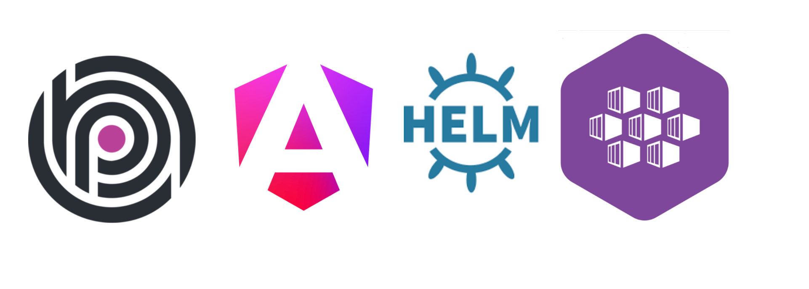
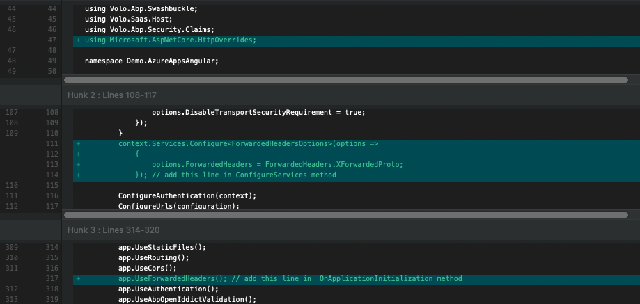
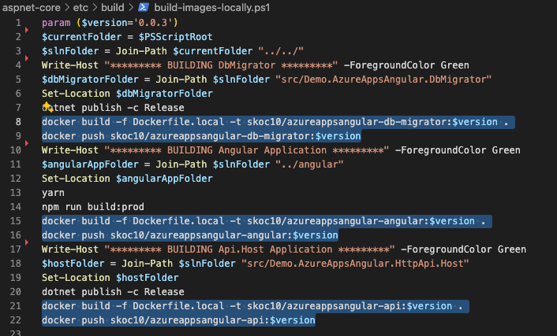
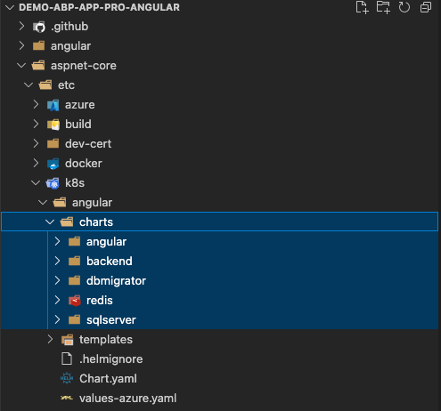
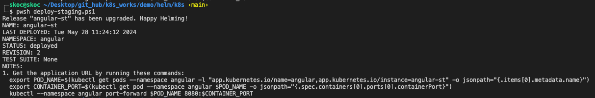
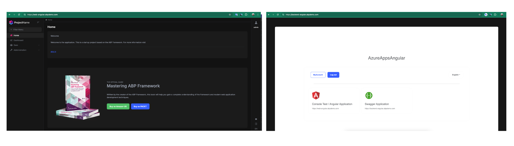

# Deploy Your ABP Framework Angular Project to Azure Kubernetes Service (AKS)



In my previous article on [Deploy Your ABP Framework MVC Project to Azure Container Apps](https://community.abp.io/posts/deploy-your-abp-framework-mvc-project-to-azure-container-apps-r93u9c6d), I talked about how ABP Mvc project can be easily deployed to Azure Container Apps. Now I will show how we can deploy to kubernetes environment, which looks a bit more complex but is more preferred for production, using a Helm chart.

### Getting Started with ABP Framework Angular and Azure Kubernetes Service

To get started, you will need an ABP Framework Angular project that you want to deploy. If you don't have one, you can [create a new project using the ABP CLI](https://docs.abp.io/en/abp/latest/Startup-Templates/Application). You will also need [an Azure subscription](https://azure.microsoft.com) and [an Azure Kubernetes Service](https://azure.microsoft.com/en-gb/services/kubernetes-service/).

### Configuring Your ABP Framework Angular Project

We have a sample ABP Framework Angular project that we will use for this deployment. Before creating the Docker image and Helm chart, you just need to configure  `aspnet-core/src/***.HttpApi.Host/***.HttpApiHostModule.cs` file to allow CORS requests from your frontend application. You can do this by updating the following code to the `ConfigureServices` method:

```csharp
public override void ConfigureServices(ServiceConfigurationContext context)
    {
        var configuration = context.Services.GetConfiguration();
        var hostingEnvironment = context.Services.GetHostingEnvironment();

        if (!configuration.GetValue<bool>("App:DisablePII"))
        {
            Microsoft.IdentityModel.Logging.IdentityModelEventSource.ShowPII = true;
        }

        if (!configuration.GetValue<bool>("AuthServer:RequireHttpsMetadata"))
        {
            Configure<OpenIddictServerAspNetCoreOptions>(options =>
            {
                options.DisableTransportSecurityRequirement = true;
            });
        }
        context.Services.Configure<ForwardedHeadersOptions>(options =>
            {
                options.ForwardedHeaders = ForwardedHeaders.XForw
```



If your ABP Framework Angular project and Azure kubernetes cluster ready, we can start to build the docker images and pushing them to any container registry. In this article, I will use DockerHub as the container registry.

I will also show you how I automated the steps that I originally did manually to make it simpler in the beginning and then automated them in Azure Devops.

### Creating a Docker Image for ABP Framework Angular

To create a Docker image for your ABP Framework Angular project, navigate to `etc/build/build-images-locally.ps1` and fix the script to match your Docker Hub username and image name. Then, run the script to build the Docker image locally.



At the end of this process, check your Docker Hub repository to confirm that the image has been pushed successfully. My Docker Hub repository looks like this. Also you can use these my public images to test the deployment.


### Creating Helm Chart for ABP Framework Angular

To deploy your ABP Framework Angular project to Azure Kubernetes Service, you need to create a Helm chart. Helm is a package manager for Kubernetes that allows you to define, install, and upgrade even the most complex Kubernetes applications. Helm uses a packaging format called charts, which are a collection of files that describe a related set of Kubernetes resources.

These helm charts are prepared to create a deployment, configmap, service and ingress for your ABP Framework Angular project. It is prepared not only for migration, frontend and backend, but also to create the sqlserver and redis that the application needs as a kubernetes service. If you already have redis and sqlserver, you don't need to stand them up in kubernetes, of course.



You can find the helm chart in the https://github.com/skoc10/k8s_works/tree/main/demo/helm/k8s/angular repository. You can configure the `values-azure.yaml` file according to your needs. 

### Deploying to Azure Kubernetes Service

`Note:` You need to have nginx-ingress-controller and cert-manager installed for letsencrypt certificate in your kubernetes cluster.

Now that you have Docker images for your ABP Framework Angular project and a Helm chart, you can proceed to deploy it to Azure Kubernetes Service. To do this, you need to create a new Azure Kubernetes Service resource and configure the `values-azure.yaml` file according to your needs. If you want, you can deploy a single Helm with `demo/helm/k8s/deploy-staging.ps1` script you can deploy each chart separately.



After deploying the Helm chart, you can check the deployment status to confirm that the deployment was successful. You can also check the logs of the pods to see if there are any errors.


Finally, you can navigate to the web url to see your ABP Framework Angular project running in Azure Kubernetes Service.



### CI/CD with Azure DevOps

I have automated the steps that I originally did manually to make it simpler in the beginning and then automated them in Azure Devops. You can find the `azure-pipelines.yml` file in the https://github.com/skoc10/k8s_works/blob/main/demo/azure/azure-pipelines.yml repository. You can configure the `azure-pipelines.yml` file according to your needs.

```yaml
trigger:
  tags:
    include:
      - "*.*.*"

variables:
  dockerRegistryServiceConnection: 'demo-reg'
  buildContextBasePath: '$(Build.SourcesDirectory)'
  tag: $(Build.BuildNumber)
  DOCKER_BUILDKIT: 1

pool:
  name: ubuntu

stages:
- stage: Build
  displayName: Build
  jobs:
  - job: CheckChanges
    displayName: Check if Angular or ASP.NET Core has changed
    pool:
      name: ubuntu
    steps:
    - checkout: self

# Migration
    - task: Docker@2
      displayName: 'Build Migration Docker image'
      inputs:
        command: build
        repository: demo-angular-apppro/migration
        dockerfile: $(buildContextBasePath)/aspnet-core/src/Demo.AzureAppsAngular.DbMigrator/Dockerfile.azure
        buildContext: $(buildContextBasePath)/aspnet-core
        containerRegistry: $(dockerRegistryServiceConnection)
        tags: |
          $(tag)

    - task: Docker@2
      displayName: 'Push Migration Docker image'
      inputs:
        command: push
        repository: demo-angular-apppro/migration
        containerRegistry: $(dockerRegistryServiceConnection)
        tags: |
          $(tag)

    - task: HelmDeploy@0
      displayName: 'Delete Migrator'
      inputs:
        connectionType: Kubernetes Service Connection
        kubernetesServiceConnection: 'aks-demoms'
        namespace: 'angular'
        command: delete
        arguments: dbmigrator
      continueOnError: true

    - task: HelmDeploy@0
      displayName: 'Deploy Migration to AKS'
      inputs:
        connectionType: Kubernetes Service Connection
        kubernetesServiceConnection: 'aks-demoms'
        namespace: 'angular'
        command: 'upgrade'
        chartType: 'FilePath'
        chartPath: '$(buildContextBasePath)/aspnet-core/etc/k8s/angular/charts/dbmigrator'
        releaseName: 'dbmigrator'
        overrideValues: 'image.tag=$(tag)'
        valueFile: '$(buildContextBasePath)/aspnet-core/etc/k8s/angular/charts/dbmigrator/values.yaml'
        waitForExecution: false

# Backend
    - task: Docker@2
      displayName: 'Build Backend Docker image'
      inputs:
        command: build
        repository: demo-angular-apppro/backend
        dockerfile: $(buildContextBasePath)/aspnet-core/src/Demo.AzureAppsAngular.HttpApi.Host/Dockerfile.azure
        buildContext: $(buildContextBasePath)/aspnet-core
        containerRegistry: $(dockerRegistryServiceConnection)
        tags: |
          $(tag)

    - task: Docker@2
      displayName: 'Push Backend Docker image'
      inputs:
        command: push
        repository: demo-angular-apppro/backend
        containerRegistry: $(dockerRegistryServiceConnection)
        tags: |
          $(tag)

    - task: HelmDeploy@0
      displayName: 'Deploy Backend to AKS'
      inputs:
        connectionType: Kubernetes Service Connection
        kubernetesServiceConnection: 'aks-demoms'
        namespace: 'angular'
        command: 'upgrade'
        chartType: 'FilePath'
        chartPath: '$(buildContextBasePath)/aspnet-core/etc/k8s/angular/charts/backend'
        releaseName: 'backend'
        overrideValues: 'image.tag=$(tag)'
        valueFile: '$(buildContextBasePath)/aspnet-core/etc/k8s/angular/charts/backend/values.yaml'
        waitForExecution: false

# Frontend
    - task: Docker@2
      displayName: 'Build Frontend Docker image'
      inputs:
        command: build
        repository: demo-angular-apppro/frontend
        dockerfile: $(buildContextBasePath)/angular/Dockerfile.azure
        buildContext: $(buildContextBasePath)/angular
        containerRegistry: $(dockerRegistryServiceConnection)
        tags: |
          $(tag)

    - task: Docker@2
      displayName: 'Push Frontend Docker image'
      inputs:
        command: push
        repository: demo-angular-apppro/frontend
        containerRegistry: $(dockerRegistryServiceConnection)
        tags: |
          $(tag)

    - task: HelmDeploy@0
      displayName: 'Deploy Frontend to AKS'
      inputs:
        connectionType: Kubernetes Service Connection
        kubernetesServiceConnection: 'aks-demoms'
        namespace: 'angular'
        command: 'upgrade'
        chartType: 'FilePath'
        chartPath: '$(buildContextBasePath)/aspnet-core/etc/k8s/angular/charts/angular'
        releaseName: 'frontend'
        overrideValues: 'image.tag=$(tag)'
        valueFile: '$(buildContextBasePath)/aspnet-core/etc/k8s/angular/charts/angular/values.yaml'
        waitForExecution: false
```

### Conclusion

In this article, I showed you how you can deploy your ABP Framework Angular project to Azure Kubernetes Service using Helm chart. I also showed you how you can automate the deployment process using Azure DevOps. I hope you found this article helpful. If you have any questions or feedback, please feel free to leave a comment below.