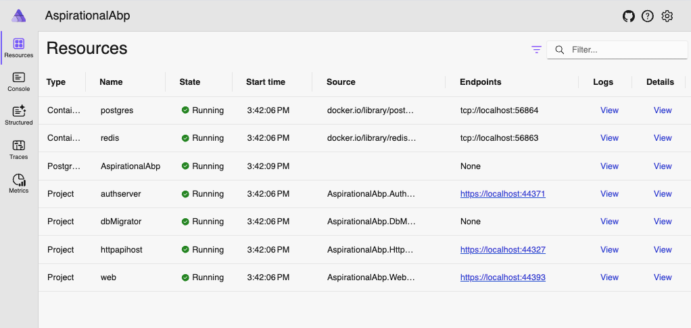
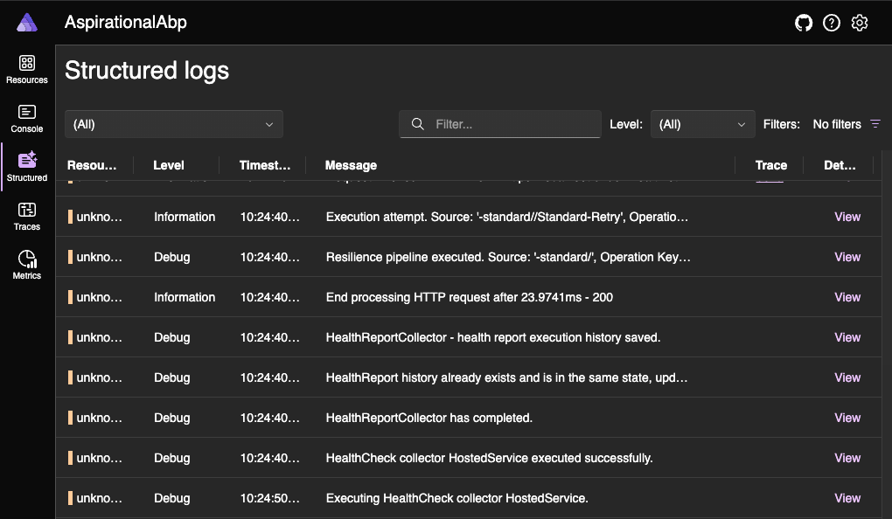
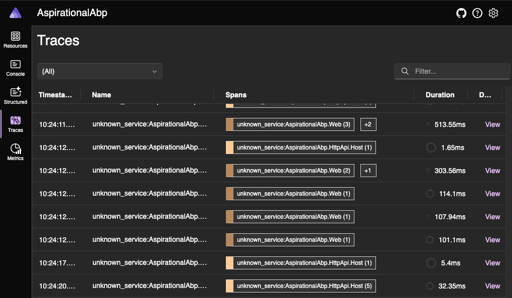
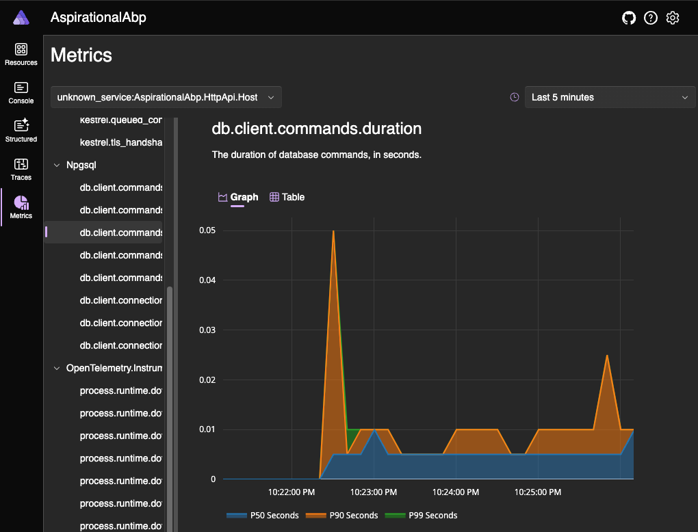

# How to use .NET Aspire with ABP framework

[.NET Aspire](https://learn.microsoft.com/en-us/dotnet/aspire/get-started/aspire-overview) is an opinionated, cloud-ready stack designed for building observable, production-ready, and distributed applications. On the other hand, the [ABP framework](https://docs.abp.io/en/abp/latest) offers a complete, modular and layered software architecture based on Domain Driven Design principles and patterns. This guide explores how to combine .NET Aspire with ABP, enabling developers to create observable, and feature-rich applications.

## When to Use .NET Aspire?

Using .NET Aspire with the ABP framework can be beneficial in various scenarios where you need to combine the strengths of both technologies. Here are some situations when using .NET Aspire with ABP can be advantageous:

- **Enterprise Web Applications:** ABP is well-suited for building enterprise web applications with its opinionated architecture and best practices. When combined with .NET Aspire, you can leverage ABP's features for rapid development of user interfaces, backend services, and business logic while benefiting from .NET Aspire's cloud-native capabilities and observability features.
- **Observability and Monitoring:** .NET Aspire's emphasis on observability, including logging, monitoring, and tracing, can enhance ABP applications by providing deeper insights into system behavior, performance metrics, and diagnostics, which is key for maintaining and optimizing enterprise-grade applications.

## Creating a new ABP Solution

To demonstrate the usage of .NET Aspire with the ABP framework, I've created an ABP solution. If you want to create the same solution from scratch, follow the steps below:

Install the ABP CLI if you haven't installed it before:

```bash
dotnet tool install -g Volo.Abp.Cli
```

Create a new solution with the ABP framework's Application Startup Template with Tiered MVC UI and EF Core database:

```bash
abp new AspirationalAbp -u mvc --database-provider ef -dbms PostgreSQL --csf --tiered
```

> The startup template selection matters for this article. I chose these options so that the demo solution can cover complex scenarios. 

**Disclaimer-I:** This article is based on version `8.0.1` of .NET Aspire and version `8.2.0` of ABP Framework.

**Disclaimer-II:** ABP and .NET Aspire may not be fully compatible in some respects. This article aims to explain how these two technologies can be used together in the simplest way possible, even if they are not fully compatible.
## Add .NET Aspire

After creating the solution, run the following commands in the `src` folder of your solution to add .NET Aspire:

```bash
// Adding AppHost
dotnet new aspire-apphost -n AspirationalAbp.AppHost
dotnet sln ../AspirationalAbp.sln add ./AspirationalAbp.AppHost/AspirationalAbp.AppHost.csproj

// Adding ServiceDefaults
dotnet new aspire-servicedefaults -n AspirationalAbp.ServiceDefaults
dotnet sln ../AspirationalAbp.sln add ./AspirationalAbp.ServiceDefaults/AspirationalAbp.ServiceDefaults.csproj
```

These commands add two new projects to the solution:
- **AspirationalAbp.AppHost**: An orchestrator project designed to connect and configure the different projects and services of your app.
- **AspirationalAbp.ServiceDefaults**: A .NET Aspire shared project to manage configurations that are reused across the projects in your solution related to [resilience](https://learn.microsoft.com/en-us/dotnet/core/resilience/http-resilience), [service discovery](https://learn.microsoft.com/en-us/dotnet/aspire/service-discovery/overview), and [telemetry](https://learn.microsoft.com/en-us/dotnet/aspire/fundamentals/telemetry).

We have added .NET Aspire to our ABP based solution, but we have not registered our projects in the .NET Aspire orchestration. Now, let's enroll our projects, which implement the db migrator, web user interface, API, and auth, in .NET Aspire orchestration.

## Registering projects to .NET Aspire orchestration

First of all, we need to add the reference of related projects to the `AspirationalAbp.AppHost` project. For this, add the following `ItemGroups` to the `AspirationalAbp.AppHost/AspirationalAbp.AppHost.csproj` file:

```csharp
<ItemGroup>  
  <ProjectReference Include="..\AspirationalAbp.AuthServer\AspirationalAbp.AuthServer.csproj" />  
  <ProjectReference Include="..\AspirationalAbp.HttpApi.Host\AspirationalAbp.HttpApi.Host.csproj" />  
  <ProjectReference Include="..\AspirationalAbp.Web\AspirationalAbp.Web.csproj"/>  
  <ProjectReference Include="..\AspirationalAbp.DbMigrator\AspirationalAbp.DbMigrator.csproj" />  
</ItemGroup>  
  
<ItemGroup>  
  <PackageReference Include="Aspire.Hosting.PostgreSQL" Version="8.0.1" />  
  <PackageReference Include="Aspire.Hosting.Redis" Version="8.0.1" />  
</ItemGroup>
```

With the first `ItemGroup`, we added the references of `AuthServer`, `HttpApi.Host`, `Web`, and `DbMigrator` projects to the app host project. So, we can orchestrate them within the app model.

With the second `ItemGroup`, to model the **PostgreSQL** server resource and **Redis** resource in the app host, installed the `Aspire.Hosting.PostgreSQL` and `Aspire.Hosting.Redis`

Now let's update the `Program` class of the `AspirationalAbp.AppHost` project as follows:

```csharp
using Microsoft.Extensions.Hosting;  
  
var builder = DistributedApplication.CreateBuilder(args);  
  
var postgres = builder  
    .AddPostgres("postgres")  
    .AddDatabase("AspirationalAbp");  
  
var redis = builder.AddRedis("redis");  
  
// DbMigrator  
if (builder.Environment.IsDevelopment())  
{  
    builder  
        .AddProject<Projects.AspirationalAbp_DbMigrator>("dbMigrator")  
        .WithReference(postgres, "Default")  
        .WithReference(redis, "Redis")   
        .WithReplicas(1);
}  
  
// AuthServer  
var authServerLaunchProfile = "AspirationalAbp.AuthServer";  
builder  
    .AddProject<Projects.AspirationalAbp_AuthServer>("authserver", launchProfileName: authServerLaunchProfile)  
    .WithExternalHttpEndpoints()  
    .WithReference(postgres, "Default")  
    .WithReference(redis);  
  
// HttpApi.Host  
var httpApiHostLaunchProfile = "AspirationalAbp.HttpApi.Host";  
builder  
    .AddProject<Projects.AspirationalAbp_HttpApi_Host>("httpapihost", launchProfileName: httpApiHostLaunchProfile)  
    .WithExternalHttpEndpoints()
    .WithReference(postgres, "Default")  
    .WithReference(redis);  
  
// Web  
builder  
    .AddProject<Projects.AspirationalAbp_Web>("web", "AspirationalAbp.Web")  
    .WithReference(redis);  
  
builder.Build().Run();
```

With the code above, the following operations were performed below:

1. Creates an `IDistributedApplicationBuilder` instance by calling `DistributedApplication.CreateBuilder(args)`.
2. Adds PostgreSQL and the `AspirationalAbp` database.
3. Adds Redis.
4. Adds the `DbMigrator` project with references to PostgreSQL and Redis, ensuring one replica in development.
5. Adds the `AuthServer` project with external HTTP endpoints, referencing PostgreSQL and Redis.
6. Adds the `HttpApi.Host` project with external HTTP endpoints, referencing PostgreSQL and Redis.
7. Adds the `Web` project, referencing Redis.
8. Builds and runs the application.

Now let's make the projects we added to the app host compatible with .NET Aspire.

## Configuring Projects for Aspire

To make the `AspirationalAbp.DbMigrator`, `AspirationalAbp.AuthServer`, `AspirationalAbp.HttpApi.Host`, and `AspirationalAbp.Web` projects compatible with .NET Aspire, we need to add and configure several packages. For that, we need to add the `Aspire.StackExchange.Redis` package to all these projects and the `Aspire.Npgsql.EntityFrameworkCore.PostgreSQL` package to the `AspirationalAbp.EntityFrameworkCore` project. Additionally, we will add the  `AspirationalAbp.ServiceDefaults` reference to host projects except `AspirationalAbp.DbMigrator`. Also, we need to convert [Serilog](https://serilog.net/) events into [OpenTelemetry](https://opentelemetry.io/) `LogRecord`s, for that we will add a  `Serilog.Sinks.OpenTelemetry` reference to host projects. Let's begin with configuring `AspirationalAbp.DbMigrator`.

### AspirationalAbp.DbMigrator

First, let's add the `Aspire.StackExchange.Redis`, and `Serilog.Sinks.OpenTelemetry` packages to the `AspirationalAbp.DbMigrator` project. For this, let's run the following .NET CLI command inside the `AspirationalAbp.DbMigrator` project:

```bash
dotnet add package Aspire.StackExchange.Redis --version 8.0.1
dotnet add package Serilog.Sinks.OpenTelemetry --version 4.0.0-dev-00313
```

Then let's override the `PreConfigureServices` method in `AspirationalAbpDbMigratorModule` as below:

```csharp
public override void PreConfigureServices(ServiceConfigurationContext context)  
{  
    var configuration = context.Services.GetConfiguration();  
    configuration["Redis:Configuration"] = configuration["ConnectionStrings:Redis"];  
}
```

To use the **OpenTelemetry** sink we have installed the `Serilog.Sinks.OpenTelemetry` package and now let's enable the sink. For this, let's write the following code block just before calling the `CreateLogger` method in the logger configuration in `Program.cs`:

```csharp
/// .WriteTo.Async(c => c.Console())  
.WriteTo.Async(c => c.OpenTelemetry())  
/// .CreateLogger();
```

Now let's continue with `AspirationalAbp.EntityFrameworkCore`.

### AspirationalAbp.EntityFrameworkCore

Now let's add the `Aspire.Npgsql.EntityFrameworkCore.PostgreSQL` package to the `AspirationalAbp.EntityFrameworkCore` project. For this, you can run the following command in the `AspirationalAbp.EntityFrameworkCore` project:

```bash
dotnet add package Aspire.Npgsql.EntityFrameworkCore.PostgreSQL --version 8.0.1
```

Now let's continue with `AspirationalAbp.AuthServer`.

### AspirationalAbp.AuthServer

First, let's add the `Serilog.Sinks.OpenTelemetry`, `Aspire.StackExchange.Redis` and `AspirationalAbp.ServiceDefaults` packages to the `AspirationalAbp.AuthServer` project. For this, let's run the following .NET CLI command inside the `AspirationalAbp.AuthServer` project:

```bash
dotnet add package Aspire.StackExchange.Redis --version 8.0.1
dotnet add reference ../AspirationalAbp.ServiceDefaults/AspirationalAbp.ServiceDefaults.csproj
dotnet add package Serilog.Sinks.OpenTelemetry --version 4.0.0-dev-00313
```

Then add the following code block after defining the builder variable in `Program.cs`:

```csharp
builder.AddServiceDefaults();  
builder.AddRedisClient("redis");  
builder.AddNpgsqlDbContext<AspirationalAbpDbContext>("Default",  
    options =>  
    {  
        options.DisableRetry = true;  
    });
```

Then add the following code to the `PreConfigureServices` method in the `AspirationalAbpAuthServerModule` class:

```csharp
configuration["Redis:Configuration"] = configuration["ConnectionStrings:Redis"];
```

To use the **OpenTelemetry** sink we have installed the `Serilog.Sinks.OpenTelemetry` package and now let's enable the sink. For this, let's write the following code block just before calling the `CreateLogger` method in logger configuration in `Program.cs`:

```csharp
/// .WriteTo.Async(c => c.Console())  
.WriteTo.Async(c => c.OpenTelemetry())  
/// .CreateLogger();
```

So far we have made `AspirationalAbp.DbMigrator`, `AspirationalAbp.EntityFrameworkCore`, and `AspirationalAbp.AuthServer` compatible with .NET Aspire. Now let's continue with `AspirationalAbp.HttpApi.Host`.

### AspirationalAbp.HttpApi.Host

First, let's add the `Serilog.Sinks.OpenTelemetry`, `Aspire.StackExchange.Redis` and `AspirationalAbp.ServiceDefaults` packages to the `AspirationalAbp.HttpApi.Host` project. For this, let's run the following .NET CLI command inside the `AspirationalAbp.HttpApi.Host` project:

```bash
dotnet add package Aspire.StackExchange.Redis --version 8.0.1
dotnet add reference ../AspirationalAbp.ServiceDefaults/AspirationalAbp.ServiceDefaults.csproj
dotnet add package Serilog.Sinks.OpenTelemetry --version 4.0.0-dev-00313
```

Then add the following code block after defining the builder variable in `Program.cs`:

```csharp
builder.AddServiceDefaults();  
builder.AddRedisClient("redis");  
builder.AddNpgsqlDbContext<AspirationalAbpDbContext>("Default",  
    options =>  
    {  
        options.DisableRetry = true;  
    });
```

Then let's override the `PreConfigureServices` method in `AspirationalAbpHttpApiHostModule` as below:

```csharp
public override void PreConfigureServices(ServiceConfigurationContext context)  
{  
    var configuration = context.Services.GetConfiguration();  
    configuration["Redis:Configuration"] = configuration["ConnectionStrings:Redis"];  
}
```

To use the **OpenTelemetry** sink we have installed the `Serilog.Sinks.OpenTelemetry` package and now let's enable the sink. For this, let's write the following code block just before calling the `CreateLogger` method in the logger configuration in `Program.cs`:

```csharp
/// .WriteTo.Async(c => c.Console())  
.WriteTo.Async(c => c.OpenTelemetry())  
/// .CreateLogger();
```

Finally, let's make `AspirationalAbp.Web` compatible with .NET Aspire.

### AspirationalAbp.Web

First, let's add the `Serilog.Sinks.OpenTelemetry`, `Aspire.StackExchange.Redis` and `AspirationalAbp.ServiceDefaults` packages to the `AspirationalAbp.Web` project. For this, let's run the following .NET CLI command inside the `AspirationalAbp.Web` project:

```bash
dotnet add package Aspire.StackExchange.Redis --version 8.0.1
dotnet add reference ../AspirationalAbp.ServiceDefaults/AspirationalAbp.ServiceDefaults.csproj
dotnet add package Serilog.Sinks.OpenTelemetry --version 4.0.0-dev-00313
```

Then add the following code block after defining the builder variable in `Program.cs`:

```csharp
builder.AddServiceDefaults();  
builder.AddRedisClient("redis");
```

Then add the following code to the `PreConfigureServices` method in the `AspirationalAbpWebModule` class:

```bash
var configuration = context.Services.GetConfiguration();  
configuration["Redis:Configuration"] = configuration["ConnectionStrings:Redis"];
```

To use the **OpenTelemetry** sink we have installed the `Serilog.Sinks.OpenTelemetry` package and now let's enable the sink. For this, let's write the following code block just before calling the `CreateLogger` method in logger configuration in `Program.cs`:

```csharp
/// .WriteTo.Async(c => c.Console())  
.WriteTo.Async(c => c.OpenTelemetry())  
/// .CreateLogger();
```

After making all our changes, we can run the `AspirationalAbp.AppHost` project.









## Conclusion

Combining .NET Aspire with the ABP framework creates a powerful setup for building robust, observable, and feature-rich applications. By integrating Aspire's observability and cloud capabilities with ABP's approach of focusing on your business without repeating yourself, you can develop feature-rich, scalable applications with enhanced monitoring and seamless cloud integration. This guide provides a clear path to set up and configure these technologies, ensuring your applications are well-structured, maintainable, and ready for modern cloud environments.

## See Also

* [.NET Aspire vs ABP Studio: Side by Side](https://abp.io/community/articles/.net-aspire-vs-abp-studio-side-by-side-t1c73d1l)
